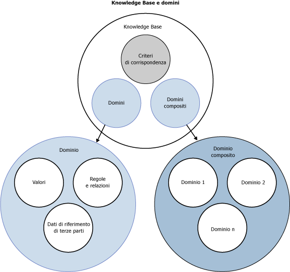

# Knowledge Base e domini DQS
  In questo argomento viene descritto che cos'è una Knowledge Base in [!INCLUDE[ssDQSnoversion](../includes/ssdqsnoversion-md.md)] (DQS). Per pulire i dati, è necessario avere informazioni su di essi. Per preparare le informazioni per un progetto Data Quality, è necessario compilare e mantenere una Knowledge Base (KB) che è possibile utilizzare in DQS per identificare dati errati o non validi. DQS consente di utilizzare sia processi assistiti da computer che interattivi per creare, compilare e aggiornare la Knowledge Base. Le informazioni in una Knowledge Base sono mantenute in domini, ognuno dei quali è specifico per un campo dati. La Knowledge Base è un repository di informazioni sui dati che consente di comprenderli e mantenerne l'integrità.  
  
 Le Knowledge Base DQS offrono i vantaggi seguenti:  
  
-   La compilazione delle informazioni sui dati rappresenta un processo dettagliato. Il processo DQS di estrazione automatica di informazioni da dati di esempio facilita notevolmente l'attività.  
  
-   DQS consente di visualizzare l'analisi effettuata dei dati e di incrementare le informazioni nella Knowledge Base creando regole e modificando i valori dei dati. Queste attività possono essere effettuate ripetutamente per migliorare le informazioni nel corso del tempo.  
  
-   È possibile sfruttare le informazioni sulla qualità di dati preesistenti basando una Knowledge Base su una KB esistente, importando informazioni di dominio da file nella KB, importando nuovamente informazioni da un progetto a una KB o utilizzando la KB predefinita di DQS, Dati DQS.  
  
-   È possibile assicurare la qualità dei dati in uso confrontandoli ai dati gestiti da un provider di dati di riferimento.  
  
-   Esiste una netta separazione tra la creazione di una Knowledge Base e la sua applicazione al processo di correzione di dati. In questo modo è possibile compilare e aggiornare la Knowledge Base con grande flessibilità.  
  
 L'amministratore dei dati utilizza l'applicazione [!INCLUDE[ssDQSClient](../includes/ssdqsclient-md.md)] per eseguire e controllare i passaggi assistiti da computer, nonché per eseguire i passaggi interattivi.  
  
 Nella figura seguente vengono illustrati i vari componenti di una Knowledge Base e un dominio in DQS:  
  
   
  
##   Procedura di creazione e compilazione di una Knowledge Base DQS  
 La compilazione di una Knowledge Base DQS include i processi e i componenti seguenti:  
  
 **Individuazione informazioni**  
 Un processo assistito da computer con il quale le informazioni vengono compilate in una Knowledge Base elaborando un campione di dati  
  
 **Gestione dominio**  
 Un processo interattivo che consente all'amministratore dei dati di verificare e modificare le informazioni contenute nei domini della Knowledge Base, ciascuno dei quali è associato a un campo dati. Sono incluse le attività di impostazione delle proprietà a livello di campo, di creazione di regole, di modifica di valori specifici, di utilizzo di servizi dati di riferimento o di configurazione di relazioni basate su termini o tra campi.  
  
 **Servizi dati di riferimento**  
 Un processo di gestione dei domini che consente di convalidare i dati rispetto a dati mantenuti e garantiti da un provider di dati di riferimento.  
  
 **Criteri di abbinamento**  
 Criteri che definiscono la modalità di elaborazione dei record in DQS per identificare potenziali duplicati e mancate corrispondenze, incorporati nella Knowledge Base in un processo assistito da computer e interattivo.  
  
##   Individuazione informazioni  
 La creazione della Knowledge Base è inizialmente un processo guidato dal computer. L'attività di individuazione delle informazioni consente di compilare la Knowledge Base tramite l'analisi di un campione di dati per la creazione di criteri di qualità di dati, la ricerca di incoerenze ed errori di sintassi dei dati e la proposta di modifiche ai dati. Questa analisi si basa su algoritmi incorporati in DQS.  
  
 L'amministratore dei dati prepara il processo collegando una Knowledge Base a una vista o una tabella di database di SQL Server contenente dati di esempio simili a quelli che verranno utilizzati per l'analisi da parte della Knowledge Base. L'amministratore dei dati esegue quindi il mapping di un dominio della Knowledge Base a ogni colonna dei dati di esempio da analizzare. Un dominio può essere un dominio singolo con mapping a un singolo campo oppure un dominio composito, costituito da più domini singoli, per ognuno dei quali è stato eseguito il mapping a parte dei dati in un singolo campo (vedere "Domini compositi" di seguito). Quando si esegue l'individuazione delle informazioni, tramite DQS vengono estratte dai dati di esempio informazioni relative alla qualità dei dati, che vengono inserite in domini della Knowledge Base. Una volta eseguita l'analisi per l'individuazione delle informazioni, si disporrà di una Knowledge Base con la quale effettuare la correzione dei dati.  
  
 La Knowledge Base DQS è estensibile. Nel corso dell'attività di individuazione delle informazioni è possibile aggiungere informazioni alla Knowledge Base in modo interattivo dopo l'analisi di individuazione delle informazioni assistita da computer. È possibile aggiungere manualmente modifiche ai valori e importare valori di dominio da un file di Excel. Inoltre, è possibile eseguire nuovamente il processo di individuazione delle informazioni in un momento successivo se i dati di esempio vengono modificati. È possibile applicare ulteriori informazioni con le attività di gestione del dominio e di corrispondenza di dati (vedere di seguito).  
  
 Non è necessario eseguire il processo di individuazione delle informazioni sugli stessi dati su cui viene eseguita la correzione dei dati. Grazie alla flessibilità di DQS, è possibile creare le informazioni da un set di campi di database e applicarle a un secondo set di dati correlati che deve essere pulito. L'amministratore dei dati può creare una Knowledge Base completamente nuova o basarla su una Knowledge Base esistente oppure può importare una Knowledge Base da un file di dati. È inoltre possibile eseguire nuovamente l'individuazione delle informazioni su una Knowledge Base esistente. In un singolo [!INCLUDE[ssDQSServer](../includes/ssdqsserver-md.md)]possono essere presenti più Knowledge Base. È inoltre possibile connettere più istanze di un'applicazione alla stessa Knowledge Base. DQS consente di impedire i conflitti di concorrenza grazie al blocco della Knowledge Base per l'utente che la apre in una sessione di gestione delle informazioni.  
  
### Assenza di distinzione maiuscole/minuscole in DQS  
 Per i valori in DQS non viene fatta distinzione tra maiuscole e minuscole. In altre parole, quando vengono eseguite le attività di individuazione delle informazioni, gestione del dominio o corrispondenza, i valori non vengono distinti in base alla presenza di maiuscole o minuscole. Se nella gestione dei valori si aggiunge un valore che differisce da un altro valore solo per le maiuscole/minuscole, il valore verrà considerato lo stesso e non un sinonimo. Se nel processo di corrispondenza vengono confrontati due valori che differiscono solo per le maiuscole/minuscole, vengono considerati una corrispondenza esatta.  
  
 Tuttavia, è possibile controllare le maiuscole/minuscole dei valori che si esportano nei risultati della pulizia. Eseguire questa operazione impostando il **formato Output in** proprietà di dominio (vedere [impostare le proprietà di dominio](../data-quality-services/set-domain-properties.md)) e utilizzando il **standardizzare Output** casella di controllo quando si esportano i risultati della pulizia (vedere [pulire i dati tramite DQS & #40; interno & #41; Knowledge Base](../data-quality-services/cleanse-data-using-dqs-internal-knowledge.md)).  
  
##   Gestione dominio  
 L'attività di gestione del dominio consente all'amministratore dei dati di modificare e aumentare in modo interattivo i metadati generati dall'attività di individuazione delle informazioni assistita da computer. Ogni modifica apportata è destinata a un dominio della Knowledge Base. Nell'attività di gestione del dominio è possibile effettuare le operazioni seguenti:  
  
-   Creare un nuovo dominio. Il nuovo dominio può essere collegato o copiato da un dominio esistente.  
  
-   Impostare proprietà di dominio valide per ogni termine nel dominio.  
  
-   Applicare regole di dominio con le quali eseguire la convalida o la standardizzazione di uno specifico intervallo di valori.  
  
-   Applicare modifiche in modo interattivo a qualsiasi valore di dati specifico nel dominio.  
  
-   Utilizzare il correttore ortografico DQS per controllare la sintassi, l'ortografia e struttura della frase di valori stringa.  
  
-   Importare un dominio da un file di dati con estensione dqs o valori di dominio da un file di Microsoft Excel.  
  
-   Importare valori trovati da un processo di pulizia in un progetto Data Quality nuovamente in una Knowledge Base.  
  
-   Collegare un dominio ai dati di riferimento gestiti da un provider di dati di riferimento, con il risultato che i valori del dominio vengono confrontati ai dati di riferimento per determinarne l'integrità e la correttezza. È inoltre possibile definire impostazioni del provider di dati.  
  
-   Applicare relazioni basate su termini per un dominio singolo.  
  
 Quando viene completata l'attività di gestione del dominio, è possibile pubblicare la Knowledge Base per utilizzarla in un progetto di dati.  
  
### Impostazione delle proprietà del dominio  
 Con le proprietà del dominio si definisce e si controlla l'elaborazione dei valori associati. È possibile impostare il tipo di dati e la lingua dei valori, specificare che i dati di origine verranno puliti utilizzando il valore iniziale (se questa opzione è deselezionata, i dati di origine verranno puliti utilizzando il termine corretto, ma non il valore iniziale), verificare la standardizzazione dei dati configurando la formattazione che verrà applicata alla restituzione dei valori dei dati nel dominio e definire quali algoritmi (errore di sintassi, correttore ortografico e normalizzazione di stringhe) verranno applicati.  
  
### Servizi dati di riferimento  
 Nel processo di gestione del dominio, è possibile collegare dati di riferimento online a un dominio. In questo modo i dati nel dominio vengono confrontati con i dati gestiti da un provider di dati di riferimento. È innanzi tutto necessario configurare il provider di dati di riferimento tramite le funzionalità di configurazione di DQS nella sezione **Amministrazione** dell'applicazione [!INCLUDE[ssDQSClient](../includes/ssdqsclient-md.md)] . Per altre informazioni, vedere [Reference Data Services in DQS](../data-quality-services/reference-data-services-in-dqs.md).  
  
### Applicazione delle regole di dominio  
 È possibile creare regole di dominio per la convalida dei dati. Una regola di dominio assicura l'accuratezza di dati, includendo sia vincoli di base, quali i possibili termini di un valore stringa, sia espressioni regolari più complesse, quali i formati validi di un indirizzo di posta elettronica.  
  
 Per un dominio composito, è possibile creare una regola CD che specifica una relazione tra un valore in un dominio singolo e un valore in un altro dominio singolo, entrambi parte di un dominio composito.  
  
### Impostazione dei valori di dominio  
 Dopo avere compilato una Knowledge Base, è possibile inserire valori di dati in ciascun dominio e visualizzarli. Dopo l'individuazione delle informazioni, in DQS verrà mostrato il numero di volte in cui ogni termine viene visualizzato, lo stato di ogni termine ed eventuali correzioni proposte. È possibile gestire queste informazioni come segue:  
  
-   Modificare lo stato di un valore, contrassegnandolo come corretto, errato o non valido  
  
-   Aggiungere un valore specifico oppure eliminare un valore specifico dalla Knowledge Base  
  
-   Impostare la relazione di un valore con un altro valore, inclusa la possibilità di designare un termine sostitutivo per termini errati o non validi  
  
-   Aggiungere, rimuovere o modificare informazioni associate al dominio.  
  
 È possibile creare valori specificamente per utente o come parte delle funzionalità di individuazione o di importazione dei dati. In questo modo è possibile allineare il dominio alle esigenze aziendali e renderlo facilmente estensibile.  
  
 I valori di dominio possono essere impostati nel corso dell'attività di gestione del dominio o nel passaggio Gestisci valori di dominio al termine dell'attività di individuazione delle informazioni. La funzionalità è la stessa in entrambe le attività.  
  
### Impostazione di relazioni basate su termini  
 Nella gestione del dominio è possibile specificare una relazione basata su termini per un dominio singolo, specificando una modifica a un valore singolo.  
  
### Domini compositi  
 Un dominio composito è una struttura che comprende due o più domini singoli, ciascuno contenente informazioni su dati comuni. Esempi di dati che possono essere gestiti in domini compositi sono il nome e il cognome in un campo di nome e la via, il numero civico, la città, la provincia il CAP e lo stato in un campo di indirizzo. Quando si esegue il mapping di un campo singolo a un dominio composito, in DQS vengono analizzati i dati di quel campo nei domini che costituiscono il dominio composito.  
  
 Qualche volta un dominio singolo non rappresenta completamente i dati del campo. Il raggruppamento di due o più domini in un dominio composito consente di rappresentare i dati in modo efficiente. Di seguito sono illustrati i vantaggi dell'utilizzo di domini compositi:  
  
-   L'analisi dei diversi domini singoli che costituiscono un dominio composito può costituire un modo più efficace di valutare la qualità dei dati.  
  
-   Quando si utilizza un dominio composito, è possibile creare anche regole tra domini che consentono di verificare che la relazione tra i dati in più domini sia appropriata. Ad esempio, è possibile verificare che la stringa "Londra" in un dominio di città corrisponda alla stringa "Inghilterra" in un dominio di paesi. Notare che regole tra domini vengono prese in esame dopo le regole del dominio.  
  
-   I dati nei domini compositi possono essere collegati a un'origine dati di riferimento, nel qual caso il dominio composito sarà inviato al provider di dati di riferimento. Questo accade spesso con i dati di indirizzo.  
  
 Il modo in cui i dati rappresentati da un dominio composito vengono analizzati dipende dalle proprietà del dominio stesso. I dati possono essere analizzati da un delimitatore, dall'ordine dei domini, o in base alle informazioni nei domini associati al dominio composito (selezionando il **Usa analisi Knowledge Base** proprietà nel dominio composito). Per altre informazioni, vedere [Set Composite Domain Properties](../data-quality-services/create-a-composite-domain.md#CompositeDomainProperties).  
  
 I domini compositi sono gestiti in modo diverso rispetto ai domini singoli. Non si gestiscono i valori in un dominio composito, ma i valori nei domini singoli che costituiscono il dominio composito. Tuttavia, dall'elenco di domini nell'attività di gestione del dominio è possibile vedere le relazioni tra i differenti valori in un dominio composito e le statistiche che vi si applicano. Ad esempio, è possibile visualizzare il numero di istanze di un indirizzo composto degli stessi cinque valori stringa. Nel passaggio Individua dell'attività di individuazione delle informazioni viene eseguito il profiling sui domini singoli all'interno di un dominio composito, non sul dominio composito. Tuttavia, nella pulizia interattiva, si puliscono dati nel dominio composito, non nei domini singoli.  
  
 È possibile eseguire la corrispondenza sui domini singoli che costituiscono il dominio composito, ma non sul dominio composito in sé.  
  
##   Corrispondenza di dati  
 Oltre ad apportare modifiche manuali a una Knowledge Base tramite la gestione del dominio, è possibile aggiungere informazioni di corrispondenza a una Knowledge Base. Per preparare DQS al processo di deduplicazione dei dati, è necessario creare criteri di corrispondenza che verranno utilizzati per calcolare la probabilità di una corrispondenza. I criteri includono una o più regole di corrispondenza create dall'amministratore dei dati per definire il modo in cui le righe di dati vengono confrontate in DQS. L'amministratore dei dati determina quali campi dati nella riga devono essere confrontati e il peso di ciascun campo nel confronto. Determina inoltre il livello di probabilità al quale si può definire una corrispondenza. Le regole di corrispondenza vengono aggiunte alla Knowledge Base per essere utilizzate nell'attività di corrispondenza nel progetto Data Quality.  
  
 Per ulteriori informazioni sulla Knowledge Base e sulla corrispondenza dei dati, vedere [Corrispondenza di dati](../data-quality-services/data-matching.md).  
  
## Argomenti della sezione  
 È possibile eseguire le operazioni seguenti su una Knowledge Base e sui relativi domini:  
  
|||  
|-|-|  
|Creare e aprire una Knowledge Base, aggiungervi informazioni ed eseguire l'attività di individuazione|[Compilazione di una Knowledge Base](../data-quality-services/building-a-knowledge-base.md)|  
|Eseguire operazioni di importazione ed esportazione su domini e Knowledge Base|[Importazione ed esportazione delle informazioni](../data-quality-services/importing-and-exporting-knowledge.md)|  
|Creare un dominio singolo, una regola di dominio e relazioni basate su termini, nonché modificare valori di dominio|[Gestione di un dominio](../data-quality-services/managing-a-domain.md)|  
|Creare un dominio composito, creare una regola tra domini e utilizzare relazioni tra valori|[Gestione di un dominio composito](../data-quality-services/managing-a-composite-domain.md)|  
|Utilizzare la Knowledge Base predefinita incorporata in DQS, Dati DQS.|[Utilizzo della Knowledge Base predefinita di DQS](../data-quality-services/using-the-dqs-default-knowledge-base.md)|  
  
  