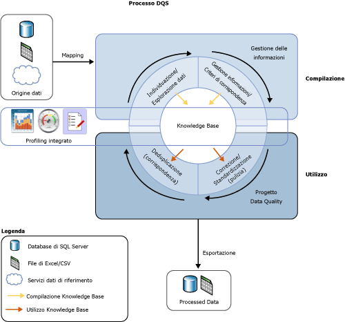

# Introduzione a Data Quality Services
  La soluzione per la qualità dei dati fornita da [!INCLUDE[ssDQSnoversion](../includes/ssdqsnoversion-md.md)] (DQS) consente a un amministratore dei dati o un professionista IT di mantenere la qualità dei dati gestiti e assicurarne l'appropriatezza per l'utilizzo aziendale. DQS è una soluzione basata sulle informazioni che offre modalità assistite da computer e interattive per gestire l'integrità e la qualità delle origini dati. DQS consente di individuare, compilare e gestire informazioni sui dati. È quindi possibile utilizzare tali informazioni per eseguire la pulizia, la corrispondenza e il profiling dei dati. È inoltre possibile utilizzare i servizi basati su cloud di provider di dati di riferimento in un progetto Data Quality DQS.  
  
##   Utilità di una soluzione DQS in ambito aziendale  
 Dati errati possono essere il risultato di errori di immissione da parte dell'utente, danni subiti durante la trasmissione o l'archiviazione, definizioni del dizionario dei dati non corrispondenti o altri problemi legati alla qualità e all'elaborazione dei dati. L'aggregazione di dati derivati da diverse origini in cui vengono utilizzati standard di dati diversi può causare l'incoerenza dei dati stessi. Lo stesso problema può essere provocato dall'applicazione di regole arbitrarie o dalla sovrascrittura di dati cronologici. I dati errati possono influire sulla capacità di un'organizzazione di eseguire le funzioni aziendali e di fornire servizi ai clienti, comportando perdita di credibilità e di affari, insoddisfazione dei clienti e problemi di conformità. I dati errati spesso non permettono il corretto funzionamento dei sistemi automatizzati e si traducono in spreco di tempo ed energia degli addetti ai processi manuali. Dati errati possono causare seri problemi nelle attività di analisi dei dati, generazione di report, data mining e data warehousing.  
  
 L'elevata qualità dei dati è di importanza critica per l'efficienza di aziende private e istituzioni pubbliche. DQS può essere utilizzato da organizzazioni di qualsiasi dimensione per migliorare il valore dei propri dati, rendendoli più adatti all'utilizzo previsto. Una soluzione per la qualità dei dati può rendere i dati più affidabili, accessibili e riutilizzabili. Può migliorare la completezza, l'accuratezza, la conformità e la coerenza dei dati, risolvendo i problemi causati dai dati errati nei carichi di lavoro di business intelligence o data warehousing, così come nei sistemi OLTP operativi.  
  
 Una soluzione DQS consente a utenti aziendali, Information Worker o professionisti IT, non necessariamente esperti di database o di programmazione, di creare, gestire ed eseguire operazioni relative alla qualità dei dati dell'organizzazione con un tempo di preparazione o configurazione minimo.  
  
##   DQS è la risposta alle esigenze di qualità dei dati  
 La qualità dei dati non è definibile in termini assoluti. Dipende dal fatto che i dati siano o meno appropriati allo scopo designato. Con DQS i dati potenzialmente errati vengono identificati e viene fornita una valutazione della probabilità che siano effettivamente errati. DQS fornisce un'illustrazione semantica dei dati che consente di decidere se siano appropriati. Grazie a DQS è possibile risolvere problemi di incompletezza, mancanza di conformità, incoerenza, imprecisione, mancanza di validità e duplicazione dei dati.  
  
 DQS include le funzionalità seguenti per risolvere i problemi di qualità dei dati.  
  
-   **Pulizia dei dati:** la modifica, la rimozione o l'arricchimento di dati errati o incompleti, tramite l'utilizzo di processi sia assistiti da computer che interattivi. Per altre informazioni, vedere [Data Cleansing](../data-quality-services/data-cleansing.md).  
  
-   **Corrispondenza:** l'identificazione di duplicati semantici in un processo basato su regole che consente di determinare la presenza di una corrispondenza ed effettuare la deduplicazione. Per altre informazioni, vedere [Data Matching](../data-quality-services/data-matching.md).  
  
-   **Servizi dati di riferimento:** la verifica della qualità dei dati in uso utilizzando i servizi di un provider di dati di riferimento. È possibile usare i servizi dati di riferimento di [Microsoft Azure Marketplace](http://azure.microsoft.com/marketplace/) per pulire, convalidare, mettere in corrispondenza e arricchire i dati. Per altre informazioni, vedere [Reference Data Services in DQS](../data-quality-services/reference-data-services-in-dqs.md).  
  
-   **Profiling:** l'analisi di un'origine dati per avere dettagli sulla qualità dei dati in ogni fase dei processi di individuazione delle informazioni, gestione del dominio, corrispondenza e pulizia dei dati. Il profiling è uno strumento potente in una soluzione DQS per la qualità dei dati. È possibile creare una soluzione per la qualità dei dati nella quale il profiling ha la stessa importanza della gestione delle informazioni, la corrispondenza o la pulizia dei dati. Per altre informazioni, vedere [Data Profiling and Notifications in DQS](../data-quality-services/data-profiling-and-notifications-in-dqs.md).  
  
-   **Monitoraggio:** la registrazione e la determinazione dello stato delle attività relative alla qualità dei dati. Il monitoraggio consente di verificare che la soluzione per la qualità dei dati funzioni come previsto. Per altre informazioni, vedere [DQS Administration](../data-quality-services/dqs-administration.md).  
  
-   **Knowledge Base:** Data Quality Services è una soluzione basata sulle informazioni in cui i dati vengono analizzati in base alla conoscenza creata con DQS. Consente di creare processi per la qualità dei dati in grado di migliorare costantemente le informazioni sui dati e, di conseguenza, la qualità dei dati stessi.  
  
 Il processo DQS viene illustrato nella figura seguente:  
  
   
  
##   Soluzione basata sulle informazioni  
 La Knowledge Base DQS è un repository che contiene tre tipi di informazioni: informazioni predefinite, informazioni generate dal [!INCLUDE[ssDQSServer](../includes/ssdqsserver-md.md)]e informazioni generate dall'utente. DQS consente di archiviare informazioni sui dati nella Knowledge Base, aggiungere regole business e modificare le informazioni nel modo desiderato, quindi applicarle per verificare l'integrità e la correttezza dei dati. Dopo avere compilato la Knowledge Base, è possibile migliorarla costantemente e riutilizzarla in più processi di miglioramento della qualità dei dati.  
  
 Le informazioni in una Knowledge Base consentono di individuare i dati potenzialmente errati e suggeriscono modifiche da apportare ai dati. Possono essere utilizzate per individuare corrispondenze di dati in base a cui effettuare la deduplicazione. Consentono inoltre di confrontare i dati di origine con dati di riferimento basati su cloud gestiti e garantiti da provider di qualità dei dati. L'amministratore dei dati o il professionista IT verifica sia le informazioni della Knowledge Base sia le modifiche da apportare ai dati ed esegue i processi di pulizia e deduplicazione e i servizi dati di riferimento.  
  
 In una Knowledge Base vengono archiviate tutte le informazioni relative a un tipo specifico di origine dati. Ad esempio, è possibile gestire una Knowledge Base per un database di clienti e un'altra Knowledge Base per un database di dipendenti. Le informazioni vengono incluse in uno o più domini di dati, ognuno dei quali è una rappresentazione semantica di un tipo di dati in un campo dati. Una Knowledge Base per un database di clienti può includere domini per nomi di aziende, indirizzi contatti, informazioni di contatto e così via. Un dominio contiene un elenco di valori attendibili, valori non validi e dati errati. Le informazioni nel dominio includono associazioni di sinonimi, relazioni basate su termini, regole di convalida, regole business e criteri di corrispondenza. Grazie a queste informazioni, l'amministratore dei dati può prendere decisioni informate per stabilire se correggere istanze specifiche dei valori in un dominio.  
  
 DQS consente di eseguire operazioni di importazione ed esportazione con una Knowledge Base. È possibile importare o esportare domini o Knowledge Base utilizzando un file DQS. È possibile importare valori o domini da un file di Excel. È inoltre possibile importare valori trovati da un processo di pulizia basato sulla Knowledge Base nuovamente in un dominio. Tali operazioni consentono di migliorare continuamente una Knowledge Base, assicurandosi che le informazioni ottenute tramite decisioni e individuazioni vengano indirizzate nuovamente alla Knowledge Base.  
  
 La soluzione DQS basata sulle informazioni prevede l'utilizzo di due passaggi fondamentali per la pulizia dei dati:  
  
-   Un processo di **gestione delle informazioni** tramite cui viene compilata la Knowledge Base  
  
-   Un **progetto Data Quality** tramite cui vengono proposte modifiche ai dati di origine in base alle informazioni incluse nella Knowledge Base.  
  
 Per altre informazioni, vedere [Knowledge Base e domini DQS](../data-quality-services/dqs-knowledge-bases-and-domains.md) e [Progetti Data Quality &#40;DQS&#41;](../data-quality-services/data-quality-projects-dqs.md).  
  
##   Componenti DQS  
 Data Quality Services consiste del [!INCLUDE[ssDQSServer](../includes/ssdqsserver-md.md)] e del [!INCLUDE[ssDQSClient](../includes/ssdqsclient-md.md)]. Questi componenti consentono di eseguire Data Quality Services separatamente dalle altre operazioni SQL Server. Entrambi questi componenti vengono installati tramite il programma di installazione di SQL Server.  
  
 Il[!INCLUDE[ssDQSServer](../includes/ssdqsserver-md.md)] viene implementato sotto forma di tre cataloghi di SQL Server che è possibile gestire e monitorare in SQL Server Management Studio (DQS_MAIN, DQS_PROJECTS e DQS_STAGING_DATA). In DQS_Main sono incluse le stored procedure DQS, il motore DQS e le Knowledge Base pubblicate. In DQS_PROJECTS sono inclusi i dati necessari per la gestione della Knowledge Base e le attività dei progetti DQS. DQS_STAGING_DATA fornisce un database intermedio di gestione temporanea in cui è possibile copiare i dati di origine per eseguire operazioni DQS e, successivamente, esportare i dati elaborati.  
  
 Il[!INCLUDE[ssDQSClient](../includes/ssdqsclient-md.md)] è un'applicazione autonoma che consente di eseguire la gestione delle informazioni, i progetti Data Quality e l'amministrazione in un'unica interfaccia utente. L'applicazione è progettata per gli amministratori dei dati che per gli amministratori DQS. Si tratta di un file eseguibile autonomo che consente di eseguire le attività di individuazione delle informazioni, gestione del dominio, creazione di criteri di corrispondenza, pulizia dei dati, corrispondenza, profiling, monitoraggio e amministrazione del server. Il[!INCLUDE[ssDQSClient](../includes/ssdqsclient-md.md)] può essere installato ed eseguito nello stesso computer del [!INCLUDE[ssDQSServer](../includes/ssdqsserver-md.md)] oppure in modalità remota in un computer distinto. Molte operazioni nel [!INCLUDE[ssDQSClient](../includes/ssdqsclient-md.md)] sono basate su procedure guidate e sono quindi molto semplici.  
  
##   Funzionalità Data Quality in Integration Services e Master Data Services  
 La funzionalità Data Quality fornita da Data Quality Services è incorporata in un componente di SQL Server Integration Services (SSIS) e nelle funzioni di Master Data Services (MDS) per abilitare l'esecuzione di processi di qualità dei dati all'interno di tali servizi.  
  
 **[!INCLUDE[ssDQSCleansingLong](../includes/ssdqscleansinglong-md.md)]**  
  
 Il [!INCLUDE[ssDQSCleansingLong](../includes/ssdqscleansinglong-md.md)] consente di eseguire la pulizia dei dati come parte di un pacchetto di Integration Services. Quando il pacchetto viene eseguito, la pulizia dei dati viene eseguita come file batch. Si tratta di un'alternativa all'esecuzione di un progetto di pulizia nell'applicazione [!INCLUDE[ssDQSClient](../includes/ssdqsclient-md.md)] . È possibile assicurare automaticamente la qualità dei dati. Non è necessario eseguire i passaggi interattivi di un progetto di pulizia dei dati all'interno dell'applicazione [!INCLUDE[ssDQSClient](../includes/ssdqsclient-md.md)] . È possibile includere il processo di pulizia dei dati all'interno di un flusso di dati che contiene altri componenti di Integration Services. Per altre informazioni, vedere [Trasformazione DQS Cleansing](../integration-services/data-flow/transformations/dqs-cleansing-transformation.md).  
  
 **Processi relativi alla qualità dei dati in Master Data Services**  
  
 La funzionalità di Data Quality Services è stata integrata in Master Data Services (MDS), quindi è possibile eseguire la deduplicazione su dati di origine e dati master all'interno del componente aggiuntivo Microsoft SQL Server 2014 Master Data Services per Microsoft Excel. Per eseguire la corrispondenza, caricare i dati gestiti da MDS in un foglio di lavoro Excel, combinarli con i dati non gestiti da MDS, quindi eseguire la corrispondenza all'interno di Excel. È necessario installare i componenti del [!INCLUDE[ssDQSServer](../includes/ssdqsserver-md.md)] con MDS. Per altre informazioni, vedere  [Corrispondenza Data Quality nel componente aggiuntivo MDS per Excel](../master-data-services/microsoft-excel-add-in/data-quality-matching-in-the-mds-add-in-for-excel.md).  
  
  
