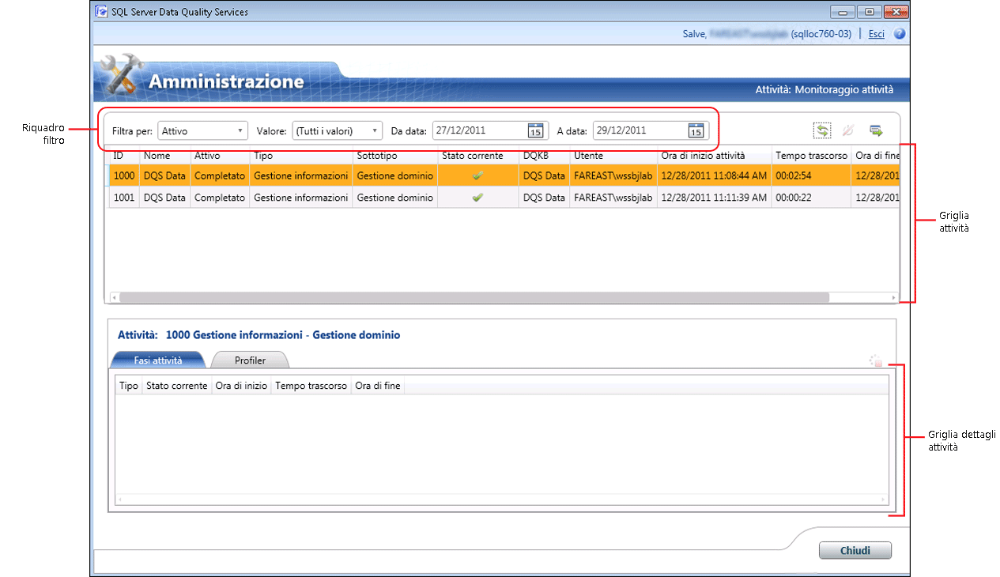

# Monitorare le attivit&#224; DQS
  In questo argomento viene descritto come monitorare a livello centrale le attività seguenti in [!INCLUDE[ssDQSnoversion](../includes/ssdqsnoversion-md.md)] (DQS): individuazione delle informazioni, gestione del dominio, criteri di corrispondenza, pulizia dei dati, corrispondenza dei dati e pulizia SSIS.  
  
##   Prima di iniziare  
  
###   Limitazioni e restrizioni  
 Solo gli utenti con il ruolo dqs_administrator nel database DQS_Main possono terminare un'attività o arrestare un processo all'interno di un'attività.  
  
###   Sicurezza  
  
####   Autorizzazioni  
  
-   Per visualizzare le attività DQS è necessario disporre del ruolo dqs_kb_editor o dqs_kb_operator nel database DQS_MAIN.  
  
-   Per terminare un'attività o arrestare un processo all'interno di un'attività nonché visualizzare le attività DQS, è necessario disporre del ruolo dqs_administrator nel database DQS_MAIN.  
  
##   Visualizzare le attività DQS  
  
1.  [!INCLUDE[ssDQSInitialStep](../includes/ssdqsinitialstep-md.md)] [Eseguire l'applicazione Client Data Quality](../data-quality-services/run-the-data-quality-client-application.md).  
  
2.  Nella schermata iniziale del [!INCLUDE[ssDQSClient](../includes/ssdqsclient-md.md)] fare clic su **Monitoraggio attività**. Verrà visualizzata la schermata Monitoraggio attività.  
  
       
  
3.  Nella schermata Monitoraggio attività vengono visualizzate le informazioni su ogni attività in una griglia di attività. Nella griglia di attività vengono visualizzate le informazioni seguenti su ciascuna attività DQS:  
  
     **ID**: valore intero. Numero univoco dell'attività generato dal sistema per il monitoraggio delle attività.  
  
     **Nome**: nome della Knowledge Base o del progetto Data Quality usato per l'attività.  
  
     **Attivo**: indica se l'attività è attualmente attiva o meno. I valori possibili sono i seguenti:  
  
    -   **Attivo**: l'attività è attualmente in esecuzione.  
  
    -   **Completato**: l'attività è finita.  
  
    -   **Terminato**: l'attività è stata terminata utilizzando la schermata Monitoraggio attività dall'amministratore DQS o l'attività è stata annullata dall'utente durante l'esecuzione nell'area funzionale corrispondente nel [!INCLUDE[ssDQSClient](../includes/ssdqsclient-md.md)].  
  
     **Tipo**: indica il tipo di attività. **Sottotipo** : indica il flusso di lavoro specifico eseguito per un tipo di attività. Vengono monitorati i tipi di attività seguenti:  
  
    -   Sottotipi di**Gestione informazioni** :  
  
        -   **Individuazione informazioni**  
  
        -   **Gestione dominio**  
  
        -   **Criteri di abbinamento**  
  
    -   Sottotipi di**Progetto DQ** :  
  
        -   **Pulizia**  
  
        -   **Corrispondenza**  
  
    -   Sottotipi di**Pulizia SSIS** :  
  
        -   **Pulizia**  
  
     **Stato corrente**: indica lo stato corrente di un'attività. Lo stato dell'attività è determinato dall'ultimo processo di calcolo. Possono essere presenti diversi processi di calcolo in un'attività, ad esempio l'esecuzione ripetuta del processo di individuazione all'interno dell'attività di individuazione delle informazioni. Lo stato può pertanto cambiare diverse volte nel corso dell'attività.  
  
     **Stato corrente** può avere i valori seguenti:  
  
    -   **In esecuzione**: il processo di calcolo è in esecuzione.  
  
    -   **Riuscito**: questo stato viene impostato prima dell'esecuzione di un processo computazionale e dopo che è stato eseguito correttamente.  
  
    -   **Non riuscito**: il processo di calcolo non è riuscito.  
  
    -   **Arrestato**: il processo di calcolo è stato arrestato.  
  
     **DQKB**: nome della Knowledge Base usata per l'attività.  
  
     **Utente**: il nome dell'utente che ha avviato l'attività o dell'ultimo utente che ha utilizzato l'attività (nel caso in cui non sono uguali).  
  
     **Ora di inizio attività**: data e ora di inizio dell'attività  
  
     **Tempo trascorso**: tempo trascorso dall'inizio dell'attività. Il valore viene visualizzato nella notazione HH:MM:SS.  
  
     **Ora di fine attività**: data e ora di fine dell'attività.  
  
##   Filtrare le informazioni delle attività DQS  
 È possibile utilizzare il riquadro dei filtri (**Filtra per**, **valore**, **da data**, e **To Date**) nella schermata per filtrare e visualizzare le attività necessarie in base a determinate criterio di filtro di Monitoraggio attività. Per filtrare i record dell'attività:  
  
1.  Decidere il criterio di filtro: specificare se si desidera filtrare i record dell'attività in base a un valore di una delle colonne nella griglia di attività (basato su valori) o in base a un intervallo di date oppure in base a entrambi i criteri.  
  
    1.  **Il filtro basato sul valore**: selezionare un criterio di filtro nel **Filtra per** elenco e quindi selezionare il valore appropriato da applicare il filtro nel **valore** elenco. Dopo aver selezionato un'opzione nell'elenco **Filtra per** , l'elenco **Valore** viene aggiornato con i valori possibili. È possibile applicare un filtro in base ai campi seguenti nei record dell'attività: **Attivo**, **Tipo**, **Sottotipo**, **Stato corrente**, **DQKB**e **Utente**.  
  
    2.  **Il filtro basato su intervallo di date**: selezionando le date appropriate nel **da data** e **To Date** controlli di Data. Per impostazione predefinita, la data visualizzata in **Da data** precede di due giorni la data corrente e la data visualizzata in **A data** è la data corrente. Il filtro non viene applicato in base alle date di *inizio* e di *fine* , ma in base all'intervallo. Questo significa che verranno visualizzate tutte le attività in esecuzione durante l'intervallo di date selezionato.  
  
2.  Fare clic sull'icona **Aggiorna l'elenco di attività** per applicare il filtro e visualizzare solo le attività DQS filtrate.  
  
##   Visualizzare i dettagli delle attività DQS  
 È possibile visualizzare le informazioni dettagliate di un'attività DQS, ad esempio le fasi dell'attività e le informazioni sul profiler, nella schermata Monitoraggio attività. A tale scopo, procedere come indicato di seguito:  
  
1.  Selezionare un'attività DQS nella griglia di attività (nel riquadro superiore).  
  
2.  Nel riquadro inferiore vengono visualizzati i dettagli dell'attività selezionata nelle 2 schede seguenti:  
  
    -   **Fasi attività**: consente di visualizzare una griglia dei processi di calcolo (fasi attività) associati all'attività selezionata. In questa scheda è possibile che vengano visualizzate diverse fasi per un'attività. Ciò può verificarsi quando la stessa fase dell'attività è stata eseguita più volte dall'utente. Ad esempio, nel caso in cui la fase dell'attività è stata arrestata e avviata di nuovo. Nella griglia in questa scheda vengono visualizzate le informazioni seguenti per ogni fase associata all'attività: **Tipo**, **Stato corrente**, **Ora di inizio**, **Tempo trascorso**e **Ora di fine**.  
  
    -   **Profiler**: vengono visualizzate le informazioni di profiling per le attività correnti e passate. Per le attività correnti, contiene informazioni parziali ma coerenti. Le informazioni di profiling di un'attività vengono esportate in un file di Excel quando si esportano i dettagli dell'attività corrispondenti in un file di Excel. Le informazioni sono disponibili nei fogli **Profiler - Origine** e **Profiler - Campi** del file di Excel esportato.  
  
##   Esportare i dettagli delle attività DQS  
 È possibile esportare in un file di Excel le proprietà, i processi e le informazioni di profiling di un'attività presenti nella schermata Monitoraggio attività. A tale scopo, procedere come indicato di seguito:  
  
1.  Selezionare un'attività nella griglia di attività (nel riquadro superiore).  
  
2.  Fare clic sull'icona **Esportare l'attività selezionata in Excel** . In alternativa, fare clic su qualsiasi attività nella griglia di attività e quindi fare clic su **Esporta attività** nel menu di scelta rapida.  
  
3.  Viene richiesto di specificare un nome e un percorso per il file di Excel da salvare. Il file di Excel esportato contiene i fogli seguenti:  
  
    |Nome foglio|Descrizione|  
    |----------------|-----------------|  
    |Attività|Contiene le informazioni (colonne) sull'attività come riportato nella griglia di attività.|  
    |Processi|Contiene le informazioni (colonne) sui processi per l'attività come la **fasi attività** scheda.|  
    |Profiler - Origine|Per il sottotipo **Pulizia** contiene le informazioni seguenti sull'attività: Record, Record corretti, Record con correzione e Record non validi.   Per i sottotipi **Individuazione informazioni**, **Gestione dominio**, **Criteri di corrispondenza**e **Corrispondenza** contiene le informazioni seguenti sull'attività: Record, Valori totali, Nuovi valori, Valori univoci e Nuovi valori univoci.|  
    |Profiler - Campi|Per i sottotipi **Pulizia** e **Pulizia SSIS** contiene le informazioni seguenti sull'attività: Campo, Dominio, Valori con correzione, Valori consigliati, Completezza e Accuratezza.   Per i sottotipi **Individuazione informazioni**, **Gestione dominio**, **Criteri di corrispondenza**e **Corrispondenza** contiene le informazioni seguenti sull'attività: Campo, Dominio, Nuovo, Univoco, Valido nel dominio e Completezza.|  
  
##   Terminare un'attività DQS  
 Gli amministratori DQS (ruolo dqs_administrator) possono terminare un'attività in esecuzione (attiva) che non è del tipo **pulizia SSIS**. Quando viene terminata un'attività, vengono arrestati tutti i processi in esecuzione nell'attività e viene rimosso tutto ciò che è correlato all'attività. Questa operazione non può essere annullata. Terminare un'attività nella schermata Monitoraggio attività equivale ad annullare la rispettiva attività facendo clic su **Annulla** durante l'esecuzione nell'area funzionale del [!INCLUDE[ssDQSClient](../includes/ssdqsclient-md.md)]. Per terminare un'attività:  
  
1.  Selezionare un'attività in esecuzione nella griglia di attività (nel riquadro superiore).  
  
2.  Fare clic sull'icona **Termina l'attività selezionata** . In alternativa, fare clic sull'attività nella griglia di attività e quindi fare clic su **Termina attività** nel menu di scelta rapida.  
  
3.  Verrà visualizzato un messaggio per confermare l'azione. Scegliere **Sì**.  
  
##   Arrestare un processo in un'attività DQS  
 Gli amministratori DQS (ruolo dqs_administrator) possono arrestare un processo di esecuzione (attivo) in un'attività che non è del tipo **pulizia SSIS**. Arrestare un processo nella schermata Monitoraggio attività equivale ad arrestare il processo all'interno della rispettiva attività nell'area funzionale del [!INCLUDE[ssDQSClient](../includes/ssdqsclient-md.md)]. Ad esempio, è possibile arrestare il processo di pulizia computerizzato all'interno di un'attività di pulizia o arrestare il processo di corrispondenza all'interno di un'attività corrispondente. Un processo arrestato non può essere riavviato dalla schermata Monitoraggio attività. È necessario riavviare il processo dall'area funzionale corrispondente nel [!INCLUDE[ssDQSClient](../includes/ssdqsclient-md.md)]. In tal caso, viene aggiunta una riga alla griglia dei processi nella scheda **Fasi attività** . Lo stato del processo arrestato continua a essere visualizzato come **Arrestato**. Per arrestare un processo:  
  
1.  Selezionare un processo in esecuzione nella griglia Dettagli attività (nel riquadro inferiore).  
  
2.  Fare clic sull'icona **Arresta il processo selezionato** . In alternativa, fare clic sul processo nella griglia dettagli attività e quindi fare clic su **Arresta processo** nel menu di scelta rapida.  
  
3.  Verrà visualizzato un messaggio per confermare l'azione. Scegliere **Sì**.  
  
  