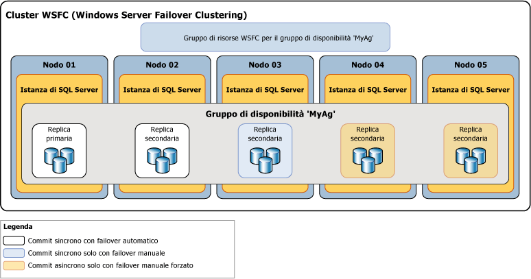

# Modalità di disponibilità (gruppi di disponibilità AlwaysOn)
[!INCLUDE[tsql-appliesto-ss2016-xxxx-xxxx-xxx_md](../../../includes/tsql-appliesto-ss2016-xxxx-xxxx-xxx-md.md)]

  In [!INCLUDE[ssHADR](../../../includes/sshadr-md.md)]la *modalità di disponibilità* è una proprietà della replica tramite cui viene determinato se una replica di disponibilità specificata può essere eseguita in modalità con commit sincrono. La modalità di disponibilità per ogni replica di disponibilità deve essere configurata per la modalità con commit sincrono o per quella con commit asincrono.  Se la replica primaria è configurata per la *modalità con commit asincrono*, non attende che una replica secondaria scriva su disco dei record del log delle transazioni in entrata per *finalizzare il log*. Se una replica secondaria specificata viene configurata per la modalità con commit asincrono, tramite la replica primaria non viene attesa la finalizzazione del log da parte della replica secondaria. Se la replica primaria e una replica secondaria specifica vengono entrambe configurate per la *modalità con commit sincrono*, la replica primaria attende la conferma della finalizzazione del log da parte della replica secondaria, a meno che la replica secondaria non sia in grado di eseguire il ping alla replica primaria entro il *periodo di timeout della sessione*della replica primaria.  
  
> [!NOTE]  
>  Se il periodo di timeout della sessione della replica primaria viene superato da una replica secondaria, la replica primaria passa temporaneamente in modalità con commit asincrono per questa replica secondaria. Quando la replica secondaria si riconnette alla replica primaria, viene ripristinata la modalità con commit sincrono.  
  
 **Contenuto dell'argomento:**  
  
-   [Modalità di disponibilità supportate](#SupportedAvModes)  
  
-   [Asynchronous-Commit Availability Mode](#AsyncCommitAvMode)  
  
-   [Synchronous-Commit Availability Mode](#SyncCommitAvMode)  
  
-   [Attività correlate](#RelatedTasks)  
  
-   [Contenuto correlato](#RelatedContent)  
  
##   Modalità di disponibilità supportate  
 [!INCLUDE[ssHADR](../../../includes/sshadr-md.md)] supporta due modalità di disponibilità: modalità con commit asincrono e modalità con commit sincrono, come indicato di seguito:  
  
-   La*modalità con commit asincrono* è una soluzione di ripristino di emergenza che offre risultati ottimali quando le repliche di disponibilità sono distribuite a distanze considerevoli. Se tutte le repliche secondarie vengono eseguite in modalità con commit asincrono, con la replica primaria non si attende che il log venga finalizzato dalle repliche secondarie. Bensì, subito dopo la scrittura del record del log nel file di log locale, tramite la replica primaria viene inviata la conferma della transazione al client. La replica primaria viene eseguita con una latenza della transazione minima a fronte di una replica secondaria configurata in modalità con commit asincrono.  Se la replica primaria corrente è configurata in modalità di disponibilità commit asincrono, eseguirà il commit asincrono delle transazioni per tutte le repliche secondarie indipendentemente dalle singole impostazioni della modalità di disponibilità.  
  
     Per altre informazioni, vedere [Modalità di disponibilità con commit asincrono](#AsyncCommitAvMode)più avanti in questo argomento.  
  
-   Con la*modalità con commit sincrono* si privilegia la disponibilità elevata rispetto alle prestazioni, aumentando tuttavia la latenza delle transazioni. In modalità con commit sincrono, l'invio della conferma della transazione al client da parte delle transazioni avviene solo dopo la finalizzazione del log su disco da parte della replica secondaria. Quando inizia la sincronizzazione dei dati in un database secondario, viene avviata l'applicazione dei record del log in entrata dal database primario corrispondente da parte della replica secondaria. Non appena è terminata la finalizzazione di tutti i record del log, lo stato del database secondario diventa SYNCHRONIZED. Successivamente, ogni nuova transazione viene finalizzata dalla replica secondaria prima che il record del log venga scritto nel file di log locale. Una volta che tutti i database secondari di una determinata replica secondaria sono sincronizzati, la modalità con commit sincrono supporta il failover manuale e, facoltativamente, quello automatico.  
  
     Per altre informazioni, vedere [Modalità di disponibilità con commit sincrono](#SyncCommitAvMode)più avanti in questo argomento.  
  
 Nell'illustrazione seguente viene mostrato un gruppo di disponibilità con cinque repliche di disponibilità. La replica primaria e una secondaria sono configurate per la modalità con commit sincrono con failover automatico. Un'altra replica secondaria è configurata per la modalità con commit sincrono con solo failover manuale pianificato e due repliche secondarie sono configurate per la modalità con commit asincrono, che supporta solo il failover manuale forzato, in genere denominato *failover forzato*.  
  
   
  
 Il comportamento di sincronizzazione e failover tra due repliche di disponibilità dipende dalla modalità di disponibilità di entrambe le repliche. Ad esempio, affinché si verifichi il commit sincrono, sia la replica primaria corrente sia la replica secondaria in questione devono essere configurate per il commit sincrono. Analogamente, affinché il failover venga eseguito automaticamente, entrambe le repliche devono essere configurate per il failover automatico. Il comportamento per lo scenario di distribuzione illustrato sopra può pertanto essere riepilogato nella tabella seguente in cui viene esaminato il comportamento con ogni potenziale replica primaria:  
  
|Replica primaria corrente|Destinazioni di failover automatico|Comportamento in modalità con commit sincrono con|Comportamento in modalità con commit asincrono con|Failover automatico possibile|  
|-----------------------------|--------------------------------|--------------------------------------------|---------------------------------------------|---------------------------------|  
|01|02|02 e 03|04|Sì|  
|02|01|01 e 03|04|Sì|  
|03||01 e 02|04|No|  
|04|||01, 02 e 03|No|  
  
 In genere il nodo 04 come replica con commit asincrono viene distribuito in un sito per il ripristino di emergenza. Il fatto che i nodi 01, 02 e 03 rimangano nella modalità con commit asincrono dopo il failover al nodo 04 contribuisce ad evitare possibili cali delle prestazioni nel gruppo di disponibilità dovute all'elevata latenza di rete tra i due siti.  
  
##   Asynchronous-Commit Availability Mode  
 Nella *modalità con commit asincrono*la replica secondaria non viene mai sincronizzata con la replica primaria. Anche se un determinato database secondario potrebbe essere aggiornato in base al database primario corrispondente, è possibile che un qualsiasi database secondario presenti un ritardo in qualsiasi momento. La modalità con commit asincrono può essere utile in uno scenario di ripristino di emergenza in cui la distanza tra replica primaria e replica secondaria è significativa e in cui si desidera evitare che piccoli errori abbiano un impatto sulla replica primaria oppure in situazioni in cui le prestazioni sono più importanti della protezione dei dati sincronizzati. Poiché inoltre la replica primaria non attende acknowledgement dalla replica secondaria, problemi nella replica secondaria non hanno mai un impatto sulla replica primaria.  
  
 Tramite una replica secondaria con commit asincrono viene effettuato il tentativo di rimanere aggiornata con i record del log ricevuti dalla replica primaria. I database secondari con commit asincrono, tuttavia, rimangono sempre non sincronizzati ed è probabile che presentino un certo ritardo rispetto ai database primari corrispondenti. In genere, il gap tra un database secondario con commit asincrono e il database primario corrispondente è limitato, ma può diventare significativo in caso di overload del server in cui è ospitata la replica secondaria o se la rete è lenta.  
  
 L'unica forma di failover supportata dalla modalità con commit asincrono è il failover forzato (con possibile perdita di dati). Il failover forzato deve essere usato come ultima risorsa solo per le situazioni in cui la replica primaria corrente non sarà disponibile per un lungo periodo di tempo e la disponibilità immediata dei database primari risulti prioritaria rispetto al rischio di una possibile perdita di dati. La destinazione del failover deve essere una replica il cui stato del ruolo deve essere SECONDARY o RESOLVING. La destinazione del failover assume il ruolo primario e le relative copie dei database diventano il database primario. Tutti i database secondari rimanenti, insieme ai database primari precedenti, non appena diventano disponibili, vengono sospesi finché non vengono ripresi singolarmente manualmente. Nella modalità con commit asincrono tutti i log delle transazioni non ancora inviati dalla replica primaria originale alla replica secondaria precedente vanno persi. Ciò significa che in alcuni o in tutti i nuovi database primari potrebbero mancare alcune transazioni di cui è stato eseguito il commit di recente. Per altre informazioni sul funzionamento del failover forzato e sulle procedure consigliate per il relativo uso, vedere [Failover e modalità di failover &#40;gruppi di disponibilità AlwaysOn&#41;](../../../database-engine/availability-groups/windows/failover-and-failover-modes-always-on-availability-groups.md).  
  
##   Synchronous-Commit Availability Mode  
 In modalità di disponibilità con commit sincrono (*modalità con commit sincrono*), dopo la creazione di un join a un gruppo di disponibilità, un database secondario viene aggiornato rispetto al database primario corrispondente e viene impostato sullo stato SYNCHRONIZED. Il database secondario rimane SYNCHRONIZED finché la sincronizzazione dei dati continua. In questo modo, si assicura che ogni transazione sottoposta a commit in un database primario lo sia anche nel database secondario corrispondente. Una volta che tutti i database secondari in una determinata replica secondaria sono sincronizzati, lo stato di integrità della sincronizzazione della replica secondaria nel suo complesso è HEALTHY.  
  
 **Contenuto della sezione**  
  
-   [Fattori che causano l'interruzione della sincronizzazione dei dati](#DisruptSync)  
  
-   [Funzionamento della sincronizzazione in una replica secondaria](#HowSyncWorks)  
  
-   [Modalità con commit sincrono con solo failover manuale](#SyncCommitWithManual)  
  
-   [Modalità commit sincrono con failover automatico](#SyncCommitWithAuto)  
  
###   Fattori che causano l'interruzione della sincronizzazione dei dati  
 Una volta che tutti i relativi database sono sincronizzati, una replica secondaria viene impostata sullo stato HEALTHY. La replica secondaria sincronizzata rimane integra finché non si verifica uno degli eventi seguenti:  
  
-   Un ritardo o un problema della rete o del computer comporta il timeout della sessione tra la replica secondaria e quella primaria.  
  
    > [!NOTE]  
    >  Per informazioni sulla proprietà relativa al periodo di timeout delle sessioni delle repliche di disponibilità, vedere [Panoramica di gruppi di disponibilità AlwaysOn &#40;SQL Server&#41;](../../../database-engine/availability-groups/windows/overview-of-always-on-availability-groups-sql-server.md).  
  
-   Si sospende un database secondario nella replica secondaria. La replica secondaria non è più sincronizzata e il relativo stato di integrità della sincronizzazione viene contrassegnato come NOT_HEALTHY. La replica secondaria non può diventare di nuovo integra finché il database secondario sospeso non verrà ripreso e risincronizzato o rimosso dal gruppo di disponibilità.  
  
-   Si aggiunge un database primario al gruppo di disponibilità. Le repliche secondarie precedentemente sincronizzate vengono impostate sullo stato di integrità della sincronizzazione NOT_HEALTHY. Con questo stato viene indicato che almeno un database si trova nello stato NOT SYNCHRONIZING. Una determinata replica secondaria non può essere integra finché un database secondario corrispondente non viene preparato nella replica, non ne viene creato un join al gruppo di disponibilità e non diventa sincronizzato con il nuovo database primario.  
  
-   Si modifica la replica primaria o secondaria in modalità di disponibilità con commit asincrono. Dopo essere stata impostata sulla modalità con commit asincrono, la replica secondaria rimarrà nello stato di integrità della sincronizzazione HEALTHY finché la sincronizzazione dei dati continua. Tuttavia, se viene impostata sulla modalità con commit asincrono solo la replica primaria, la replica secondaria con commit sincrono verrà impostata sullo stato di integrità della sincronizzazione PARTIALLY_HEALTHY. Con questo stato viene indicato che almeno un database si trova nello stato SYNCHRONIZING, ma nessuno dei database si trova nello stato SYNCHRONIZING.  
  
-   Si modifica una qualsiasi replica secondaria impostando la modalità di disponibilità con commit sincrono. In questo modo, lo stato di integrità della sincronizzazione della replica secondaria diventa PARTIALLY_HEALTHY finché tutti i relativi database sono nello stato SYNCHRONIZED.  
  
> [!TIP]  
>  Per visualizzare l'integrità della sincronizzazione di un gruppo di disponibilità, di una replica di disponibilità o di un database di disponibilità, eseguire una query sulla colonna **synchronization_health** o **synchronization_health_desc** di [sys.dm_hadr_availability_group_states](../../../relational-databases/system-dynamic-management-views/sys-dm-hadr-availability-group-states-transact-sql.md), [sys.dm_hadr_availability_replica_states](../../../relational-databases/system-dynamic-management-views/sys-dm-hadr-availability-replica-states-transact-sql.md)o [sys.dm_hadr_database_replica_states](../../../relational-databases/system-dynamic-management-views/sys-dm-hadr-database-replica-states-transact-sql.md)rispettivamente.  
  
###   Funzionamento della sincronizzazione in una replica secondaria  
 In modalità con commit sincrono, dopo che una replica secondaria è stata unita in join al gruppo di disponibilità ed è stata stabilita una sessione con la replica primaria, la replica secondaria scrive i record del log in entrata su disco (*finalizza il log*) e invia un messaggio di conferma alla replica primaria. Una volta che il log finalizzato nel database secondario viene aggiornato rispetto alla fine del log nel database primario, lo stato del database secondario viene impostato su SYNCHRONIZED. Il tempo necessario per la sincronizzazione dipende essenzialmente dal ritardo del database secondario rispetto al database primario al momento dell'avvio della sessione (misurato in base al numero di record del log ricevuti inizialmente dalla replica primaria), dal carico di lavoro nel database primario e dalla velocità del computer dell'istanza del server che ospita la replica secondaria.  
  
 Il funzionamento sincrono viene mantenuto nel modo seguente:  
  
1.  Durante la ricezione di una transazione da un client, tramite la replica primaria viene scritto il log per la transazione nel relativo log e, contemporaneamente, viene inviato il record del log alle repliche secondarie.  
  
2.  Una volta che un record del log viene scritto nel log delle transazioni del database primario, la transazione può essere annullata solo se in questa fase si verifica un failover su un database secondario che non ha ricevuto il log. Tramite la replica primaria si attende la conferma dalla replica secondaria con commit sincrono.  
  
3.  Mediante la replica secondaria viene finalizzato il log e restituito un acknowledgement alla replica primaria.  
  
4.  Quando si riceve la conferma dalla replica secondaria, tramite la replica primaria viene completata l'elaborazione del commit e viene inviato un messaggio di conferma al client.  
  
    > [!NOTE]  
    >  Se si verifica il timeout di una replica secondaria con commit sincrono senza conferma della finalizzazione del log, la replica secondaria viene contrassegnata con errore da quella primaria. Lo stato di connessione della replica secondaria viene impostato su DISCONNECTED e non viene più attesa la conferma della replica secondaria da parte di quella primaria. Questo comportamento assicura che una replica secondaria con commit sincrono in cui si sono verificati errori non impedisca la finalizzazione del log delle transazioni nella replica primaria.  
  
 Con la modalità con commit sincrono è possibile proteggere i dati richiedendone la sincronizzazione tra due posizioni, ma con un aumento della latenza delle transazioni.  
  
###  Modalità con commit sincrono con solo failover manuale  
 Se queste repliche sono connesse e il database è sincronizzato, il failover manuale è supportato. Se la replica secondaria diventa inattiva, la replica primaria non viene influenzata. La replica primaria viene eseguita con esposizione se non è presente alcuna replica con stato SYNCHRONIZED, cioè non vengono inviati dati a una qualsiasi replica secondaria. In caso di perdita della replica primaria, le repliche secondarie vengono impostate sullo stato RESOLVING, ma il proprietario del database può forzare un failover sulla replica secondaria (con possibile perdita di dati). Per altre informazioni, vedere [Failover e modalità di failover &#40;gruppi di disponibilità AlwaysOn&#41;](../../../database-engine/availability-groups/windows/failover-and-failover-modes-always-on-availability-groups.md).  
  
###   Modalità commit sincrono con failover automatico  
 Con il failover automatico si garantisce disponibilità elevata assicurando che il database diventi di nuovo disponibile rapidamente dopo la perdita della replica primaria. Per configurare un gruppo di disponibilità per il failover automatico, è necessario impostare la replica primaria corrente e almeno una replica secondaria sulla modalità con commit sincrono con failover automatico. Si possono avere fino a tre repliche di failover automatico.  
  
 Inoltre, affinché un failover automatico sia possibile in un momento specifico, questa replica secondaria deve essere sincronizzata con la replica primaria (cioè tutti i database secondari sono sincronizzati) e per il cluster WSFC (Windows Server Failover Clustering) deve essere disponibile un quorum. Se la replica primaria non è disponibile in presenza di tali condizioni, si verifica il failover automatico. La replica secondaria assume il ruolo di replica primaria e il relativo database diventa il database primario. Per altre informazioni, vedere la sezione "Failover automatico" dell'argomento [Failover e modalità di failover &#40;gruppi di disponibilità AlwaysOn&#41;](../../../database-engine/availability-groups/windows/failover-and-failover-modes-always-on-availability-groups.md).  
  
> [!NOTE]  
>  Per informazioni sul quorum WSFC e [!INCLUDE[ssHADR](../../../includes/sshadr-md.md)], vedere [Modalità quorum WSFC e configurazione del voto &#40;SQL Server&#41;](../../../sql-server/failover-clusters/windows/wsfc-quorum-modes-and-voting-configuration-sql-server.md).  
  
##   Attività correlate  
 **Per modificare la modalità di disponibilità e failover**  
  
-   [Modificare la modalità di disponibilità di una replica di disponibilità &#40;SQL Server&#41;](../../../database-engine/availability-groups/windows/change-the-availability-mode-of-an-availability-replica-sql-server.md)  
  
-   [Modificare la modalità di failover di una replica di disponibilità &#40;SQL Server&#41;](../../../database-engine/availability-groups/windows/change-the-failover-mode-of-an-availability-replica-sql-server.md)  
  
 **Per modificare i voti del quorum**  
  
-   [Visualizzare le impostazioni NodeWeight per il quorum del cluster](../../../sql-server/failover-clusters/windows/view-cluster-quorum-nodeweight-settings.md)  
  
-   [Configurare le impostazioni NodeWeight per il quorum del cluster](../../../sql-server/failover-clusters/windows/configure-cluster-quorum-nodeweight-settings.md)  
  
-   [Forzare l'avvio di un cluster WSFC senza un quorum](../../../sql-server/failover-clusters/windows/force-a-wsfc-cluster-to-start-without-a-quorum.md)  
  
 **Per eseguire un failover manuale**  
  
-   [Eseguire un failover manuale pianificato di un gruppo di disponibilità &#40;SQL Server&#41;](../../../database-engine/availability-groups/windows/perform-a-planned-manual-failover-of-an-availability-group-sql-server.md)  
  
-   [Eseguire un failover manuale forzato di un gruppo di disponibilità &#40;SQL Server&#41;](../../../database-engine/availability-groups/windows/perform-a-forced-manual-failover-of-an-availability-group-sql-server.md)  
  
-   [Utilizzare la Procedura guidata Failover del gruppo di disponibilità &#40;SQL Server Management Studio&#41;](../../../database-engine/availability-groups/windows/use-the-fail-over-availability-group-wizard-sql-server-management-studio.md)  
  
 **Per visualizzare il gruppo e la replica di disponibilità, nonché gli stati dei database**  
  
-   [sys.dm_hadr_availability_group_states &#40;Transact-SQL&#41;](../../../relational-databases/system-dynamic-management-views/sys-dm-hadr-availability-group-states-transact-sql.md)  
  
-   [sys.dm_hadr_availability_replica_states &#40;Transact-SQL&#41;](../../../relational-databases/system-dynamic-management-views/sys-dm-hadr-availability-replica-states-transact-sql.md)  
  
-   [sys.dm_hadr_database_replica_states &#40;Transact-SQL&#41;](../../../relational-databases/system-dynamic-management-views/sys-dm-hadr-database-replica-states-transact-sql.md)  
  
##   Contenuto correlato  
  
-   [Microsoft SQL Server Always On Solutions Guide for High Availability and Disaster Recovery (Guida alle soluzioni AlwaysOn di Microsoft SQL Server per la disponibilità elevata e il ripristino di emergenza)](http://go.microsoft.com/fwlink/?LinkId=227600)  
  
-   [SQL Server Always On Team Blog: The official SQL Server Always On Team Blog (Blog del team di SQL Server AlwaysOn: blog ufficiale del team di SQL Server AlwaysOn)](https://blogs.msdn.microsoft.com/sqlalwayson/)  
  
## Vedere anche  
 [Panoramica di gruppi di disponibilità AlwaysOn &#40;SQL Server&#41;](../../../database-engine/availability-groups/windows/overview-of-always-on-availability-groups-sql-server.md)   
 [Failover e modalità di failover &#40;gruppi di disponibilità AlwaysOn&#41;](../../../database-engine/availability-groups/windows/failover-and-failover-modes-always-on-availability-groups.md)   
 [Windows Server Failover Clustering &#40;WSFC&#41; con SQL Server](../../../sql-server/failover-clusters/windows/windows-server-failover-clustering-wsfc-with-sql-server.md)  
  
  

