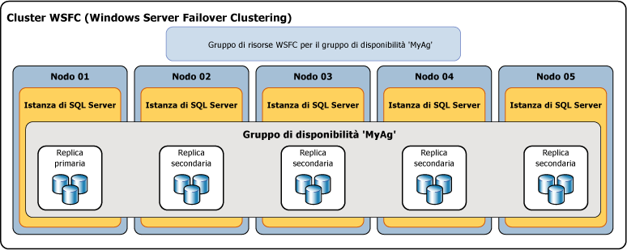

# Panoramica di Gruppi di disponibilità AlwaysOn (SQL Server)
[!INCLUDE[appliesto-ss-xxxx-xxxx-xxx-md](../../../includes/appliesto-ss-xxxx-xxxx-xxx-md.md)]

 In questo argomento sono introdotti i concetti di [!INCLUDE[ssHADR](../../../includes/sshadr-md.md)] fondamentali per la configurazione e la gestione di uno o più gruppi di disponibilità in [!INCLUDE[ssCurrent](../../../includes/sscurrent-md.md)]. Per un riepilogo dei vantaggi offerti dai gruppi di disponibilità e per una panoramica della terminologia relativa a [!INCLUDE[ssHADR](../../../includes/sshadr-md.md)], vedere [Gruppi di disponibilità AlwaysOn &#40;SQL Server&#41;](../../../database-engine/availability-groups/windows/always-on-availability-groups-sql-server.md).  
  
 Un *gruppo di disponibilità* supporta un ambiente di replica per un set discreto di database utente, noti come *database di disponibilità*. È possibile creare un gruppo di disponibilità per la disponibilità elevata (HA) o per la scalabilità in lettura. Un gruppo di disponibilità elevata è un set di database il cui failover viene eseguito contemporaneamente. Un gruppo di disponibilità a scalabilità in lettura è un set di database che vengono copiati in altre istanze di SQL Server per il carico di lavoro di sola lettura. Un gruppo di disponibilità supporta un set di database primari e da uno a otto set di database secondari corrispondenti. I database secondari *non* sono backup. Continuare a eseguire il backup dei database e dei log delle transazioni regolarmente.  
  
> [!TIP]  
>  È possibile creare qualsiasi tipo di backup di un database primario. In alternativa, è possibile creare backup del log e backup completi di sola copia dei database secondari. Per altre informazioni, vedere [Repliche secondarie attive: Backup in repliche secondarie &#40;Gruppi di disponibilità AlwaysOn&#41;](../../../database-engine/availability-groups/windows/active-secondaries-backup-on-secondary-replicas-always-on-availability-groups.md).   

 Ogni set di database di disponibilità è ospitato da una *replica di disponibilità*. Sono disponibili due tipi di replica di disponibilità: una *replica primaria* in cui sono ospitati i database primari e da una a otto *repliche secondarie*, ognuna ospitante un set di database secondari, che sono usate come destinazione del failover potenziale per il gruppo di disponibilità. Per un gruppo di disponibilità il failover si verifica al livello di una replica di disponibilità. Una replica di disponibilità fornisce la ridondanza solo a livello di database, per il set di database in un gruppo di disponibilità. I failover non sono dovuti a database ritenuti sospetti in seguito a una perdita di un file di dati o al danneggiamento di un log delle transazioni.  
  
 La replica primaria rende disponibili i database primari per le connessioni in lettura e scrittura dei client La replica primaria invia i record di log delle transazioni di ogni database primario a ogni database secondario. Questo processo, noto come *sincronizzazione dei dati*, si verifica a livello di database. Ogni replica secondaria memorizza nella cache i record del log delle transazioni (*finalizza* il log), quindi li applica al database secondario corrispondente. La sincronizzazione dei dati si verifica tra il database primario e ogni database secondario collegato, indipendentemente dagli altri database. Pertanto, un database secondario può essere sospeso o non riuscire senza influire su altri database secondari e un database primario può essere sospeso o non riuscire senza influire su altri database primari.  
  
 Facoltativamente, è possibile configurare una o più repliche secondarie per supportare l'accesso in sola lettura ai database secondari e una qualsiasi replica secondaria per consentire l'esecuzione di backup sui database secondari.  

 SQL Server 2017 introduce due architetture diverse per i gruppi di disponibilità. I *gruppi di disponibilità Always On* offrono disponibilità elevata, ripristino di emergenza e bilanciamento della scalabilità in lettura. Questi gruppi di disponibilità richiedono una gestione del cluster. In Windows, il clustering di failover fornisce la gestione del cluster. In Linux è possibile utilizzare Pacemaker. L'altra architettura è data dai *gruppi di disponibilità con scalabilità in lettura*. Un gruppo di disponibilità con scalabilità in lettura fornisce repliche per i carichi di lavoro di sola lettura, ma non un'elevata disponibilità. In un gruppo di disponibilità con scalabilità in lettura non è presente la gestione del cluster. 
 
 La distribuzione dei [!INCLUDE[ssHADR](../../../includes/sshadr-md.md)] per la disponibilità elevata in Windows richiede un cluster WSCF (Windows Server Failover Clustering). Ogni replica di disponibilità di un determinato gruppo di disponibilità deve risiedere su un nodo diverso dello stesso cluster WSFC. L'unica eccezione è che quando viene eseguita la migrazione a un altro cluster WSFC, un gruppo di disponibilità può risiedere temporaneamente in due cluster. 

 >[!NOTE]
 >Per informazioni sui gruppi di disponibilità in Linux, vedere [Gruppo di disponibilità Always On per SQL Server in Linux](../../../linux/sql-server-linux-availability-group-overview.md). 

 In una configurazione a disponibilità elevata, un ruolo cluster viene creato per ogni gruppo di disponibilità che viene creato. Con il cluster WSFC è possibile eseguire il monitoraggio del ruolo per valutare lo stato di integrità della replica primaria. Il quorum di [!INCLUDE[ssHADR](../../../includes/sshadr-md.md)] si basa su tutti i nodi del cluster WSFC, indipendentemente dal fatto che un nodo del cluster ospiti una replica di disponibilità. A differenza del mirroring del database, non esiste alcun ruolo del server di controllo in [!INCLUDE[ssHADR](../../../includes/sshadr-md.md)].  
  
> [!NOTE]  
>  Per informazioni sulla relazione dei componenti di SQL Server AlwaysOn con il cluster WSFC, vedere [WSFC &#40;Windows Server Failover Clustering&#41; con SQL Server](../../../sql-server/failover-clusters/windows/windows-server-failover-clustering-wsfc-with-sql-server.md).  
  
 Di seguito viene illustrato un gruppo di disponibilità contenente una replica primaria e quattro repliche secondarie. Sono supportate fino a otto repliche secondarie, incluse una replica primaria e due repliche secondarie con commit sincrono.  
  
   
  
##   Availability Databases  
 Per poter essere aggiunto a un gruppo di disponibilità, il database deve essere online, di lettura e scrittura ed esistere sull'istanza del server che ospita la replica primaria. Il database viene aggiunto al gruppo di disponibilità come database primario, pur rimanendo disponibile ai client. Non esiste alcun database secondario corrispondente finché i backup del nuovo database primario non sono ripristinati sull'istanza del server che ospita la replica secondaria (tramite RESTORE WITH NORECOVERY). Il nuovo database secondario rimane nello stato RESTORING finché non ne viene creato un join al gruppo di disponibilità. Per altre informazioni, vedere [Avviare lo spostamento dati su un database secondario Always On &#40;SQL Server&#41;](../../../database-engine/availability-groups/windows/start-data-movement-on-an-always-on-secondary-database-sql-server.md).  
  
 Dopo la creazione di un join, il database secondario passa allo stato ONLINE e avvia la sincronizzazione dati con il database primario corrispondente. La*sincronizzazione dati* è il processo tramite cui le modifiche apportate a un database primario sono riprodotte in un database secondario. La sincronizzazione dei dati comporta che il database primario invia i record del log delle transazioni al database secondario.  
  
> [!IMPORTANT]  
>  Un database di disponibilità viene a volte definito *replica di database* in [!INCLUDE[tsql](../../../includes/tsql-md.md)], PowerShell e nei nomi di oggetti SMO (SQL Server Management Objects). Il termine "database replica" (replica di database) viene usato ad esempio nei nomi delle DMV AlwaysOn che restituiscono informazioni sui database di disponibilità:  **sys.dm_hadr_database_replica_states** e **sys.dm_hadr_database_replica_cluster_states**. Tuttavia, nella documentazione online di SQL Server il termine "replica" si riferisce solitamente alle repliche di disponibilità. Ad esempio, "replica primaria" e "replica secondaria" si riferiscono sempre a repliche di disponibilità.  
  
##   Repliche di disponibilità  
 Ogni gruppo di disponibilità definisce un set di due o più partner di failover noti come repliche di disponibilità. Le*repliche di disponibilità* sono componenti del gruppo di disponibilità. Ogni replica di disponibilità ospita una copia dei database di disponibilità del gruppo di disponibilità. Per un determinato gruppo di disponibilità, le repliche di disponibilità devono essere ospitate da istanze separate di [!INCLUDE[ssNoVersion](../../../includes/ssnoversion-md.md)] che risiedono in nodi diversi di un cluster WSFC. Ognuna di queste istanze del server deve essere abilitata per AlwaysOn.  
  
 In una determinata istanza può essere ospitata solo una replica di disponibilità per gruppo di disponibilità. Tuttavia, ogni istanza può essere usata per numerosi gruppi di disponibilità. Un'istanza specificata può essere un'istanza autonoma o un'istanza del cluster di failover di [!INCLUDE[ssNoVersion](../../../includes/ssnoversion-md.md)] . Se è necessaria la ridondanza a livello di server, usare le istanze del cluster di failover.  
  
 A ogni replica di disponibilità viene assegnato un ruolo iniziale, vale a dire il *ruolo primario* o il *ruolo secondario*, ereditato dai database di disponibilità della replica in questione. È il ruolo a determinare se la replica a cui è stato assegnato ospiterà database di lettura e scrittura o database di sola lettura. La *replica primaria*, a cui viene assegnato il ruolo primario, ospiterà i database di lettura e scrittura, noti come *database primari*. Ad almeno un'altra replica, nota come *replica secondaria*viene assegnato il ruolo secondario. Una replica secondaria ospita i database di sola lettura, noti come database secondari.  
  
> [!NOTE]  
>  Quando il ruolo di una replica di disponibilità è indeterminato, ad esempio durante un failover, i relativi database si trovano temporaneamente nello stato NOT SYNCHRONIZING. Il loro ruolo rimane impostato su RESOLVING finché il ruolo della replica di disponibilità non viene risolto. Se una replica di disponibilità viene risolta nel ruolo primario, i relativi database diventano i database primari. Se una replica di disponibilità viene risolta nel ruolo secondario, i relativi database diventano i database secondari.  
  
##   Modalità di disponibilità  
 La modalità di disponibilità è una proprietà di ogni replica di disponibilità. La modalità di disponibilità determina se la replica primaria eseguirà il commit delle transazioni su un database solo dopo che una determinata replica secondaria avrà scritto su disco i record del log delle transazioni (consolidamento del log). [!INCLUDE[ssHADR](../../../includes/sshadr-md.md)] supportano due modalità di disponibilità:*modalità commit asincrono* e *modalità commit sincrono*.  
  
-   **Asynchronous-commit mode**  
  
     Una replica di disponibilità che usa questa modalità di disponibilità viene chiamata *replica con commit asincrono*. Nella modalità commit asincrono, la replica primaria esegue il commit delle transazioni senza attendere l'acknowledgement della finalizzazione del log da parte di una replica con commit asincrono. La modalità commit asincrono riduce la latenza delle transazioni sui database secondari, ma consente un certo ritardo rispetto ai database primari, rendendo possibile la perdita di dati.  
  
-   **Synchronous-commit mode**  
  
     Una replica di disponibilità che usa questa modalità di disponibilità è nota come *replica con commit sincrono*. Nella modalità commit sincrono, prima di eseguire il commit delle transazioni, una replica primaria con commit sincrono attende l'acknowledgement della finalizzazione del log da parte della replica secondaria con commit sincrono. Nella modalità commit sincrono si può essere sicuri che al termine della sincronizzazione di un determinato database secondario con il database primario, le transazioni di cui è stato eseguito il commit sono completamente protette. Questa protezione comporta un aumento della latenza delle transazioni.  
  
 Per altre informazioni, vedere [Modalità di disponibilità &#40;gruppi di disponibilità AlwaysOn&#41;](../../../database-engine/availability-groups/windows/availability-modes-always-on-availability-groups.md).  
  
##   Tipi di failover  
 Nel contesto di una sessione tra la replica primaria e una replica secondaria, i ruoli primari e secondari sono potenzialmente intercambiabili in un processo noto come *failover*. Durante un failover la replica secondaria di destinazione assume il ruolo primario, diventando la nuova replica primaria. La nuova replica primaria porta i relativi database online come database primari, consentendo alle applicazioni client di connettersi ad essi. Se la replica primaria precedente è disponibile, assume il ruolo secondario, diventando una replica secondaria. I database primari precedenti diventano database secondari e la sincronizzazione dati viene ripresa.  
  
 Sono disponibili tre tipi di failover: automatico, manuale e forzato (con possibile perdita di dati). La forma o le forme di failover supportate da una determinata replica secondaria dipendono dalla relativa modalità di disponibilità e, per la modalità commit sincrono, dalla modalità di failover sulla replica primaria e sulla replica secondaria di destinazione.  
  
-   La modalità commit sincrono supporta due forme di failover:*failover manuale pianificato* e *failover automatico*, se la replica secondaria di destinazione è sincronizzata con avt1. Il supporto per queste forme di failover dipende dall'impostazione della *proprietà della modalità di failover* sui partner di failover. Se la modalità di failover è impostata su "manuale" sulla replica primaria o su quella secondaria, per la replica secondaria è supportato solo il failover manuale. Se la modalità di failover è impostata su "automatico" sia sulla replica primaria sia sulle repliche secondarie, sulla replica secondaria sono supportate entrambe le forme di failover, manuale e automatico.  
  
    -   **Failover manuale pianificato** (senza perdita di dati)  
  
         Si verifica un failover manuale quando un amministratore di database esegue un comando di failover causando il passaggio di una replica secondaria sincronizzata al ruolo primario (con protezione dei dati garantita) e della replica primaria al ruolo secondario. Un failover manuale richiede che sia la replica primaria sia la replica secondaria di destinazione siano eseguite nella modalità commit sincrono e che la replica secondaria sia già sincronizzata.  
  
    -   **Failover automatico** (senza perdita di dati)  
  
         Un failover automatico si verifica in risposta a un errore che causa il passaggio di una replica secondaria sincronizzata al ruolo primario (con protezione dei dati garantita). Quando la replica primaria precedente diventa disponibile, assume il ruolo secondario. Il failover automatico richiede che sia la replica primaria sia la replica secondaria di destinazione siano eseguite nella modalità commit sincrono con la modalità di failover impostata su "Automatico". Inoltre, la replica secondaria deve essere già sincronizzata, deve disporre del quorum WSFC e deve soddisfare le condizioni specificate dai [criteri di failover flessibili](../../../database-engine/availability-groups/windows/flexible-automatic-failover-policy-availability-group.md)del gruppo di disponibilità.  
  
        > [!IMPORTANT]  
        >  Le istanze del cluster di failover di SQL Server non supportano il failover automatico da gruppi di disponibilità, pertanto le replica di disponibilità ospitate da un'istanza del cluster di failover possono essere configurate solo per il failover manuale.  
  
    > [!NOTE]  
    >  Se si esegue un comando di failover forzato su una replica secondaria sincronizzata, la replica secondaria si comporta come con un failover manuale pianificato.  
  
-   Nella modalità commit asincrono, l'unica forma di failover supportata è il failover manuale forzato (con possibile perdita di dati), in genere denominato *failover forzato*. Il failover forzato è considerato una forma di failover manuale, in quanto può essere avviato solo manualmente. Il failover forzato rappresenta un'opzione di ripristino di emergenza. Si tratta dell'unica forma di failover possibile quando la replica secondaria di destinazione non è sincronizzata con la replica primaria.  
  
 Per altre informazioni, vedere [Failover e modalità di failover &#40;gruppi di disponibilità AlwaysOn&#41;](../../../database-engine/availability-groups/windows/failover-and-failover-modes-always-on-availability-groups.md).  
  
##   Connessioni client  
 È possibile fornire la connettività client alla replica primaria di un determinato gruppo di disponibilità creando un listener del gruppo di disponibilità. Un *listener del gruppo di disponibilità* fornisce un set di risorse collegate a un determinato gruppo di disponibilità per l'indirizzamento delle connessioni client alla replica di disponibilità appropriata.  
  
 Un listener del gruppo di disponibilità è associato a un nome DNS univoco che funge da nome di rete virtuale (VNN), a uno o più indirizzi IP virtuali (VIP) e a un numero di porta TCP. Per altre informazioni, vedere [Listener del gruppo di disponibilità, connettività client e failover dell'applicazione &#40;SQL Server&#41;](../../../database-engine/availability-groups/windows/listeners-client-connectivity-application-failover.md).  
  
> [!TIP]  
>  Se un gruppo di disponibilità dispone unicamente di due repliche di disponibilità e non è configurato per consentire l'accesso in lettura alla replica secondaria, i client possono connettersi alla replica primaria tramite una [stringa di connessione per il mirroring del database](../../../database-engine/database-mirroring/connect-clients-to-a-database-mirroring-session-sql-server.md). Questo approccio può essere utile temporaneamente dopo la migrazione di un database dal mirroring del database ai [!INCLUDE[ssHADR](../../../includes/sshadr-md.md)]. Prima di aggiungere ulteriori repliche di disponibilità, è necessario creare un listener del gruppo di disponibilità e aggiornare le applicazioni affinché utilizzino il nome di rete del listener.  
  
##   Repliche secondarie attive  
 [!INCLUDE[ssHADR](../../../includes/sshadr-md.md)] supporta le repliche secondarie attive. Le funzionalità delle repliche secondarie attive includono il supporto per:  
  
-   **Esecuzione di operazioni di backup sulle repliche secondarie**  
  
     Le repliche secondarie supportano l'esecuzione di backup del log e backup di [sola copia](../../../database-engine/availability-groups/windows/active-secondaries-backup-on-secondary-replicas-always-on-availability-groups.md) di un database completo, di file o di un filegroup. È possibile configurare il gruppo di disponibilità per specificare una preferenza per la destinazione dei backup. È importante comprendere che la preferenza non viene applicata da SQL Server, pertanto non incide sui backup ad hoc. L'interpretazione di questa preferenza dipende dalla logica, se presente, di cui viene generato lo script nei processi di backup per ogni database di un determinato gruppo di disponibilità. Per una replica di disponibilità singola, è possibile specificare la priorità di esecuzione dei backup in questa replica rispetto alle altre repliche dello stesso gruppo di disponibilità. Per altre informazioni, vedere [Repliche secondarie attive: Backup in repliche secondarie &#40;gruppi di disponibilità Always On&#41;](../../../database-engine/availability-groups/windows/active-secondaries-backup-on-secondary-replicas-always-on-availability-groups.md).  
  
-   **Accesso in sola lettura a una o più repliche secondarie (repliche secondarie leggibili)**  
  
     Una replica di disponibilità può essere configurata in modo da consentire l'accesso in sola lettura ai relativi database locali quando svolge il ruolo secondario, sebbene alcune operazioni non siano pienamente supportate. Se inoltre si desidera impedire l'esecuzione dei carichi di lavoro in sola lettura sulla replica primaria, è possibile configurare le repliche in modo da consentire l'accesso in lettura/scrittura solo quando l'esecuzione avviene nel ruolo primario. Per altre informazioni, vedere [Repliche secondarie attive: Repliche secondarie leggibili &#40;Gruppi di disponibilità AlwaysOn&#41;](../../../database-engine/availability-groups/windows/active-secondaries-readable-secondary-replicas-always-on-availability-groups.md).  
  
     Se un listener del gruppo di disponibilità e una o più repliche secondarie leggibili vengono elaborate da un gruppo di disponibilità, tramite [!INCLUDE[ssNoVersion](../../../includes/ssnoversion-md.md)] è possibile instradare le richieste di connessione con finalità di lettura a una di tali repliche (*routing di sola lettura*). Per altre informazioni, vedere [Listener del gruppo di disponibilità, connettività client e failover dell'applicazione &#40;SQL Server&#41;](../../../database-engine/availability-groups/windows/listeners-client-connectivity-application-failover.md).  
  
##   Periodo di timeout della sessione  
 Il periodo di timeout della sessione è una proprietà della replica di disponibilità che determina quanto tempo la connessione con un'altra replica di disponibilità può rimanere inattiva prima che la connessione venga chiusa. Le repliche primarie e secondarie effettuano vicendevolmente il ping per segnalare che ancora sono attive. La ricezione di un ping dall'altra replica durante il periodo di timeout indica che la connessione è ancora aperta e che le istanze del server sono in comunicazione. Alla ricezione di un ping, la replica di disponibilità reimposta il contatore del timeout della sessione per quella connessione.  
  
 Il periodo di timeout della sessione impedisce alla replica di attendere indefinitamente la ricezione di un ping dall'altra replica. Se non viene ricevuto alcun ping dall'altra replica entro il periodo di timeout della sessione, si verifica il timeout della replica. La connessione viene chiusa e per la replica scaduta viene impostato lo stato DISCONNECTED. Anche se la replica disconnessa è configurata per la modalità con commit sincrono, le transazioni non attenderanno che quella replica venga riconnessa e risincronizzata.  
  
 Il periodo di timeout della sessione predefinito per ogni replica di disponibilità è di 10 secondi. Questo valore è configurabile dall'utente (minimo 5 secondi). È consigliabile usare generalmente un periodo di timeout di almeno 10 secondi. Con un valore inferiore a 10 secondi, può verificarsi un sovraccarico del sistema, con generazione di falsi errori.  
  
> [!NOTE]  
>  Nel ruolo di risoluzione, il periodo di timeout della sessione non si applica perché il ping non viene eseguito.  
  
##   Correzione di pagina automatica  
 Ogni replica di disponibilità tenta di recuperare automaticamente delle pagine danneggiate su un database locale risolvendo determinati tipi di errore che impediscono la lettura di una pagina di dati. Se una replica secondaria non legge una pagina, la replica richiede alla replica primaria una copia aggiornata della pagina. Se la replica primaria non legge una pagina, la replica trasmette una richiesta per una copia aggiornata a tutte le repliche secondarie e ottiene la pagina dalla prima replica secondaria che risponderà. Se la richiesta viene soddisfatta, la pagina illeggibile viene sostituita dalla copia e l'errore viene risolto.  
  
 Per altre informazioni, vedere [Correzione automatica della pagina &#40;Gruppi di disponibilità/Mirroring del database&#41;](../../../sql-server/failover-clusters/automatic-page-repair-availability-groups-database-mirroring.md).  
  
##   Attività correlate  
  
-   [Introduzione ai gruppi di disponibilità Always On &#40;SQL Server&#41;](../../../database-engine/availability-groups/windows/getting-started-with-always-on-availability-groups-sql-server.md)  
  
##   Contenuto correlato  
  
-   **Blog:**  
  
     [Pagina relativa alla serie di informazioni su HADRON riguardanti l'uso del pool di lavoro per database abilitati HADRON in AlwaysOn](http://blogs.msdn.com/b/psssql/archive/2012/05/17/Always%20On-hadron-learning-series-worker-pool-usage-for-hadron-enabled-databases.aspx)  
  
     [SQL Server AlwaysOn Team Blog: blog ufficiale del team di SQL Server AlwaysOn](https://blogs.msdn.microsoft.com/sqlalwayson/)  
  
     [Pagina relativa ai blog del Servizio Supporto Tecnico Clienti per gli ingegneri di SQL Server](http://blogs.msdn.com/b/psssql/)  
  
-   **Video:**  
  
     [Pagina relativa alla prima parte riguardante l'introduzione della soluzione a disponibilità elevata di prossima generazione della serie AlwaysOn di Microsoft SQL Server nome in codice "Denali"](http://channel9.msdn.com/Events/TechEd/NorthAmerica/2011/DBI302)  
  
     [Pagina relativa alla seconda parte riguardante la compilazione di una soluzione a disponibilità elevata critica tramite AlwasyOn della serie AlwaysOn di Microsoft SQL Server nome in codice "Denali"](http://channel9.msdn.com/Events/TechEd/NorthAmerica/2011/DBI404)  
  
-   **White paper:**  
  
     [Microsoft SQL Server Always On Solutions Guide for High Availability and Disaster Recovery (Guida alle soluzioni AlwaysOn di Microsoft SQL Server per la disponibilità elevata e il ripristino di emergenza)](http://go.microsoft.com/fwlink/?LinkId=227600)  
  
     [Pagina relativa ai white paper Microsoft per SQL Server 2012](http://msdn.microsoft.com/library/hh403491.aspx)  
  
     [Pagina relativa ai white paper del team di consulenza clienti di SQL Server](http://sqlcat.com/)  
  
## Vedere anche  
 [Modalità di disponibilità &#40;gruppi di disponibilità AlwaysOn&#41;](../../../database-engine/availability-groups/windows/availability-modes-always-on-availability-groups.md)   
 [Failover e modalità di failover &#40;gruppi di disponibilità AlwaysOn&#41;](../../../database-engine/availability-groups/windows/failover-and-failover-modes-always-on-availability-groups.md)   
 [Panoramica delle istruzioni Transact-SQL per i gruppi di disponibilità Always On &#40;SQL Server&#41;.](../../../database-engine/availability-groups/windows/transact-sql-statements-for-always-on-availability-groups.md)   
 [Panoramica dei cmdlet di PowerShell per Gruppi di disponibilità Always On &#40;SQL Server&#41;](../../../database-engine/availability-groups/windows/overview-of-powershell-cmdlets-for-always-on-availability-groups-sql-server.md)   
 [Supporto della disponibilità elevata per i database OLTP in memoria](../../../relational-databases/in-memory-oltp/high-availability-support-for-in-memory-oltp-databases.md)   
 [Prerequisiti, restrizioni e raccomandazioni per i gruppi di disponibilità AlwaysOn &#40;SQL Server&#41;](../../../database-engine/availability-groups/windows/prereqs-restrictions-recommendations-always-on-availability.md)   
 [Creazione e configurazione di gruppi di disponibilità &#40;SQL Server&#41;](../../../database-engine/availability-groups/windows/creation-and-configuration-of-availability-groups-sql-server.md)   
 [Repliche secondarie attive: Repliche secondarie leggibili &#40;Gruppi di disponibilità AlwaysOn&#41;](../../../database-engine/availability-groups/windows/active-secondaries-readable-secondary-replicas-always-on-availability-groups.md)   
 [Repliche secondarie attive: Backup in repliche secondarie &#40;Gruppi di disponibilità AlwaysOn&#41;](../../../database-engine/availability-groups/windows/active-secondaries-backup-on-secondary-replicas-always-on-availability-groups.md)   
 [Listener del gruppo di disponibilità, connettività client e failover dell'applicazione &#40;SQL Server&#41;](../../../database-engine/availability-groups/windows/listeners-client-connectivity-application-failover.md)  
  
   
