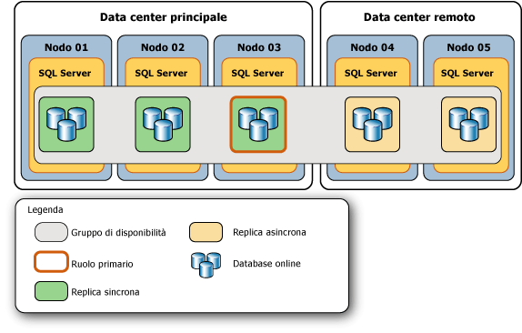
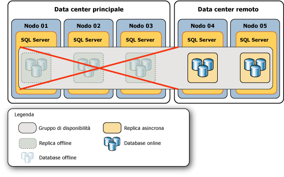
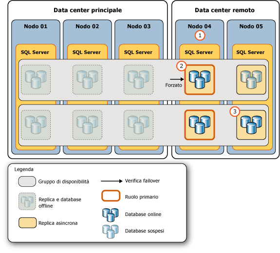
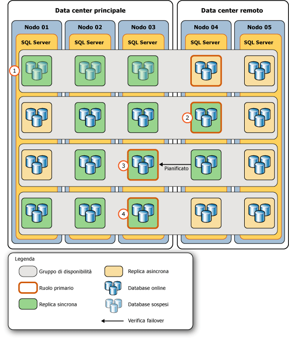

# <a name="perform-a-forced-manual-failover-of-an-availability-group-sql-server"></a>Eseguire un failover manuale forzato di un gruppo di disponibilità (SQL Server)
  Questo argomento illustra come eseguire un failover forzato (con possibile perdita di dati) in un gruppo di disponibilità AlwaysOn tramite [!INCLUDE[ssManStudioFull](../../../includes/ssmanstudiofull-md.md)], [!INCLUDE[tsql](../../../includes/tsql-md.md)]o PowerShell in [!INCLUDE[ssCurrent](../../../includes/sscurrent-md.md)]. Un failover forzato rappresenta un tipo di failover manuale che deve essere utilizzato esclusivamente per il ripristino di emergenza, se non è possibile eseguire un [failover manuale pianificato](../../../database-engine/availability-groups/windows/perform-a-planned-manual-failover-of-an-availability-group-sql-server.md) . Se si forza il failover in una replica secondaria non sincronizzata, è possibile che vengano persi alcuni dati. È pertanto consigliabile forzare il failover solo se è necessario ripristinare immediatamente il servizio nel gruppo di disponibilità e si è disposti a rischiare la perdita di dati.  
  
 Dopo un failover forzato, la destinazione a cui è stato eseguito il failover del gruppo di disponibilità diventa la nuova replica primaria. I database secondari nelle repliche secondarie rimanenti vengono sospesi e dovranno essere ripresi manualmente. Quando la replica primaria precedente diventa disponibile, passa al ruolo secondario. In questo modo i database primari precedenti diventano database secondari e passano allo stato SUSPENDED. Prima di riprendere uno specifico database secondario, è possibile che si riesca a recuperare i dati perduti. Si tenga tuttavia presente che il troncamento del log delle transazioni viene ritardato in uno specifico database primario mentre i relativi database secondari sono sospesi.  
  
> [!IMPORTANT]  
>  La sincronizzazione dei dati con il database primario non verrà eseguita fino a quando non viene ripreso il database secondario. Per informazioni sulla ripresa di un database secondario, vedere [Completamento: Attività essenziali dopo un failover forzato](#FollowUp) più avanti in questo articolo.  
  
 È necessario eseguire un failover forzato nelle situazioni di emergenza indicate di seguito.  
  
-   Dopo aver forzato il quorum del cluster WSFC (*forced quorum*), sarà necessario forzare il failover di ogni gruppo di disponibilità (con possibile perdita di dati). Il failover forzato è necessario poiché lo stato effettivo dei valori del cluster WSFC potrebbe essere andato perso. È tuttavia possibile evitare la perdita di dati, se si riesce a forzare il failover nell'istanza del server che ospitava la replica primaria prima di forzare il quorum o in una replica secondaria sincronizzata prima di forzare il quorum. Per ulteriori informazioni, vedere [Metodi possibili per evitare la perdita di dati dopo aver forzato il quorum](#WaysToAvoidDataLoss)più avanti in questo argomento.  
  
    > [!IMPORTANT]  
    >  Se il quorum viene recuperato naturalmente, senza bisogno di forzarlo, le repliche di disponibilità verranno sottoposte al normale processo di recupero. Se la replica primaria non risulta ancora disponibile dopo aver recuperato il quorum, è possibile eseguire un failover manuale pianificato in una replica secondaria sincronizzata.  
  
     Per informazioni sulla forzatura del quorum, vedere [Ripristino di emergenza WSFC tramite quorum forzato &#40;SQL Server&#41;](../../../sql-server/failover-clusters/windows/wsfc-disaster-recovery-through-forced-quorum-sql-server.md). Per informazioni sui motivi per cui il failover forzato è necessario dopo la forzatura del quorum, vedere [Failover e modalità di failover &#40;gruppi di disponibilità AlwaysOn&#41;](../../../database-engine/availability-groups/windows/failover-and-failover-modes-always-on-availability-groups.md).  
  
-   Se la replica primaria non è più disponibile dopo che il cluster WSFC ha conseguito un quorum integro, è possibile forzare il failover (con possibile perdita di dati) in qualsiasi replica con ruolo in stato SECONDARY o RESOLVING. Se possibile, forzare il failover in una replica secondaria con commit sincrono che era sincronizzata quando la replica primaria è andata persa.  
  
    > [!TIP]  
    >  Quando il cluster WSFC consegue un quorum integro, se si esegue un comando di failover forzato in una replica secondaria sincronizzata, la replica eseguirà in realtà un failover manuale pianificato.  
  
> [!NOTE]  
>  Per altre informazioni sui prerequisiti, consigli per il failover forzato e uno scenario di esempio che usa il failover forzato per il ripristino da un errore irreversibile, vedere [Scenario di esempio: Utilizzo di un failover forzato per il ripristino da un errore irreversibile](../../../database-engine/availability-groups/windows/perform-a-forced-manual-failover-of-an-availability-group-sql-server.md#ExampleRecoveryFromCatastrophy), più avanti in questo argomento.  
  
-   **Prima di iniziare:**  
  
     [Limitazioni e restrizioni](#Restrictions)  
  
     [Prerequisiti](#Prerequisites)  
  
     [Indicazioni](#Recommendations)  
  
     [Metodi possibili per evitare la perdita di dati dopo aver forzato il quorum](#WaysToAvoidDataLoss)  
  
     [Sicurezza](#Security)  
  
-   **Per forzare il failover (con possibile perdita di dati) tramite:**  
  
     [SQL Server Management Studio](#SSMSProcedure)  
  
     [Transact-SQL](#TsqlProcedure)  
  
     [PowerShell](#PowerShellProcedure)  
  
-   **Completamento:** [Attività essenziali dopo un failover forzato](#FollowUp)  
  
-   **Scenario di esempio:** [Uso di un failover forzato per il ripristino da un errore irreversibile](#ExampleRecoveryFromCatastrophy)  
  
-   [Attività correlate](#RelatedTasks)  
  
-   [Contenuto correlato](#RelatedContent)  
  
##  <a name="BeforeYouBegin"></a> Prima di iniziare  
  
###  <a name="Restrictions"></a> Limitazioni e restrizioni  
  
-   L'unico caso in cui non è possibile eseguire un failover forzato si verifica quando il cluster WSFC (Windows Server Failover Clustering) non dispone del quorum.  
  
-   È possibile che si verifichi una perdita di dati durante il failover forzato di un gruppo di disponibilità. Inoltre, se la replica primaria è in esecuzione quando si inizia un failover forzato, è possibile che i client siano ancora connessi ai database primari precedenti. Pertanto, è consigliabile forzare il failover solo se la replica primaria non è più in esecuzione e si è disposti a rischiare la perdita di dati per ripristinare l'accesso ai database nel gruppo di disponibilità.  
  
-   Quando un database secondario si trova nello stato REVERTING o INITIALIZING, il failover forzato provocherebbe il mancato avvio del database come database primario. Se il database era nello stato INITIALIZING, sarà necessario applicare i record del log mancanti da un backup del database o ripristinare completamente il database. Se il database era nello stato REVERTING, sarà necessario ripristinare completamente il database dai backup.  
  
-   Un comando di failover viene eseguito non appena la destinazione di failover avrà accettato il comando. Tuttavia, il recupero del database si verifica in modo asincrono dopo che il gruppo di disponibilità ha completato il failover.  
  
-   La coerenza tra i database all'interno del gruppo di disponibilità potrebbe non essere mantenuta nel failover.  
  
    > [!NOTE]  
    >  Il supporto delle transazioni distribuite e tra database varia in base alle versioni di SQL Server e del sistema operativo. Per altre informazioni, vedere [Transazioni tra database non supportate per il mirroring del database o i gruppi di disponibilità AlwaysOn &#40;SQL Server&#41;](../../../database-engine/availability-groups/windows/transactions-always-on-availability-and-database-mirroring.md).  
  
###  <a name="Prerequisites"></a> Prerequisiti  
  
-   Il cluster WSFC dispone del quorum. Se il cluster non dispone del quorum, vedere [Ripristino di emergenza WSFC tramite quorum forzato &#40;SQL Server&#41;](../../../sql-server/failover-clusters/windows/wsfc-disaster-recovery-through-forced-quorum-sql-server.md).  
  
-   È necessario connettersi a un'istanza del server che ospita una replica con ruolo in stato SECONDARY o RESOLVING.  
  
###  <a name="Recommendations"></a> Indicazioni  
  
-   Non forzare il failover mentre la replica primaria è ancora in esecuzione.  
  
-   Se possibile, forzare il failover solo in una destinazione di failover con database secondari in stato NOT SYNCHRONIZED, SYNCHRONIZED o SYNCHRONIZING. Per informazioni sulle implicazioni del failover forzato quando un database secondario è nello stato INITIALIZING o REVERTING, vedere [Limitazioni e restrizioni](#Restrictions), in precedenza in questo argomento.  
  
-   In genere la latenza di un determinato database secondario, rispetto al database primario, dovrebbe essere simile nelle diverse repliche secondarie con commit asincrono. Tuttavia, in caso di failover forzato, la perdita di dati può costituire un problema significativo. È pertanto consigliabile determinare la latenza relativa delle copie dei database nelle diverse repliche secondarie. Per determinare quale copia di un database secondario specifico presenta la latenza minima, confrontare i relativi LSN di fine log. Un LSN di fine log più elevato indica una minore latenza.  
  
    > [!TIP]  
    >  Per confrontare gli LSN di fine log, connettersi in sequenza a ogni replica secondaria online ed eseguire una query su [sys.dm_hadr_database_replica_states](../../../relational-databases/system-dynamic-management-views/sys-dm-hadr-database-replica-states-transact-sql.md) per ottenere il valore **end_of_log_lsn** di ogni database secondario locale. Confrontare quindi gli LSN di fine log delle diverse copie di ogni database. Si noti che database diversi potrebbero presentare i relativi LSN più elevati in repliche secondarie diverse. In tal caso, la destinazione del failover più appropriata dipenderà dall'importanza relativa che si attribuisce ai dati nei diversi database, ovvero per quale di questi database si preferirebbe ridurre al minimo una possibile perdita di dati.  
  
-   Se i client sono in grado di connettersi alla replica primaria originale, un failover forzato incorre nel rischio di comportamento split-brain. Prima di forzare il failover, è consigliabile impedire ai client di accedere alla replica primaria originale. In caso contrario, dopo il failover forzato, i database primari originali e i database primari correnti possono essere aggiornati in modo indipendente gli uni dagli altri.  
  
###  <a name="WaysToAvoidDataLoss"></a> Metodi possibili per evitare la perdita di dati dopo aver forzato il quorum  
 In alcune condizioni di errore dopo che il quorum è andato perso, è possibile evitare la perdita di dati nei modi indicati di seguito.  
  
-   **Se la replica primaria originale torna online**  
  
     Se il quorum viene perso e la forzatura del quorum WSFC implica il ripristino del nodo del cluster che ospita la replica primaria di un gruppo di disponibilità, è possibile evitare la perdita di dati per questo gruppo di disponibilità. Connettersi alla replica primaria ed eseguire un failover forzato (FAILOVER_ALLOW_DATA_LOSS). In questo modo la replica primaria torna online. Non si verifica alcuna perdita di dati, in quanto viene eseguito il failover forzato nella replica primaria originale.  
  
-   **Se una replica secondaria sincronizzata con commit sincrono torna online**  
  
     Se il quorum viene perso e la forzatura del quorum WSFC implica il ripristino del nodo del cluster che ospita una replica secondaria sincronizzata di un gruppo di disponibilità, è possibile evitare la perdita di dati per questo gruppo di disponibilità. Se il nodo ripristinato era attivo nel momento in cui il quorum è andato perso, è possibile determinare se può verificarsi una perdita di dati in un database specifico eseguendo una query sulla colonna **is_failover_ready** della vista a gestione dinamica (DMV) [sys.dm_hadr_database_replica_cluster_states](../../../relational-databases/system-dynamic-management-views/sys-dm-hadr-database-replica-cluster-states-transact-sql.md) . Ad esempio, per un'istanza del server denominata `sql108w2k8r22`, eseguire la query qui indicata:  
  
    ```  
    SELECT * FROM sys.dm_hadr_database_replica_cluster_states  
       WHERE replica_id=(SELECT replica_id FROM sys.availability_replicas   
          WHERE replica_server_name ='sql108w2k8r22')  
    ```  
  
    > [!CAUTION]  
    >  Se il nodo ripristinato non era attivo nel momento in cui il quorum è andato perso, **is_failover_ready** potrebbe non riflettere l'effettivo stato del cluster nel momento in cui la replica primaria è passata offline. Quindi il valore **is_failover_ready** è utile solo se il nodo dell'host era attivo nel momento in cui si è verificato l'errore. Per altre informazioni, vedere "Motivi per cui è necessario il failover forzato dopo aver forzato il quorum" in [Failover e modalità di failover &#40;gruppi di disponibilità AlwaysOn&#41;](../../../database-engine/availability-groups/windows/failover-and-failover-modes-always-on-availability-groups.md).  
  
     Se **is_failover_ready** è uguale a 1, il database viene contrassegnato come sincronizzato nel cluster ed è pronto per il failover. Se **is_failover_ready** è uguale a 1 in ogni database di una determinata replica secondaria, è possibile eseguire un failover forzato (FORCE_FAILOVER_ALLOW_DATA_LOSS) senza perdita di dati nella replica secondaria. La replica secondaria sincronizzata torna online nel ruolo primario, ovvero come nuova replica primaria, con tutti i dati intatti.  
  
     Se **is_failover_ready** è uguale a 0, il database non viene contrassegnato come sincronizzato nel cluster e *non* è pronto per un failover manuale pianificato. Se si forza il failover nella replica secondaria host, i dati verranno persi nel database.  
  
    > [!NOTE]  
    >  Se si forza il failover in una replica secondaria, la quantità di dati che andranno perduti dipenderà dal ritardo della destinazione di failover rispetto alla replica primaria. Purtroppo, quando il cluster WSFC non dispone del quorum o il quorum è stato forzato, non è possibile valutare la quantità di dati che potrebbero andare perduti. Si noti, tuttavia, che una volta che il cluster WSFC avrà recuperato un quorum integro, sarà possibile iniziare a tenere traccia della potenziale perdita di dati. Per altre informazioni, vedere "Come tenere traccia della potenziale perdita di dati" in [Failover e modalità di failover &#40;gruppi di disponibilità AlwaysOn&#41;](../../../database-engine/availability-groups/windows/failover-and-failover-modes-always-on-availability-groups.md).  
  
###  <a name="Security"></a> Sicurezza  
  
####  <a name="Permissions"></a> Autorizzazioni  
 È necessaria l'autorizzazione ALTER AVAILABILITY GROUP nel gruppo di disponibilità, l'autorizzazione CONTROL AVAILABILITY GROUP, l'autorizzazione ALTER ANY AVAILABILITY GROUP o l'autorizzazione CONTROL SERVER.  
  
##  <a name="SSMSProcedure"></a> Utilizzo di SQL Server Management Studio  
 **Per forzare il failover (con possibile perdita di dati)**  
  
1.  In Esplora oggetti connettersi a un'istanza del server che ospita una replica con stato SECONDARY o RESOLVING nel gruppo di disponibilità di cui è necessario eseguire il failover ed espandere l'albero del server.  
  
2.  Espandere il nodo **Disponibilità elevata AlwaysOn** e il nodo **Gruppi di disponibilità** .  
  
3.  Fare clic con il pulsante destro del mouse sul gruppo di disponibilità di cui eseguire il failover e selezionare il comando **Failover** .  
  
4.  Verrà avviata la Creazione guidata Gruppo di disponibilità di failover. Per ulteriori informazioni, vedere [Utilizzare la Procedura guidata Failover del gruppo di disponibilità &#40;SQL Server Management Studio&#41;](../../../database-engine/availability-groups/windows/use-the-fail-over-availability-group-wizard-sql-server-management-studio.md).  
  
5.  Dopo avere forzato il failover di un gruppo di disponibilità, completare i passaggi necessari. Per ulteriori informazioni, vedere [Completamento: Attività essenziali dopo un failover forzato](#FollowUp), più avanti in questo argomento.  
  
##  <a name="TsqlProcedure"></a> Utilizzo di Transact-SQL  
 **Per forzare il failover (con possibile perdita di dati)**  
  
1.  Connettersi a un'istanza del server che ospita una replica con ruolo in stato SECONDARY o RESOLVING nel gruppo di disponibilità di cui è necessario eseguire il failover.  
  
2.  Utilizzare l'istruzione [ALTER AVAILABILITY GROUP](../../../t-sql/statements/alter-availability-group-transact-sql.md) , come indicato di seguito:  
  
     ALTER AVAILABILITY GROUP *nome_gruppo* FORCE_FAILOVER_ALLOW_DATA_LOSS  
  
     dove *nome_gruppo* è il nome del gruppo di disponibilità.  
  
     Nell'esempio seguente viene eseguito il failover forzato del gruppo di disponibilità `AccountsAG` alla replica secondaria locale.  
  
    ```  
    ALTER AVAILABILITY GROUP AccountsAG FORCE_FAILOVER_ALLOW_DATA_LOSS;  
    ```  
  
3.  Dopo avere forzato il failover di un gruppo di disponibilità, completare i passaggi necessari. Per ulteriori informazioni, vedere [Completamento: Attività essenziali dopo un failover forzato](#FollowUp), più avanti in questo argomento.  
  
##  <a name="PowerShellProcedure"></a> Utilizzo di PowerShell  
 **Per forzare il failover (con possibile perdita di dati)**  
  
1.  Passare a una directory (**cd**) dell'istanza del server che ospita una replica con ruolo in stato SECONDARY o RESOLVING nel gruppo di disponibilità di cui è necessario eseguire il failover.  
  
2.  Usare il cmdlet **Switch-SqlAvailabilityGroup** con il parametro **AllowDataLoss** in uno dei formati seguenti:  
  
    -   **-AllowDataLoss**  
  
         Per impostazione predefinita, se viene specificato il parametro **-AllowDataLoss** il cmdlet **Switch-SqlAvailabilityGroup** segnala che il failover forzato può comportare la perdita di transazioni di cui non è stato eseguito il commit e richiede la conferma dell'operazione. Per continuare, immettere **Y**. Per annullare l'operazione, immettere **N**.  
  
         Nell'esempio seguente viene eseguito un failover forzato (con possibile perdita di dati) del gruppo di disponibilità `MyAg` nella replica secondaria nell'istanza del server denominata `SecondaryServer\InstanceName`. Verrà richiesto di confermare questa operazione.  
  
        ```  
        Switch-SqlAvailabilityGroup `  
           -Path SQLSERVER:\Sql\SecondaryServer\InstanceName\AvailabilityGroups\MyAg `  
           -AllowDataLoss  
        ```  
  
    -   **-AllowDataLoss-Force**  
  
         Per avviare un failover forzato senza conferma, specificare entrambi i parametri **-AllowDataLoss** e **-Force** . Ciò si rivela utile per includere il comando in uno script ed eseguirlo senza l'interazione dell'utente.  Usare l'opzione **-Force** con cautela, dal momento che un failover forzato può causare la perdita di dati dai database che fanno parte del gruppo di disponibilità.  
  
         Nell'esempio seguente viene eseguito il failover forzato (con possibile perdita di dati) del gruppo di disponibilità `MyAg` nell'istanza del server denominata `SecondaryServer\InstanceName`. L'opzione **-Force** elimina la richiesta di conferma dell'operazione.  
  
        ```  
        Switch-SqlAvailabilityGroup `  
           -Path SQLSERVER:\Sql\SecondaryServer\InstanceName\AvailabilityGroups\MyAg `  
           -AllowDataLoss -Force  
        ```  
  
    > [!NOTE]  
    >  Per visualizzare la sintassi di un cmdlet, usare il cmdlet **Get-Help** nell'ambiente PowerShell di [!INCLUDE[ssNoVersion](../../../includes/ssnoversion-md.md)] . Per altre informazioni, vedere [Get Help SQL Server PowerShell](../../../relational-databases/scripting/get-help-sql-server-powershell.md).  
  
3.  Dopo avere forzato il failover di un gruppo di disponibilità, completare i passaggi necessari. Per ulteriori informazioni, vedere [Completamento: Attività essenziali dopo un failover forzato](#FollowUp), più avanti in questo argomento.  
  
 **Per impostare e utilizzare il provider PowerShell per SQL Server**  
  
-   [Provider PowerShell per SQL Server](../../../relational-databases/scripting/sql-server-powershell-provider.md)  
  
##  <a name="FollowUp"></a> Completamento: Attività essenziali dopo un failover forzato  
  
1.  Dopo un failover forzato, la replica secondaria a cui è stato eseguito il failover diventa la nuova replica primaria. Tuttavia, per rendere accessibile ai client tale replica di disponibilità, potrebbe essere necessario riconfigurare il quorum WSFC o modificare la configurazione della modalità di disponibilità del gruppo di disponibilità, nel modo seguente:  
  
    -   **Se è stato eseguito il failover al di fuori del [!INCLUDE[ssFosAuto](../../../includes/ssfosauto-md.md)]:**modificare i voti del quorum dei nodi WSFC per riflettere la nuova configurazione del gruppo di disponibilità. Se il nodo WSFC che ospita la replica secondaria di destinazione non dispone di un voto del quorum WSFC, potrebbe essere necessario forzare il quorum WSFC.  
  
        > [!NOTE]  
        >  Un [!INCLUDE[ssFosAuto](../../../includes/ssfosauto-md.md)] esiste solo se due repliche di disponibilità (inclusa la replica primaria precedente) sono configurate per la modalità commit sincrono con failover automatico.  
  
         **Per modificare i voti del quorum**  
  
        -   [Visualizzare le impostazioni NodeWeight per il quorum del cluster](../../../sql-server/failover-clusters/windows/view-cluster-quorum-nodeweight-settings.md)  
  
        -   [Configurare le impostazioni NodeWeight per il quorum del cluster](../../../sql-server/failover-clusters/windows/configure-cluster-quorum-nodeweight-settings.md)  
  
        -   [Forzare l'avvio di un cluster WSFC senza un quorum](../../../sql-server/failover-clusters/windows/force-a-wsfc-cluster-to-start-without-a-quorum.md)  
  
    -   **Se il failover viene eseguito al di fuori del [!INCLUDE[ssFosSync](../../../includes/ssfossync-md.md)]:** è consigliabile modificare la modalità di disponibilità e quella di failover nella nuova replica primaria e nelle repliche secondarie rimanenti per riflettere la configurazione desiderata del failover con commit sincrono e automatico.  
  
        > [!NOTE]  
        >  Un [!INCLUDE[ssFosSync](../../../includes/ssfossync-md.md)] esiste solo se la replica primaria corrente viene configurata per la modalità commit sincrono.  
  
         **Per modificare la modalità di disponibilità e failover**  
  
        -   [Modificare la modalità di disponibilità di una replica di disponibilità &#40;SQL Server&#41;](../../../database-engine/availability-groups/windows/change-the-availability-mode-of-an-availability-replica-sql-server.md)  
  
        -   [Modificare la modalità di failover di una replica di disponibilità &#40;SQL Server&#41;](../../../database-engine/availability-groups/windows/change-the-failover-mode-of-an-availability-replica-sql-server.md)  
  
2.  Dopo un failover forzato tutti i database secondari sono sospesi, compresi i database primari precedenti. Ciò avviene dopo che la replica primaria precedente torna online e viene ora individuata come replica secondaria. È necessario riprendere manualmente ogni database sospeso singolarmente in ogni replica secondaria.  
  
     Quando un database secondario viene ripreso, inizia la sincronizzazione dei dati con il database primario corrispondente. Il database secondario esegue il rollback di qualsiasi record di log di cui non è mai stato eseguito il commit sul nuovo database primario. Se pertanto si desidera evitare possibili perdite di dati nei database primari dopo il failover, è consigliabile tentare di creare uno snapshot di database nei database sospesi in uno dei database secondari con commit sincrono.  
  
    > [!IMPORTANT]  
    >  Il troncamento del log delle transazioni viene ritardato nel database primario, mentre gli eventuali database secondari vengono sospesi. Inoltre, l'integrità di sincronizzazione di una replica secondaria con commit sincrono non potrà passare allo stato HEALTHY finché un database locale qualsiasi rimane sospeso.  
  
     **Per creare uno snapshot del database**  
  
    -   [Creare uno snapshot del database &#40;Transact-SQL&#41;](../../../relational-databases/databases/create-a-database-snapshot-transact-sql.md)  
  
     **Per riprendere un database di disponibilità**  
  
    -   [Riprendere un database di disponibilità &#40;SQL Server&#41;](../../../database-engine/availability-groups/windows/resume-an-availability-database-sql-server.md)  
  
    > [!CAUTION]  
    >  Dopo la ripresa di tutti i database secondari, prima di tentare nuovamente il failover del gruppo, attendere che ogni database secondario nella destinazione del failover successivo entri nello stato SYNCHRONIZING. Se un database non è ancora nello stato SYNCHRONIZING, non potrà essere portato online come database primario e ristabilire la sincronizzazione dei dati per il database potrebbe richiedere il ripristino dei log delle transazioni, il ripristino di un backup di database completo o il failover alla replica primaria precedente.  
  
3.  Se una replica di disponibilità non riuscita non viene restituita alla replica di disponibilità o viene restituita con un ritardo tale che il troncamento del log delle transazioni sul nuovo database primario non può essere ritardato, valutare di rimuovere la replica non riuscita dal gruppo di disponibilità per evitare l'esaurimento dello spazio disponibile sul disco per i file di log.  
  
     **Per rimuovere una replica secondaria**  
  
    -   [Rimuovere una replica secondaria da un gruppo di disponibilità &#40;SQL Server&#41;](../../../database-engine/availability-groups/windows/remove-a-secondary-replica-from-an-availability-group-sql-server.md)  
  
4.  Se si segue un failover forzato con uno o più failover forzati aggiuntivi, eseguire un backup del log dopo ogni failover forzato aggiuntivo nella serie. Per informazioni sul motivo, vedere "Rischi correlati al failover forzato" nella sezione "Failover manuale forzato (con possibile perdita di dati)" di [Failover e modalità di failover &#40;gruppi di disponibilità AlwaysOn&#41;](../../../database-engine/availability-groups/windows/failover-and-failover-modes-always-on-availability-groups.md).  
  
     **Per eseguire un backup del log**  
  
    -   [Backup di un log delle transazioni &#40;SQL Server&#41;](../../../relational-databases/backup-restore/back-up-a-transaction-log-sql-server.md)  
  
##  <a name="ExampleRecoveryFromCatastrophy"></a> Scenario di esempio: Utilizzo di un failover forzato per il ripristino da un errore irreversibile  
 In caso di errore della replica primaria e qualora non sia disponibile una replica secondaria sincronizzata, il failover forzato del gruppo di disponibilità potrebbe costituire una risposta appropriata. Un failover forzato può risultare appropriato: (1) se si prevede che la replica primaria rimanga offline più a lungo di quanto sia consentito dal contratto di servizio (SLA, Service Level Agreement) e (2) se si è disposti a rischiare una possibile perdita di dati per rendere rapidamente disponibili i database primari. Se si stabilisce che un gruppo di disponibilità richiede un failover forzato, l'effettivo failover forzato sarà solo uno dei passaggi di un processo che comprende diversi passaggi.  
  
 Per illustrare i passaggi necessari per utilizzare un failover forzato per il ripristino da un errore irreversibile, in questo argomento viene presentato un possibile scenario di ripristino di emergenza. Nello scenario di esempio si considera un gruppo di disponibilità la cui topologia originale consiste in un data center principale che ospita tre repliche di disponibilità con commit sincrono, inclusa la replica primaria, e un data center remoto che ospita due repliche secondarie con commit asincrono. Nella figura seguente viene illustrata la topologia originale di questo gruppo di disponibilità di esempio. Il gruppo di disponibilità è ospitato da un cluster WSFC su più subnet con tre nodi nel data center principale (**Nodo 01**, **Nodo 02**e **Nodo 03**) e due nodi nel data center remoto (**Nodo 04** e **Nodo 05**).  
  
   
  
 Si verifica un arresto imprevisto del data center principale. Le tre repliche di disponibilità passano alla modalità offline e i relativi database diventano non disponibili. Nella figura seguente viene illustrato l'impatto di questo errore sulla topologia del gruppo di disponibilità.  
  
   
  
 L'amministratore del database (DBA) determina che la migliore risposta possibile consiste nel forzare il failover del gruppo di disponibilità su una delle repliche secondarie remote con commit asincrono. In questo esempio viene illustrata la procedura tipica eseguita per forzare il failover del gruppo di disponibilità su una replica remota e per ripristinare infine la topologia originale del gruppo di disponibilità.  
  
 La risposta all'errore presentata in questo esempio è costituita da due fasi:  
  
-   [Risposta all'errore irreversibile del data center principale](#FailureResponse)  
  
-   [Ripristino della topologia originale del gruppo di disponibilità](#ReturnToOrigTopology)  
  
###  <a name="FailureResponse"></a> Responding to the Catastrophic Failure of the Main Data Center  
 Nella figura seguente viene illustrata la serie di azioni eseguite nel data center remoto in risposta a un errore irreversibile nel data center principale.  
  
   
  
 I passaggi riportati nella figura indicano quanto segue:  
  
|Passaggio|Azione|Collegamenti|  
|----------|------------|-----------|  
|**1.**|Il DBA o l'amministratore di rete si accerta che il cluster WSFC disponga di un quorum integro. In questo esempio il quorum deve essere forzato.|[Modalità quorum WSFC e configurazione del voto &#40;SQL Server&#41;](../../../sql-server/failover-clusters/windows/wsfc-quorum-modes-and-voting-configuration-sql-server.md)<br /><br /> [Ripristino di emergenza WSFC tramite quorum forzato &#40;SQL Server&#41;](../../../sql-server/failover-clusters/windows/wsfc-disaster-recovery-through-forced-quorum-sql-server.md)|  
|**2.**|Il DBA si connette all'istanza del server con la latenza minima (sul **Node 04**) ed esegue un failover manuale forzato. Con il failover forzato questa replica secondaria assume il ruolo primario e i database secondari nella replica secondaria rimanente (sul **Node 05**) vengono sospesi.|[sys.dm_hadr_database_replica_states &#40;Transact-SQL&#41;](../../../relational-databases/system-dynamic-management-views/sys-dm-hadr-database-replica-states-transact-sql.md) (query sulla colonna **end_of_log_lsn** . Per altre informazioni, vedere [Indicazioni](#Recommendations)più indietro in questo argomento.|  
|**3.**|Il DBA riprende manualmente ogni database secondario nella replica secondaria rimanente.|[Riprendere un database di disponibilità &#40;SQL Server&#41;](../../../database-engine/availability-groups/windows/resume-an-availability-database-sql-server.md)|  
  
###  <a name="ReturnToOrigTopology"></a> Ripristino della topologia originale del gruppo di disponibilità  
 Nella figura seguente viene illustrata la serie di azioni eseguite per ripristinare la topologia originale del gruppo di disponibilità dopo che il data center principale sarà ritornato online e che sarà stata ristabilita la comunicazione dei nodi WSFC con il cluster WSFC.  
  
> [!IMPORTANT]  
>  Se il quorum del cluster WSFC è stato forzato, al riavvio dei nodi offline potrebbe essere formato un nuovo quorum in presenza di entrambe le seguenti condizioni: (a) tra i nodi del quorum forzato non è disponibile connettività di rete e (b) i nodi riavviati sono la maggioranza dei nodi del cluster. Questo porterebbe a una condizione "split brain" in cui il gruppo di disponibilità disporrebbe di due repliche primarie indipendenti, una in ogni data center. Prima di forzare il quorum per creare un set di quorum di minoranza, vedere [Ripristino di emergenza WSFC tramite quorum forzato &#40;SQL Server&#41;](../../../sql-server/failover-clusters/windows/wsfc-disaster-recovery-through-forced-quorum-sql-server.md).  
  
   
  
 I passaggi riportati nella figura indicano quanto segue:  
  
||Passaggio|Collegamenti|  
|-|----------|-----------|  
|**1.**|I nodi nel data center principale ritornano online e ristabiliscono la comunicazione con il cluster WSFC. Le relative repliche di disponibilità vengono riportate online come repliche secondarie con database sospesi e il DBA dovrà presto riprendere manualmente ogni database.|[Riprendere un database di disponibilità &#40;SQL Server&#41;](../../../database-engine/availability-groups/windows/resume-an-availability-database-sql-server.md)<br /><br /> Suggerimento: per evitare possibili perdite di dati nei database primari dopo il failover, provare a creare uno snapshot del database sui database sospesi in uno dei database secondari con commit sincrono. Si tenga presente che il troncamento del log delle transazioni viene ritardato sul database primario mentre i relativi database secondari sono sospesi. Inoltre, l'integrità di sincronizzazione della replica secondaria con commit sincrono non potrà passare allo stato HEALTHY finché un database locale qualsiasi rimane sospeso.|  
|**2.**|Una volta ripresi i database, il DBA modifica la nuova replica primaria impostandola temporaneamente sulla modalità commit sincrono. Questa operazione comporta due passaggi:<br /><br /> 1) Modificare una replica di disponibilità offline impostandola sulla modalità commit asincrono.<br /><br /> 2) Modificare la nuova replica primaria impostandola sulla modalità commit sincrono. Nota: questo passaggio consente ai database secondari con commit sincrono ripresi di passare allo stato SYNCHRONIZED.|[Modificare la modalità di disponibilità di una replica di disponibilità &#40;SQL Server&#41;](../../../database-engine/availability-groups/windows/change-the-availability-mode-of-an-availability-replica-sql-server.md)|  
|**3.**|Dopo che la replica secondaria con commit sincrono nel **Node 03** (la replica primaria originale) è passata allo stato di sincronizzazione HEALTHY, il DBA esegue un failover manuale pianificato su tale replica, perché diventi di nuovo replica primaria. La replica nel **Nodo 04** tornerà a essere una replica secondaria.|[sys.dm_hadr_database_replica_states &#40;Transact-SQL&#41;](../../../relational-databases/system-dynamic-management-views/sys-dm-hadr-database-replica-states-transact-sql.md)<br /><br /> [Utilizzare i criteri AlwaysOn per visualizzare l'integrità di un gruppo di disponibilità &#40;SQL Server&#41;](../../../database-engine/availability-groups/windows/use-always-on-policies-to-view-the-health-of-an-availability-group-sql-server.md)<br /><br /> [Eseguire un failover manuale pianificato di un gruppo di disponibilità &#40;SQL Server&#41;](../../../database-engine/availability-groups/windows/perform-a-planned-manual-failover-of-an-availability-group-sql-server.md)|  
|**4.**|Il DBA si connette alla nuova replica primaria ed effettua le seguenti operazioni:<br /><br /> 1) Modifica la replica primaria precedente nel data center remoto riportandola in modalità commit asincrono.<br /><br /> 2) Modifica la replica secondaria con commit asincrono nel data center principale riportandola in modalità commit sincrono.|[Modificare la modalità di disponibilità di una replica di disponibilità &#40;SQL Server&#41;](../../../database-engine/availability-groups/windows/change-the-availability-mode-of-an-availability-replica-sql-server.md)|  
  
##  <a name="RelatedTasks"></a> Attività correlate  
 **Per modificare i voti del quorum**  
  
-   [Visualizzare le impostazioni NodeWeight per il quorum del cluster](../../../sql-server/failover-clusters/windows/view-cluster-quorum-nodeweight-settings.md)  
  
-   [Configurare le impostazioni NodeWeight per il quorum del cluster](../../../sql-server/failover-clusters/windows/configure-cluster-quorum-nodeweight-settings.md)  
  
-   [Forzare l'avvio di un cluster WSFC senza un quorum](../../../sql-server/failover-clusters/windows/force-a-wsfc-cluster-to-start-without-a-quorum.md)  
  
 **Failover manuale pianificato:**  
  
-   [Eseguire un failover manuale pianificato di un gruppo di disponibilità &#40;SQL Server&#41;](../../../database-engine/availability-groups/windows/perform-a-planned-manual-failover-of-an-availability-group-sql-server.md)  
  
-   [Utilizzare la Procedura guidata Failover del gruppo di disponibilità &#40;SQL Server Management Studio&#41;](../../../database-engine/availability-groups/windows/use-the-fail-over-availability-group-wizard-sql-server-management-studio.md)  
  
 **Per risolvere i problemi:**  
  
-   [Risolvere i problemi relativi alla configurazione di Gruppi di disponibilità AlwaysOn &#40;SQL Server&#41;](../../../database-engine/availability-groups/windows/troubleshoot-always-on-availability-groups-configuration-sql-server.md)  
  
-   [Risolvere i problemi relativi a una operazione di aggiunta file non riuscita &#40;Gruppi di disponibilità AlwaysOn&#41;](../../../database-engine/availability-groups/windows/troubleshoot-a-failed-add-file-operation-always-on-availability-groups.md)  
  
##  <a name="RelatedContent"></a> Contenuto correlato  
  
-   **Blog:**  
  
     [SQL Server Always On Team Blogs: The official SQL Server Always On Team Blog (Blog del team di SQL Server AlwaysOn in cui è disponibile il blog del team ufficiale di SQL Server AlwaysOn)](https://blogs.msdn.microsoft.com/sqlalwayson/)  
  
     [Pagina relativa ai blog del Servizio Supporto Tecnico Clienti per gli ingegneri di SQL Server](http://blogs.msdn.com/b/psssql/)  
  
-   **White paper:**  
  
     [Microsoft SQL Server Always On Solutions Guide for High Availability and Disaster Recovery (Guida alle soluzioni AlwaysOn di Microsoft SQL Server per la disponibilità elevata e il ripristino di emergenza)](http://go.microsoft.com/fwlink/?LinkId=227600)  
  
     [Pagina relativa ai white paper Microsoft per SQL Server 2012](http://msdn.microsoft.com/library/hh403491.aspx)  
  
     [Pagina relativa ai white paper del team di consulenza clienti di SQL Server](http://sqlcat.com/)  
  
## <a name="see-also"></a>Vedere anche  
 [Panoramica di gruppi di disponibilità AlwaysOn &#40;SQL Server&#41;](../../../database-engine/availability-groups/windows/overview-of-always-on-availability-groups-sql-server.md)   
 [Modalità di disponibilità &#40;gruppi di disponibilità AlwaysOn&#41;](../../../database-engine/availability-groups/windows/availability-modes-always-on-availability-groups.md)   
 [Failover e modalità di failover &#40;gruppi di disponibilità AlwaysOn&#41;](../../../database-engine/availability-groups/windows/failover-and-failover-modes-always-on-availability-groups.md)   
 [Informazioni sull'accesso alla connessione client per le repliche di disponibilità &#40;SQL Server&#41;](../../../database-engine/availability-groups/windows/about-client-connection-access-to-availability-replicas-sql-server.md)   
 [Monitoraggio di Gruppi di disponibilità &#40;SQL Server&#41;](../../../database-engine/availability-groups/windows/monitoring-of-availability-groups-sql-server.md)   
 [Windows Server Failover Clustering &#40;WSFC&#41; con SQL Server](../../../sql-server/failover-clusters/windows/windows-server-failover-clustering-wsfc-with-sql-server.md)  
  
  
