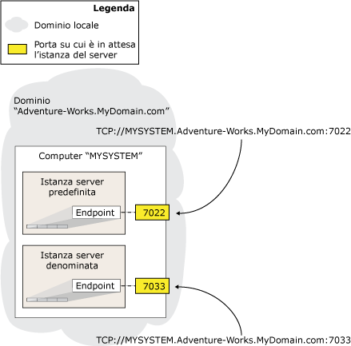

# <a name="specify-endpoint-url---adding-or-modifying-availability-replica"></a>Specificare l'URL dell'endpoint quando si aggiunge o si modifica una replica di disponibilità
[!INCLUDE[appliesto-ss-xxxx-xxxx-xxx-md](../../../includes/appliesto-ss-xxxx-xxxx-xxx-md.md)] Per ospitare una replica di disponibilità per un gruppo di disponibilità, un'istanza del server deve possedere un endpoint del mirroring del database. L'istanza del server utilizza questo endpoint per rimanere in attesa dei messaggi [!INCLUDE[ssHADR](../../../includes/sshadr-md.md)] dalle repliche di disponibilità ospitate da altre istanze del server. Per definire una replica di disponibilità per un gruppo di disponibilità, è necessario specificare l'URL dell'endpoint dell'istanza del server che ospiterà la replica. L' *URL dell'endpoint* identifica il protocollo di trasporto dell'endpoint del mirroring del database, TCP, l'indirizzo di sistema dell'istanza del server e il numero di porta associato all'endpoint.  
  
> [!NOTE]  
>  Il termine "URL dell'endpoint" è sinonimo del termine "indirizzo di rete server" utilizzato dall'interfaccia utente del mirroring del database e dalla documentazione.  
  
-   [Sintassi per un URL dell'endpoint](#SyntaxOfURL)  
  
-   [Individuazione del nome di dominio completo di un sistema](#Finding_FQDN)  
  
-   [Attività correlate](#RelatedTasks)  
  
-   [Contenuto correlato](#RelatedContent)  
  
##  <a name="SyntaxOfURL"></a> Sintassi per un URL dell'endpoint  
 La sintassi per un URL dell'endpoint è la seguente:  
  
 TCP**://***\<indirizzo_sistema>***:***\<porta>*  
  
 dove  
  
-   *\<<system-address>* è una stringa che identifica in modo univoco il computer di destinazione. In genere, l'indirizzo del server è un nome di sistema, se i sistemi si trovano nello stesso dominio, un nome di dominio completo o un indirizzo IP.  
  
    -   Poiché i nodi del cluster WSFC (Windows Server Failover Clustering) si trovano nello stesso dominio, è possibile utilizzare il nome del computer, ad esempio `SYSTEM46`.  
  
    -   Per utilizzare un indirizzo IP, è necessario che esso sia univoco nell'ambiente. È consigliabile utilizzare un indirizzo IP solo se è statico. L'indirizzo IP può essere IP versione 4 (IPv4) o IP versione 6 (IPv6). Un indirizzo IPv6 deve essere racchiuso tra parentesi quadre, ad esempio **[***<indirizzo_IPv6>***]**.  
  
         Per individuare l'indirizzo IP di un sistema, al prompt dei comandi di Windows immettere il comando **ipconfig** .  
  
    -   Il funzionamento del nome di dominio completo è garantito. Il nome di dominio completo è costituito da una stringa di indirizzo definita a livello locale che accetta forme diverse a seconda della posizione. Spesso ma non sempre, un nome di dominio completo è un nome composto che include un nome computer e una serie di segmenti di dominio separati da virgole, ad esempio:  
  
         *nome_computer* **.** *segmento_dominio*[...**.***segmento_dominio*]  
  
         dove *nome_computer*è il nome di rete del computer che esegue l'istanza del server e *segmento_dominio*[...**.***segmento_dominio*] è la parte rimanente delle informazioni sul dominio del server, ad esempio: `localinfo.corp.Adventure-Works.com`.  
  
         Il contenuto e il numero dei segmenti di dominio sono determinati all'interno della società o dell'organizzazione. Per ulteriori informazioni, vedere [Individuazione del nome di dominio completo](#Finding_FQDN), più avanti in questo argomento.  
  
-   *\<port>* è il numero di porta utilizzato dall'endpoint del mirroring dell'istanza del server partner.  
  
     Un endpoint del mirroring del database può utilizzare qualsiasi porta disponibile nel computer. Ogni numero di porta deve essere associato a un solo endpoint e ogni endpoint a una singola istanza del server. In questo modo, istanze del server diverse sullo stesso server restano in attesa su endpoint diversi con porte diverse. Pertanto, la porta specificata nell'URL dell'endpoint quando si specifica una replica di disponibilità indirizzerà sempre i messaggi in arrivo all'istanza del server il cui endpoint è associato a tale porta.  
  
     Nell'URL dell'endpoint solo il numero della porta identifica l'istanza del server associata all'endpoint del mirroring del database nel computer di destinazione. Nella figura seguente vengono illustrati gli URL dell'endpoint di due istanze del server su un unico computer. L'istanza predefinita utilizza la porta `7022` , mentre l'istanza denominata utilizza la porta `7033`. L'URL dell'endpoint di queste due istanze del server sono rispettivamente `TCP://MYSYSTEM.Adventure-works.MyDomain.com:7022` e `TCP://MYSYSTEM.Adventure-works.MyDomain.com:7033`. Si noti che l'indirizzo non include il nome dell'istanza del server.  
  
       
  
     Per individuare la porta attualmente associata all'endpoint di mirroring del database per un'istanza del server, utilizzare l'istruzione [!INCLUDE[tsql](../../../includes/tsql-md.md)] seguente:  
  
    ```  
    SELECT type_desc, port FROM sys.TCP_endpoints  
    ```  
  
     Individuare la riga il cui valore **type_desc** è "DATABASE_MIRRORING" e usare il numero di porta corrispondente.  
  
### <a name="examples"></a>Esempi  
  
#### <a name="a-using-a-system-name"></a>A. Utilizzo di un nome di sistema  
 L'URL dell'endpoint seguente specifica un nome di sistema, `SYSTEM46`, e la porta `7022`.  
  
 `TCP://SYSTEM46:7022`  
  
#### <a name="b-using-a-fully-qualified-domain-name"></a>B. Utilizzo di un nome di dominio completo  
 L'URL dell'endpoint seguente specifica un nome di dominio completo, `DBSERVER8.manufacturing.Adventure-Works.com`, e la porta `7024`.  
  
 `TCP://DBSERVER8.manufacturing.Adventure-Works.com:7024`  
  
#### <a name="c-using-ipv4"></a>C. Utilizzo di IPv4  
 L'URL dell'endpoint seguente specifica un indirizzo IPv4, `10.193.9.134`, e la porta `7023`.  
  
 `TCP://10.193.9.134:7023`  
  
#### <a name="d-using-ipv6"></a>D. Utilizzo di IPv6  
 L'URL dell'endpoint seguente include un indirizzo IPv6, `2001:4898:23:1002:20f:1fff:feff:b3a3`, e la porta `7022`.  
  
 `TCP://[2001:4898:23:1002:20f:1fff:feff:b3a3]:7022`  
  
##  <a name="Finding_FQDN"></a> Individuazione del nome di dominio completo di un sistema  
 Per individuare il nome di dominio completo di un sistema, al prompt dei comandi di Windows immettere:  
  
 **IPCONFIG /ALL**  
  
 Per ottenere il nome di dominio completo, concatenare i valori di *<host_name>* e *<Primary_Dns_Suffix>* come riportato di seguito:  
  
 *<host_name>* **.** *<Primary_Dns_Suffix>*  
  
 Ad esempio, la configurazione IP  
  
 `Host Name  .  .  .  .  .  .  : MYSERVER`  
  
 `Primary Dns Suffix  .  .  .  : mydomain.Adventure-Works.com`  
  
 corrisponde al nome di dominio completo seguente:  
  
 `MYSERVER.mydomain.Adventure-Works.com`  
  
> [!NOTE]  
>  Per ulteriori informazioni su un nome di dominio completo, consultare l'amministratore di sistema.  
  
##  <a name="RelatedTasks"></a> Attività correlate  
 **Per configurare un endpoint del mirroring del database**  
  
-   [Creare un endpoint del mirroring del database per i gruppi di disponibilità AlwaysOn &#40;SQL Server PowerShell&#41;](../../../database-engine/availability-groups/windows/database-mirroring-always-on-availability-groups-powershell.md)  
  
-   [Creare un endpoint del mirroring del database per l'autenticazione Windows &#40;Transact-SQL&#41;](../../../database-engine/database-mirroring/create-a-database-mirroring-endpoint-for-windows-authentication-transact-sql.md)  
  
-   [Utilizzare certificati per un endpoint del mirroring del database &#40;Transact-SQL&#41;](../../../database-engine/database-mirroring/use-certificates-for-a-database-mirroring-endpoint-transact-sql.md)  
  
    -   [Impostazione dell'endpoint del mirroring del database per l'utilizzo di certificati per le connessioni in uscita &#40;Transact-SQL&#41;](../../../database-engine/database-mirroring/database-mirroring-use-certificates-for-outbound-connections.md)  
  
    -   [Impostazione dell'endpoint del mirroring del database per l'utilizzo di certificati per le connessioni in ingresso &#40;Transact-SQL&#41;](../../../database-engine/database-mirroring/database-mirroring-use-certificates-for-inbound-connections.md)  
  
-   [Specificare un indirizzo di rete del server &#40;Mirroring del database&#41;](../../../database-engine/database-mirroring/specify-a-server-network-address-database-mirroring.md)  
  
-   Specifica dell'URL dell'endpoint quando si aggiunge o si modifica una replica di disponibilità (SQL Server)  
  
-   [Risolvere i problemi relativi alla configurazione di Gruppi di disponibilità AlwaysOn &#40;SQL Server&#41;](../../../database-engine/availability-groups/windows/troubleshoot-always-on-availability-groups-configuration-sql-server.md)  
  
 **Per visualizzare informazioni sull'endpoint del mirroring del database**  
  
-   [sys.database_mirroring_endpoints &#40;Transact-SQL&#41;](../../../relational-databases/system-catalog-views/sys-database-mirroring-endpoints-transact-sql.md)  
  
 **Per aggiungere una replica di disponibilità**  
  
-   [Aggiungere una replica secondaria a un gruppo di disponibilità &#40;SQL Server&#41;](../../../database-engine/availability-groups/windows/add-a-secondary-replica-to-an-availability-group-sql-server.md)  
  
-   [Creare un join di una replica secondaria a un gruppo di disponibilità &#40;SQL Server&#41;](../../../database-engine/availability-groups/windows/join-a-secondary-replica-to-an-availability-group-sql-server.md)  
  
##  <a name="RelatedContent"></a> Contenuto correlato  
  
-   [Pagine relative alla guida alle soluzioni AlwaysOn di Microsoft SQL Server per la disponibilità elevata e il ripristino di emergenza](http://go.microsoft.com/fwlink/?LinkId=227600)  
  
## <a name="see-also"></a>Vedere anche  
 [Creazione e configurazione di gruppi di disponibilità &#40;SQL Server&#41;](../../../database-engine/availability-groups/windows/creation-and-configuration-of-availability-groups-sql-server.md)   
 [Panoramica di Gruppi di disponibilità AlwaysOn &#40;SQL Server&#41;](../../../database-engine/availability-groups/windows/overview-of-always-on-availability-groups-sql-server.md)   
 [CREATE ENDPOINT &#40;Transact-SQL&#41;](../../../t-sql/statements/create-endpoint-transact-sql.md)  
  
  
