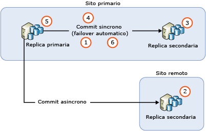
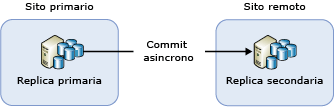
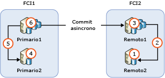

# <a name="upgrading-always-on-availability-group-replica-instances"></a>Aggiornamento delle istanze di replica dei gruppi di disponibilità AlwaysOn
[!INCLUDE[appliesto-ss-xxxx-xxxx-xxx-md](../../../includes/appliesto-ss-xxxx-xxxx-xxx-md.md)]

Quando si aggiorna un'istanza di [!INCLUDE[ssNoVersion](../../../includes/ssnoversion-md.md)] che ospita un gruppo di disponibilità AlwaysOn a una nuova versione di [!INCLUDE[ssCurrent](../../../includes/sscurrent-md.md)], a un nuovo Service Pack o aggiornamento cumulativo di [!INCLUDE[ssNoVersion](../../../includes/ssnoversion-md.md)] oppure quando la si installa su un nuovo Service Pack o aggiornamento cumulativo di Windows, è possibile ridurre i tempi di inattività per la replica primaria a un singolo failover manuale eseguendo un aggiornamento in sequenza (o a due failover manuali in caso di failback sulla replica primaria originale). Durante il processo di aggiornamento, non sarà disponibile una replica secondaria per il failover o le operazioni di sola lettura e, dopo l'aggiornamento, a seconda del volume di attività nel nodo della replica primaria, l'aggiornamento della replica secondaria al nodo della replica primaria potrebbe richiedere un po' di tempo (è dunque prevedibile un traffico di rete elevato).  
  
>[!NOTE]  
>Questo articolo si limita a illustrare l'aggiornamento di SQL Server. Non viene descritto l'aggiornamento del sistema operativo che contiene WSFC (Windows Server Failover Cluster). L'aggiornamento del sistema operativo Windows che ospita il cluster di failover non è supportato per i sistemi operativi precedenti a Windows Server 2012 R2. Per aggiornare un nodo del cluster in esecuzione su Windows Server 2012 R2, vedere [Aggiornamento in sequenza del sistema operativo del cluster](https://technet.microsoft.com/library/dn850430.aspx)  
  
## <a name="prerequisites"></a>Prerequisites  
Prima di iniziare, esaminare le informazioni seguenti:  
  
- [Aggiornamenti di versione ed edizione supportati](../../../database-engine/install-windows/supported-version-and-edition-upgrades.md): verificare che sia possibile eseguire l'aggiornamento a SQL Server 2016 dalla versione in uso del sistema operativo Windows e di SQL Server. Ad esempio, non è possibile eseguire l'aggiornamento diretto da un'istanza di SQL Server 2005 a [!INCLUDE[ssCurrent](../../../includes/sscurrent-md.md)].  
  
- [Scegliere un metodo di aggiornamento del motore di database](../../../database-engine/install-windows/choose-a-database-engine-upgrade-method.md): per il corretto ordine di aggiornamento, selezionare il metodo e la procedura di aggiornamento appropriati in base alla verifica degli aggiornamenti di versione ed edizione supportati e anche agli altri componenti installati nell'ambiente.  
  
- [Pianificare e testare il piano di aggiornamento del motore di database](../../../database-engine/install-windows/plan-and-test-the-database-engine-upgrade-plan.md): esaminare le note sulla versione, i problemi di aggiornamento noti e l'elenco di controllo pre-aggiornamento e sviluppare e testare il piano di aggiornamento.  
  
- [Requisiti hardware e software per l'installazione di SQL Server](../../../sql-server/install/hardware-and-software-requirements-for-installing-sql-server.md): esaminare i requisiti software per l'installazione di [!INCLUDE[ssCurrent](../../../includes/sscurrent-md.md)]. Se è necessario software aggiuntivo, installarlo in ogni nodo prima di iniziare il processo di aggiornamento per ridurre al minimo eventuali tempi di inattività.  

- [Verificare se Change Data Capture o la replica vengono usati per i database del gruppo di disponibilità](#special-steps-for-change-data-capture-or-replication): se un database all'interno del gruppo di disponibilità è abilitato per Change Data Capture (CDC), seguire queste [istruzioni](#special-steps-for-change-data-capture-or-replication).

>[!NOTE]  
>L'uso di più versioni delle istanze di SQL Server nello stesso gruppo di disponibilità è supportato solo nel contesto di un aggiornamento in sequenza che aggiorna le repliche nelle posizioni originali. Una versione successiva di un'istanza di SQL Server non può essere aggiunta come nuova replica a un gruppo di disponibilità esistente. Ad esempio non è possibile aggiungere una replica SQL Server 2017 a un gruppo di disponibilità SQL Server 2016 esistente. Per eseguire la migrazione a una nuova versione dell'istanza di SQL Server che usa gruppi di disponibilità, l'unico metodo supportato è un gruppo di disponibilità distribuito in SQL Server 2016 Enterprise Edition o versioni successive.

## <a name="rolling-upgrade-basics-for-always-on-ags"></a>Informazioni di base sull'aggiornamento in sequenza per i gruppi di disponibilità AlwaysOn  
Per ridurre al minimo i tempi di inattività e la perdita di dati per i gruppi di disponibilità, osservare le linee guida seguenti quando si eseguono gli aggiornamenti dei server:  
  
- Prima di avviare l'aggiornamento in sequenza:  
  
    - Eseguire un failover manuale di prova su almeno una delle istanze di replica con commit sincrono  
  
    - Proteggere i dati eseguendo un backup completo di ogni database di disponibilità  
  
    - Eseguire il comando DBCC CHECKDB su ogni database di disponibilità  
  
-   Aggiornare sempre prima le istanze di replica secondaria remota, quindi quelle di replica secondaria locale e, infine, l'istanza di replica primaria.  
  
-   Non è possibile eseguire backup su un database in corso di aggiornamento.  Prima di eseguire l'aggiornamento delle repliche secondarie, configurare la preferenza per i backup automatici in modo che vengano eseguiti solo sulla replica primaria.  Durante un aggiornamento di versione, le repliche non sono né leggibili né disponibili per i backup. Durante un aggiornamento non di versione, è possibile configurare l'esecuzione di backup automatici sulle repliche secondarie prima di aggiornare la replica primaria.  
  
-   Durante un aggiornamento di versione, non è possibile leggere repliche secondarie leggibili dopo il relativo aggiornamento e prima che venga eseguito il failover della replica primaria su una replica secondaria aggiornata o che venga aggiornata la replica primaria.  
  
-   Per evitare failover accidentali del gruppo di disponibilità durante il processo di aggiornamento, rimuovere il failover da tutte le repliche con commit sincrono prima di iniziare.  
  
-   Non aggiornare l'istanza di replica primaria prima di aver eseguito il failover del gruppo di disponibilità su un'istanza aggiornata con una replica secondaria. In caso contrario, le applicazioni client potrebbero subire tempi di inattività prolungati durante l'aggiornamento sull'istanza di replica primaria.  
  
-   Eseguire sempre il failover del gruppo di disponibilità su un'istanza di replica secondaria con commit sincrono. Se si esegue il failover su un'istanza di replica secondaria con commit asincrono, i database saranno soggetti alla perdita di dati e lo spostamento dei dati viene automaticamente sospeso finché non viene ripreso manualmente.  
  
-   Non aggiornare l'istanza di replica primaria prima di aver aggiornato tutte le altre istanze di replica secondaria. Non è più possibile recapitare log tramite una replica primaria aggiornata alle repliche secondarie la cui istanza di [!INCLUDE[ssCurrent](../../../includes/sscurrent-md.md)] non è ancora stata aggiornata alla stessa versione. Se viene sospeso lo spostamento dei dati in una replica secondaria, il failover automatico per quest'ultima non può essere eseguito e nei database di disponibilità possono verificarsi perdite di dati.  
  
-   Prima di eseguire il failover di un gruppo di disponibilità, verificare che lo stato di sincronizzazione della destinazione di failover sia SINCRONIZZATO.  
  
## <a name="rolling-upgrade-process"></a>Processo di aggiornamento in sequenza  
 Il processo effettivo dipende da fattori quali la topologia di distribuzione dei gruppi di disponibilità e la modalità di commit di ogni replica. Nello scenario più semplice, l'aggiornamento in sequenza è articolato in un processo a più fasi che nella sua forma essenziale prevede i passaggi seguenti:  
  
   
  
1.  Rimuovere il failover automatico in tutte le repliche con commit sincrono  
  
2.  Aggiornare tutte le istanze di replica secondaria remota in cui vengono eseguite repliche secondarie con commit asincrono  
  
3.  Aggiornare tutte le istanze di replica secondaria locale in cui non è attualmente in esecuzione la replica primaria  
  
4.  Eseguire manualmente il failover del gruppo di disponibilità su una replica secondaria locale con commit sincrono  
  
5.  Aggiornare l'istanza di replica locale in cui, in precedenza, era ospitata la replica primaria  
  
6.  Configurare i partner di failover automatico nel modo desiderato  
  
 Se necessario, è possibile eseguire un ulteriore failover manuale per ripristinare la configurazione originale del gruppo di disponibilità.  
  
## <a name="ag-with-one-remote-secondary-replica"></a>Gruppo di disponibilità con una replica secondaria remota  
 Se è stato distribuito un gruppo di disponibilità solo a fini di ripristino di emergenza potrebbe essere necessario eseguirne il failover su una replica secondaria con commit asincrono. Questo tipo di configurazione è illustrato nella figura seguente:  
  
   
  
 In questo caso è necessario eseguire il failover del gruppo di disponibilità su una replica secondaria con commit asincrono durante l'aggiornamento in sequenza. Per evitare perdite di dati, modificare la modalità di commit impostando il commit sincrono e attendere che venga completata la sincronizzazione della replica secondaria prima di eseguire il failover del gruppo di disponibilità. Il processo di aggiornamento in sequenza può quindi avvenire come segue:  
  
1.  Aggiornare l'istanza di replica secondaria sul sito remoto  
  
2.  Impostare la modalità di commit sincrono  
  
3.  Attendere che lo stato di sincronizzazione sia SINCRONIZZATO  
  
4.  Eseguire il failover del gruppo di disponibilità sulla replica secondaria nel sito remoto  
  
5.  Aggiornare l'istanza di replica (sito primario) locale  
  
6.  Eseguire di nuovo il failover del gruppo di disponibilità sul sito primario  
  
7.  Impostare la modalità di commit asincrono  
  
 Poiché la modalità di commit sincrono non è consigliata per la sincronizzazione dei dati con un sito remoto, tramite le applicazioni client potrebbe essere rilevato un aumento immediato della latenza del database in seguito alla modifica dell'impostazione. L'esecuzione di un failover causa inoltre la rimozione di tutti i messaggi di log non riconosciuti. Il numero di messaggi di log rimossi può essere notevole a causa dell'elevata latenza di rete tra i due siti determinando un numero elevato di errori delle transazioni nei client. È possibile ridurre l'impatto sulle applicazioni client con le azioni seguenti:  
  
-   Scegliere con attenzione una finestra di manutenzione nei periodi di minore traffico client  
  
-   Durante l'aggiornamento di [!INCLUDE[ssCurrent](../../../includes/sscurrent-md.md)] nel sito primario, impostare di nuovo la modalità di commit asincrono, quindi ripristinare il commit sincrono una volta pronti a effettuare nuovamente il failover sul sito primario  
  
## <a name="ag-with-failover-cluster-instance-nodes"></a>Gruppo di disponibilità con nodi di istanze del cluster di failover  
 Se in un gruppo di disponibilità sono contenuti nodi di istanze del cluster di failover, è consigliabile aggiornare i nodi inattivi prima di quelli attivi. Nella figura seguente è illustrato uno scenario comune di gruppi di disponibilità con istanze del cluster di failover per la disponibilità elevata locale e il commit asincrono tra le istanze stesse ai fini del ripristino di emergenza remoto ed è indicata la relativa sequenza di aggiornamento.  
  
   
  
1.  Aggiornare REMOTE2  
  
2.  Effettuare il failover dell'istanza FCI2 a REMOTE2  
  
3.  Aggiornare REMOTE1  
  
4.  Aggiornare PRIMARY2  
  
5.  Effettuare il failover dell'istanza FCI1 a PRIMARY2  
  
6.  Aggiornare PRIMARY1  
  
## <a name="upgrade-update-sql-server-instances-with-multiple-ags"></a>Aggiornare le istanze di SQL Server con più gruppi di disponibilità  
 Se si eseguono più gruppi di disponibilità con repliche primarie su nodi server distinti (configurazione Attiva/Attiva), il percorso di aggiornamento prevede altri passaggi di failover per preservare la disponibilità elevata durante il processo. Si supponga di avere tre gruppi di disponibilità in tre nodi server con tutte le repliche in modalità commit sincrono come illustrato nella tabella seguente:  
  
|Gruppo di disponibilità|Nodo1|Nodo2|Nodo3|  
|------------------------|-----------|-----------|-----------|  
|AG1|Primaria|||  
|AG2||Primaria||  
|AG3|||Primaria|  
  
 In determinate situazioni potrebbe essere opportuno eseguire un aggiornamento in sequenza con bilanciamento del carico articolato come segue:  
  
1.  Effettuare il failover di AG2 a Nodo3 (per liberare Nodo2)  
  
2.  Aggiornare Nodo2  
  
3.  Effettuare il failover di AG1 a Nodo2 (per liberare Nodo1)  
  
4.  Aggiornare Nodo1  
  
5.  Effettuare il failover di AG2 e AG3 a Nodo1 (per liberare Nodo3)  
  
6.  Aggiornare Nodo3  
  
7.  Effettuare il failover di AG3 a Nodo3  
  
 Questa sequenza di aggiornamento implica un tempo di inattività medio inferiore alla durata di due failover per gruppo di disponibilità. La configurazione risultante è illustrata nella tabella seguente.  
  
|Gruppo di disponibilità|Nodo1|Nodo2|Nodo3|  
|------------------------|-----------|-----------|-----------|  
|AG1||Primaria||  
|AG2|Primaria|||  
|AG3|||Primaria|  
  
 Il percorso di aggiornamento e i tempi di inattività per le applicazioni client possono variare a seconda della specifica implementazione in uso.  
  
> [!NOTE]  
>  In molti casi, dopo aver completato l'aggiornamento in sequenza, sarà possibile eseguire il failback sulla replica primaria originale. 

## <a name="special-steps-for-change-data-capture-or-replication"></a>Passaggi speciali per Change Data Capture o la replica

A seconda dell'aggiornamento che si sta applicando, possono essere necessari passaggi aggiuntivi per i database di replica del gruppo di disponibilità abilitati per Change Data Capture o la replica. Fare riferimento alle note sulla versione relative all'aggiornamento per stabilire se i passaggi seguenti sono necessari:

1. Aggiornare ogni replica secondaria.

1. Al termine dell'aggiornamento di tutte le repliche secondarie, eseguire il failover del gruppo di disponibilità su un'istanza aggiornata. 

1. Eseguire l'istruzione Transact-SQL seguente sull'istanza che ospita la replica primaria:

   ```sql
   EXECUTE [master].[sys].[sp_vupgrade_replication];
   ```

   >[!NOTE]
   >L'esecuzione di questo comando potrebbe richiedere alcuni minuti. 

1. Aggiornare l'istanza che era in origine la replica primaria.

Per informazioni di carattere generale, vedere l'articolo sulla [possibilità che la funzionalità CDC non funzioni dopo che è stato applicato l'aggiornamento cumulativo più recente](http://blogs.msdn.microsoft.com/sql_server_team/cdc-functionality-may-break-after-upgrading-to-the-latest-cu-for-sql-server-2012-2014-and-2016/).

  
## <a name="see-also"></a>Vedere anche  
 [Eseguire l'aggiornamento a SQL Server 2016 usando l'Installazione guidata &#40;programma di installazione&#41;](../../../database-engine/install-windows/upgrade-sql-server-using-the-installation-wizard-setup.md)   

 [Installazione di SQL Server 2016 dal prompt dei comandi](../../../database-engine/install-windows/install-sql-server-2016-from-the-command-prompt.md)  
  
  
