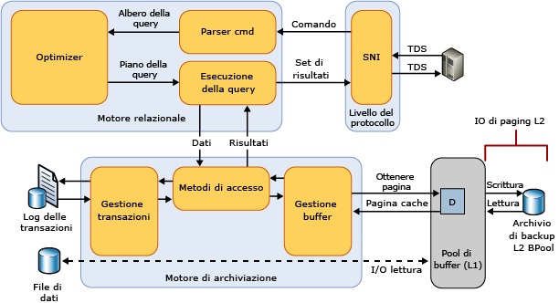

# Estensione pool di buffer
  Introdotta in [!INCLUDE[ssSQL14](../../includes/sssql14-md.md)], l'estensione del pool di buffer offre l'integrazione diretta di una estensione di RAM non volatile (ossia, un'unità SSD) al pool di buffer del [!INCLUDE[ssDE](../../includes/ssde-md.md)] per migliorare la velocità effettiva di I/O in maniera significativa. L'estensione del pool di buffer non è disponibile in tutte le edizioni di [!INCLUDE[ssNoVersion](../../includes/ssnoversion-md.md)] . Per altre informazioni, vedere [Funzionalità supportate dalle edizioni di SQL Server 2016](~/sql-server/editions-and-supported-features-for-sql-server-2016.md).  
  
## Vantaggi dell'estensione del pool di buffer  
 Lo scopo principale di un database di [!INCLUDE[ssNoVersion](../../includes/ssnoversion-md.md)] è l'archiviazione e il recupero dei dati. L'esecuzione di una quantità elevata di operazioni di I/O su disco è pertanto una caratteristica fondamentale del motore di database. Poiché le operazioni di I/O nel disco possono utilizzare molte risorse e richiedere un tempo relativamente lungo per il completamento, in [!INCLUDE[ssNoVersion](../../includes/ssnoversion-md.md)] viene data grande importanza all'efficienza dell'I/O. Il pool di buffer funge da fonte primaria di allocazione della memoria di [!INCLUDE[ssNoVersion](../../includes/ssnoversion-md.md)]. La gestione del buffer è un elemento chiave per il raggiungimento di tale efficienza. Il componente di gestione del buffer è costituito da due meccanismi, ovvero Gestione buffer che consente di accedere alle pagine del database e aggiornarle, e il pool di buffer, che consente di ridurre le operazioni di I/O del file di database.  
  
 Le pagine di indice e di dati vengono lette dal disco nel pool di buffer e le pagine modificate, dette anche pagine dirty, vengono riscritte sul disco. L'utilizzo della memoria nei checkpoint di database e del server determinano la rimozione dalla cache del buffer delle pagine dirty ad accesso frequente (attive) e la scrittura su dischi di tipo meccanico, quindi la rilettura delle stesse nella cache. Queste operazioni di I/O sono in genere piccole letture e scritture casuali nell'ordine di 4 - 16 KB di dati. Piccoli modelli di I/O casuali generano frequenti ricerche, per contendersi il braccio meccanico del disco, aumentare la latenza dell'attività di I/O e ridurre la velocità effettiva di I/O aggregata del sistema.  
  
 L'approccio tipico per risolvere questi colli bottiglia nelle operazioni di I/O consiste nell'aggiungere una maggiore quantità di DRAM o, in alternativa, più spindle SAS a prestazioni elevate. Anche se queste opzioni sono utili, presentano svantaggi significativi: la memoria DRAM è più costosa delle unità di archiviazione dati e l'aggiunta di spindle aumenta le spese di investimento per l'acquisto di hardware, nonché i costi operativi dovuti al maggior consumo di energia e alla più elevata probabilità di guasti dei componenti.  
  
 La funzionalità di estensione del pool di buffer estende la cache di pool di buffer con RAM non volatile (di solito unità SSD). Grazie a questa estensione, il pool di buffer può supportare un working set del database più esteso, forzando il paging delle attività di I/O tra la RAM e le unità SSD. In questo modo viene effettuato in modo efficiente l'offload delle piccole operazioni di I/O casuali dai dischi meccanici alle unità SSD. Grazie alla latenza più bassa e al miglioramento delle prestazioni di I/O casuali delle unità SSD, l'estensione del pool di buffer consente di migliorare notevolmente la velocità effettiva di I/O.  
  
 Nell'elenco seguente vengono descritti i vantaggi della funzionalità di estensione del pool di buffer.  
  
-   Maggiore velocità effettiva di I/O casuale  
  
-   Riduzione della latenza di I/O  
  
-   Maggiore velocità effettiva delle transazioni  
  
-   Miglioramento delle prestazioni di lettura con un più ampio pool di buffer ibrido  
  
-   Architettura di memorizzazione nella cache per l'utilizzo delle unità di memoria attuali e future  
  
### Concetti  
 I seguenti termini sono applicabili alla funzionalità di estensione del pool di buffer.  
  
 Unità SSD  
 Le unità SSD consentono di archiviare dati in memoria (RAM) in modo persistente. Per ulteriori informazioni vedere [questa definizione](http://en.wikipedia.org/wiki/Solid-state_drive).  
  
 Buffer  
 In [!INCLUDE[ssNoVersion](../../includes/ssnoversion-md.md)]un buffer è una pagina da 8 KB in memoria, ovvero delle stesse dimensioni di una pagina di dati o di indice. La cache del buffer è quindi suddivisa in pagine da 8 KB. Una pagina rimane nella cache del buffer fino a quando per Gestione buffer non è necessaria l'area del buffer per leggere un maggior numero di dati. I dati vengono riscritti sul disco solo se vengono modificati. Queste pagine modificate in memoria sono dette pagine dirty. Una pagina è detta clean quando è equivalente alla propria immagine del database sul disco. I dati nella cache del buffer possono essere modificati più volte prima di venire riscritti sul disco.  
  
 Pool di buffer  
 Definito anche cache del buffer. Il pool di buffer è una risorsa globale condivisa da tutti i database per le pagine di dati memorizzate nella cache. Le dimensioni massime e minime della cache del pool di buffer sono determinate all'avvio o quando l'istanza di SQL Server viene riconfigurata dinamicamente tramite sp_configure. Tali dimensioni determinano il numero massimo di pagine che possono essere memorizzate nella cache del pool di buffer dell'istanza in esecuzione in un momento qualsiasi.  
  
 La quantità massima di memoria di cui può essere eseguito il commit tramite Estensione pool di buffer può essere limitata da altre applicazioni in esecuzione nel computer se queste creano richieste di memoria significative.  
  
 Checkpoint  
 Un checkpoint crea un punto valido da cui il [!INCLUDE[ssDE](../../includes/ssde-md.md)] può iniziare ad applicare le modifiche contenute nel log delle transazioni durante il ripristino a seguito di un arresto anomalo del sistema o di un arresto imprevisto. Un checkpoint scrive le pagine dirty e le informazioni sul log delle transazioni dalla memoria al disco e registra inoltre le informazioni sul log delle transazioni. Per altre informazioni, vedere [Checkpoint di database &#40;SQL Server&#41;](../../relational-databases/logs/database-checkpoints-sql-server.md).  
  
## Dettagli relativi all'estensione del pool di buffer  
 L'archiviazione sull'unità SSD viene utilizzata come estensione del sottosistema di memoria anziché del sottosistema di archiviazione su disco, ovvero il file di estensione del pool di buffer consente alla funzionalità di gestione del pool di buffer di utilizzare sia la memoria DRAM che la memoria flash NAND, per gestire un pool di buffer molto più grande di pagine ad accesso meno frequente nella NvRAM (Non-volatile Random Access Memory) supportata da unità SSD. In questo modo viene creata una gerarchia multilivello di memorizzazione nella cache con livello 1 (L1) come DRAM e livello 2 (L2) come file di estensione del pool di buffer sull'unità SSD. Solo le pagine clean vengono scritte nella cache L2 che consente di gestire la sicurezza dei dati. In Gestione buffer viene gestito lo spostamento delle pagine clean tra le cache L1 e L2.  
  
 Nella figura seguente viene fornita una panoramica di alto livello dell'architettura del pool di buffer in relazione agli altri componenti di [!INCLUDE[ssNoVersion](../../includes/ssnoversion-md.md)] .  
  
   
  
 Quando è abilitata, l'estensione del pool di buffer specifica le dimensioni e il percorso del file di memorizzazione nella cache del pool di buffer sull'unità SSD. Il file è un extent contiguo di archiviazione sull'unità SSD e viene configurato in modo statico durante l'avvio dell'istanza di [!INCLUDE[ssNoVersion](../../includes/ssnoversion-md.md)]. Le modifiche ai parametri di configurazione del file possono essere eseguite solo quando la funzionalità di estensione del pool di buffer è disabilitata. In tal caso, tutte le impostazioni di configurazione correlate vengono rimosse dal Registro di sistema. Il file di estensione del pool di buffer viene eliminato durante l'arresto dell'istanza di SQL Server.  
  
## Procedure consigliate  
 È consigliabile attenersi a queste procedure consigliate.  
  
-   Dopo avere abilitato per la prima volta l'estensione del pool di buffer, è consigliabile riavviare l'istanza di SQL Server per massimizzare i vantaggi per le prestazioni.  
  
-   Le dimensioni dell'estensione del pool di buffer possono arrivare fino a 32 volte il valore di max_server_memory.  Si consiglia un rapporto tra le dimensioni della memoria fisica (max_server_memory) e le dimensioni dei file di estensione del pool di buffer non superiore a 1:16. Un rapporto inferiore nell'intervallo da 1:4 a 1:8 può essere ottimale. Per informazioni sull'impostazione dell'opzione max_server_memory, vedere [Opzioni di configurazione del server Server Memory](../../database-engine/configure-windows/server-memory-server-configuration-options.md).  
  
-   Effettuare test approfonditi dell'estensione del pool di buffer prima dell'implementazione in un ambiente di produzione. Una volta in produzione, evitare di apportare modifiche di configurazione al file o di disattivare la funzionalità. Queste attività possono influire negativamente sulle prestazioni del server perché la dimensione del pool di buffer si riduce in modo significativo quando la funzionalità è disabilitata. Se disabilitata, la memoria utilizzata per supportare la funzionalità non viene recuperata finché l'istanza di SQL Server non viene riavviata. Tuttavia, se la funzionalità viene riabilitata, la memoria verrà riutilizzata senza riavviare l'istanza.  
  
## Informazioni restituite sull'estensione del pool di buffer  
 È possibile utilizzare le viste a gestione dinamica (DMV) seguenti per visualizzare la configurazione dell'estensione del pool di buffer e le informazioni sulle pagine di dati restituite nell'estensione.  
  
-   [sys.dm_os_buffer_pool_extension_configuration &#40;Transact-SQL&#41;](../../relational-databases/system-dynamic-management-views/sys-dm-os-buffer-pool-extension-configuration-transact-sql.md)  
  
-   [sys.dm_os_buffer_descriptors &#40;Transact-SQL&#41;](../../relational-databases/system-dynamic-management-views/sys-dm-os-buffer-descriptors-transact-sql.md)  
  
 I contatori delle prestazioni sono disponibili nell'oggetto di Gestione buffer di SQL Server per tenere traccia delle pagine di dati nel file di estensione del pool di buffer. Per ulteriori informazioni, vedere l'argomento relativo ai [contatori delle prestazioni dell'estensione del pool di buffer](../../relational-databases/performance-monitor/sql-server-buffer-manager-object.md).  
  
 Sono disponibili i seguenti XEvent.  
  
|XEvent|Descrizione|Parametri|  
|------------|-----------------|----------------|  
|sqlserver.buffer_pool_extension_pages_written|Viene attivato quando una pagina o un gruppo di pagine vengono eliminate dal pool di buffer e vengono scritte nel file di estensione del pool di buffer.|*number_page*   *first_page_id*   *first_page_offset*   *initiator_numa_node_id*|  
|sqlserver.buffer_pool_extension_pages_read|Viene attivato quando una pagina viene letta dal file di estensione del pool di buffer nel pool di buffer.|*number_page*   *first_page_id*   *first_page_offset*   *initiator_numa_node_id*|  
|sqlserver.buffer_pool_extension_pages_evicted|Viene attivato quando una pagina viene rimossa dal file di estensione del pool di buffer.|*number_page*   *first_page_id*   *first_page_offset*   *initiator_numa_node_id*|  
|sqlserver.buffer_pool_eviction_thresholds_recalculated|Viene attivato quando viene calcolata la soglia di eliminazione.|*warm_threshold*   *cold_threshold*   *pages_bypassed_eviction*   *eviction_bypass_reason*   *eviction_bypass_reason_description*|  
  
## Attività correlate  
  
|||  
|-|-|  
|**Descrizione dell'attività**|**Argomento**|  
|Abilitare e configurare l'estensione del pool di buffer.|[ALTER SERVER CONFIGURATION &#40;Transact-SQL&#41;](../../t-sql/statements/alter-server-configuration-transact-sql.md)|  
|Modificare la configurazione dell'estensione del pool di buffer.|[ALTER SERVER CONFIGURATION &#40;Transact-SQL&#41;](../../t-sql/statements/alter-server-configuration-transact-sql.md)|  
|Visualizzare la configurazione dell'estensione del pool di buffer.|[sys.dm_os_buffer_pool_extension_configuration &#40;Transact-SQL&#41;](../../relational-databases/system-dynamic-management-views/sys-dm-os-buffer-pool-extension-configuration-transact-sql.md)|  
|Eseguire il monitoraggio dell'estensione del pool di buffer.|[sys.dm_os_buffer_descriptors &#40;Transact-SQL&#41;](../../relational-databases/system-dynamic-management-views/sys-dm-os-buffer-descriptors-transact-sql.md)   [Contatori delle prestazioni](../../relational-databases/performance-monitor/sql-server-buffer-manager-object.md)|  
  
  

