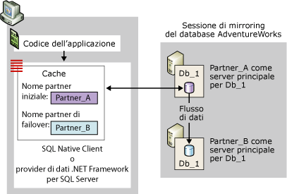
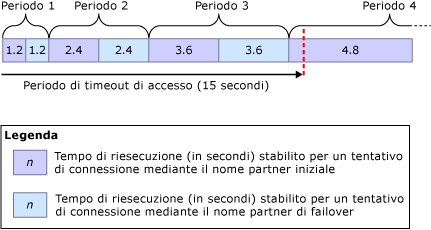
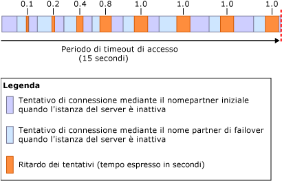

# Connessione di client a una sessione di mirroring del database (SQL Server)
  Per connettersi a una sessione di mirroring del database un client può utilizzare [!INCLUDE[ssNoVersion](../../includes/ssnoversion-md.md)] Native Client o il provider di dati .NET Framework per [!INCLUDE[ssNoVersion](../../includes/ssnoversion-md.md)]. Se configurati per un database [!INCLUDE[ssCurrent](../../includes/sscurrent-md.md)] , questi provider di accesso ai dati supportano entrambi completamente il mirroring del database. Per informazioni relative alle considerazioni di programmazione per l'utilizzo di un database con mirroring, vedere [Using Database Mirroring](../../relational-databases/native-client/features/using-database-mirroring.md). È inoltre necessario che l'istanza del server principale corrente sia disponibile e che l'account di accesso del client sia stato creato nell'istanza del server. Per altre informazioni, vedere [Risolvere i problemi relativi agli utenti isolati &#40;SQL Server&#41;](../../sql-server/failover-clusters/troubleshoot-orphaned-users-sql-server.md). Le connessioni client a una sessione di mirroring del database non richiedono l'istanza del server di controllo del mirroring, se ne esiste una.  
  
 **Contenuto dell'argomento:**  
  
 [Creazione della connessione iniziale a una sessione di mirroring del database](#InitialConnection)  
 Vengono introdotti il nome partner iniziale e il nome partner di failover, viene descritto il modo in cui i provider di accesso ai dati eseguono la connessione iniziale a un database con mirroring e vengono illustrati gli attributi della stringa di connessione per la connessione a un database con mirroring.  
  
 [Algoritmo di riesecuzione dei tentativi di connessione (per connessioni TCP/IP)](#RetryAlgorithm)  
 Viene descritto l'algoritmo di riesecuzione dei tentativi di connessione per connessioni TCP/IP.  
  
 [Riconnessione a una sessione di mirroring del database](#Reconnecting)  
 Viene descritta la riconnessione a un database con mirroring se una connessione stabilita a una sessione di mirroring del database non viene completata per qualsiasi ragione e viene illustrato l'impatto del reindirizzamento su un'applicazione client.  
  
 [Impatto di un nome partner di failover non aggiornato](#StalePartnerName)  
 Viene illustrato l'impatto della modifica di uno dei partner per il mirroring per un database con mirroring da parte di un amministratore di database.  
  
##  <a name="InitialConnection"></a> Creazione della connessione iniziale a una sessione di mirroring del database  
 Per la connessione iniziale a un database con mirroring, è necessario che un client renda disponibile una stringa di connessione che includa, come minimo, il nome di un'istanza del server. Tale nome del server obbligatorio identifica l'istanza del server principale corrente ed è noto come *nome partner iniziale*.  
  
 Facoltativamente, la stringa di connessione può indicare inoltre il nome di un'altra istanza del server, che identifichi l'istanza del server mirror corrente, da utilizzare se il partner iniziale non sia disponibile durante il primo tentativo di connessione. Il secondo nome viene definito *nome partner di failover*.  
  
 È inoltre necessario che la stringa di connessione includa un nome di database, al fine di consentire i tentativi di failover da parte del provider di accesso ai dati.  
  
 Alla ricezione di una stringa di connessione, il provider di accesso ai dati archivia il nome partner iniziale e il nome partner di failover, se disponibile, in una cache nella memoria volatile del client (per il codice gestito, l'ambito della cache è il dominio applicazione). Dopo essere stato memorizzato nella cache, il nome partner iniziale non viene mai aggiornato dal provider di accesso ai dati. Quando il client rende disponibile il nome partner di failover, il provider di accesso ai dati memorizza inoltre il nome di questo partner di failover temporaneamente nel caso in cui il provider non possa connettersi utilizzando il nome partner iniziale.  
  
 Una sessione di mirroring del database non costituisce protezione contro i problemi di accesso al server specifici dei client, ad esempio nel caso di problemi di comunicazione di un computer client con la rete. Un tentativo di connessione a un database con mirroring può non riuscire per varie ragioni, non correlate al provider di accesso ai dati, ad esempio un tentativo di connessione può non riuscire perché l'istanza del server principale è inattiva, perché si verifica durante il failover del database o a causa di un errore di rete.  
  
 Durante il tentativo di connessione, il provider di accesso ai dati inizia le operazioni utilizzando il proprio nome partner iniziale. Se l'istanza del server specificata è disponibile e corrisponde all'istanza del server principale corrente, il tentativo di connessione in genere riesce.  
  
> [!NOTE]  
>  Se la sessione di mirroring viene sospesa, il client in genere si connette al server principale e quindi scarica il nome partner. Il database non è tuttavia disponibile per il client fino alla ripresa del mirroring.  
  
 Se il tentativo ha esito negativo, il provider di accesso ai dati tenta di stabilire la connessione utilizzando il nome partner di failover, se disponibile. Se uno dei nomi partner disponibili consente di identificare correttamente il server principale corrente, il tentativo di stabilire la connessione iniziale da parte del provider di accesso ai dati in genere ha esito positivo. Al completamento della connessione, il provider di accesso ai dati scarica il nome dell'istanza del server mirror corrente. Questo nome viene memorizzato nella cache come nome partner di failover, sovrascrivendo l'eventuale nome partner di failover indicato dal client. Di conseguenza, il provider di dati .NET Framework per [!INCLUDE[ssNoVersion](../../includes/ssnoversion-md.md)] non aggiorna il nome partner di failover. [!INCLUDE[ssNoVersion](../../includes/ssnoversion-md.md)] Native Client aggiorna invece la cache ogni volta che una connessione successiva o il ripristino di una connessione restituisce un diverso nome partner.  
  
 Nella figura seguente viene illustrata una connessione client al partner iniziale, **Partner_A**, per un database con mirroring denominato **Db_1**. Nella figura viene illustrato un caso in cui il nome partner iniziale specificato dal client identifica correttamente il server principale corrente, **Partner_A**. Il tentativo di connessione iniziale riesce e il provider di accesso ai dati archivia il nome del server mirror, attualmente **Partner_B**, come nome partner di failover nella cache locale. Il client si connette infine alla copia principale del database **Db_1**.  
  
   
  
 Il tentativo di connessione iniziale può non riuscire, ad esempio, a causa di un errore di rete o di un'istanza del server non attiva. Poiché il partner iniziale non è disponibile, per consentire al provider di accesso ai dati di tentare la connessione al partner di failover, è necessario che il nome partner di failover sia stato specificato dal client nella stringa di connessione.  
  
 In questo caso, se il nome partner di failover non è disponibile, il tentativo di connessione originale continua fino al timeout della connessione di rete o alla restituzione di un errore, analogamente a quanto avviene per un database senza mirroring.  
  
 Quando il nome partner di failover viene specificato nella stringa di connessione, il comportamento del provider di accesso ai dati dipende dal protocollo di rete e dal sistema operativo del client, come segue:  
  
-   Per il protocollo TCP/IP, i tentativi di connessione sono regolati da un algoritmo per la riesecuzione dei tentativi di connessione specifico del mirroring del database. L'algoritmo per i *nuovi tentativi di connessione* determina il tempo massimo (*tempo per i nuovi tentativi*) stabilito per l'apertura di una connessione per un tentativo di connessione specifico.  
  
-   Per altri protocolli di rete  
  
     Se si verifica un errore o se il partner iniziale non è disponibile, il tentativo di connessione iniziale attende fino alla scadenza del periodo di timeout della connessione di rete o fino alla scadenza del periodo di timeout di accesso sul provider di accesso ai dati. In genere, tale attesa dura dai 20 ai 30 secondi. Successivamente, se non si è verificato il timeout del provider di accesso ai dati, esso tenta di connettersi al partner di failover. Se il periodo di timeout della connessione scade prima che la connessione venga stabilita o se il partner di failover diventa non disponibile, il tentativo di connessione non riesce. Se il partner di failover è disponibile entro il periodo di timeout di accesso ed è ora il server principale, il tentativo di connessione in genere ha esito positivo.  
  
 [&#91;Torna all'inizio&#93;](#Top)  
  
### Stringhe di connessione per un database con mirroring  
 La stringa di connessione fornita dal client include informazioni utilizzate dal provider di accesso ai dati per connettersi al database. In questa sessione vengono illustrate le parole chiave specificatamente rilevanti per la connessione a un database con mirroring utilizzando una connessione tramite driver ODBC di [!INCLUDE[ssNoVersion](../../includes/ssnoversion-md.md)] Native Client.  
  
#### Attributo Network  
 La stringa di connessione deve includere l'attributo **Rete** per specificare il protocollo di rete. Questo assicura che il protocollo di rete specificato sia persistente tra le connessioni a partner diversi. Il protocollo ottimale per la connessione a un database con mirroring è TCP/IP. Per assicurare che il client richieda il TCP/IP per ogni connessione ai partner, una stringa di connessione include l'attributo seguente:  
  
```  
Network=dbmssocn;   
```  
  
> [!IMPORTANT]  
>  È consigliabile mantenere TCP/IP all'inizio dell'elenco dei protocolli per un client. Tuttavia, se la stringa di connessione specifica l'attributo **Rete** , questo ha la priorità sull'ordine dell'elenco.  
  
 In alternativa, per assicurare che il client richieda il protocollo Named Pipes per ogni connessione ai partner, una stringa di connessione include l'attributo seguente:  
  
```  
Network=dbnmpntw;   
```  
  
> [!IMPORTANT]  
>  Poiché il protocollo Named Pipes non utilizza l'algoritmo per la riesecuzione dei tentativi TCP/IP, in molti casi, per un tentativo di connessione con tale protocollo può verificarsi il timeout prima della connessione a un database con mirroring.  
  
#### Attributo Server  
 La stringa di connessione deve includere un attributo **Server** indicante il nome partner iniziale, che dovrebbe identificare l'istanza del server principale corrente.  
  
 Il modo più semplice per identificare l'istanza del server è specificarne il nome, *<nome_server>*[**\\***<nome_istanza_SQL_Server>*]. Esempio:  
  
 `Server=Partner_A;`  
  
 o  
  
 `Server=Partner_A\Instance_2;`  
  
 Quando viene utilizzato il nome di sistema, è tuttavia necessario che il client esegua una ricerca DNS per ottenere l'indirizzo IP del server e una query SQL Server Browser per ottenere il numero di porta del server sul quale si trova il partner. Queste ricerche e query possono essere ignorate specificando l'indirizzo IP e il numero di porta del partner nell'attributo **Server** , anziché il nome del server. Questo è consigliabile per ridurre al minimo la possibilità di ritardi esterni durante la connessione al partner.  
  
> [!NOTE]  
>  Una query SQL Server Browser è necessaria se la stringa di connessione specifica il nome dell'istanza denominata e non la porta.  
  
 Per specificare l'indirizzo IP e la porta, l'attributo **Server** assume il formato `Server=`*<indirizzo_ip>*`,`*\<porta>*, ad esempio:  
  
```  
Server=123.34.45.56,4724;   
```  
  
> [!NOTE]  
>  L'indirizzo IP può essere IP versione 4 (IPv4) o IP versione 6 (IPv6).  
  
#### Attributo Database  
 È inoltre necessario che la stringa di connessione specifichi l'attributo **Database** per indicare il nome del database con mirroring. Se il database non è disponibile quando il client tenta di stabilire la connessione, viene generata un'eccezione.  
  
 Ad esempio, per connettersi esplicitamente al database **AdventureWorks** nel server principale Partner_A, un client deve usare la stringa di connessione seguente:  
  
 `" Server=Partner_A; Database=AdventureWorks "`  
  
> [!NOTE]  
>  Le informazioni sull'autenticazione vengono omesse dalla stringa.  
  
> [!IMPORTANT]  
>  L'aggiunta al prefisso del protocollo dell'attributo **Server** (`Server=tcp:`*\<nomeserver>*) non è compatibile con l'attributo **Rete** e l'indicazione del protocollo in entrambe le posizioni determinerà probabilmente un errore. Di conseguenza, è consigliabile che una stringa di connessione specifichi il protocollo tramite l'attributo **Rete** e specifichi solo il nome del server nell'attributo **Server** (`"Network=dbmssocn; Server=`*\<nomeserver>*`"`).  
  
#### Attributo Failover Partner  
 Oltre al nome partner iniziale, il client può anche specificare il nome partner di failover, che identifica l'istanza del server mirror corrente. Il partner di failover viene specificato dalla parola chiave dell'attributo Failover Partner. La parola chiave per questo attributo dipende dall'API utilizzata. Nella seguente tabella vengono elencate le parole chiave:  
  
|API|Parola chiave per l'attributo Failover Partner|  
|---------|--------------------------------------------|  
|Provider OLE DB|**FailoverPartner**|  
|Driver ODBC|**Failover_Partner**|  
|ADO (ActiveX Data Objects)|**Partner di failover**|  
  
 Il modo più semplice per identificare l'istanza del server è tramite il nome di sistema, *<nome_server>*[**\\***\<nome_istanza_SQL_Server>*].  
  
 In alternativa, è possibile specificare l'indirizzo IP e il numero di porta nell'attributo **Partner di failover** . Se il tentativo di connessione iniziale non riesce durante la prima connessione al database, il tentativo di connessione al partner di failover non dovrà più utilizzare necessariamente il DNS e SQL Server Browser. Una volta stabilita una connessione, il nome partner di failover sarà sovrascritto dal nome partner di failover. In questo modo, se si verifica un failover, le connessioni reindirizzate richiederanno il DNS e SQL Server Browser.  
  
> [!NOTE]  
>  Quando viene specificato solo il nome del partner iniziale, non è necessaria alcuna operazione o scrittura di codice da parte degli sviluppatori dell'applicazione, fatta eccezione per quello relativo alla modalità di riconnessione.  
  
> [!NOTE]  
>  Gli sviluppatori di applicazioni con codice gestito forniscono il nome del partner di failover nella proprietà **ConnectionString** dell'oggetto **SqlConnection** . Per informazioni sull'utilizzo di questa stringa di connessione, vedere la sezione relativa al supporto del mirroring del database nel Provider di dati .NET Framework per SQL Server nella documentazione di ADO.NET, che fa parte dell'SDK di [!INCLUDE[msCoName](../../includes/msconame-md.md)] .NET Framework.  
  
#### Stringa di connessione di esempio  
 Ad esempio, per connettersi esplicitamente al database **AdventureWorks** tramite TCP/IP in Partner_A o Partner_B, è necessario che un'applicazione client che usa il driver ODBC includa la stringa di connessione seguente:  
  
```  
"Server=Partner_A; Failover_Partner=Partner_B; Database=AdventureWorks; Network=dbmssocn"  
```  
  
 In alternativa, il client può utilizzare l'indirizzo IP e il numero di porta per identificare il partner iniziale, Partner_A. Ad esempio, se l'indirizzo IP è 250.65.43.21 e il numero di porta è 4734, la stringa di connessione sarà la seguente:  
  
```  
"Server=250.65.43.21,4734; Failover_Partner=Partner_B; Database=AdventureWorks; Network=dbmssocn"  
```  
  
##  <a name="RetryAlgorithm"></a> Algoritmo di riesecuzione dei tentativi di connessione (per connessioni TCP/IP)  
 Per una connessione TCP/IP, quando entrambi i nomi partner si trovano nella cache, il provider di accesso ai dati applica un algoritmo di riesecuzione dei tentativi di connessione. Questa operazione viene eseguita sia per eseguire la connessione iniziale alla sessione sia per eseguire la riconnessione dopo aver perso la connessione stabilita. Dopo avere aperto una connessione, è necessario ulteriore tempo per il completamento dei passaggi di pre-accesso e di accesso.  
  
> [!NOTE]  
>  Il tempo impiegato nell'apertura di una connessione può superare il tempo di riesecuzione dei tentativi a causa di fattori esterni, ad esempio ricerche DNS lente, lentezza del controller di dominio o del centro di distribuzione chiave (KDC) Kerberos, tempo impiegato per contattare SQL Server Browser, traffico di rete intenso e così via. Tali fattori esterni possono impedire a un client di connettersi a un database con mirroring. Inoltre, questi fattori esterni possono fare sì che una connessione richieda più tempo del tempo di riesecuzione dei tentativi stabilito. Per informazioni su come ignorare DNS e SQL Server Browser per il tentativo di connessione al partner iniziale, vedere [Creazione della connessione iniziale a una sessione di mirroring del database](#InitialConnection), riportato in precedenza in questo argomento.  
  
 Se un tentativo di connessione ha esito negativo o il tempo di riesecuzione dei tentativi scade prima che abbia esito positivo, il provider di accesso ai dati tenterà la connessione all'altro partner. Se a questo punto non è ancora stata aperta una connessione, il provider tenterà alternativamente i nomi partner iniziale e di failover finché non verrà aperta una connessione o fino al timeout del periodo di accesso. Il periodo di timeout di accesso predefinito è 15 secondi. È consigliabile utilizzare un periodo di timeout di accesso di almeno 5 secondi. L'utilizzo di un periodo di timeout più breve può impedire qualsiasi tentativo di connessione.  
  
 Il tempo di riesecuzione dei tentativi è una percentuale del periodo di accesso. Il tempo di riesecuzione dei tentativi di connessione è maggiore in ogni ciclo successivo. Nel primo ciclo, il tempo di riesecuzione per ognuno dei due tentativi è l'8% del periodo di accesso totale. In ogni ciclo successivo, l'algoritmo di riesecuzione dei tentativi aumenta dello stesso valore il tempo massimo di riesecuzione. I tempi di riesecuzione dei primi otto tentativi di connessione sono pertanto i seguenti:  
  
 8%, 8%, 16%, 16%, 24%, 24%, 32%, 32%  
  
 Il tempo di riesecuzione dei tentativi viene calcolato mediante la formula seguente:  
  
 *TempoRiesecuzione* **=** *TempoRiesecuzionePrecedente* **+(** 0,08 **\****TimeoutAccesso***)**  
  
 Dove *PreviousRetryTime* è inizialmente pari a 0.  
  
 Ad esempio, se per l'accesso si usa il periodo di timeout predefinito di 15 secondi, *TimeoutAccesso* *= 15*. In questo caso, i tempi di riesecuzione dei tentativi stabiliti nei primi tre cicli sono i seguenti:  
  
|Arrotondamento|Calcolo*RetryTime* |Tempo di riesecuzione per tentativo|  
|-----------|-----------------------------|----------------------------|  
|1|0 **+(**0.08 **\*** 15**)**|1,2 secondi|  
|2|1.2 **+(**0.08 **\*** 15**)**|2,4 secondi|  
|3|2.4 **+(**0.08 **\*** 15**)**|3,6 secondi|  
|4|3.6 **+(**0.08 **\*** 15**)**|4,8 secondi|  
  
 Nella figura seguente vengono illustrati questi tempi di riesecuzione dei tentativi di connessione successivi, per ognuno dei quali si verifica il timeout.  
  
   
  
 Per il periodo di timeout di accesso predefinito, il tempo massimo stabilito per i primi tre cicli di tentativi di connessione è pari a 14,4 secondi. Se ogni tentativo richiedesse tutto il tempo stabilito, rimarrebbero solo 0,6 secondi di tempo prima del timeout del periodo di accesso. In tal caso, il quarto ciclo verrebbe abbreviato consentendo solo un rapido tentativo finale di connessione mediante il nome partner iniziale. Un tentativo di connessione può tuttavia dare esito negativo prima della scadenza del tempo di riesecuzione dei tentativi stabilito, in particolare negli ultimi cicli. Ad esempio, se si riceve un errore di rete è possibile che un tentativo termini prima della scadenza del tempo di riesecuzione dei tentativi. Se i primi tentativi hanno esito negativo a causa di un errore di rete, sarebbe disponibile ulteriore tempo per il quarto ciclo e forse per quelli successivi.  
  
 Un'altra causa di esito negativo di un tentativo è un'istanza del server non attiva, come si verifica quando un'istanza del server è impegnata nel failover del relativo database. In questo caso, viene imposto un ritardo nella riesecuzione dei tentativi per impedire ai client di causare l'overload dei partner con una successione rapida di tentativi di connessione.  
  
> [!NOTE]  
>  Quando entrambi i nomi partner sono disponibili, se il periodo di timeout di accesso è infinito, il client tenta di riconnettersi ai server all'infinito, alternando tra il nome partner iniziale e il nome partner di failover.  
  
 [&#91;Torna all'inizio&#93;](#Top)  
  
### Ritardi di riesecuzione dei tentativi durante il failover  
 Se un client tenta di connettersi a un partner durante il failover, il partner risponde immediatamente che non è attivo. In questo caso, ogni ciclo di tentativi di connessione è molto più breve del tempo di riesecuzione stabilito. Potranno pertanto essere eseguiti molti cicli di tentativi di connessione prima del timeout del periodo di accesso. Per evitare l'overload dei partner con una serie rapida di tentativi di connessione durante un failover, il provider di accesso ai dati aggiunge un breve ritardo dopo ogni ciclo di riesecuzione dei tentativi. La durata di tale ritardo è determinata dall'algoritmo di ritardo dei tentativi. Dopo il primo ciclo, il ritardo è di 100 millisecondi. Dopo ognuno dei tre cicli successivi, il ritardo raddoppia (200, 400 e 800). Per tutti i cicli successivi, il ritardo dei tentativi è di 1 secondo fino alla riuscita o al timeout del tentativo di connessione.  
  
> [!NOTE]  
>  Se l'istanza del server viene arrestata, la richiesta di connessione ha immediatamente esito negativo.  
  
 Nella figura seguente viene illustrato il modo in cui il ritardo dei tentativi influisca sui tentativi di connessione durante un failover manuale in cui i partner cambiano di ruolo. Il periodo di timeout di accesso è 15 secondi.  
  
   
  
##  <a name="Reconnecting"></a> Riconnessione a una sessione di mirroring del database  
 Se una connessione stabilita a una sessione di mirroring del database ha esito negativo per qualsiasi motivo, ad esempio a causa di un failover di mirroring del database, e l'applicazione tenta di riconnettersi al server iniziale, il provider di accesso ai dati può tentare di ristabilire la connessione utilizzando il nome del partner di failover memorizzato nella cache del client. La riconnessione non è tuttavia automatica. È necessario che l'applicazione riconosca l'errore, chiuda la connessione non riuscita e ne apra una nuova utilizzando gli stessi attributi della stringa di connessione. A questo punto, il provider di accesso ai dati reindirizzerà la connessione al partner di failover. Se l'istanza del server identificata da questo nome è attualmente il server principale, il tentativo di connessione ha in genere esito positivo. Se non è chiaro se è stato eseguito il commit o il rollback di una transazione, l'applicazione dovrà verificare lo stato della transazione, come durante la riconnessione a un'istanza del server autonoma.  
  
 La riconnessione è analoga a una connessione iniziale per la quale la stringa di connessione specifica un nome partner di failover. Se il primo tentativo di connessione ha esito negativo, si alternano tentativi di connessione tra il nome partner iniziale e il nome partner di failover finché il client non si connette al server principale oppure fino al timeout del provider di accesso ai dati.  
  
> [!NOTE]  
>  [!INCLUDE[ssNoVersion](../../includes/ssnoversion-md.md)] Native Client verifica che venga eseguita la connessione a un'istanza del server principale, ma non controlla se questa istanza sia partner dell'istanza del server specificata nel nome partner iniziale della stringa di connessione.  
  
 Se per le connessioni viene utilizzato TCP/IP, l'algoritmo di riesecuzione dei tentativi di connessione determina la quantità di tempo stabilita per i tentativi di connessione in ogni ciclo.  
  
> [!IMPORTANT]  
>  In caso di disconnessione del client dal database, il provider di accesso ai dati non tenterà di ristabilire la connessione. È necessario che il client generi una nuova richiesta di connessione. Inoltre, se un'applicazione si arresta in seguito alla perdita della connessione, i nomi partner memorizzati nella cache andranno persi. Se la connessione è andata persa perché il server principale non era più disponibile, l'unico modo per ristabilire la connessione dell'applicazione al server mirror consiste nel fornire il nome partner di failover nella relativa stringa di connessione.  
  
 [&#91;Torna all'inizio&#93;](#Top)  
  
### Impatto del reindirizzamento su un'applicazione client  
 Dopo un failover, il provider di accesso ai dati reindirizza la connessione all'istanza del server principale corrente. Tuttavia, il reindirizzamento è trasparente per i client. A un client, una connessione reindirizzata appare come una connessione all'istanza del server identificata dal nome partner iniziale. Se il partner iniziale è attualmente il server mirror, il client può apparire come se fosse connesso al server mirror e aggiornasse il database mirror. In realtà, tuttavia, il client è stato reindirizzato al partner di failover, ovvero il database principale corrente, e sta aggiornando il nuovo database principale.  
  
 Dopo essere stato reindirizzato al partner di failover, un client può riscontrare risultati imprevisti durante l'utilizzo di un'istruzione [!INCLUDE[tsql](../../includes/tsql-md.md)] USE per utilizzare un database diverso. Questa situazione può verificarsi se l'istanza del server principale corrente (il partner di failover) presenta un set diverso di database rispetto al server principale originale (il partner iniziale).  
  
##  <a name="Benefits"></a>   
 [&#91;Torna all'inizio&#93;](#Top)  
  
##  <a name="StalePartnerName"></a> Impatto di un nome partner di failover non aggiornato  
 L'amministratore del database può modificare il partner di failover in qualunque momento. Pertanto, un nome partner di failover specificato dal client potrebbe essere scaduto o *non aggiornato*. Ad esempio, considerare un partner di failover denominato Partner_B che viene sostituito da un'altra istanza del server, Partner_C. Ora, se un client fornisce Partner_B come nome del partner di failover, tale nome è non aggiornato. Se il nome partner di failover specificato dal client non è aggiornato, il provider di accesso ai dati si comporta come se il client non avesse fornito alcun nome partner di failover.  
  
 Si consideri ad esempio la situazione in cui un client utilizza una stringa di connessione per una serie di quattro tentativi di connessione. Nella stringa di connessione il nome partner iniziale è Partner_A e il nome partner di failover è Partner_B:  
  
```  
"Server=Partner_A; Failover Partner=Partner_B; Database=AdventureWorks"  
```  
  
 Nella tabella seguente sono riportate quattro configurazioni partner, per ognuna delle quali viene indicato se la stringa di connessione specificata consente la connessione del client per la prima volta.  
  
> [!NOTE]  
>  Un'applicazione può tenere traccia delle modifiche alla configurazione e modificare di conseguenza la propria stringa di connessione. Questo richiede codice aggiuntivo ma riduce il carico amministrativo.  
  
|Configurazione|Server principale|Server mirror|Comportamento al tentativo di connessione specificando Partner_A e Partner_B|  
|-------------------|----------------------|-------------------|------------------------------------------------------------------------------|  
|Configurazione di mirroring originale.|Partner_A|Partner_B|Partner_A viene memorizzato nella cache come nome partner iniziale. Il client riesce a connettersi a Partner_A. Il client scarica il nome del server mirror, Partner_B, e lo memorizza nella cache, ignorando il nome partner di failover specificato dal client.|  
|In Partner_A si verifica un errore hardware, che provoca il failover, disconnettendo i client.|Partner_B|none|Partner_A è ancora memorizzato nella cache come nome partner iniziale, ma il nome partner di failover specificato dal client, Partner_B, consente al client di connettersi al server principale corrente.|  
|L'amministratore del database arresta il mirroring, disconnettendo i client, sostituisce Partner_A con Partner_C e riavvia il mirroring.|Partner_B|Partner_C|Il client tenta di connettersi senza successo a Partner_A. Il client tenta quindi di connettersi a Partner_B, ovvero il server principale corrente, e la connessione ha esito positivo. Il provider di accesso ai dati scarica il nome del server mirror corrente, Partner_C, e lo memorizza nella cache come nome partner di failover corrente.|  
|Viene eseguito il failover manuale del servizio su Partner_C, disconnettendo i client.|Partner_C|Partner_B|Il client tenta di connettersi inizialmente a Partner_A, quindi a Partner_B. Entrambi i nomi generano errori e infine si verifica il timeout della richiesta di connessione, la quale avrà esito negativo.|  
  
 [&#91;Torna all'inizio&#93;](#Top)  
  
## Vedere anche  
 [Mirroring del database &#40;SQL Server&#41;](../../database-engine/database-mirroring/database-mirroring-sql-server.md)   
 [Possibili errori durante il mirroring del database](../../database-engine/database-mirroring/possible-failures-during-database-mirroring.md)  
  
  