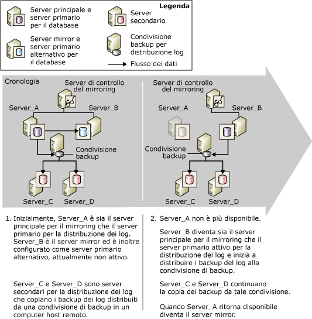

# Mirroring del database e log shipping (SQL Server)
[!INCLUDE[appliesto-ss-xxxx-xxxx-xxx-md](../../includes/appliesto-ss-xxxx-xxxx-xxx-md.md)]
  Per un database specifico è possibile eseguire il mirroring o il log shipping oppure eseguire le due operazioni simultaneamente. Per scegliere l'approccio da utilizzare, considerare gli aspetti seguenti:  
  
-   Numero di server di destinazione necessari  
  
     Se è necessario un solo database di destinazione, il mirroring del database rappresenta la soluzione consigliata.  
  
     Se è necessario più di un database di destinazione, utilizzare il log shipping con o senza il mirroring del database. La combinazione di questi approcci offre i vantaggi del mirroring del database insieme al supporto per più destinazioni garantito dal log shipping.  
  
-   Se è necessario posticipare il ripristino del log nel database di destinazione, in genere ai fini della protezione da errori logici, utilizzare il log shipping dei log con o senza mirroring del database.  
  
 In questo argomento vengono fornite alcune considerazioni utili per la combinazione del log shipping e del mirroring del database.  
  
> [!NOTE]  
>  Per informazioni introduttive su queste tecnologie, vedere [Mirroring del database &#40;SQL Server&#41;](../../database-engine/database-mirroring/database-mirroring-sql-server.md) e [Informazioni sul log shipping &#40;SQL Server&#41;](../../database-engine/log-shipping/about-log-shipping-sql-server.md).  
  
## Combinazione del log shipping e del mirroring del database  
 Il database principale in una sessione di mirroring può anche fungere da database primario in una configurazione per il log shipping o viceversa, se la condivisione di backup per il log shipping è integra. La sessione di mirroring del database viene eseguita in qualsiasi modalità operativa, sia sincrona (con la protezione delle transazioni impostata su FULL) che asincrona (con la protezione delle transazioni impostata su OFF).  
  
> [!NOTE]  
>  Per utilizzare il mirroring del database su un database è sempre necessario il modello di recupero con registrazione completa.  
  
 Quando si combinano il log shipping e il mirroring del database, benché non sia necessario, la sessione di mirroring viene in genere stabilita prima del log shipping. Il database principale corrente viene quindi configurato come database primario per il log shipping ( *database principale/primario*), insieme a uno o più database secondari remoti. Il database mirror, inoltre, deve essere configurato come database primario per il log shipping ( *database mirror/primario*). È consigliabile che i database secondari per il log shipping siano presenti in istanze del server diverse rispetto al server principale/primario o al server mirror/primario.  
  
> [!NOTE]  
>  Le impostazioni relative alla distinzione tra maiuscole e minuscole dei server implicati nel log shipping devono corrispondere.  
  
 Durante una sessione di log shipping, i processi di backup nel database primario comportano la creazione di backup del log in una cartella di backup. Da questa cartella i backup vengono copiati tramite i processi di copia dei server secondari. Ai fini della corretta esecuzione, è necessario che i processi di backup e di copia possano accedere alla cartella di backup per il log shipping. Per ottimizzare la disponibilità del server primario, è consigliabile definire la cartella di backup in un percorso di backup condiviso in un computer host distinto. Assicurarsi che tutti i server per il log shipping, incluso il server mirror/primario, possano accedere al percorso di backup condiviso, noto come *condivisione di backup*.  
  
 Per consentire il proseguimento del log shipping in seguito a un errore di mirroring del database, è inoltre necessario configurare il server mirror come server primario utilizzando la stessa configurazione del database primario nel database principale. Il database mirror è in stato di ripristino, che impedisce ai processi di backup di eseguire il backup del log nel database mirror. Questo comportamento garantisce che il database mirror/primario non interferisca con il database principale/primario i cui backup del log vengono copiati dai server secondari. Per evitare avvisi non corretti, in seguito all'esecuzione del processo di backup nel database mirror/primario, il log del processo di backup registra un messaggio nella tabella**log_shipping_monitor_history_detail** e il processo agente restituisce uno stato con esito positivo.  
  
 Il database mirror/primario è inattivo durante la sessione di log shipping. Se, tuttavia, il mirroring ha esito negativo, il database mirror precedente viene portato online come database principale. A questo punto, il database viene inoltre attivato come database primario per il log shipping. I processi di backup per il log shipping precedentemente non disponibili per distribuire il log nel database avviano la distribuzione. Al contrario, un failover fa sì che il database principale/primario precedente venga impostato come nuovo database mirror/primario e sia in stato di ripristino e che i processi di backup nel database non eseguano più il backup del log.  
  
> [!NOTE]  
>  Nel caso di un failover automatico, il passaggio al ruolo mirror si verifica quando il database principale/primario si riconnette alla sessione di mirroring.  
  
 Per essere eseguita in modalità a sicurezza elevata con failover automatico, la sessione di mirroring viene configurata con un'istanza del server aggiuntiva, nota come *server di controllo del mirroring*. In caso di perdita del database principale per qualsiasi motivo in seguito alla sincronizzazione del database e se il server mirror e il server di controllo del mirroring continuano a comunicare, si verifica il failover automatico. Un failover automatico fa sì che il server assuma il ruolo principale e porti online il proprio database come database principale. Se il percorso di backup per il log shipping è accessibile da parte del nuovo server principale/primario, tramite i relativi processi di backup viene avviata la distribuzione dei backup del log in tale percorso. La modalità sincrona del mirroring del database garantisce che la catena di log non sia interessata da un failover del mirroring e che venga ripristinato solo il log valido. I server secondari continuano a copiare i backup del log senza rilevare che un'istanza del server diversa è stata impostata come server primario.  
  
 Quando si utilizza un server di monitoraggio log shipping locale, non è necessaria alcuna considerazione specifica ai fini di questo scenario. Per informazioni sull'utilizzo di un'istanza di monitoraggio remota con questo scenario, vedere "Impatto del mirroring del database su un'istanza di monitoraggio remota" più avanti in questo argomento.  
  
## Failover dal database principale al database mirror  
 Nella figura seguente viene illustrata la combinazione del log shipping e del mirroring del database quando il mirroring viene eseguito in modalità a sicurezza elevata con failover automatico. Inizialmente il **Server_A** rappresenta sia il server principale per il mirroring, sia il server primario per il log shipping. Il**Server_B** rappresenta il server mirror ed è inoltre configurato come server primario, attualmente non attivo. I**Server_C** e **Server_D** rappresentano i server secondari per il log shipping. Per ottimizzare la disponibilità della sessione di log shipping, il percorso di backup è incluso in una directory condivisa di un computer host distinto.  
  
   
  
 In seguito a un failover del mirroring, il nome del server primario definito nel server secondario risulta inalterato ,  
  
## Impatto del mirroring del database su un'istanza di monitoraggio remota  
 Quando il log shipping viene utilizzato con un'istanza di monitoraggio remota, la combinazione della sessione di log shipping e del mirroring del database influisce sulle informazioni incluse nelle tabelle di monitoraggio. Le informazioni sul server primario rappresentano una combinazione di quelle configurate nel server principale/primario e del server di monitoraggio configurato in ogni server secondario.  
  
 Per mantenere il monitoraggio il più semplice possibile, quando si utilizza un server di monitoraggio remoto è consigliabile specificare il nome del server primario originale durante la configurazione del server primario nel server secondario. Questo approccio semplifica la modifica della configurazione per il log shipping tramite Microsoft [!INCLUDE[ssNoVersion](../../includes/ssnoversion-md.md)] Agent. Per altre informazioni sul monitoraggio, vedere [Monitorare il log shipping &#40;Transact-SQL&#41;](../../database-engine/log-shipping/monitor-log-shipping-transact-sql.md).  
  
## Impostazione della combinazione di mirroring e log shipping  
 Per impostare insieme il mirroring del database e il log shipping, è necessario attenersi alla procedura seguente:  
  
1.  Ripristinare i backup del database principale/primario con NORECOVERY in un'altra istanza del server per utilizzarli in seguito come database mirror per il mirroring del database principale/primario. Per altre informazioni, vedere [Preparare un database mirror per il mirroring &#40;SQL Server&#41;](../../database-engine/database-mirroring/prepare-a-mirror-database-for-mirroring-sql-server.md).  
  
2.  Impostare il mirroring del database. Per altre informazioni, vedere [Stabilire una sessione di mirroring del database tramite autenticazione di Windows &#40;SQL Server Management Studio&#41;](../../database-engine/database-mirroring/establish-database-mirroring-session-windows-authentication.md) o [Impostazione del mirroring del database &#40;SQL Server&#41;](../../database-engine/database-mirroring/setting-up-database-mirroring-sql-server.md).  
  
3.  Ripristinare i backup del database principale/primario in altre istanze del server per utilizzarli in seguito come database secondari del log shipping per il database primario.  
  
4.  Impostare il log shipping nel database principale come database primario per uno o più database secondari.  
  
     È consigliabile impostare una singola condivisione come directory di backup (condivisione di backup). In questo modo si assicura che in seguito allo scambio tra server principale e mirror, i processi di backup continuino a scrivere nella stessa directory utilizzata in precedenza. Una procedura consigliata consiste nel fare in modo che la condivisione sia in un server fisico diverso dai server in cui è presente il database implicato nel mirroring e nel log shipping.  
  
     Per altre informazioni, vedere [Configurare il log shipping &#40;SQL Server&#41;](../../database-engine/log-shipping/configure-log-shipping-sql-server.md).  
  
5.  Eseguire manualemnte il failover dal database principale al database mirror  
  
     Per eseguire un failover manuale:  
  
    -   [Failover manuale di una sessione di mirroring del database &#40;SQL Server Management Studio&#41;](../../database-engine/database-mirroring/manually-fail-over-a-database-mirroring-session-sql-server-management-studio.md)  
  
    -   [Failover manuale in una sessione di mirroring del database &#40;Transact-SQL&#41;](../../database-engine/database-mirroring/manually-fail-over-a-database-mirroring-session-transact-sql.md)  
  
6.  Impostare il log shipping nel nuovo database principale (in precedenza database mirror) come database primario.  
  
    > [!IMPORTANT]  
    >  Non eseguire alcuna installazione da un database secondario.  
  
     È necessario utilizzare la stessa condivisione di backup utilizzata nel passaggio 4.  
  
     L'interfaccia **Log shipping delle transazioni** di [!INCLUDE[ssManStudioFull](../../includes/ssmanstudiofull-md.md)] supporta solo un database primario per ogni configurazione di log shipping. È pertanto necessario utilizzare stored procedure per impostare il nuovo database principale come primario.  
  
7.  Eseguire un altro failover manuale per eseguire nuovamente il failback al database principale originale.  
  
  
