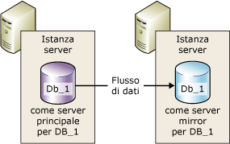
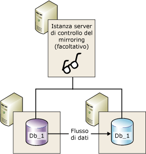
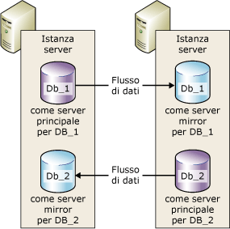

# Mirroring del database (SQL Server)
[!INCLUDE[appliesto-ss-xxxx-xxxx-xxx-md](../../includes/appliesto-ss-xxxx-xxxx-xxx-md.md)]
    
> [!NOTE]  
>  [!INCLUDE[ssNoteDepFutureAvoid](../../includes/ssnotedepfutureavoid-md.md)] In alternativa, usare [!INCLUDE[ssHADR](../../includes/sshadr-md.md)].  
  
 Il*mirroring del database* è una soluzione per aumentare la disponibilità di un database di [!INCLUDE[ssNoVersion](../../includes/ssnoversion-md.md)] . Il mirroring viene implementato a livello di singolo database e funziona solo con database che utilizzano il modello di recupero con registrazione completa.  
  
> [!IMPORTANT]  
>  Per informazioni sul supporto per il mirroring del database, nonché su restrizioni, prerequisiti e consigli per la configurazione dei server partner e per la distribuzione del mirroring del database, vedere [Prerequisiti, restrizioni e indicazioni per il mirroring del database](../../database-engine/database-mirroring/prerequisites-restrictions-and-recommendations-for-database-mirroring.md).  
  
  
##   Vantaggi del mirroring del database  
 Il mirroring del database è una semplice strategia che offre i vantaggi seguenti:  
  
-   Maggiore disponibilità di un database.  
  
     In caso di emergenza, il failover automatico in modalità a protezione elevata attiva rapidamente la modalità online per la copia di standby del database (senza alcuna perdita di dati). Nelle altre modalità operative l'amministratore del database può scegliere se forzare il servizio (con possibile perdita di dati) nella copia di standby del database. Per ulteriori informazioni, vedere [Cambio di ruolo](#RoleSwitching), più avanti in questo argomento.  
  
-   Maggiore protezione dei dati.  
  
     Il mirroring del database offre una ridondanza dei dati completa o quasi completa, in base al fatto che la modalità operativa sia a protezione elevata o a prestazioni elevate. Per ulteriori informazioni, vedere [Modalità operative](#OperatingModes)di seguito in questo argomento.  
  
     Un partner di mirroring di database in esecuzione in [!INCLUDE[ssEnterpriseEd10](../../includes/ssenterpriseed10-md.md)] o versioni successive cerca di risolvere alcuni tipi di errori che impediscono la lettura di una pagina di dati. Il partner che non è in grado di leggere una pagina ne richiede una copia aggiornata all'altro. Se la richiesta viene soddisfatta, la pagina illeggibile viene sostituita dalla copia e l'errore viene risolto. Per ulteriori informazioni, vedere [Correzione automatica della pagina &#40;Gruppi di disponibilità/Mirroring del database&#41;](../../sql-server/failover-clusters/automatic-page-repair-availability-groups-database-mirroring.md).  
  
-   Migliore disponibilità del database di produzione durante gli aggiornamenti.  
  
     Per contenere il tempo di inattività di un database con mirroring, è possibile aggiornare in sequenza le istanze di [!INCLUDE[ssNoVersion](../../includes/ssnoversion-md.md)] che ospitano i partner di failover. Ciò genererà il tempo di inattività di un solo failover. Questa modalità di aggiornamento è noto come *aggiornamento in sequenza*. Per altre informazioni, vedere [Upgrading Mirrored Instances](../../database-engine/database-mirroring/upgrading-mirrored-instances.md)(Aggiornamento di istanze con mirroring).  
  
  
##   Termini e definizioni del mirroring del database  
 failover automatico  
 Processo attraverso il quale, quando il server principale non è disponibile, il server mirror assume il ruolo di server principale e attiva la modalità online per la propria copia del database come database principale.  
  
 partner di failover  
 Le due istanze del server (il server principale o il server mirror) che vengono utilizzate come partner nel cambio di ruolo per un database con mirroring.  
  
 servizio forzato  
 Failover iniziato dal proprietario del database in seguito all'errore del server principale per trasferire il servizio al database mirror mentre si trova in uno stato sconosciuto.  
  
 Modalità a prestazioni elevate  
 La sessione di mirroring del database viene eseguita in modo asincrono e utilizza unicamente il server principale e il server mirror. L'unica forma di cambio di ruolo è il servizio forzato (con possibile perdita di dati).  
  
 Modalità a sicurezza elevata  
 La sessione di mirroring del database viene eseguita in modo asincrono e facoltativamente utilizza un server di controllo, nonché il server principale e il server mirror.  
  
 failover manuale  
 Failover iniziato dal proprietario del database, mentre il server principale è ancora in esecuzione, per trasferire il servizio dal database principale al database mirror mentre si trovano in uno stato sincronizzato.  
  
 database mirror  
 Copia del database che in genere è completamente sincronizzata con il database principale.  
  
 server mirror  
 In una configurazione di mirroring del database, istanza del server in cui risiede il database mirror.  
  
 database principale  
 Nel mirroring del database, database di lettura/scrittura il cui log delle transazioni viene applicato a una copia di sola lettura del database (database mirror).  
  
 server principale  
 Nel mirroring del database, partner il cui database è attualmente il database principale.  
  
 coda di rollforward  
 Record del log delle transazioni ricevuto in attesa sul disco di un server mirror.  
  
 ruolo  
 Il server principale e il server mirror eseguono ruoli mirror e principali complementari. Facoltativamente, il ruolo del server di controllo del mirroring viene eseguito da una terza istanza di server.  
  
 Cambio di ruolo  
 Assunzione del ruolo principale da parte del mirror.  
  
 coda invii  
 Record del log delle transazioni non inviato che si sono accumulati sul disco del log del server principale.  
  
 sessione  
 Relazione che si verifica durante il mirroring del database tra il server principale, il server mirror e il server di controllo del mirroring, se presente.  
  
 All'avvio o alla ripresa di una sessione di mirroring, processo in cui i record di log del database principale accumulati nel server principale vengono inviati al server mirror, che li scrive sul disco il più rapidamente possibile in modo da non rimanere indietro rispetto al server principale.  
  
 Livello di sicurezza delle transazioni  
 Proprietà del database specifica del mirroring che determina l'esecuzione della sessione di mirroring del database in modalità sincrona o asincrona. Esistono due livelli di protezione: FULL e OFF.  
  
 Controllo  
 Per l'utilizzo nella sola modalità a sicurezza elevata. Istanza facoltativa di SQL Server che consente al server mirror di stabilire quando avviare un failover automatico. A differenza dei due partner di failover, il server di controllo del mirroring non rende disponibile il database. Il supporto del failover automatico è l'unico ruolo del server di controllo del mirroring.  
  
  
##   Panoramica del mirroring del database  
 Il mirroring del database gestisce due copie di un singolo database che devono trovarsi su istanze del server diverse di [!INCLUDE[ssDEnoversion](../../includes/ssdenoversion-md.md)]. In genere, tali istanze del server risiedono su computer ubicati in posizioni diverse. L'avvio del mirroring del database su un database comporta l'avvio di una relazione, nota come *sessione del mirroring del database*, tra queste istanze del server.  
  
 Un'istanza del server gestisce il database per i client (il *server principale*). L'altra istanza agisce come server warm standby o hot standby (il *server mirror*), a seconda della configurazione e dello stato della sessione di mirroring. Quando viene sincronizzata una sessione di mirroring del database, il mirroring del database rende disponibile un server di hot standby che supporta il failover rapido senza perdita di dati da transazioni di cui è stato eseguito il commit. Quando la sessione non è sincronizzata, il server mirror è in genere disponibile come server warm standby e ciò può causare perdite di dati.  
  
 Il server principale e il server mirror comunicano e cooperano come *partner* in una *sessione di mirroring del database*. I due partner svolgono ruoli complementari nella sessione: il *ruolo principale* e il *ruolo mirror*. In ogni momento, un partner svolge il ruolo principale, l'altro il ruolo mirror. Ogni partner è definito *proprietario* del suo ruolo corrente. Il partner proprietario del ruolo principale è definito *server principale*e la sua copia del database è il database principale corrente. Il partner proprietario del ruolo mirror è definito *server mirror*e la sua copia del database è il database mirror corrente. Quando il mirroring del database è distribuito in un ambiente di produzione, il database principale è il *database di produzione*.  
  
 Il mirroring del database include il *rollforward* sul database mirror di tutte le operazioni di inserimento, aggiornamento ed eliminazione eseguite sul database principale il più rapidamente possibile. Il rollforward viene eseguito inviando un flusso di record del log delle transazioni attivi al server mirror, il quale applica i record del log al database mirror, in sequenza, il più rapidamente possibile. Diversamente dalla replica, che opera a livello logico, il mirroring del database opera a livello dei record del log fisico. A partire da [!INCLUDE[ssKatmai](../../includes/sskatmai-md.md)], il server principale comprime il flusso di record del log delle transazioni prima di inviarlo al server mirror. Questa compressione del log si verifica in tutte le sessioni di mirroring.  
  
> [!NOTE]  
>  Una determinata istanza del server può prendere parte a più sessioni di mirroring del database simultanee con lo stesso partner o con partner diversi. Una determinata istanza del server può essere partner in alcune sessioni e server di controllo del mirroring in altre. L'istanza del server mirror deve eseguire la stessa edizione di [!INCLUDE[ssNoVersion](../../includes/ssnoversion-md.md)].  
  
 **Contenuto della sezione**  
  
-   [Modalità operative](#OperatingModes)  
  
-   [Cambio di ruolo](#RoleSwitching)  
  
-   [Sessioni simultanee](#ConcurrentSessions)  
  
-   [Connessioni client](#ClientConnections)  
  
-   [Effetti della sospensione di una sessione sul log delle transazioni principale](#ImpactOfPausing)  
  
  
###   Modalità operative  
 Una sessione di mirroring del database può essere eseguita in un'operazione sincrona o asincrona. In modalità asincrona il commit delle transazioni viene eseguito senza attendere che il server mirror salvi il log su disco, ottimizzando così le prestazioni. L'operazione sincrona assicura che il commit di una transazione venga eseguito su entrambi i partner, ma con il rischio di aumentare la latenza delle transazioni.  
  
 Per il mirroring del database sono disponibili due modalità operative. Una di esse, la *modalità a protezione elevata* supporta l'operazione sincrona. In modalità a protezione elevata, all'avvio di una sessione, il server mirror sincronizza il database mirror con il database principale il più rapidamente possibile. Quando i database sono sincronizzati, il commit di una transazione viene eseguito su entrambi i partner, ma con il rischio di aumentare la latenza delle transazioni.  
  
 La seconda modalità operativa, la *modalità a prestazioni elevate*, prevede l'esecuzione in modo asincrono. Il server mirror tenta di restare sincronizzato con i record del log inviati dal server principale. Il database mirror potrebbe avere un certo ritardo rispetto al database principale. Tale divario tra i due database tuttavia è in genere piuttosto limitato. ma può diventare significativo se il server principale è soggetto a un ingente carico di lavoro o se il sistema del server mirror è sottoposto a overload.  
  
 In modalità a prestazioni elevate, non appena il server principale invia un record del log al server mirror, il server principale invia una conferma al client. Non attende un acknowledgement da parte del server mirror. Il commit delle transazioni viene pertanto eseguito senza attendere che il server mirror salvi il log su disco. L'operazione asincrona consente l'esecuzione del server principale con una latenza minima per le transazioni, ma comporta il rischio potenziale di perdita dei dati.  
  
 Tutte le sessioni di mirroring del database supportano solo un server principale e un server mirror. La configurazione è illustrata nella figura seguente.  
  
   
  
 La modalità a prestazioni elevate con failover automatico richiede la presenza di una terza istanza del server, nota come *server di controllo*. A differenza dei due partner, il server di controllo del mirroring non serve il database, ma supporta il failover automatico mediante la verifica dell'efficienza del server principale. Il server mirror avvia il failover automatico solo se il server mirror e il server di controllo del mirroring rimangono connessi tra loro dopo la disconnessione di entrambi dal server principale.  
  
 Nella figura seguente viene illustrata una configurazione che include un server di controllo del mirroring.  
  
   
  
 Per ulteriori informazioni, vedere [Cambio di ruolo](#RoleSwitching), più avanti in questo argomento.  
  
> [!NOTE]  
>  Per avviare una nuova sessione di mirroring o aggiungere un server di controllo del mirroring a una configurazione di mirroring esistente, è necessario che in tutte le istanze server coinvolte venga eseguita la stessa versione di [!INCLUDE[ssNoVersion](../../includes/ssnoversion-md.md)]. Tuttavia, quando viene eseguito l'aggiornamento a [!INCLUDE[ssKatmai](../../includes/sskatmai-md.md)] o a una versione successiva, possono verificarsi variazioni nelle istanze coinvolte. Per altre informazioni, vedere [Aggiornamento di istanze con mirroring](../../database-engine/database-mirroring/upgrading-mirrored-instances.md).  
  
  
####   Sicurezza delle transazioni e modalità operative  
 La modalità operativa può essere sincrona o asincrona in base all'impostazione del livello di protezione delle transazioni. Se si utilizza esclusivamente [!INCLUDE[ssManStudioFull](../../includes/ssmanstudiofull-md.md)] per configurare il mirroring del database, le impostazioni di protezione delle transazioni vengono configurate automaticamente quando si seleziona la modalità operativa.  
  
 Se si utilizza [!INCLUDE[tsql](../../includes/tsql-md.md)] per configurare il mirroring del database, è necessario conoscere la procedura di impostazione della protezione delle transazioni. La protezione delle transazioni è controllata dalla proprietà SAFETY dell'istruzione ALTER DATABASE. In un database sottoposto a mirroring, la proprietà SAFETY può essere impostata su FULL o su OFF.  
  
-   Se l'opzione SAFETY è impostata su FULL, l'operazione di mirroring del database è sincrona dopo la fase di sincronizzazione iniziale. Se un server di controllo del mirroring è in modalità a protezione elevata, la sessione supporta il failover automatico.  
  
-   Se l'opzione SAFETY è impostata su OFF, l'operazione di mirroring del database è asincrona. La sessione viene eseguita in modalità a prestazioni elevate e anche l'opzione WITNESS deve essere impostata su OFF.  
  
 Per altre informazioni, vedere [Database Mirroring Operating Modes](../../database-engine/database-mirroring/database-mirroring-operating-modes.md).  
  
  
###   Cambio di ruolo  
 Nel contesto di una sessione di mirroring del database, in genere i ruoli principale e mirror sono intercambiabili tramite un processo denominato *cambio di ruolo*. Il cambio di ruolo comporta il trasferimento del ruolo principale al server mirror. In un cambio di ruolo, il server mirror funge da *partner di failover* per il server principale. Quando si verifica un cambio di ruolo, il server mirror assume il ruolo principale e attiva la modalità online per la propria copia del database come nuovo database principale. Il server principale precedente, quando disponibile, assume il ruolo di mirror e il suo database diventa il nuovo database mirror. Potenzialmente, i ruoli possono essere scambiati ripetutamente nei due sensi.  
  
 Esistono le tre forme seguenti di cambio di ruolo.  
  
-   *Automatic failover*  
  
     Richiede la modalità a protezione elevata e la presenza di un server mirror e di un server per il controllo del mirroring. Il database deve essere già sincronizzato e il server di controllo del mirroring deve essere connesso al server mirror.  
  
     Il ruolo del server di controllo del mirroring consiste nel verificare il funzionamento di un determinato server partner. Se il server mirror perde la connessione al server principale, ma il server di controllo del mirroring è ancora connesso al server principale, il server non avvierà il failover. Per altre informazioni, vedere [Server di controllo del mirroring del database](../../database-engine/database-mirroring/database-mirroring-witness.md).  
  
-   *Manual failover*  
  
     Richiede la modalità a protezione elevata. I partner devono essere connessi tra loro e il database deve essere già sincronizzato.  
  
-   *Servizio forzato* (con possibile perdita di dati)  
  
     In modalità a prestazioni elevate e a protezione elevata senza failover automatico, è possibile forzare il servizio se il server principale non è disponibile e il server mirror è disponibile.  
  
    > [!IMPORTANT]  
    >  La modalità a prestazioni elevate è destinata all'utilizzo senza un server di controllo del mirroring. Tuttavia, se è disponibile un server per il controllo del mirroring, per poter forzare il servizio è necessario che il server di controllo del mirroring sia connesso al server mirror.  
  
 In qualsiasi scenario di cambio di ruolo, quando il nuovo database principale è online, le applicazioni client possono eseguire un rapido recupero tramite la riconnessione al database.  
  
  
###   Sessioni simultanee  
 Una determinata istanza del server può prendere parte a più sessioni di mirroring del database simultanee (una volta per ogni database con mirroring) con la stessa istanza o istanze diverse del server. Spesso, un'istanza del server funge esclusivamente da server partner o da server di controllo del mirroring in tutte le relative sessioni di mirroring del database. Poiché tuttavia ogni sessione è indipendente dalle altre, un'istanza del server può fungere da server partner in alcune sessioni e da server di controllo del mirroring in altre. Si considerino ad esempio le quattro sessioni seguenti tra tre istanze del server (`SSInstance_1`, `SSInstance_2`e `SSInstance_3`). Ogni istanza del server funge da partner in alcune sessioni e da server di controllo del mirroring in altre:  
  
|Istanza del server|Sessione per il database A|Sessione per il database B|Sessione per il database C|Sessione per il database D|  
|---------------------|----------------------------|----------------------------|----------------------------|----------------------------|  
|`SSInstance_1`|Controllo|Partner|Partner|Partner|  
|`SSInstance_2`|Partner|Controllo|Partner|Partner|  
|`SSInstance_3`|Partner|Partner|Controllo|Controllo|  
  
 Nella figura seguente vengono illustrate due istanze del server che partecipano come partner a due sessioni di mirroring. Una sessione è relativa al database denominato **Db_1**, l'altra al database denominato **Db_2**.  
  
   
  
 Ogni database è indipendente dagli altri. Ad esempio, un'istanza del server inizialmente può rappresentare il server mirror per due database. Se uno dei database esegue il failover, l'istanza del server diventa il server principale per il database con failover, rimanendo contemporaneamente il server mirror per l'altro database.  
  
 Sempre a titolo di esempio, si consideri un'istanza del server che rappresenta il server principale per due o più database in esecuzione in modalità a sicurezza elevata con failover automatico. In caso di errore dell'istanza del server, tutti i database eseguiranno automaticamente il failover ai rispettivi database mirror.  
  
 Quando si imposta un'istanza del server perché operi sia come partner che come server di controllo, assicurarsi che l'endpoint del mirroring del database supporti entrambi i ruoli. Per altre informazioni, vedere [Endpoint del mirroring del database &#40;SQL Server&#41;](../../database-engine/database-mirroring/the-database-mirroring-endpoint-sql-server.md)). Assicurarsi inoltre che il sistema disponga di risorse sufficienti per ridurre la contesa tra risorse.  
  
> [!NOTE]  
>  I database con mirroring sono indipendenti tra loro, quindi non possono eseguire il failover come gruppo.  
  
###   Connessioni client  
 Le connessioni client per le sessioni di mirroring del database sono supportate da [!INCLUDE[msCoName](../../includes/msconame-md.md)] .NET Data Provider per [!INCLUDE[ssNoVersion](../../includes/ssnoversion-md.md)]. Per ulteriori informazioni, vedere [Connettere client a una sessione di mirroring del database &#40;SQL Server&#41;](../../database-engine/database-mirroring/connect-clients-to-a-database-mirroring-session-sql-server.md).  
  
  
###   Effetti della sospensione di una sessione sul log delle transazioni principale  
 Il proprietario del database può sospendere una sessione in qualsiasi momento e, in questo modo, preservare lo stato della sessione mentre si rimuove il mirroring. Quando una sessione viene sospesa, il server principale non invia nuovi record del log al server mirror. Tali record restano attivi e si accumulano nel log delle transazioni del database principale. Inoltre, finché la sessione di mirroring del database rimane sospesa, non è possibile troncare il log delle transazioni. Se la sessione di mirroring del database resta sospesa troppo a lungo, dunque, lo spazio del log può esaurirsi.  
  
 Per ulteriori informazioni, vedere [Sospensione e ripresa del mirroring del database &#40;SQL Server&#41;](../../database-engine/database-mirroring/pausing-and-resuming-database-mirroring-sql-server.md).  
  
##   Impostazione di una sessione di mirroring per un database  
 Prima di iniziare una sessione di mirroring, è necessario che il proprietario del database oppure l'amministratore di sistema crei il database mirror, imposti gli endpoint e gli account di accesso e, in alcuni casi, crei e imposti i certificati. Per ulteriori informazioni, vedere [Impostazione del mirroring del database &#40;SQL Server&#41;](../../database-engine/database-mirroring/setting-up-database-mirroring-sql-server.md).  
  
##   Interoperabilità e coesistenza con altre funzionalità del motore di database  
 È possibile utilizzare il mirroring del database con i componenti e le caratteristiche seguenti di [!INCLUDE[ssNoVersion](../../includes/ssnoversion-md.md)].  
  
-   [Log shipping](../../database-engine/database-mirroring/database-mirroring-and-log-shipping-sql-server.md)  
  
-   [Cataloghi full-text](../../database-engine/database-mirroring/database-mirroring-and-full-text-catalogs-sql-server.md)  
  
-   [Snapshot di database](../../database-engine/database-mirroring/database-mirroring-and-database-snapshots-sql-server.md)  
  
-   [Replica](../../database-engine/database-mirroring/database-mirroring-and-replication-sql-server.md)  
  
##   Contenuto della sezione  
 [Prerequisiti, restrizioni e indicazioni per il mirroring del database](../../database-engine/database-mirroring/prerequisites-restrictions-and-recommendations-for-database-mirroring.md)  
 Vengono descritti i prerequisiti e le indicazioni per la configurazione del mirroring del database.  
  
 [Database Mirroring Operating Modes](../../database-engine/database-mirroring/database-mirroring-operating-modes.md)  
 Sono incluse informazioni sulle modalità di funzionamento sincrona e asincrona per le sessioni di mirroring del database e sul cambio di ruoli dei partner durante una sessione di mirroring del database.  
  
 [Server di controllo del mirroring del database](../../database-engine/database-mirroring/database-mirroring-witness.md)  
 Descrive il ruolo di un server di controllo nel mirroring del database, viene illustrato come utilizzare un singolo server di controllo in più sessioni di mirroring, vengono descritti i requisiti software e hardware per i server di controllo e il ruolo del server di controllo nel failover automatico. Sono inoltre contenute informazioni sull'aggiunta o la rimozione di un server di controllo.  
  
 [Cambio di ruolo durante una sessione di mirroring del database &#40;SQL Server&#41;](../../database-engine/database-mirroring/role-switching-during-a-database-mirroring-session-sql-server.md)  
 Sono incluse informazioni sul cambio di ruoli dei partner durante una sessione di mirroring del database, nonché sul failover automatico, il failover manuale e il servizio forzato (con possibile perdita dei dati). Sono inoltre incluse informazioni sulla stima relativa all'interruzione del servizio durante il cambio di ruoli.  
  
 [Possibili errori durante il mirroring del database](../../database-engine/database-mirroring/possible-failures-during-database-mirroring.md)  
 Vengono descritti i problemi fisici, del sistema operativo e di [!INCLUDE[ssNoVersion](../../includes/ssnoversion-md.md)] , inclusi gli errori hardware e software, che possono causare interruzioni durante la sessione di mirroring del database. Viene illustrato come il meccanismo di timeout del mirroring risponde agli errori software.  
  
 [Endpoint del mirroring del database &#40;SQL Server&#41;](../../database-engine/database-mirroring/the-database-mirroring-endpoint-sql-server.md)  
 Viene illustrato il funzionamento dell'endpoint del mirroring del database.  
  
 [Impostazione del mirroring del database &#40;SQL Server&#41;](../../database-engine/database-mirroring/setting-up-database-mirroring-sql-server.md)  
 Sono inclusi gli argomenti su prerequisiti, indicazioni e procedure per la configurazione del mirroring del database.  
  
 [Connettere client a una sessione di mirroring del database &#40;SQL Server&#41;](../../database-engine/database-mirroring/connect-clients-to-a-database-mirroring-session-sql-server.md)  
 Sono inclusi gli argomenti relativi agli attributi della stringa di connessione del client e agli algoritmi per la connessione e la riconnessione di un client a un database con mirroring.  
  
 [Sospensione e ripresa del mirroring del database &#40;SQL Server&#41;](../../database-engine/database-mirroring/pausing-and-resuming-database-mirroring-sql-server.md)  
 Viene spiegato cosa accade quando viene sospeso il mirroring del database, incluso l'impatto sul troncamento del log delle transazioni, e vengono fornite le descrizioni delle modalità di sospensione e ripresa del mirroring del database.  
  
 [Rimozione del mirroring del database &#40;SQL Server&#41;](../../database-engine/database-mirroring/removing-database-mirroring-sql-server.md)  
 Viene descritto l'impatto della rimozione del mirroring e viene spiegato come terminare una sessione  
  
 [Monitoraggio del mirroring del database &#40;SQL Server&#41;](../../database-engine/database-mirroring/monitoring-database-mirroring-sql-server.md)  
 Contiene informazioni sull'uso di Monitoraggio mirroring del database o delle stored procedure **dbmmonitor** per monitorare le sessioni o il mirroring del database.  
  
  
##   Attività correlate  
  
### Attività di configurazione  
 **Utilizzo di SQL Server Management Studio**  
  
-   [Avviare la Configurazione guidata sicurezza mirroring del database &#40;SQL Server Management Studio&#41;](../../database-engine/database-mirroring/start-the-configuring-database-mirroring-security-wizard.md)  
  
-   [Stabilire una sessione di mirroring del database tramite autenticazione di Windows &#40;SQL Server Management Studio&#41;](../../database-engine/database-mirroring/establish-database-mirroring-session-windows-authentication.md)  
  
 **Utilizzo di Transact-SQL**  
  
-   [Concedere l'accesso alla rete a un endpoint per il mirroring del database usando l'autenticazione di Windows &#40;SQL Server&#41;](../../database-engine/database-mirroring/database-mirroring-allow-network-access-windows-authentication.md)  
  
-   [Impostazione dell'endpoint del mirroring del database per l'utilizzo di certificati per le connessioni in uscita &#40;Transact-SQL&#41;](../../database-engine/database-mirroring/database-mirroring-use-certificates-for-outbound-connections.md)  
  
-   [Impostazione dell'endpoint del mirroring del database per l'utilizzo di certificati per le connessioni in ingresso &#40;Transact-SQL&#41;](../../database-engine/database-mirroring/database-mirroring-use-certificates-for-inbound-connections.md)  
  
-   [Creare un endpoint del mirroring del database per l'autenticazione Windows &#40;Transact-SQL&#41;](../../database-engine/database-mirroring/create-a-database-mirroring-endpoint-for-windows-authentication-transact-sql.md)  
  
-   [Stabilire una sessione di mirroring del database tramite autenticazione di Windows &#40;Transact-SQL&#41;](../../database-engine/database-mirroring/database-mirroring-establish-session-windows-authentication.md)  
  
-   [Aggiungere un server di controllo del mirroring del database tramite l'autenticazione di Windows &#40;Transact-SQL&#41;](../../database-engine/database-mirroring/add-a-database-mirroring-witness-using-windows-authentication-transact-sql.md)  
  
-   [Impostare un database mirror per l'uso della proprietà Trustworthy &#40;Transact-SQL&#41;](../../database-engine/database-mirroring/set-up-a-mirror-database-to-use-the-trustworthy-property-transact-sql.md)  
  
 **Utilizzo di Transact-SQL o SQL Server Management Studio**  
  
-   [Upgrading Mirrored Instances](../../database-engine/database-mirroring/upgrading-mirrored-instances.md)  
  
-   [Preparare un database mirror per il mirroring &#40;SQL Server&#41;](../../database-engine/database-mirroring/prepare-a-mirror-database-for-mirroring-sql-server.md)  
  
  
### Attività amministrative  
 **Transact-SQL**  
  
-   [Modificare la sicurezza delle transazioni in una sessione di mirroring del database &#40;Transact-SQL&#41;](../../database-engine/database-mirroring/change-transaction-safety-in-a-database-mirroring-session-transact-sql.md)  
  
-   [Eseguire il failover manuale di una sessione di mirroring del database &#40;Transact-SQL&#41;](../../database-engine/database-mirroring/manually-fail-over-a-database-mirroring-session-transact-sql.md)  
  
-   [Utilizzo forzato del servizio in una sessione di mirroring del database &#40;Transact-SQL&#41;](../../database-engine/database-mirroring/force-service-in-a-database-mirroring-session-transact-sql.md)  
  
-   [Sospendere o riprendere una sessione di mirroring del database &#40;SQL Server&#41;](../../database-engine/database-mirroring/pause-or-resume-a-database-mirroring-session-sql-server.md)  
  
-   [Rimuovere il server di controllo del mirroring da una sessione di mirroring del database &#40;SQL Server&#41;](../../database-engine/database-mirroring/remove-the-witness-from-a-database-mirroring-session-sql-server.md)  
  
-   [Rimuovere il mirroring del database &#40;SQL Server&#41;](../../database-engine/database-mirroring/remove-database-mirroring-sql-server.md)  
  
 **SQL Server Management Studio**  
  
-   [Aggiungere o sostituire un server di controllo del mirroring del database &#40;SQL Server Management Studio&#41;](../../database-engine/database-mirroring/add-or-replace-a-database-mirroring-witness-sql-server-management-studio.md)  
  
-   [Eseguire il failover manuale di una sessione di mirroring del database &#40;SQL Server Management Studio&#41;](../../database-engine/database-mirroring/manually-fail-over-a-database-mirroring-session-sql-server-management-studio.md)  
  
-   [Sospendere o riprendere una sessione di mirroring del database &#40;SQL Server&#41;](../../database-engine/database-mirroring/pause-or-resume-a-database-mirroring-session-sql-server.md)  
  
-   [Rimuovere il server di controllo del mirroring da una sessione di mirroring del database &#40;SQL Server&#41;](../../database-engine/database-mirroring/remove-the-witness-from-a-database-mirroring-session-sql-server.md)  
  
-   [Rimuovere il mirroring del database &#40;SQL Server&#41;](../../database-engine/database-mirroring/remove-database-mirroring-sql-server.md)  
  
  
## Vedere anche  
 [Endpoint del mirroring del database &#40;SQL Server&#41;](../../database-engine/database-mirroring/the-database-mirroring-endpoint-sql-server.md)   
 [Correzione automatica della pagina &#40;Gruppi di disponibilità/Mirroring del database&#41;](../../sql-server/failover-clusters/automatic-page-repair-availability-groups-database-mirroring.md)   
 [Risolvere i problemi relativi alla configurazione del mirroring del database &#40;SQL Server&#41;](../../database-engine/database-mirroring/troubleshoot-database-mirroring-configuration-sql-server.md)   
 [Mirroring del database: Interoperabilità e coesistenza &#40;SQL Server&#41;](../../database-engine/database-mirroring/database-mirroring-interoperability-and-coexistence-sql-server.md)   
 [Prerequisiti restrizioni e indicazioni per il mirroring del database](../../database-engine/database-mirroring/prerequisites-restrictions-and-recommendations-for-database-mirroring.md)   
 [Panoramica di gruppi di disponibilità AlwaysOn &#40;SQL Server&#41;](../../database-engine/availability-groups/windows/overview-of-always-on-availability-groups-sql-server.md)   
 [Informazioni sul log shipping &#40;SQL Server&#41;](../../database-engine/log-shipping/about-log-shipping-sql-server.md)  
  
  
