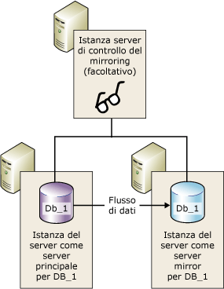
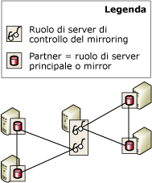

# Server di controllo del mirroring del database
[!INCLUDE[appliesto-ss-xxxx-xxxx-xxx-md](../../includes/appliesto-ss-xxxx-xxxx-xxx-md.md)]
  Per supportare il failover automatico, è necessario configurare una sessione di mirroring del database in modalità a protezione elevata e usare l'istanza di un terzo server, noto come *server di controllo*. Il server di controllo del mirroring è un'istanza facoltativa di [!INCLUDE[ssNoVersion](../../includes/ssnoversion-md.md)] che consente al server mirror in una sessione in modalità a protezione elevata di stabilire se avviare un failover automatico. A differenza dei due partner, il server di controllo del mirroring non serve il database, Il supporto del failover automatico è l'unico ruolo del server di controllo del mirroring.  
  
> [!NOTE]  
>  In modalità a prestazioni elevate, il server di controllo del mirroring può influenzare negativamente la disponibilità. Se un server di controllo del mirroring è configurato per una sessione di mirroring del database, il server principale deve essere connesso almeno a una delle istanze degli altri server, ovvero il server mirror o il server di controllo del mirroring, oppure a entrambe. In caso contrario, il database non è più disponibile e diventa impossibile forzare il servizio (con possibile perdita di dati). Per tale motivo, nella modalità a prestazioni elevate è fortemente consigliabile mantenere sempre inattivo il server di controllo del mirroring. Per informazioni sull'impatto di un server di controllo sulla modalità a prestazioni elevate, vedere [Modalità di funzionamento del mirroring del database](../../database-engine/database-mirroring/database-mirroring-operating-modes.md).  
  
 Nella figura seguente viene illustrata una sessione in modalità a protezione elevata con un server di controllo del mirroring.  
  
   
  
 **Contenuto dell'argomento:**  
  
-   [Utilizzo di un server di controllo del mirroring in più sessioni](#InMultipleSessions)  
  
-   [Indicazioni relative a software e hardware](#SwHwRecommendations)  
  
-   [Ruolo del server di controllo del mirroring nel failover automatico](#InAutoFo)  
  
-   [Per aggiungere o rimuovere un server di controllo del mirroring](#AddRemoveWitness)  
  
##   Utilizzo di un server di controllo del mirroring in più sessioni  
 Un'istanza del server specifica può fungere da server di controllo del mirroring in sessioni di mirroring del database simultanee, ogni sessione per un database diverso. Sessioni diverse possono avere luogo con partner diversi. Nella figura seguente viene illustrata un'istanza del server che rappresenta un server di controllo del mirroring in due sessioni di mirroring del database con partner diversi.  
  
   
  
 Un'istanza a server singolo può inoltre fungere contemporaneamente da server di controllo del mirroring in alcune sessioni e da partner in altre. Tuttavia, in pratica, un'istanza del server funge in genere da server di controllo del mirroring o da partner. I partner richiedono infatti computer sofisticati, con hardware sufficiente per supportare un database di produzione, mentre è possibile eseguire il server di controllo del mirroring in qualunque sistema Windows disponibile che supporti [!INCLUDE[ssCurrent](../../includes/sscurrent-md.md)].  
  
##   Indicazioni relative a software e hardware  
 È fortemente consigliabile che il server di controllo del mirroring si trovi su un computer diverso rispetto ai partner. I partner di mirroring del database sono supportati solo da [!INCLUDE[ssNoVersion](../../includes/ssnoversion-md.md)] Standard Edition e da [!INCLUDE[ssNoVersion](../../includes/ssnoversion-md.md)] Enterprise Edition. I server di controllo, invece, sono supportati anche da [!INCLUDE[ssNoVersion](../../includes/ssnoversion-md.md)] Workgroup e da [!INCLUDE[ssNoVersion](../../includes/ssnoversion-md.md)] Express. Eccetto durante un aggiornamento da una versione precedente di [!INCLUDE[ssNoVersion](../../includes/ssnoversion-md.md)], le istanze del server in una sessione di mirroring devono essere tutte eseguite con la stessa versione di [!INCLUDE[ssNoVersion](../../includes/ssnoversion-md.md)]. Ad esempio, un server di controllo del mirroring [!INCLUDE[ssKatmai](../../includes/sskatmai-md.md)] è supportato durante l'aggiornamento da una configurazione di mirroring di [!INCLUDE[ssKatmai](../../includes/sskatmai-md.md)] , ma non può essere aggiunto a una configurazione di mirroring di [!INCLUDE[ssKilimanjaro](../../includes/sskilimanjaro-md.md)] esistente, nuova o successiva.  
  
 Un server di controllo del mirroring può essere eseguito su qualsiasi computer affidabile che supporti una di queste versioni di [!INCLUDE[ssNoVersion](../../includes/ssnoversion-md.md)]. Tuttavia è consigliabile che ogni istanza del server usata come server di controllo soddisfi la configurazione minima necessaria per la versione di [!INCLUDE[ssNoVersion](../../includes/ssnoversion-md.md)] Standard in esecuzione. Per altre informazioni su questi requisiti, vedere [Requisiti hardware e software per l'installazione di SQL Server 2016](../../sql-server/install/hardware-and-software-requirements-for-installing-sql-server.md).  
  
##   Ruolo del server di controllo del mirroring nel failover automatico  
 Nel corso di una sessione di mirroring del database viene eseguito il monitoraggio dello stato di connessione di tutte le istanze del server. Se i partner vengono disconnessi gli uni dagli altri, si basano sul server di controllo del mirroring per assicurare che solo uno di essi stia attualmente rispondendo alle richieste del database. Se un server mirror sincronizzato perde la connessione al server principale ma rimane connesso al server di controllo del mirroring, il server mirror contatta il server di controllo del mirroring per determinare se quest'ultimo ha perso la connessione al server principale:  
  
-   Se il server principale è ancora connesso al server di controllo del mirroring, il failover automatico non avviene. Il server principale continua invece a rispondere alle richieste del database accumulando al contempo record del log da inviare al server mirror quando il partner si riconnette.  
  
-   Se anche il server di controllo del mirroring viene disconnesso dal server principale, il server mirror viene a conoscenza del fatto che il database principale è diventato non disponibile. In questo caso, il server mirror avvia immediatamente un failover automatico.  
  
-   Se il server mirror viene disconnesso dal server di controllo del mirroring e dal server principale, il failover automatico non è possibile, indipendentemente dallo stato del server principale.  
  
 Il requisito che prevede che almeno due delle istanze del server debbano essere connesse è noto come *quorum*. Il quorum assicura che il database possa essere utilizzato da un solo partner per volta. Per informazioni sul funzionamento del quorum e sul suo impatto su una sessione, vedere [Quorum: Impatto di un server di controllo del mirroring sulla disponibilità del database &#40;mirroring del database&#41;](../../database-engine/database-mirroring/quorum-how-a-witness-affects-database-availability-database-mirroring.md).  
  
##   Per aggiungere o rimuovere un server di controllo del mirroring  
 **Per aggiungere un server di controllo del mirroring**  
  
-   [Aggiunta o sostituzione di un server di controllo del mirroring del database &#40;SQL Server Management Studio&#41;](../../database-engine/database-mirroring/add-or-replace-a-database-mirroring-witness-sql-server-management-studio.md)  
  
-   [Aggiungere un server di controllo del mirroring del database tramite l'autenticazione di Windows &#40;Transact-SQL&#41;](../../database-engine/database-mirroring/add-a-database-mirroring-witness-using-windows-authentication-transact-sql.md)  
  
 **Per rimuovere il server di controllo del mirroring**  
  
-   [Rimuovere il server di controllo del mirroring da una sessione di mirroring del database &#40;SQL Server&#41;](../../database-engine/database-mirroring/remove-the-witness-from-a-database-mirroring-session-sql-server.md)  
  
## Vedere anche  
 [Cambio di ruolo durante una sessione di mirroring del database &#40;SQL Server&#41;](../../database-engine/database-mirroring/role-switching-during-a-database-mirroring-session-sql-server.md)   
 [Modalità di funzionamento del mirroring del database](../../database-engine/database-mirroring/database-mirroring-operating-modes.md)   
 [Quorum: Impatto di un server di controllo del mirroring sulla disponibilità del database &#40;mirroring del database&#41;](../../database-engine/database-mirroring/quorum-how-a-witness-affects-database-availability-database-mirroring.md)   
 [Possibili errori durante il mirroring del database](../../database-engine/database-mirroring/possible-failures-during-database-mirroring.md)   
 [Stati di mirroring &#40;SQL Server&#41;](../../database-engine/database-mirroring/mirroring-states-sql-server.md)  
  
  
