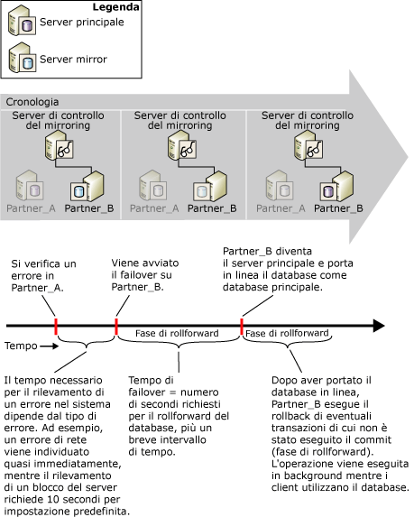

# Stimare l'interruzione del servizio durante il cambio di ruolo (mirroring del database)
[!INCLUDE[appliesto-ss-xxxx-xxxx-xxx-md](../../includes/appliesto-ss-xxxx-xxxx-xxx-md.md)] Durante un cambio di ruolo, l'intervallo di tempo in cui il mirroring del database sarà fuori servizio dipende dal tipo e dalla causa del cambio di ruolo.  
  
-   Per il failover automatico, i fattori che contribuiscono alla durata dell'interruzione del servizio sono due: il tempo necessario perché il server mirror individui l'errore del server principale, ovvero il rilevamento dell'errore, e il tempo necessario per eseguire il failover del database, ovvero il tempo di failover.  
  
-   Per un'operazione di servizio forzato, sebbene si sia verificato un errore, il rilevamento e la risoluzione dell'errore dipendono dalla rapidità dell'intervento umano. La potenziale interruzione del servizio può tuttavia essere stimata pari al tempo necessario al server mirror per il cambio di ruolo dopo l'esecuzione del comando di servizio forzato.  
  
    > [!NOTE]  
    >  Per ridurre il tempo necessario al rilevamento di condizioni specifiche, ad esempio alcuni tipi di errori, è possibile definire avvisi per tali condizioni.  
  
-   Nel caso di un failover manuale, è rilevante solo il tempo richiesto per eseguire il failover del database dopo l'esecuzione del comando di failover.  
  
## Rilevamento dell'errore  
 Il periodo di tempo necessario al sistema per rilevare un errore dipende dal tipo di errore. Ad esempio, un errore di rete viene rilevato quasi istantaneamente, mentre il rilevamento del blocco di un server richiede per impostazione predefinita 10 secondi, ovvero il periodo di timeout predefinito.  
  
 Per informazioni sugli errori che possono causare un esito negativo durante una sessione di mirroring del database e sul rilevamento di timeout in modalità a sicurezza elevata con failover automatico, vedere [Possibili errori durante il mirroring del database](../../database-engine/database-mirroring/possible-failures-during-database-mirroring.md).  
  
## Tempo di failover  
 Il tempo di failover è composto principalmente dal tempo necessario al server mirror precedente per eseguire il rollforward di tutti i log rimanenti nella propria coda rollforward, più un breve tempo aggiuntivo. Per altre informazioni sulla modalità usata dal server mirror per elaborare i record dei log, vedere [Mirroring di database &#40;SQL Server&#41;](../../database-engine/database-mirroring/database-mirroring-sql-server.md). Per informazioni sulla stima del tempo di failover, vedere la sezione Stima del tempo di rollforward durante il failover, più avanti in questo argomento.  
  
> [!IMPORTANT]  
>  Se il failover si verifica durante una transazione in cui viene creato e quindi modificato un indice o una tabella, per il failover può essere necessario un tempo superiore al normale.  Ad esempio, il tempo di failover può aumentare se il failover si verifica durante la serie di operazioni seguente: BEGIN TRANSACTION, CREATE INDEX su una tabella e SELECT INTO sulla tabella. La possibilità di un failover prolungato durante una transazione di questo tipo permane finché la transazione non viene completata con un'istruzione COMMIT TRANSACTION o ROLLBACK TRANSACTION.  
  
### Coda rollforward  
 Il rollforward del database comporta l'applicazione dei record di log presenti nella coda rollforward sul server mirror. La *coda rollforward* contiene i record di log che sono stati scritti su disco nel server mirror ma per i quali non è ancora stato eseguito il rollforward nel database mirror.  
  
 Il tempo di failover per il database dipende dalla velocità con cui il server mirror è in grado di eseguire il rollforward del log nella coda rollforward, a sua volta determinata principalmente dall'hardware di sistema e dal carico di lavoro attuale. È possibile che, a causa di un carico di lavoro estremamente elevato in un database principale, la velocità con la quale il server principale invia il log al server mirror sia molto più elevata rispetto a quella con la quale ne esegue il rollforward. In questo caso, il failover potrebbe richiedere tempi lunghi mentre il server mirror esegue il rollforward del log nella coda rollforward. Per visualizzare le dimensioni correnti della coda rollforward, usare il contatore **Coda rollforward** nell'oggetto prestazioni del mirroring del database. Per altre informazioni, vedere [Oggetto Database Mirroring di SQL Server](../../relational-databases/performance-monitor/sql-server-database-mirroring-object.md).  
  
### Stima del tempo di rollforward durante il failover  
 È possibile misurare il tempo necessario per eseguire il rollforward dei record del log, definito *tempo di rollforward*, usando una copia di prova del database di produzione.  
  
 Il metodo utilizzato per stimare il tempo di rollforward durante il failover dipende dal numero di thread utilizzati dal server mirror durante la fase di rollforward. Il numero di thread dipende dagli elementi seguenti:  
  
-   In [!INCLUDE[ssStandard](../../includes/ssstandard-md.md)]nel server mirror viene utilizzato sempre un thread singolo per eseguire il roll forward del database.  
  
-   In [!INCLUDE[ssEnterprise](../../includes/ssenterprise-md.md)], anche nei server mirror in computer con meno di cinque CPU viene utilizzato unicamente un thread singolo. Con cinque o più CPU, un server mirror distribuisce le operazioni di rollforward a più thread durante un failover. Questa operazione viene definita *rollforward parallelo*. Il rollforward parallelo è ottimizzato per l'utilizzo di un thread ogni quattro CPU.  
  
#### Stima del tempo di rollforward per il rollforward a thread singolo  
 Per il rollforward a thread singolo, il tempo richiesto dal rollforward del database mirror durante il failover è all'incirca uguale al tempo necessario al ripristino di un backup del log per eseguire il rollforward di un log delle stesse dimensioni. Per stimare il tempo di failover, creare un database di prova nell'ambiente in cui si prevede di eseguire il mirroring. Prelevare quindi un backup del log dal database di produzione. Per misurare il tempo di rollforward relativo al backup del log, verificare il tempo necessario per ripristinare il backup del log con WITH NORECOVERY nel database di prova.  
  
 Dopo avere ottenuto il tempo di rollforward del server mirror, è possibile stimare il tempo necessario per eseguire il failover del database a una temporizzazione specifica dividendo le dimensioni del log attuale per il quale dovrà essere eseguito il rollforward nel server mirror (misurate dal contatore delle prestazioni **Coda rollforward** ) per il tempo di rollforward. In condizioni normali, se con il server mirror è possibile far fronte al carico derivante dal server principale, il valore di **Coda rollforward** è piccolo o vicino a zero e un failover richiede pochi secondi.  
  
#### Stima del tempo di rollforward per il rollforward parallelo  
 In [!INCLUDE[ssEnterprise](../../includes/ssenterprise-md.md)]il rollforward parallelo è ottimizzato per l'utilizzo di un thread ogni quattro CPU. Per stimare il tempo di rollforward per il rollforward parallelo, è consigliabile utilizzare un sistema di prova in esecuzione anziché un semplice database di prova. Durante il monitoraggio della coda rollforward sul server mirror, aumentare il carico del server principale. In condizioni normali, il valore del contatore Coda rollforward è vicino a zero. Aumentare il carico del server principale fino a che il valore del contatore Coda rollforward inizia a crescere in modo costante. Il sistema raggiunge quindi il tempo di rollforward massimo e il contatore delle prestazioni **Byte rollforward/sec** a questo punto rappresenta il tempo di rollforward massimo. Per altre informazioni, vedere [Oggetto Database Mirroring di SQL Server](../../relational-databases/performance-monitor/sql-server-database-mirroring-object.md).  
  
## Stima dell'interruzione del servizio durante il failover automatico  
 Nella figura seguente viene illustrato in quale modo il rilevamento dell'errore e il tempo di failover determinano il tempo necessario per il completamento di un failover automatico su **Partner_B**. Il failover richiede un tempo per il rollforward del database (fase di rollforward) più un breve periodo di tempo per portare online il database. La fase di rollback, che prevede l'esecuzione del rollback per tutte le transazioni di cui non è stato eseguito il commit, si verifica dopo che il nuovo database principale viene portato online e prosegue dopo il failover. Durante la fase di rollback, il database è disponibile.  
  
   
  
## Vedere anche  
 [Modalità di funzionamento del mirroring del database](../../database-engine/database-mirroring/database-mirroring-operating-modes.md)   
 [Cambio di ruolo durante una sessione di mirroring del database &#40;SQL Server&#41;](../../database-engine/database-mirroring/role-switching-during-a-database-mirroring-session-sql-server.md)   
 [Monitoraggio del mirroring del database &#40;SQL Server&#41;](../../database-engine/database-mirroring/monitoring-database-mirroring-sql-server.md)  
  
  
