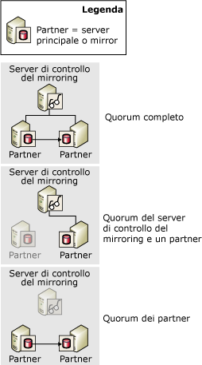
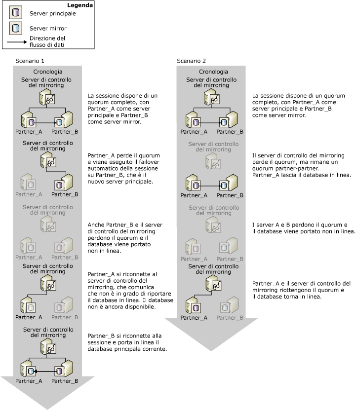

# Quorum: Impatto di un server di controllo del mirroring sulla disponibilità del database (mirroring del database)
[!INCLUDE[appliesto-ss-xxxx-xxxx-xxx-md](../../includes/appliesto-ss-xxxx-xxxx-xxx-md.md)] Ogni volta che viene impostato un server di controllo del mirroring per una sessione di mirroring del database, è necessario che esista il *quorum*. Il quorum è una relazione esistente quando due o più istanze del server in una sessione di mirroring del database sono connesse l'una all'altra. In genere, un quorum coinvolge tre istanze del server interconnesse. Quando è impostato un server di controllo del mirroring, il quorum è necessario per rendere disponibile il database. Progettato per la modalità a protezione elevata con failover automatico, il quorum garantisce che un database sia di proprietà di un singolo partner alla volta.  
  
 Se un'istanza del server specifica viene disconnessa da una sessione di mirroring, perde il quorum. In assenza di istanze del server connesse, la sessione perde il quorum e il database non è più disponibile. Sono possibili tre tipi di quorum:  
  
-   Un *quorum completo* include sia i partner che il server di controllo del mirroring.  
  
-   Un *quorum server di controllo del mirroring-partner* è costituito dal server di controllo del mirroring e da uno dei partner.  
  
-   Un *quorum partner-partner* è costituito dai due partner.  
  
 Nella figura seguente vengono illustrati questi tipi di quorum.  
  
   
  
 Finché il server principale corrente mantiene il quorum, detiene il ruolo di server principale e continua a rendere disponibile il database, a meno che il proprietario del database non esegua un failover manuale. Se il server principale perde il quorum, smette di rendere disponibile il database. Il failover automatico può essere eseguito solo se il database principale perde il quorum, in modo da garantire che non renda più disponibile il database.  
  
 Un'istanza del server disconnessa salva il relativo ruolo più recente nella sessione. In genere, un'istanza del server disconnessa si riconnette alla sessione quando viene riavviata e riacquisisce il quorum.  
  
> [!IMPORTANT]  
>  Il server di controllo del mirroring deve essere impostato solo quando si intende utilizzare la modalità a protezione elevata con failover automatico. Nella modalità a prestazioni elevate, che non richiede mai un server di controllo del mirroring, è consigliabile impostare la proprietà WITNESS su OFF. Per informazioni relative all'impatto di un server di controllo del mirroring sulla modalità a prestazioni elevate, vedere [Modalità di funzionamento del mirroring del database](../../database-engine/database-mirroring/database-mirroring-operating-modes.md).  
  
## Quorum in sessioni in modalità a protezione elevata  
 In modalità a protezione elevata, il quorum consente il failover automatico in quanto rende disponibile un contesto in cui il partner proprietario del ruolo di server principale è determinato dalle istanze del server con quorum. Il server principale rende disponibile il database se dispone del quorum. Se il server principale perde il quorum mentre il server mirror e il server di controllo del mirroring sincronizzati mantengono il quorum, viene eseguito il failover automatico.  
  
 I tipi di quorum possibili per la modalità a protezione elevata sono i seguenti:  
  
-   Un *quorum completo* costituito da entrambi i partner e dal server di controllo del mirroring.  
  
     In circostanze normali tutte e tre le istanze del server prendono parte a un quorum a tre vie, denominato *quorum completo*. Con un quorum completo, il server principale e il server mirror continuano a svolgere i rispettivi ruoli, a meno che non si verifichi un failover manuale.  
  
-   Un quorum *server di controllo del mirroring-partner* costituito dal server di controllo del mirroring e da uno dei partner.  
  
     Se la connessione di rete tra i partner si interrompe perché uno di essi non è più raggiungibile, possono verificarsi i casi seguenti:  
  
    -   La connessione con il server mirror viene persa e il server principale e il server di controllo del mirroring mantengono il quorum.  
  
         In questo caso, il server principale imposta il relativo database su DISCONNECTED e viene eseguito con il mirroring in stato SUSPENDED. Questa condizione viene definita *esecuzione senza mirroring* perché il mirroring del database attualmente non viene eseguito. Quando il server mirror parteciperà di nuovo alla sessione, riacquisirà il quorum come mirror e avvierà la risincronizzazione della propria copia del database.  
  
    -   La connessione con il server principale viene persa e il server mirror e il server di controllo del mirroring mantengono il quorum.  
  
         In questo caso, viene eseguito il failover automatico. Per altre informazioni, vedere [Database Mirroring Operating Modes](../../database-engine/database-mirroring/database-mirroring-operating-modes.md).  
  
    -   Il quorum viene perso da tutte le istanze del server, ma successivamente vengono riconnessi il mirroring e il server di controllo del mirroring. In questo caso, il database non verrà utilizzato.  
  
     In rari casi, la connessione di rete tra i partner di failover si interrompe anche se entrambi rimangono connessi al server di controllo del mirroring. In questa circostanza esistono due quorum separati "server di controllo del mirroring-partner", con il server di controllo del mirroring che funge da legame. Il server di controllo del mirroring informa il server mirror che il server principale è ancora connesso, pertanto il failover automatico non viene eseguito. Il server mirror, invece, mantiene il relativo ruolo e attende di riconnettersi al server principale. Se in questa fase la coda di rollforward include record del log, il server mirror continua a eseguire il rollforward del database mirror. In fase di riconnessione, il server mirror ripeterà la sincronizzazione del database mirror.  
  
-   Un quorum *partner-partner* costituito dai due partner.  
  
     Finché i partner mantengono il quorum, il database rimane in stato SYNCHRONIZED e il failover manuale è possibile. Senza il server di controllo del mirroring, il failover automatico non è possibile. Quando invece il server di controllo del mirroring riacquisisce il quorum, la sessione riprende a funzionare in modo normale e il failover automatico è di nuovo supportato.  
  
-   La sessione perde il quorum.  
  
     Se tutte le istanze del server vengono disconnesse le une dalle altre, si dice che la sessione ha *perso il quorum*. A mano a mano che le istanze del server si riconnettono le une alle altre, riacquisiscono il quorum.  
  
    -   Se il server principale si riconnette a una delle altre istanze del server, il database diventa disponibile.  
  
    -   Se il server principale rimane disconnesso mentre il server mirror e il server di controllo del mirroring si riconnettono l'uno all'altro, il failover automatico non può essere eseguito perché si potrebbe verificare una perdita di dati. Il database non sarà pertanto disponibile fino a quando il server principale non parteciperà di nuovo alla sessione.  
  
    -   Quando tutte e tre le istanze del server si riconnettono, viene riacquisito il quorum completo e la sessione riprende a funzionare in modo normale.  
  
> [!IMPORTANT]  
>  Una sessione che dispone di un quorum "partner-partner" perde il quorum quando uno dei due partner perde il quorum. Se si prevede che il server di controllo del mirroring rimarrà disconnesso per un lungo periodo di tempo, è pertanto consigliabile rimuovere temporaneamente tale server dalla sessione. La rimozione del server di controllo del mirroring comporta l'annullamento del requisito del quorum. Se quindi il server mirror viene disconnesso, il server principale potrà continuare a rendere disponibile il database. Per informazioni sull'aggiunta o sulla rimozione di un server di controllo del mirroring, vedere [Server di controllo del mirroring del database](../../database-engine/database-mirroring/database-mirroring-witness.md).  
  
### Impatto del quorum sulla disponibilità del database  
 Nella figura seguente viene illustrato il modo in cui il server di controllo del mirroring e i partner interagiscono per garantire che in qualsiasi momento un singolo partner sia il proprietario del ruolo di server principale e che solo il server principale corrente sia in grado di attivare la modalità online per il database. In entrambi questi scenari inizialmente esiste un quorum completo e i ruoli di server principale e di server mirror sono svolti rispettivamente da **Partner_A** e **Partner_B** .  
  
   
  
 Lo scenario 1 viene illustra come, dopo un errore del server principale originale (**Partner_A**), il server di controllo del mirroring e il server mirror stabiliscono che il server principale **Partner_A**non è più disponibile e formano il quorum. Il server mirror **Partner_B** assume quindi il ruolo di server principale. Viene eseguito il failover automatico e **Partner_B**attiva la modalità online per la propria copia del database. **Partner_B** diventa quindi inattivo e il database risulta offline. Il server principale precedente, ovvero **Partner_A**, successivamente si riconnette al server di controllo del mirroring riottenendo il quorum. Comunicando con il server di controllo del mirroring, **Partner_A** rileva tuttavia che non potrà attivare la modalità online per la propria copia del database perché **Partner_B** è l'attuale proprietario del ruolo di server principale. Quando **Partner_B** parteciperà di nuovo alla sessione, riattiverà la modalità online per il database.  
  
 Nello scenario 2 il server di controllo del mirroring perde il quorum, mentre i partner **Partner_A** e **Partner_B**mantengono il quorum l'uno nei confronti dell'altro e il database rimane online. Il quorum viene quindi perso anche dai partner e il database risulta offline. Il server principale, ovvero **Partner_A**, successivamente si riconnette al server di controllo del mirroring riottenendo il quorum. Il server di controllo del mirroring conferma che il ruolo di server principale appartiene ancora a **Partner_A** e **Partner_A** riattiva la modalità online per il database.  
  
## Vedere anche  
 [Modalità di funzionamento del mirroring del database](../../database-engine/database-mirroring/database-mirroring-operating-modes.md)   
 [Cambio di ruolo durante una sessione di mirroring del database &#40;SQL Server&#41;](../../database-engine/database-mirroring/role-switching-during-a-database-mirroring-session-sql-server.md)   
 [Server di controllo del mirroring del database](../../database-engine/database-mirroring/database-mirroring-witness.md)   
 [Possibili errori durante il mirroring del database](../../database-engine/database-mirroring/possible-failures-during-database-mirroring.md)   
 [Stati di mirroring &#40;SQL Server&#41;](../../database-engine/database-mirroring/mirroring-states-sql-server.md)  
  
  
