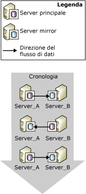
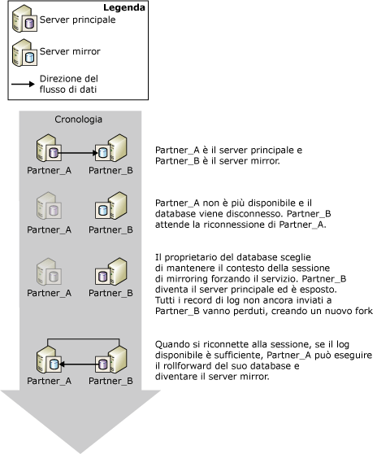

# Cambio di ruolo durante una sessione di mirroring del database (SQL Server)
[!INCLUDE[appliesto-ss-xxxx-xxxx-xxx-md](../../includes/appliesto-ss-xxxx-xxxx-xxx-md.md)] Nel contesto di una sessione di mirroring del database, in genere i ruoli principale e mirror sono intercambiabili tramite un processo denominato *cambio di ruolo*. Nel cambio di ruolo, il server mirror funge da *partner di failover* per il server principale, assumendo il ruolo principale e recuperando la propria copia del database e portandola online come nuovo database principale. Il server principale precedente, quando disponibile, assume il ruolo di mirror, e il suo database diventa il nuovo database mirror. Potenzialmente, i ruoli possono essere scambiati nei due sensi in seguito a più errori o per scopi amministrativi.  
  
> [!NOTE]  
>  In questo argomento si parte dal presupposto che l'utente conosca le modalità operative per il mirroring del database. Per altre informazioni, vedere [Database Mirroring Operating Modes](../../database-engine/database-mirroring/database-mirroring-operating-modes.md).  
  
 La figura seguente illustra i partner di mirroring, **Partner_A** e **Partner_B**, che eseguono lo scambio dei ruoli principale e mirror su una serie di failover automatici o manuali.  
  
   
  
> [!IMPORTANT]  
>  Dopo un cambio di ruolo, i processi eseguiti nel precedente database principale devono essere ricreati sul nuovo server principale affinché possano essere eseguiti nella nuova posizione. Per altre informazioni, vedere [Gestione di account di accesso e di processi dopo un cambio di ruolo &#40;SQL Server&#41;](../../sql-server/failover-clusters/management-of-logins-and-jobs-after-role-switching-sql-server.md).  
  
 Esistono tre forme di cambio di ruolo: failover automatico, failover manuale e servizio forzato (con possibile perdita di dati). Il supporto di ogni forma dipende dalla modalità operativa della sessione.  
  
> [!NOTE]  
>  Se non si ha familiarità con queste modalità operative, vedere [Modalità di funzionamento del mirroring del database](../../database-engine/database-mirroring/database-mirroring-operating-modes.md).  
  
-   **Failover manuale**  
  
     Con la modalità a sicurezza elevata è supportato il failover manuale. A ogni sincronizzazione del database, il proprietario del database può avviare un failover manuale.  
  
     Il failover manuale è disponibile a scopo di amministrazione. Per altre informazioni, vedere [Failover manuale](#ManualFailover)più avanti in questo argomento.  
  
-   **Failover automatico**  
  
     In presenza di un server di controllo del mirroring, con la modalità a sicurezza elevata è supportato il failover automatico. Il failover automatico si verifica solo in caso di perdita del server principale se il server di controllo del mirroring e il server mirror sono ancora connessi tra loro e il database è già sincronizzato. Per altre informazioni, vedere [Failover automatico](#AutomaticFailover)più avanti in questo argomento.  
  
-   **Servizio forzato (con possibile perdita di dati)**  
  
     L'utilizzo forzato del servizio è supportato in modalità a sicurezza elevata quando nessun server di controllo del mirroring è impostato e in modalità a prestazioni elevate. Quando il server principale viene perso, il proprietario del database può rendere il database disponibile forzando il servizio per il server mirror (con possibile perdita di dati).  
  
    > [!NOTE]  
    >  È consigliabile impostare la proprietà WITNESS su OFF in modalità a prestazioni elevate. In caso contrario, per portare il database online, è necessario che il server mirror sia connesso al server di controllo del mirroring.  
  
     Per altre informazioni, vedere [Servizio forzato (con possibile perdita di dati)](#ForcedService)più avanti in questo argomento.  
  
 Nella tabella seguente viene presentato un riepilogo delle forme di failover supportate in ognuna delle modalità operative.  
  
||Prestazioni elevate|Modalità a sicurezza elevata senza un server di controllo del mirroring|Modalità a sicurezza elevata con un server di controllo del mirroring|  
|-|----------------------|-----------------------------------------|--------------------------------------|  
|Failover automatico|no|no|Sì|  
|Failover manuale|no|Sì|Sì|  
|Servizio forzato|Sì|Sì|no|  
  
 Dopo un cambio di ruolo è necessario che alcuni metadati siano disponibili su entrambi i partner per garantire che tutti gli utenti del database possano accedere al nuovo database principale. È inoltre necessario che i processi di backup vengano creati sul nuovo server principale per garantire che i backup del database continuino regolarmente in base alla pianificazione. Per altre informazioni, vedere [Gestione di account di accesso e di processi dopo un cambio di ruolo &#40;SQL Server&#41;](../../sql-server/failover-clusters/management-of-logins-and-jobs-after-role-switching-sql-server.md).  
  
 Durante un cambio di ruolo, il periodo di tempo durante il quale il mirroring del database non sarà disponibile dipende dal tipo e dalla causa del cambio di ruolo. Per altre informazioni, vedere [Stimare l'interruzione del servizio durante il cambio di ruolo &#40;mirroring del database&#41;](../../database-engine/database-mirroring/estimate-the-interruption-of-service-during-role-switching-database-mirroring.md).  
  
##   Manual Failover  
 Il failover manuale disconnette i client dal database e inverte i ruoli dei partner. Solo la modalità a sicurezza elevata supporta il failover manuale.  
  
 **Contenuto della sezione**  
  
-   [Mantenimento della disponibilità durante gli aggiornamenti](#AvailabilityDuringUpgrades)  
  
-   [Condizioni necessarie per un failover manuale](#ConditionsForManualFo)  
  
-   [Funzionamento del failover manuale](#HowManualFoWorks)  
  
###   Mantenimento della disponibilità durante gli aggiornamenti  
 L'amministratore del database può utilizzare il failover manuale per aggiornare l'hardware o il software senza ridurre la disponibilità. Per eseguire aggiornamenti del software mediante il mirroring del database, è necessario che il server mirror e/o il sistema ricevano precedentemente gli aggiornamenti.  
  
> [!NOTE]  
>  Il mirroring del database dovrebbe consentire l'esecuzione di un aggiornamento in sequenza. Questo non è tuttavia garantito poiché le modifiche future non sono ancora note. Per altre informazioni, vedere [Upgrading Mirrored Instances](../../database-engine/database-mirroring/upgrading-mirrored-instances.md)(Aggiornamento di istanze con mirroring).  
  
 Nella figura seguente è illustrato un esempio di utilizzo del failover manuale per mantenere la disponibilità del database mentre si aggiorna un'istanza del server di database. Al termine dell'aggiornamento, un amministratore può eseguire facoltativamente il failover all'istanza del server originale. Questa operazione è utile se l'amministratore desidera arrestare la sessione di mirroring e utilizzare il server mirror in un'altra posizione. In questo modo, è possibile utilizzare ripetutamente una singola istanza del server per aggiornare una serie di istanze del server di database.  
  
   
  
###   Condizioni necessarie per un failover manuale  
 Per il failover manuale, è necessario che il livello di protezione delle transazioni sia impostato su FULL (ovvero in modalità a protezione elevata). Se i partner sono connessi e il database è già sincronizzato, è supportato il failover manuale.  
  
###   Funzionamento del failover manuale  
 Il failover manuale inizia la sequenza di azioni seguente:  
  
1.  Il server principale disconnette i client dal database principale, invia la parte finale del log al server mirror e, in vista del passaggio al ruolo di server mirror, imposta lo stato di mirroring su SYNCHRONIZING.  
  
2.  Il server mirror registra il numero di sequenza del file di log (LSN) relativo all'ultimo record del log ricevuto dal server principale come LSN di failover.  
  
    > [!NOTE]  
    >  Per visualizzare questo LSN, selezionare la colonna **mirroring_failover_lsn** da [sys.database_mirroring &#40;Transact-SQL&#41;](../../relational-databases/system-catalog-views/sys-database-mirroring-transact-sql.md).  
  
3.  Se un log è in attesa nella coda di rollforward, il server mirror termina il rollforward del database mirror. La quantità di tempo necessaria varia in base alla velocità del sistema, al carico di lavoro recente e alle dimensioni del log nella coda di rollforward. Per la modalità operativa sincrona, è possibile regolare il tempo di failover limitando le dimensioni della coda di rollforward. Tale operazione, tuttavia, può causare un rallentamento del server principale a vantaggio della velocità del server mirror.  
  
    > [!NOTE]  
    >  Per visualizzare le dimensioni correnti della coda di rollforward, usare il contatore delle prestazioni **Redo Queue** (Coda di rollforward) nell'oggetto prestazioni del mirroring del database. Per altre informazioni, vedere [Monitoraggio del mirroring del database &#40;SQL Server&#41;](../../database-engine/database-mirroring/monitoring-database-mirroring-sql-server.md).  
  
4.  Il server mirror diventa il nuovo server principale, mentre il server principale precedente diventa il nuovo server mirror.  
  
5.  Il nuovo server principale esegue il rollback delle eventuali transazioni di cui non è stato eseguito il commit e porta online la copia interna del database come database principale.  
  
6.  Il server principale precedente assume il ruolo di server mirror e il database principale precedente diventa il database mirror. Il nuovo server mirror risincronizza rapidamente il nuovo database mirror con il nuovo database principale.  
  
    > [!NOTE]  
    >  Nell'istante stesso in cui il nuovo server mirror ha ristabilito la sincronizzazione dei database, il failover è nuovamente possibile, stavolta nella direzione inversa.  
  
 Dopo il failover, i client devono riconnettersi al database principale corrente. Per altre informazioni, vedere [Connettere client a una sessione di mirroring del database &#40;SQL Server&#41;](../../database-engine/database-mirroring/connect-clients-to-a-database-mirroring-session-sql-server.md).  
  
 **Per iniziare il failover manuale**  
  
-   [Failover manuale di una sessione di mirroring del database &#40;SQL Server Management Studio&#41;](../../database-engine/database-mirroring/manually-fail-over-a-database-mirroring-session-sql-server-management-studio.md)  
  
-   [Failover manuale in una sessione di mirroring del database &#40;Transact-SQL&#41;](../../database-engine/database-mirroring/manually-fail-over-a-database-mirroring-session-transact-sql.md).  
  
##   Automatic Failover  
 Il failover automatico è supportato esclusivamente nelle sessioni di mirroring del database in esecuzione con un server di controllo del mirroring in modalità a protezione elevata (*modalità a protezione elevata con failover automatico*). In modalità a protezione elevata con failover automatico, dopo la sincronizzazione del database, se il database principale risulta non disponibile, si verifica un failover automatico. In seguito a questo processo, il server mirror assume il ruolo di server principale e attiva la modalità online per la propria copia del database come database principale. La sincronizzazione del database impedisce la perdita di dati durante il failover, poiché per ogni transazione di cui è stato eseguito il commit nel database principale viene eseguito il commit anche nel database mirror.  
  
> [!IMPORTANT]  
>  Affinché il failover automatico garantisca una maggiore affidabilità, è necessario che il database mirror e principale si trovino in computer diversi.  
  
 **Contenuto della sezione**  
  
-   [Condizioni necessarie per un failover automatico](#ConditionsForAutoFo)  
  
-   [Funzionamento del failover automatico](#HowAutoFoWorks)  
  
-   [Per disabilitare il failover automatico (SQL Server Management Studio)](#DisableAutoSSMS)  
  
-   [Per disabilitare il failover automatico (Transact-SQL)](#DisableAutoTsql)  
  
###   Condizioni necessarie per un failover automatico  
 Per l'esecuzione del failover automatico è necessario che si verifichino le condizioni seguenti:  
  
-   La sessione di mirroring del database deve essere in esecuzione in modalità a protezione elevata e deve disporre di un server di controllo del mirroring. Per altre informazioni, vedere [Database Mirroring Operating Modes](../../database-engine/database-mirroring/database-mirroring-operating-modes.md).  
  
-   Il database mirror deve essere già stato sincronizzato. Questa condizione garantisce che il log inviato al server mirror sia stato interamente scritto su disco.  
  
-   Le comunicazioni tra il server principale e gli altri componenti della configurazione di mirroring del database sono state interrotte, mentre il server mirror e il server di controllo del mirroring mantengono il quorum. Tuttavia, se si interrompe la comunicazione tra tutte le istanze del server e in un momento successivo il server di controllo del mirroring e il server mirror tornano a comunicare, il failover automatico non si verifica.  
  
    > [!NOTE]  
    >  Per altre informazioni, vedere [Quorum: Impatto di un server di controllo del mirroring sulla disponibilità del database &#40;mirroring del database&#41;](../../database-engine/database-mirroring/quorum-how-a-witness-affects-database-availability-database-mirroring.md).  
  
-   Il server mirror ha rilevato la perdita del server principale.  
  
     La modalità in base a cui il server mirror rileva un errore del server principale varia a seconda che si tratti di un errore hardware o software. Per altre informazioni, vedere [Possibili errori durante il mirroring del database](../../database-engine/database-mirroring/possible-failures-during-database-mirroring.md).  
  
###   Funzionamento del failover automatico  
 Se le condizioni riportate sopra sono soddisfatte, il failover automatico avvia la sequenza di azioni seguente:  
  
1.  Se il server principale è ancora in esecuzione, lo stato del database principale cambia in DISCONNECTED e tutti i client vengono disconnessi dal database principale.  
  
2.  Il server di controllo del mirroring e il server mirror rilevano che il server principale non è disponibile.  
  
3.  Se un log è in attesa nella coda di rollforward, il server mirror termina il rollforward del database mirror.  
  
    > [!NOTE]  
    >  La quantità di tempo necessaria per applicare il log varia in base alla velocità del sistema, al carico di lavoro recente e alle dimensioni del log nella coda di rollforward.  
  
4.  Viene attivata la modalità online per il database mirror precedente come nuovo database principale, mentre la procedura di recupero elimina tutte le transazioni di cui non è stato eseguito il commit eseguendone il rollback il più rapidamente possibile. Vengono utilizzati blocchi per isolare tali transazioni.  
  
5.  Quando il server principale precedente partecipa nuovamente alla sessione, esso rileva che ora è il proprio partner di failover a detenere il ruolo di server principale. Il server principale precedente assume il ruolo di server mirror, rendendo la propria copia del database il nuovo database mirror. Il nuovo server mirror provvede il più rapidamente possibile a sincronizzare il nuovo database mirror con il database principale. Nell'istante stesso in cui il nuovo server mirror ha ristabilito la sincronizzazione dei database, il failover è nuovamente possibile, stavolta nella direzione inversa.  
  
 Nella figura seguente viene illustrata una singola istanza di failover automatico.  
  
   
  
 La sessione ha inizialmente un quorum completo, ovvero tutti e tre i server sono connessi. **Partner_A** è il server principale e **Partner_B** il server mirror. **Partner_A** , o il database principale del **Partner_A**, diventa non disponibile. Sia il server di controllo del mirroring che **Partner_B** rilevano che il server principale non è più disponibile e la sessione mantiene il quorum. **Partner_B** diviene il server principale e rende disponibile la propria copia del database come nuovo database principale. Quando si riconnette alla sessione, **Partner_A** individua che **Partner_B** detiene ora il ruolo di server principale. **Partner_A** assume quindi il ruolo di server mirror.  
  
 Dopo il failover, i client devono riconnettersi al database principale corrente. Per altre informazioni, vedere [Connettere client a una sessione di mirroring del database &#40;SQL Server&#41;](../../database-engine/database-mirroring/connect-clients-to-a-database-mirroring-session-sql-server.md).  
  
> [!NOTE]  
>  Le transazioni che sono state preparate utilizzando [!INCLUDE[msCoName](../../includes/msconame-md.md)] Distributed Transaction Coordinator, ma di cui non è stato ancora eseguito il commit nel momento in cui si verifica un failover, vengono considerate interrotte dopo il failover del database.  
  
###   Per disabilitare il failover automatico (SQL Server Management Studio)  
 Aprire la pagina **Proprietà database - Mirroring** e cambiare la modalità operativa selezionando una delle opzioni seguenti:  
  
-   **Protezione elevata senza failover automatico (sincrona)**  
  
     In questa modalità il database continua a essere sincronizzato e il failover manuale rimane possibile.  
  
-   **Prestazioni elevate (asincrona)**  
  
     In questa modalità il database mirror potrebbe avere un certo ritardo rispetto al database principale e il failover manuale non è più possibile.  
  
###   Per disabilitare il failover automatico (Transact-SQL)  
 In un punto qualsiasi di una sessione di mirroring del database, il proprietario del database può disabilitare il failover automatico disabilitando il server di controllo del mirroring.  
  
 **Per disabilitare il server di controllo del mirroring**  
  
-   [Rimuovere il server di controllo del mirroring da una sessione di mirroring del database &#40;SQL Server&#41;](../../database-engine/database-mirroring/remove-the-witness-from-a-database-mirroring-session-sql-server.md)  
  
    > [!NOTE]  
    >  Se si disabilita il server di controllo del mirroring mentre resta attiva la protezione completa delle transazioni, la sessione passa in modalità a protezione elevata senza failover automatico.  
  
##   Forced Service (with Possible Data Loss)  
 Il mirroring del database include l'utilizzo forzato del servizio (con possibile perdita di dati) come metodo di ripristino di emergenza per consentire l'utilizzo di un server mirror come server warm standby. Il servizio forzato è possibile solo se il server principale è disconnesso dal server mirror in una sessione di mirroring. Dato che l'utilizzo forzato del servizio determina il rischio di possibili perdite di dati, è consigliabile utilizzarlo con cautela e quando strettamente necessario.  
  
 Il supporto per l'utilizzo forzato del servizio dipende dalla modalità operativa e dallo stato della sessione, come segue:  
  
-   In genere, la modalità a prestazioni elevate supporta l'utilizzo forzato del servizio ogniqualvolta il server principale è disconnesso. Sebbene non sia necessario, è tuttavia possibile che un server di controllo del mirroring sia presente per una sessione in modalità a prestazioni elevate. In questo caso, l'utilizzo forzato del servizio richiede che il server mirror e il server di controllo del mirroring siano connessi tra loro.  
  
-   La modalità a protezione elevata senza failover automatico supporta l'utilizzo forzato del servizio ogniqualvolta il server principale è disconnesso.  
  
-   La modalità a protezione elevata con failover automatico supporta l'utilizzo forzato del servizio ogniqualvolta il server mirror e il server di controllo del mirroring sono connessi tra loro e nessuno dei due è connesso al server principale, a condizione che sul server mirror non sia in corso il rollback del database mirror al momento dell'ultima connessione al server principale.  
  
 È consigliabile forzare il servizio solo se è necessario ripristinare immediatamente il servizio sul database e si è disposti a rischiare la perdita di dati. L'utilizzo forzato del servizio ha un effetto analogo alla rimozione del mirroring, ad eccezione del fatto che semplifica la risincronizzazione dei database quando il mirroring viene ripreso, con rischio di possibile perdita di dati. L'utilizzo forzato del servizio avvia una transizione uniforme del ruolo principale al database mirror. Il server mirror assume il ruolo di server principale e rende immediatamente disponibile la propria copia del database ai client. Il nuovo database principale viene eseguito senza un mirror, ovvero senza mirroring.  
  
> [!IMPORTANT]  
>  Se il server principale è stato semplicemente disconnesso dalla sessione di mirroring del database ed è ancora in esecuzione, è possibile che alcuni client continuino ad accedere al database principale originale. Dopo aver forzato il servizio, è importante impedire ai client l'accesso al server principale originale. In caso contrario, dopo l'utilizzo forzato del servizio, è possibile che il database principale originale e il database principale corrente vengano aggiornati in modo indipendente l'uno dall'altro.  
  
 **Contenuto della sezione**  
  
-   [Caso tipico di utilizzo forzato del servizio](#TypicalCaseFS)  
  
-   [Rischi correlati all'utilizzo forzato del servizio](#FSrisks)  
  
-   [Gestione della potenziale perdita di dati](#ManageDataLoss)  
  
-   [Attività correlate alla gestione di un forzato Failover](#RelatedTasksForFS)  
  
###   Caso tipico di utilizzo forzato del servizio  
 Nella figura seguente viene illustrato un caso tipico di utilizzo forzato del servizio (con possibile perdita di dati).  
  
   
  
 Come illustrato nella figura, il server principale originale, **Partner_A**, diventa non disponibile per il server mirror, **Partner_B**, causando la disconnessione del database mirror. Dopo aver verificato che **Partner_A** non è disponibile ai client, l'amministratore del database forza il servizio, con possibilità di perdita di dati, su **Partner_B**. **Partner_B** diventa il server principale e viene eseguito con il database *esposto* , ovvero senza mirroring. A questo punto, i client possono riconnettersi a **Partner_B**.  
  
 Quando **Partner_A** diventa disponibile, riconnette il nuovo server principale, si riconnette alla sessione e assume il ruolo di mirror. La sessione di mirroring viene sospesa immediatamente, senza sincronizzazione del nuovo database mirror. La sospensione della sessione consente all'amministratore del database di decidere se riprendere la sessione o, in casi estremi, rimuovere il mirroring e tentare di salvare i dati dal database principale precedente. In questo caso, l'amministratore del database sceglie di riprendere il mirroring. A questo punto, **Partner_A** assume il ruolo di server mirror ed esegue il rollback del database principale originale dal momento dell'ultima transazione sincronizzata eseguita correttamente. Eventuali transazioni con commit che non siano state scritte sul disco del server mirror prima dell'utilizzo forzato del servizio vengono perdute. **Partner_A** esegue quindi il rollforward del nuovo database mirror applicando eventuali modifiche apportate al nuovo database principale dal momento in cui il server mirror precedente è diventato il nuovo server principale.  
  
> [!NOTE]  
>  Sebbene la modalità a prestazioni elevate non ne richieda la presenza, se un server di controllo del mirroring è configurato, è possibile forzare il servizio solo se il server di controllo del mirroring è attualmente connesso al server mirror.  
  
###   Rischi correlati all'utilizzo forzato del servizio  
 È fondamentale comprendere che l'utilizzo forzato del servizio può causare la perdita di dati. La perdita di dati è possibile in quanto il server mirror non è in grado di comunicare con il server principale e pertanto non può garantire che i due database siano sincronizzati. L'utilizzo forzato del servizio comporta l'avvio di un nuovo fork di recupero. Poiché il database principale originale e il database mirror si trovano su fork di recupero diversi, ogni database includerà i dati che l'altro database non include. Il database principale originale include tutte le modifiche non inviate al database mirror precedente dalla sua coda di invio (il log non inviato). Il database mirror precedente include tutte le modifiche apportate dopo che il servizio è stato forzato.  
  
 Se il servizio viene forzato a causa di un errore del server principale, la potenziale perdita di dati dipende dal fatto che uno o più log delle transazioni non siano stati inviati al server mirror prima dell'errore. In modalità a protezione elevata, questo è possibile solo finché il database mirror viene sincronizzato. In modalità a prestazioni elevate, è sempre possibile la presenza di log non inviato accumulato.  
  
 Le implicazioni dell'utilizzo forzato del servizio dipendono in parte dal fatto che la sessione disponga o meno di un server di controllo del mirroring:  
  
-   In sua assenza, è possibile forzare il servizio se i partner vengono disconnessi, ad esempio, perché la relativa connessione di rete si interrompe. Se il server principale originale è ancora in esecuzione, entrambi i partner sono proprietari del ruolo principale. I client che si connettono al nuovo server principale avranno accesso alla versione corrente del database, mentre i client che si connettono al server principale originale avranno accesso al database principale originale. Questa situazione aumenta il rischio di perdita di dati. Se ai partner è consentita la riconnessione, il server principale originale assume il ruolo di mirror e modifica lo stato del proprio database impostandolo su "recupero in corso," prima della sospensione del mirroring. Se la sessione viene ripresa, le transazioni sul database principale originale i cui log si trovavano nella coda di invio al momento della disconnessione più recente vanno perdute. Vanno inoltre perdute eventuali transazioni verificatesi dopo l'utilizzo forzato del servizio.  
  
-   In presenza di un server di controllo del mirroring, se il server mirror viene disconnesso dal server principale e dal server di controllo del mirroring, finché questi ultimi rimangono connessi tra loro, il server principale è in esecuzione senza mirroring. Se il server principale viene quindi disconnesso dal server di controllo del mirroring, smette di interagire con il database. Se successivamente il server mirror si riconnette al server di controllo del mirroring, diventa possibile l'utilizzo forzato del servizio. Se il servizio viene forzato, tutte le modifiche apportate mentre il server principale originale era in esecuzione senza mirroring verranno perdute, se il server principale originale viene riconnesso.  
  
 Per altre informazioni, vedere [Gestione della potenziale perdita di dati](#ManageDataLoss)più avanti in questo argomento.  
  
###   Gestione della potenziale perdita di dati  
 Dopo l'utilizzo forzato del servizio, quando il server principale precedente è disponibile e supponendo che il relativo database non sia danneggiato, è possibile tentare di gestire la potenziale perdita di dati. La tecnica disponibile per la gestione della potenziale perdita di dati dipende dal fatto che il server principale originale sia stato riconnesso al relativo partner e si sia ricollegato alla sessione di mirroring. Supponendo che il server principale originale possa accedere alla nuova istanza principale, la riconnessione avviene in modo automatico e trasparente.  
  
#### Il server principale originale si è riconnesso  
 In genere, dopo un errore, al riavvio, il server principale originale si riconnette rapidamente al proprio partner. Alla riconnessione, il server principale originale diventa il server mirror. Il relativo database diventa il database mirror e assume lo stato di recupero prima che la sessione venga sospesa. Per il database mirror non verrà eseguito il rollback a meno che non venga ripreso il mirroring.  
  
 Il database in fase di recupero è tuttavia inaccessibile, pertanto non è possibile verificarlo per valutare i dati che andrebbero perduti in caso di ripresa del mirroring. Pertanto, la decisione relativa alla ripresa o alla rimozione del mirroring dipende dal fatto che sia accettabile o meno l'eventuale perdita di dati.  
  
-   Se la perdita di dati non è accettabile, rimuovere il mirroring per salvare i dati.  
  
     La rimozione del mirroring consentirà all'amministratore del database di recuperare il database principale originale e di tentare di recuperare i dati a rischio di perdita. Tuttavia, quando il database mirror precedente torna online, i partner precedenti interagiranno con database divergenti con lo stesso nome. L'amministratore del database deve rendere uno dei database inaccessibile ai client per evitare ulteriori divergenze del database e per impedire problemi di failover dei client.  
  
-   Se la perdita di dati è accettabile, è possibile riprendere il mirroring.  
  
     La ripresa del mirroring determina il rollback del nuovo database mirror come primo passaggio della sincronizzazione del database. Se nella coda di invio erano in attesa record di log al momento dell'errore, le transazioni corrispondenti vengono perdute, anche se con commit.  
  
#### Il server principale originale non si è riconnesso  
 Se è possibile impedire temporaneamente la riconnessione sulla rete del server principale originale al nuovo server principale, è possibile esaminare il server principale originale per valutare quali dati andrebbero perduti in caso di ripresa del mirroring.  
  
-   Contesti in cui la perdita di dati è accettabile  
  
     Consentire la riconnessione al partner del server principale originale. La riconnessione determina la sospensione del mirroring. Per procedere con il mirroring, riprendere la sessione. Il server principale precedente assume il ruolo di mirror. Il nuovo server mirror elimina il fork di recupero originale, perdendo eventuali transazioni non inviate o ricevute dal server mirror precedente.  
  
-   Contesti in cui la perdita di dati non è ammissibile  
  
     Se il database principale originale contiene dati critici che andrebbero persi in caso di ripresa della sessione, è possibile preservare tali dati sul server principale originale rimuovendo il mirroring. In tal caso è opportuno tentare di eseguire il backup della parte finale del log del server principale in questo punto. Successivamente, è possibile aggiornare il database principale corrente (il precedente database mirror) esportando i dati da salvaguardare dal database principale originale e importandoli nel database principale corrente. È consigliabile eseguire un backup completo del database aggiornato il più rapidamente possibile.  
  
     Per riattivare il mirroring utilizzando il database aggiornato quale database principale iniziale, utilizzare questo backup (e almeno un backup del log successivo) per creare un nuovo database mirror. È necessario applicare qualsiasi backup del log eseguito dopo la rimozione del mirroring. È pertanto consigliabile rimandare ulteriori backup del log del database principale fino all'avvio della nuova sessione di mirroring.  
  
###   Attività correlate alla gestione di un forzato Failover  
 **Per forzare il servizio**  
  
-   [Utilizzo forzato del servizio in una sessione di mirroring del database &#40;Transact-SQL&#41;](../../database-engine/database-mirroring/force-service-in-a-database-mirroring-session-transact-sql.md).  
  
 **Per riprendere il mirroring del database**  
  
-   [Sospendere o riprendere una sessione di mirroring del database &#40;SQL Server&#41;](../../database-engine/database-mirroring/pause-or-resume-a-database-mirroring-session-sql-server.md)  
  
 **Per creare un nuovo database mirror**  
  
 [Preparare un database mirror per il mirroring &#40;SQL Server&#41;](../../database-engine/database-mirroring/prepare-a-mirror-database-for-mirroring-sql-server.md)  
  
 **Per avviare il mirroring del database**  
  
-   [Impostazione del mirroring del database &#40;SQL Server&#41;](../../database-engine/database-mirroring/setting-up-database-mirroring-sql-server.md)  
  
-   [Stabilire una sessione di mirroring del database tramite autenticazione di Windows &#40;SQL Server Management Studio&#41;](../../database-engine/database-mirroring/establish-database-mirroring-session-windows-authentication.md)  
  
## Vedere anche  
 [Stimare l'interruzione del servizio durante il cambio di ruolo &#40;mirroring del database&#41;](../../database-engine/database-mirroring/estimate-the-interruption-of-service-during-role-switching-database-mirroring.md)   
 [Possibili errori durante il mirroring del database](../../database-engine/database-mirroring/possible-failures-during-database-mirroring.md)   
 [Connettere client a una sessione di mirroring del database &#40;SQL Server&#41;](../../database-engine/database-mirroring/connect-clients-to-a-database-mirroring-session-sql-server.md)   
 [Server di controllo del mirroring del database](../../database-engine/database-mirroring/database-mirroring-witness.md)   
 [Ripristini di database completi &#40;modello di recupero con registrazione completa&#41;](../../relational-databases/backup-restore/complete-database-restores-full-recovery-model.md)   
 [Modalità di funzionamento del mirroring del database](../../database-engine/database-mirroring/database-mirroring-operating-modes.md)   
 [Stati di mirroring &#40;SQL Server&#41;](../../database-engine/database-mirroring/mirroring-states-sql-server.md)  
  
  
