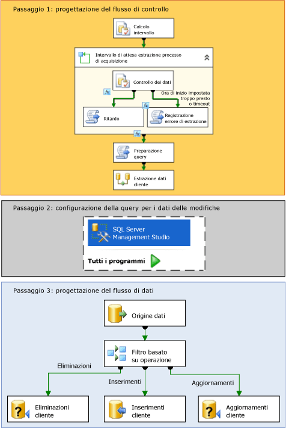

# Change Data Capture (SSIS)
  Change Data Capture in [!INCLUDE[ssNoVersion](../../includes/ssnoversion-md.md)]offre una soluzione efficace alla sfida posta dall'esecuzione di caricamenti incrementali da tabelle di origine in data mart e data warehouse.  
  
## Informazioni su Change Data Capture  
 Le tabelle di origine vengono modificate nel tempo. Un data mart o un data warehouse basato su tali tabelle deve riflettere le modifiche. Un processo di copia periodica di uno snapshot dell'intera origine, tuttavia, richiede troppo tempo e l'utilizzo di una quantità eccessiva di risorse. Approcci alternativi che includono colonne di tipo timestamp, trigger o query complesse riducono spesso le prestazioni e aumentano la complessità. È necessario un flusso affidabile di dati delle modifiche strutturato in modo che possa essere applicato con facilità dagli utenti alle rappresentazioni di destinazione dei dati. Change Data Capture in [!INCLUDE[ssNoVersion](../../includes/ssnoversion-md.md)] è in grado di offrire tale soluzione.  
  
 La funzionalità Change Data Capture di [!INCLUDE[ssDE](../../includes/ssde-md.md)] consente di acquisire attività di inserimento, aggiornamento ed eliminazione applicate a tabelle [!INCLUDE[ssNoVersion](../../includes/ssnoversion-md.md)] e rende disponibili i dettagli relativi alle modifiche in un formato relazionale semplice da utilizzare. Le tabelle delle modifiche utilizzate da Change Data Capture contengono colonne che riflettono la struttura di colonne delle tabelle di origine rilevate, insieme ai metadati necessari per comprendere le modifiche apportate riga per riga.  
  
> [!NOTE]  
>  Change Data Capture non è disponibile in tutte le edizioni di [!INCLUDE[msCoName](../../includes/msconame-md.md)][!INCLUDE[ssNoVersion](../../includes/ssnoversion-md.md)]. Per un elenco delle funzionalità supportate dalle edizioni di [!INCLUDE[ssNoVersion](../../includes/ssnoversion-md.md)], vedere [Funzionalità supportate dalle edizioni di SQL Server 2016](~/sql-server/editions-and-supported-features-for-sql-server-2016.md).  
  
## Funzionamento di Change Data Capture in Integration Services  
 Tramite un pacchetto di [!INCLUDE[ssISnoversion](../../includes/ssisnoversion-md.md)] è possibile raccogliere facilmente i dati delle modifiche nei database di [!INCLUDE[ssNoVersion](../../includes/ssnoversion-md.md)] per eseguire caricamenti incrementali efficaci in un data warehouse. Prima che sia possibile utilizzare [!INCLUDE[ssISnoversion](../../includes/ssisnoversion-md.md)] per caricare i dati delle modifiche, un amministratore deve tuttavia abilitare Change Data Capture nel database e nelle tabelle da cui si desidera acquisire le modifiche. Per altre informazioni su come configurare Change Data Capture in un database, vedere [Abilitare e disabilitare Change Data Capture &#40;SQL Server&#41;](../../relational-databases/track-changes/enable-and-disable-change-data-capture-sql-server.md).  
  
 Dopo che un amministratore ha abilitato Change Data Capture nel database, è possibile creare un pacchetto per l'esecuzione del caricamento incrementale di tali dati. Nel diagramma seguente vengono illustrati i passaggi per la creazione di tale pacchetto che esegue un caricamento incrementale da una singola tabella:  
  
   
  
 Come illustrato nel diagramma precedente, la creazione di un pacchetto per l'esecuzione di un caricamento incrementale dei dati modificati comporta i passaggi seguenti:  
  
 **Passaggio 1: Progettazione del flusso di controllo**  
 Nel flusso di controllo del pacchetto è necessario definire le attività seguenti:  
  
-   Calcolare i valori **datetime** di inizio e di fine per l'intervallo di modifiche apportate ai dati di origine da recuperare.  
  
     Per calcolare tali valori, usare un'attività Esegui SQL o espressioni [!INCLUDE[ssISnoversion](../../includes/ssisnoversion-md.md)] con funzioni **datetime** . È quindi necessario archiviare gli endpoint in variabili del pacchetto da utilizzare in seguito nel pacchetto.  
  
     **Per altre informazioni:** [Definizione di un intervallo dei dati delle modifiche](../../integration-services/change-data-capture/specify-an-interval-of-change-data.md)  
  
-   Determinare se i dati delle modifiche per l'intervallo selezionato sono pronti. Questo passaggio è necessario in quanto il processo di acquisizione asincrono potrebbe non avere ancora raggiunto l'endpoint selezionato.  
  
     Per determinare se i dati sono pronti, iniziare con un contenitore Ciclo For per rimandare l'esecuzione, se necessario, fino a quando i dati delle modifiche per l'intervallo selezionato non saranno pronti. Nel contenitore Ciclo For utilizzare un'attività Esegui SQL per eseguire una query sulle tabelle di mapping temporale gestite da Change Data Capture. Usare quindi un'attività Script che chiama il metodo **Thread.Sleep** o un'altra attività Esegui SQL con un'istruzione **WAITFOR** per rimandare temporaneamente l'esecuzione del pacchetto, se necessario. Facoltativamente, utilizzare un'altra attività Script per registrare una condizione di errore o un timeout.  
  
     **Per altre informazioni:** [Come determinare se i dati delle modifiche sono pronti](../../integration-services/change-data-capture/determine-whether-the-change-data-is-ready.md)  
  
-   Preparare la stringa di query che verrà utilizzata per eseguire una query per i dati delle modifiche.  
  
     Utilizzare un'attività Script o un'attività Esegui SQL per assemblare l'istruzione SQL da utilizzare per eseguire una query per le modifiche.  
  
     **Per altre informazioni:** [Preparazione dell'esecuzione di una query per i dati delle modifiche](../../integration-services/change-data-capture/prepare-to-query-for-the-change-data.md)  
  
 **Passaggio 2: Configurazione della query per i dati delle modifiche**  
 Creare la funzione con valori di tabella che eseguirà una query per i dati.  
  
 Usare [!INCLUDE[ssManStudioFull](../../includes/ssmanstudiofull-md.md)] per sviluppare e salvare la query.  
  
 **Per altre informazioni:** [Recupero e comprensione dei dati delle modifiche](../../integration-services/change-data-capture/retrieve-and-understand-the-change-data.md)  
  
 **Passaggio 3: Progettazione del flusso di dati**  
 Nel flusso di dati del pacchetto è necessario definire le attività seguenti:  
  
-   Recuperare i dati delle modifiche dalle tabelle delle modifiche.  
  
     Per recuperare i dati, utilizzare un componente di origine per eseguire una query sulle tabelle delle modifiche comprese nell'intervallo selezionato. L'origine chiama una funzione Transact-SQL con valori di tabella che deve essere stata creata in precedenza.  
  
     **Per altre informazioni:** [Recupero e comprensione dei dati delle modifiche](../../integration-services/change-data-capture/retrieve-and-understand-the-change-data.md)  
  
-   Suddividere le modifiche in inserimenti, aggiornamenti ed eliminazioni per l'elaborazione.  
  
     Per suddividere le modifiche, utilizzare una trasformazione Suddivisione condizionale per indirizzare inserimenti, aggiornamenti ed eliminazioni a output diversi per l'elaborazione appropriata.  
  
     **Per altre informazioni:** [Elaborazione di inserimenti, aggiornamenti ed eliminazioni](../../integration-services/change-data-capture/process-inserts-updates-and-deletes.md)  
  
-   Applicare gli inserimenti, le eliminazioni e gli aggiornamenti alla destinazione.  
  
     A tale scopo, utilizzare un componente di destinazione per applicare gli inserimenti alla destinazione. Utilizzare inoltre trasformazioni Comando OLE DB con istruzioni UPDATE e DELETE con parametri per applicare aggiornamenti ed eliminazioni alla destinazione. È inoltre possibile applicare aggiornamenti ed eliminazioni utilizzando componenti di destinazione per salvare le righe in tabelle temporanee. Utilizzare quindi le attività Esegui SQL per eseguire operazioni di aggiornamento bulk e di eliminazione bulk sulla destinazione dalle tabelle temporanee.  
  
     **Per altre informazioni:** [Applicazione delle modifiche alla destinazione](../../integration-services/change-data-capture/apply-the-changes-to-the-destination.md)  
  
### Modificare i dati di più tabelle  
 Il processo illustrato nel diagramma e nei passaggi precedenti prevede un caricamento incrementale da una singola tabella. Il processo per eseguire un caricamento incrementale da più tabelle è identico. È tuttavia necessario modificare la progettazione del pacchetto per adattarlo all'elaborazione di più tabelle. Per altre informazioni su come creare un pacchetto che esegue un caricamento incrementale da più tabelle, vedere [Esecuzione di un caricamento incrementale di più tabelle](../../integration-services/change-data-capture/perform-an-incremental-load-of-multiple-tables.md).  
  
## Esempi di pacchetti Change Data Capture  
 [!INCLUDE[ssISnoversion](../../includes/ssisnoversion-md.md)] offre due esempi che illustrano come usare la funzionalità Change Data Capture nei pacchetti. Per altre informazioni, vedere gli argomenti seguenti:  
  
-   [File Leggimi relativo al pacchetto di esempio di un intervallo di tempo specificato in Change Data Capture](https://go.microsoft.com/fwlink/?LinkId=133507)  
  
-   [File Leggimi relativo al pacchetto di esempio dall'ultima richiesta in Change Data Capture](https://go.microsoft.com/fwlink/?LinkId=133508)  
  
## Attività correlate  
  
-   [Definizione di un intervallo dei dati delle modifiche](../../integration-services/change-data-capture/specify-an-interval-of-change-data.md)  
  
-   [Determinare se i dati delle modifiche sono pronti](../../integration-services/change-data-capture/determine-whether-the-change-data-is-ready.md)  
  
-   [Preparare l'esecuzione di una query per i dati delle modifiche](../../integration-services/change-data-capture/prepare-to-query-for-the-change-data.md)  
  
-   [Creare la funzione per il recupero dei dati delle modifiche](../../integration-services/change-data-capture/create-the-function-to-retrieve-the-change-data.md)  
  
-   [Recuperare e interpretare i dati delle modifiche](../../integration-services/change-data-capture/retrieve-and-understand-the-change-data.md)  
  
-   [Elaborare inserimenti, aggiornamenti ed eliminazioni](../../integration-services/change-data-capture/process-inserts-updates-and-deletes.md)  
  
-   [Applicare le modifiche alla destinazione](../../integration-services/change-data-capture/apply-the-changes-to-the-destination.md)  
  
-   [Esecuzione di un caricamento incrementale di più tabelle](../../integration-services/change-data-capture/perform-an-incremental-load-of-multiple-tables.md)  
  
## Contenuto correlato  
 Intervento nel blog sul [carico incrementale con schema progettuale di SSIS](https://go.microsoft.com/fwlink/?LinkId=217679)su sqlblog.com  
  
  
