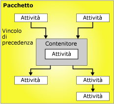

# Flusso di controllo
  Un pacchetto è costituito da un flusso di controllo e, facoltativamente, da uno o più flussi di dati. [!INCLUDE[ssNoVersion](../../includes/ssnoversion-md.md)] [!INCLUDE[ssISnoversion](../../includes/ssisnoversion-md.md)] offre tre diversi tipi di elementi del flusso di controllo: contenitori, che definiscono le strutture nei pacchetti, attività, che forniscono le funzionalità, e vincoli di precedenza, che connettono eseguibili, contenitori e attività in un flusso di controllo ordinato.  
  
 Per altre informazioni, vedere [Vincoli di precedenza](../../integration-services/control-flow/precedence-constraints.md), [Contenitori in Integration Services](../../integration-services/control-flow/integration-services-containers.md)e [Attività di Integration Services](../../integration-services/control-flow/integration-services-tasks.md).  
  
 Nella figura seguente viene illustrato un flusso di controllo con un contenitore e sei attività, di cui cinque definite a livello di pacchetto e una a livello di contenitore. Tale attività è all'interno di un contenitore.  
  
   
  
 L'architettura di [!INCLUDE[ssISnoversion](../../includes/ssisnoversion-md.md)] supporta la nidificazione dei contenitori e un flusso di controllo può includere più livelli di contenitori nidificati. Un pacchetto può ad esempio includere un contenitore quale Ciclo Foreach, che a sua volta può includere un altro contenitore Ciclo Foreach e così via.  
  
 Anche i gestori di eventi includono flussi di controllo, che vengono compilati utilizzando gli stessi tipi di elementi del flusso di controllo.  
  
## Implementazione del flusso di controllo  
 Il flusso di controllo in un pacchetto viene creato tramite la scheda **Flusso di controllo** di Progettazione [!INCLUDE[ssIS](../../includes/ssis-md.md)] . Quando la scheda **Flusso di controllo** è attiva, nella Casella degli strumenti sono elencati i contenitori e le attività che è possibile aggiungere al flusso di controllo.  
  
 Nella figura seguente viene illustrato il flusso di controllo di un semplice pacchetto nella finestra di progettazione del flusso di controllo. Il flusso di controllo illustrato nella figura è composto da tre attività a livello di pacchetto e da un contenitore a livello di pacchetto contenente tre attività. Le attività e il contenitore sono connessi tramite vincoli di precedenza.  
  
   
  
 Per creare un flusso di controllo è necessario eseguire i passaggi seguenti:  
  
-   Aggiungere contenitori che implementano flussi di lavoro ripetuti in un pacchetto o suddividono il flusso di controllo in subset.  
  
-   Aggiungere attività che supportano il flusso di dati, preparano i dati, implementano script ed eseguono funzioni di flusso di lavoro e Business Intelligence.  
  
     In [!INCLUDE[ssISnoversion](../../includes/ssisnoversion-md.md)] è disponibile un'ampia gamma di attività che è possibile utilizzare per creare un flusso di controllo in grado di soddisfare i requisiti aziendali del pacchetto. Se il pacchetto deve gestire dati, il flusso di controllo dovrà includere almeno un'attività Flusso di dati. Un pacchetto può ad esempio estrarre dati, aggregarne i valori e quindi scrivere i risultati in un'origine dei dati.  Per altre informazioni, vedere [Attività di Integration Services](../../integration-services/control-flow/integration-services-tasks.md) e [Aggiunta o eliminazione di un'attività o un contenitore in un flusso di controllo](../../integration-services/control-flow/add-or-delete-a-task-or-a-container-in-a-control-flow.md).  
  
-   Connettere contenitori e attività tramite vincoli di precedenza, in modo da formare un flusso di controllo ordinato.  
  
     Dopo l'aggiunta di un'attività o un contenitore all'area di progettazione della scheda **Flusso di controllo** , Progettazione [!INCLUDE[ssIS](../../includes/ssis-md.md)] aggiunge automaticamente un connettore a tale elemento. Se in un pacchetto sono inclusi due o più elementi, attività o contenitori, sarà possibile crearne un join in modo da formare un flusso di controllo trascinandone i connettori da un elemento all'altro.  
  
     Il connettore tra due elementi rappresenta un vincolo di precedenza, che definisce la relazione tra i due elementi connessi. Specifica infatti l'ordine in cui attività e contenitori devono essere eseguiti in fase di esecuzione, nonché le condizioni in cui tali attività e contenitori devono essere eseguiti. Un vincolo di precedenza può ad esempio specificare che una determinata attività deve essere completata, affinché sia possibile eseguire l'attività successiva nel flusso di controllo. Per altre informazioni, vedere [Vincoli di precedenza](../../integration-services/control-flow/precedence-constraints.md).  
  
-   Aggiunta di gestioni connessioni.  
  
     Molte attività richiedono una connessione a un'origine dei dati ed è pertanto necessario aggiungere al pacchetto le gestioni connessioni richieste dalle attività. A seconda del tipo di enumeratore utilizzato, anche il contenitore Ciclo Foreach può richiedere una gestione connessione. È possibile aggiungere le gestioni connessioni durante la costruzione del flusso di controllo elemento per elemento oppure prima di iniziare la costruzione del flusso di controllo. Per altre informazioni, vedere [Connessioni in Integration Services &#40;SSIS&#41;](../../integration-services/connection-manager/integration-services-ssis-connections.md) e [Creazione di gestioni connessioni](http://msdn.microsoft.com/library/6ca317b8-0061-4d9d-b830-ee8c21268345).  
  
 La finestra di progettazione [!INCLUDE[ssIS](../../includes/ssis-md.md)] include inoltre molte funzionalità della modalità progettazione che è possibile usare per gestire l'area di progettazione e creare un flusso di controllo autodocumentato.  
  
## Attività correlate  
  
-   [Aggiungere o eliminare un'attività o un contenitore in un flusso di controllo](../../integration-services/control-flow/add-or-delete-a-task-or-a-container-in-a-control-flow.md)  
  
-   [Impostazione delle proprietà di un'attività o di un contenitore](http://msdn.microsoft.com/library/52d47ca4-fb8c-493d-8b2b-48bb269f859b)  
  
-   [Raggruppare o separare componenti](../../integration-services/group-or-ungroup-components.md)  
  
  
