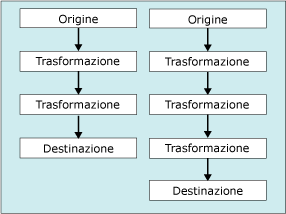

# Attività Flusso di dati
  L'attività Flusso di dati incapsula il motore flusso di dati che consente di spostare i dati dalle origini alle destinazioni e offre la possibilità di trasformare, pulire e modificare i dati durante lo spostamento. L'aggiunta di un'attività Flusso di dati al flusso di controllo di un pacchetto consente al pacchetto di estrarre, trasformare e caricare dati.  
  
 Un flusso di dati è costituito da almeno un componente dei flussi di dati, ma è in genere formato da un set di componenti dei flussi di dati opportunamente connessi: origini che estraggono i dati, trasformazioni che modificano, inviano o riepilogano i dati e destinazioni che caricano i dati.  
  
 In fase di esecuzione l'attività Flusso di dati compila un piano di esecuzione, basato sul flusso di dati, che viene eseguito dal motore flusso di dati. È possibile creare un'attività Flusso di dati priva di flusso di dati, ma l'attività verrà eseguita solo se include almeno un flusso di dati.  
  
 Per l'inserimento bulk dei dati di file di testo in un database di [!INCLUDE[ssNoVersion](../../includes/ssnoversion-md.md)] , è possibile utilizzare l'attività Inserimento bulk anziché un'attività Flusso di dati e un flusso di dati. L'attività Inserimento bulk non consente tuttavia la trasformazione dei dati. Per altre informazioni, vedere [Attività Inserimento bulk](../../integration-services/control-flow/bulk-insert-task.md).  
  
## Più flussi  
 Un'attività Flusso di dati può includere più flussi di dati. Se un'attività copia più set di dati e l'ordine in cui i dati vengono copiati non è significativo, è consigliabile includere più flussi di dati in un'unica attività Flusso di dati. È ad esempio possibile creare cinque flussi di dati, ognuno dei quali copia dati da un file flat a una tabella delle dimensioni diversa in uno schema star di data warehouse.  
  
 Se un'attività flusso di dati contiene più flussi di dati, l'ordine di esecuzione verrà automaticamente determinato dal motore flusso di dati. Se l'ordine di esecuzione è rilevante, sarà pertanto necessario includere nel pacchetto più attività Flusso di dati, ognuna contenente un solo flusso di dati. Sarà quindi possibile applicare vincoli di precedenza per controllare l'ordine di esecuzione delle attività.  
  
 Nella figura seguente viene illustrata un'attività Flusso di dati che include più flussi di dati.  
  
   
  
## Voci di log  
 [!INCLUDE[ssISnoversion](../../includes/ssisnoversion-md.md)] include un set di eventi del log disponibili per tutte le attività. [!INCLUDE[ssISnoversion](../../includes/ssisnoversion-md.md)] fornisce anche voci di log personalizzate a molte attività. Per altre informazioni, vedere [registrazione di Integration Services &#40;SSIS&#41;](../../integration-services/performance/integration-services-ssis-logging.md). L'attività Flusso di dati include le voci di log personalizzate seguenti:  
  
|Voce di log|Description|  
|---------------|-----------------|  
|**BufferSizeTuning**|Indica che l'attività Flusso di dati ha modificato le dimensioni del buffer. In questa voce di log vengono indicati i motivi della modifica delle dimensioni del buffer e le nuove dimensioni temporanee del buffer.|  
|**OnPipelinePostEndOfRowset**|Indica che a un componente è stato inviato il segnale di fine del set di righe, che viene impostato dall'ultima chiamata al metodo **ProcessInput** . Viene scritta una voce per ogni componente del flusso di dati che elabora dati di input. Tale voce include il nome del componente.|  
|**OnPipelinePostPrimeOutput**|Indica che il componente ha completato l'ultima chiamata al metodo **PrimeOutput** . A seconda del flusso di dati, è possibile che vengano scritte più voci di log. Se il componente è un'origine, questa voce di log indica che tale componente ha terminato l'elaborazione delle righe.|  
|**OnPipelinePreEndOfRowset**|Indica che un componente sta per ricevere il segnale di fine del set di righe, che viene impostato dall'ultima chiamata al metodo **ProcessInput** . Viene scritta una voce per ogni componente del flusso di dati che elabora dati di input. Tale voce include il nome del componente.|  
|**OnPipelinePrePrimeOutput**|Indica che il componente sta per ricevere una chiamata dal metodo **PrimeOutput** . A seconda del flusso di dati, è possibile che vengano scritte più voci di log.|  
|**OnPipelineRowsSent**|Specifica il numero delle righe inviate all'input di un componente da una chiamata al metodo **ProcessInput** . La voce di log include il nome del componente.|  
|**PipelineBufferLeak**|Fornisce informazioni su tutti i componenti che hanno mantenuto attivi i buffer dopo la chiusura di Gestione buffer. Se vi è ancora un buffer attivo, le risorse dei buffer non sono state rilasciate e potrebbero verificarsi perdite di memoria. Nella voce di log vengono indicati il nome del componente e l'ID del buffer.|  
|**PipelineComponentTime**|Indica la quantità di tempo (in millisecondi) utilizzata dal componente per ciascuno dei cinque passaggi principali dell'elaborazione, ovvero Validate, PreExecute, PostExecute, ProcessInput e ProcessOutput.|  
|**PipelineExecutionPlan**|Specifica il piano di esecuzione del flusso di dati. Il piano di esecuzione offre informazioni sulle modalità di invio dei buffer ai componenti. Insieme alla voce di log PipelineExecutionTrees, queste informazioni illustrano ciò che avviene nell'attività Flusso di dati.|  
|**PipelineExecutionTrees**|Specifica gli alberi di esecuzione del layout nel flusso di dati. L'utilità di pianificazione del motore flusso di dati utilizza tali alberi per compilare il piano di esecuzione del flusso di dati.|  
|**PipelineInitialization**|Fornisce le informazioni di inizializzazione relative all'attività, che includono le directory da utilizzare per l'archiviazione temporanea dei dati BLOB, le dimensioni predefinite del buffer e il numero di righe in un buffer. A seconda della configurazione dell'attività Flusso di dati, è possibile che vengano scritte più voci di log.|  
  
 Queste voci di log forniscono numerose informazioni sull'esecuzione dell'attività Flusso di dati ogni volta che si esegue un pacchetto. L'esecuzione ripetuta dei pacchetti consente nel tempo di acquisire importanti informazioni cronologiche sull'elaborazione eseguita dall'attività, gli eventuali problemi che possono influire sulle prestazioni e il volume di dati gestito dall'attività.  
  
 Per ulteriori informazioni sull'utilizzo di queste voci di log per monitorare e migliorare le prestazioni del flusso di dati, vedere uno degli argomenti seguenti:  
  
-   [Contatori delle prestazioni](../../integration-services/performance/performance-counters.md)  
  
-   [Funzionalità delle prestazioni del flusso di dati](../../integration-services/data-flow/data-flow-performance-features.md)  
  
### Messaggi di esempio di un'attività Flusso di dati  
 Nella tabella seguente vengono elencati messaggi di esempio per le voci di log relative a un pacchetto molto semplice. Il pacchetto utilizza un'origine OLE DB per estrarre dati da una tabella, una trasformazione Ordinamento per ordinare i dati e una destinazione OLE DB per scrivere i dati in una tabella diversa.  
  
|Voce di log|Messaggi|  
|---------------|--------------|  
|**BufferSizeTuning**|`Rows in buffer type 0 would cause a buffer size greater than the configured maximum. There will be only 9637 rows in buffers of this type.`   `Rows in buffer type 2 would cause a buffer size greater than the configured maximum. There will be only 9497 rows in buffers of this type.`   `Rows in buffer type 3 would cause a buffer size greater than the configured maximum. There will be only 9497 rows in buffers of this type.`|  
|**OnPipelinePostEndOfRowset**|`A component will be given the end of rowset signal. : 1180 : Sort : 1181 : Sort Input`   `A component will be given the end of rowset signal. : 1291 : OLE DB Destination : 1304 : OLE DB Destination Input`|  
|**OnPipelinePostPrimeOutput**|`A component has returned from its PrimeOutput call. : 1180 : Sort`   `A component has returned from its PrimeOutput call. : 1 : OLE DB Source`|  
|**OnPipelinePreEndOfRowset**|`A component has finished processing all of its rows. : 1180 : Sort : 1181 : Sort Input`   `A component has finished processing all of its rows. : 1291 : OLE DB Destination : 1304 : OLE DB Destination Input`|  
|**OnPipelinePrePrimeOutput**|`PrimeOutput will be called on a component. : 1180 : Sort`   `PrimeOutput will be called on a component. : 1 : OLE DB Source`|  
|**OnPipelineRowsSent**|`Rows were provided to a data flow component as input. :  : 1185 : OLE DB Source Output : 1180 : Sort : 1181 : Sort Input : 76`   `Rows were provided to a data flow component as input. :  : 1308 : Sort Output : 1291 : OLE DB Destination : 1304 : OLE DB Destination Input : 76`|  
|**PipelineComponentTime**|`The component "Calculate LineItemTotalCost" (3522) spent 356 milliseconds in ProcessInput.`   `The component "Sum Quantity and LineItemTotalCost" (3619) spent 79 milliseconds in ProcessInput.`   `The component "Calculate Average Cost" (3662) spent 16 milliseconds in ProcessInput.`   `The component "Sort by ProductID" (3717) spent 125 milliseconds in ProcessInput.`   `The component "Load Data" (3773) spent 0 milliseconds in ProcessInput.`   `The component "Extract Data" (3869) spent 688 milliseconds in PrimeOutput filling buffers on output "OLE DB Source Output" (3879).`   `The component "Sum Quantity and LineItemTotalCost" (3619) spent 141 milliseconds in PrimeOutput filling buffers on output "Aggregate Output 1" (3621).`   `The component "Sort by ProductID" (3717) spent 16 milliseconds in PrimeOutput filling buffers on output "Sort Output" (3719).`|  
|**PipelineExecutionPlan**|`SourceThread0`   `Drives: 1`   `Influences: 1180 1291`   `Output Work List`   `CreatePrimeBuffer of type 1 for output ID 11.`   `SetBufferListener: "WorkThread0" for input ID 1181`   `CreatePrimeBuffer of type 3 for output ID 12.`   `CallPrimeOutput on component "OLE DB Source" (1)`   `End Output Work List`   `End SourceThread0`   `WorkThread0`   `Drives: 1180`   `Influences: 1180 1291`   `Input Work list, input ID 1181 (1 EORs Expected)`   `CallProcessInput on input ID 1181 on component "Sort" (1180) for view type 2`   `End Input Work list for input 1181`   `Output Work List`   `CreatePrimeBuffer of type 4 for output ID 1182.`   `SetBufferListener: "WorkThread1" for input ID 1304`   `CallPrimeOutput on component "Sort" (1180)`   `End Output Work List`   `End WorkThread0`   `WorkThread1`   `Drives: 1291`   `Influences: 1291`   `Input Work list, input ID 1304 (1 EORs Expected)`   `CallProcessInput on input ID 1304 on component "OLE DB Destination" (1291) for view type 5`   `End Input Work list for input 1304`   `Output Work List`   `End Output Work List`   `End WorkThread1`|  
|**PipelineExecutionTrees**|`begin execution tree 0`   `output "OLE DB Source Output" (11)`   `input "Sort Input" (1181)`   `end execution tree 0`   `begin execution tree 1`   `output "OLE DB Source Error Output" (12)`   `end execution tree 1`   `begin execution tree 2`   `output "Sort Output" (1182)`   `input "OLE DB Destination Input" (1304)`   `output "OLE DB Destination Error Output" (1305)`   `end execution tree 2`|  
|**PipelineInitialization**|`No temporary BLOB data storage locations were provided. The buffer manager will consider the directories in the TEMP and TMP environment variables.`   `The default buffer size is 10485760 bytes.`   `Buffers will have 10000 rows by default`   `The data flow will not remove unused components because its RunInOptimizedMode property is set to false.`|  
  
 Per molti eventi vengono scritte più voci nel log e i messaggi relativi a numerose voci di log contengono dati complessi. Per semplificare la comprensione e la comunicazione del contenuto dei messaggi complessi, è possibile analizzare il testo dei messaggi. In base alla posizione dei log, è possibile utilizzare istruzioni Transact-SQL o un componente script per separare il testo complesso in colonne o altri formati che si ritengono più utili.  
  
 Nella tabella seguente viene ad esempio illustrato il messaggio "Sono state passate righe come input per un componente del flusso di dati. :  : 1185 : Output origine OLE DB : 1180 : Ordinamento : 1181 : Input ordinamento : 76", scomposto in colonne. Il messaggio è stato scritto dall'evento **OnPipelineRowsSent** quando le righe sono state inviate dall'origine OLE DB alla trasformazione Ordinamento.  
  
|colonna|Description|valore|  
|------------|-----------------|-----------|  
|**PathID**|Valore della proprietà **ID** del percorso tra l'origine OLE DB e la trasformazione Ordinamento.|1185|  
|**PathName**|Valore della proprietà **Name** del percorso.|Output origine OLE DB|  
|**ComponentID**|Valore della proprietà **ID** della trasformazione Ordinamento.|1180|  
|**ComponentName**|Valore della proprietà **Name** della trasformazione Ordinamento.|Ordina|  
|**InputID**|Valore della proprietà **ID** dell'input della trasformazione Ordinamento.|1181|  
|**InputName**|Valore della proprietà **Name** dell'input della trasformazione Ordinamento.|Input ordinamento|  
|**RowsSent**|Numero di righe inviate all'input della trasformazione Ordinamento.|76|  
  
## Configurazione dell'attività Flusso di dati  
 È possibile impostare le proprietà a livello di codice o nella finestra **Proprietà** .  
  
 Per altre informazioni sull'impostazione di queste proprietà nella finestra **Proprietà** , fare clic sull'argomento seguente:  
  
-   [Impostazione delle proprietà di un'attività o di un contenitore](http://msdn.microsoft.com/library/52d47ca4-fb8c-493d-8b2b-48bb269f859b)  
  
## Configurazione a livello di codice dell'attività Flusso di dati  
 Per ulteriori informazioni sull'aggiunta di un'attività Flusso di dati a un pacchetto a livello di codice e sulle impostazioni delle proprietà del flusso di dati, fare clic sull'argomento seguente:  
  
-   [Aggiunta dell'attività Flusso di dati a livello di programmazione](../../integration-services/building-packages-programmatically/adding-the-data-flow-task-programmatically.md)  
  
## Related Tasks  
 [Impostazione delle proprietà di un'attività o di un contenitore](http://msdn.microsoft.com/library/52d47ca4-fb8c-493d-8b2b-48bb269f859b)  
  
## Contenuto correlato  
 Video relativo al [server di distribuzione di dati bilanciati](http://go.microsoft.com/fwlink/?LinkID=226278&clcid=0x409)sul sito technet.microsoft.com.  
  
  
