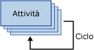

# Contenitore Ciclo For
  Il contenitore Ciclo For definisce un flusso di controllo ripetuto all'interno di un pacchetto. L'implementazione del ciclo è simile alla struttura del ciclo **For** nei linguaggi di programmazione. A ogni ripetizione del ciclo il contenitore Ciclo For valuta un'espressione e ne ripete il flusso di lavoro finché tale espressione non restituisce **False**.  
  
 Per definire il ciclo, il contenitore Ciclo For usa gli elementi seguenti:  
  
-   Un'espressione di inizializzazione facoltativa che assegna valori ai contatori del ciclo.  
  
-   Un'espressione di valutazione che contiene l'espressione utilizzata per stabilire se il ciclo deve essere arrestato o continuare.  
  
-   Un'espressione di iterazione facoltativa che incrementa o decrementa il contatore del ciclo.  
  
 Nella figura seguente viene illustrato un contenitore Ciclo For con un'attività Invia messaggi. Se l'espressione di inizializzazione è `@Counter = 0`, l'espressione di valutazione è `@Counter < 4`e l'espressione di iterazione è `@Counter = @Counter + 1`, il ciclo si ripeterà quattro volte e verranno inviati quattro messaggi di posta elettronica.  
  
   
  
 Le espressioni devono essere espressioni di [!INCLUDE[ssNoVersion](../../includes/ssnoversion-md.md)] [!INCLUDE[ssISnoversion](../../includes/ssisnoversion-md.md)] valide.  
  
 Per creare le espressioni di inizializzazione e assegnazione, è possibile utilizzare l'operatore di assegnazione (=). In altre circostanze questo operatore non è supportato dalla grammatica delle espressioni di Integration Services, ma può essere utilizzato solo dai tipi di espressione di inizializzazione e assegnazione nel contenitore Ciclo For. Tutte le espressioni che usano l'operatore di assegnazione devono avere la sintassi `@Var = <expression>`, dove **Var** è una variabile di runtime ed \<expression> è un'espressione che segue le regole della sintassi delle espressioni di [!INCLUDE[ssIS](../../includes/ssis-md.md)]. L'espressione può includere le variabili, i valori letterali e tutti gli operatori e le funzioni supportati dalla grammatica delle espressioni di SSIS. L'espressione deve restituire un tipo di dati di cui è possibile eseguire il cast al tipo di dati della variabile.  
  
 Un contenitore Ciclo For può includere una sola espressione di valutazione, pertanto esegue tutti gli elementi del flusso di controllo per lo stesso numero di volte. Poiché un contenitore Ciclo For può includere altri contenitori Ciclo For, nei pacchetti è possibile compilare cicli nidificati e implementare loop complessi.  
  
 È possibile impostare una proprietà di transazione sul contenitore Ciclo For per definire una transazione per un subset del flusso di controllo del pacchetto. In questo modo è possibile gestire le transazioni con un livello di granularità superiore. Se ad esempio un contenitore Ciclo For ripete un flusso di controllo che aggiorna più volte i dati di una tabella, sarà possibile configurare il ciclo For e il relativo flusso di controllo per l'utilizzo di una transazione, in modo da assicurare che se non è possibile aggiornare correttamente tutti i dati, non ne verrà aggiornato alcuno. Per altre informazioni, vedere [Transazioni di Integration Services](../../integration-services/integration-services-transactions.md).  
  
## Aggiungere un'iterazione a un flusso di controllo con il contenitore Ciclo For
  [!INCLUDE[ssISnoversion](../../includes/ssisnoversion-md.md)] include il contenitore Ciclo For, un elemento del flusso di controllo che semplifica l'implementazione di un ciclo che consente la ripetizione condizionale di un flusso di controllo in un pacchetto. Per altre informazioni, vedere [Contenitore Ciclo For](../../integration-services/control-flow/for-loop-container.md).  
  
 Il contenitore Ciclo For valuta una condizione a ogni iterazione del ciclo e si arresta quando la condizione restituisce False. Il contenitore Ciclo For include espressioni per l'inizializzazione del ciclo, la definizione della condizione da valutare per determinare se arrestare o meno l'esecuzione del flusso di controllo ripetuto, nonché l'assegnazione di un valore a un'espressione che aggiorna il valore con cui confrontare la condizione da valutare. La condizione da valutare è obbligatoria, mentre le espressioni di inizializzazione e di assegnazione sono facoltative.  
  
 Il contenitore Ciclo For non offre funzionalità, ma solo una struttura in cui compilare un flusso di controllo ripetibile. Per aggiungere funzionalità al contenitore Ciclo For è necessario includervi almeno un'attività. Per altre informazioni, vedere [Attività di Integration Services](../../integration-services/control-flow/integration-services-tasks.md).  
  
 Il contenitore Ciclo For può includere un flusso di controllo con più attività e altri contenitori. L'aggiunta di attività e contenitori a un contenitore Ciclo For è analoga all'aggiunta di tali elementi a un pacchetto, con la differenza che è necessario trascinare attività e contenitori nel contenitore Ciclo For anziché nel pacchetto. Se il contenitore Ciclo For include più di un contenitore o attività, sarà possibile connettere tali elementi utilizzando vincoli di precedenza, come avviene nei pacchetti. Per altre informazioni, vedere [Vincoli di precedenza](../../integration-services/control-flow/precedence-constraints.md).  
  
## Aggiungere un contenitore Ciclo For in un flusso di controllo  
  
1.  Aggiungere il contenitore Ciclo For al pacchetto. Per altre informazioni, vedere [Aggiunta o eliminazione di un'attività o un contenitore in un flusso di controllo](../../integration-services/control-flow/add-or-delete-a-task-or-a-container-in-a-control-flow.md).  
  
2.  Aggiungere attività e contenitori al contenitore Ciclo For. Per altre informazioni, vedere [Aggiunta o eliminazione di un'attività o un contenitore in un flusso di controllo](../../integration-services/control-flow/add-or-delete-a-task-or-a-container-in-a-control-flow.md).  
  
3.  Connettere le attività e i contenitori inclusi nel contenitore Ciclo For tramite vincoli di precedenza. Per altre informazioni, vedere [Connessione di attività e contenitori tramite un vincolo di precedenza predefinito](http://msdn.microsoft.com/library/8f31f15f-98ff-4c35-b41f-8b8cfd148d75).  
  
4.  Configurare il contenitore Ciclo For. Per altre informazioni, vedere [Configurazione di un contenitore Ciclo For](http://msdn.microsoft.com/library/b9cd7ea7-b198-4a35-8b16-6acf09611ca5).  

##  Configurare il contenitore Ciclo For
Questa procedura descrive come configurare un contenitore Ciclo For tramite la finestra di dialogo **Editor ciclo For** .  
  
 Per un esempio di contenitore Ciclo For, vedere la pagina relativa all' [esecuzione corretta di cicli SSIS](http://go.microsoft.com/fwlink/?LinkId=240295) sul sito Web bimonkey.com.  
  
1.  In [!INCLUDE[ssBIDevStudioFull](../../includes/ssbidevstudiofull-md.md)]fare doppio clic sul contenitore Ciclo For per aprire la finestra di dialogo **Editor ciclo For**.  
  
2.  Facoltativamente, modificare il nome e la descrizione del contenitore Ciclo For.  
  
3.  Facoltativamente, digitare un'espressione di inizializzazione nella casella di testo **InitExpression** .  
  
4.  Digitare un'espressione di valutazione nella casella di testo **EvalExpression** .  
  
    > [!NOTE]  
    >  L'espressione deve restituire un valore booleano. Quando l'espressione restituisce **false**, l'esecuzione del ciclo viene arrestata.  
  
5.  Facoltativamente, digitare un'espressione di assegnazione nella casella di testo **AssignExpression** .  
  
6.  Facoltativamente, fare clic su **Espressioni** e, nella pagina **Espressioni** , creare espressioni di proprietà per le proprietà del contenitore Ciclo For. Per altre informazioni, vedere [Aggiunta o modifica di un'espressione di proprietà](../../integration-services/expressions/add-or-change-a-property-expression.md).  
  
7.  Fare clic su **OK** per chiudere la finestra **Editor ciclo For**.  

## Finestra di dialogo Editor ciclo For
La pagina **Ciclo For** della finestra di dialogo **Editor ciclo For** consente di configurare un ciclo che ripeta un flusso di lavoro fino a quando una determinata condizione non restituisca il valore False.  
  
 Per ulteriori informazioni sul contenitore Ciclo Foreach e sulle modalità di utilizzo del contenitore nei pacchetti, vedere [For Loop Container](../../integration-services/control-flow/for-loop-container.md).  
  
### Opzioni  
 **InitExpression**  
 Consente di specificare un'espressione facoltativa che inizializzi i valori utilizzati dal ciclo.  
  
 **EvalExpression**  
 Consente di specificare un'espressione che determini se il ciclo deve arrestarsi o continuare.  
  
 **AssignExpression**  
 Consente di specificare un'espressione facoltativa che modifichi una condizione ogni volta che il ciclo viene ripetuto.  
  
 **Nome**  
 Consente di specificare un nome univoco per il contenitore Ciclo For. Tale nome viene utilizzato come etichetta nell'icona dell'attività.  
  
> [!NOTE]  
>  I nomi degli oggetti devono essere univoci all'interno di un pacchetto.  
  
 **Descrizione**  
 Consente di specificare una descrizione per il contenitore Ciclo For.  
 
## Usare le espressioni con il contenitore Ciclo For  
 Quando si configura il contenitore Ciclo For specificando una condizione da valutare, un valore di inizializzazione o un valore di assegnazione, è possibile utilizzare valori letterali o espressioni.  
  
 Le espressioni possono includere variabili. Il vantaggio delle variabili è che possono essere aggiornate in fase di esecuzione, rendendo il pacchetto più flessibile e più facile da gestire. Un'espressione può avere una lunghezza massima di 4000 caratteri.  
  
 Quando si specifica una variabile in un'espressione è necessario anteporre il simbolo @ al nome della variabile. Se ad esempio il nome della variabile è **Counter**, nell'espressione usata nel contenitore Ciclo For sarà necessario immettere @Counter. Se la variabile include la proprietà Namespace, sarà necessario racchiudere la variabile e lo spazio dei nomi tra parentesi quadre. Se ad esempio si usa la variabile **Counter** nello spazio dei nomi **MyNamespace**, sarà necessario immettere [@MyNamespace::Counter].  
  
 Le variabili utilizzate dal contenitore Ciclo For devono essere definite nell'ambito del contenitore Ciclo For o di un altro contenitore di livello superiore nella gerarchia dei contenitori del pacchetto. Un contenitore Ciclo For può ad esempio utilizzare sia variabili definite nel proprio ambito, sia variabili definite nell'ambito del pacchetto. Per altre informazioni, vedere [Variabili di Integration Services &#40;SSIS&#41;](../../integration-services/integration-services-ssis-variables.md) e [Utilizzo di variabili nei pacchetti](http://msdn.microsoft.com/library/7742e92d-46c5-4cc4-b9a3-45b688ddb787).  
  
 La grammatica delle espressioni di [!INCLUDE[ssIS](../../includes/ssis-md.md)] offre un set completo di operatori e funzioni per l'implementazione di espressioni complesse che è possibile utilizzare per la valutazione, l'inizializzazione o l'assegnazione. Per altre informazioni, vedere [Espressioni di Integration Services &#40;SSIS&#41;](../../integration-services/expressions/integration-services-ssis-expressions.md).  
  
  
## Vedere anche  
 [Flusso di controllo](../../integration-services/control-flow/control-flow.md)   
 [Espressioni di Integration Services &#40;SSIS&#41;](../../integration-services/expressions/integration-services-ssis-expressions.md)  
  
  
