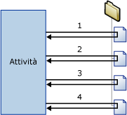

# Contenitore Ciclo Foreach
  Il contenitore Ciclo Foreach definisce un flusso di controllo ripetuto all'interno di un pacchetto. L'implementazione del ciclo è simile alla struttura del ciclo **Foreach** nei linguaggi di programmazione. In un pacchetto per l'esecuzione del ciclo viene utilizzato un enumeratore Foreach.  Il contenitore Ciclo Foreach ripete il flusso di controllo per ogni membro di un enumeratore specificato.  
  
 [!INCLUDE[ssNoVersion](../../includes/ssnoversion-md.md)] [!INCLUDE[ssISnoversion](../../includes/ssisnoversion-md.md)] sono disponibili i tipi di enumeratori seguenti:  
  
-   Foreach ADO Enumerator, per enumerare righe nelle tabelle. Consente ad esempio di ottenere le righe in un recordset ADO.  
  
     Con la destinazione recordset è possibile salvare i dati in memoria in un recordset archiviato in una variabile del pacchetto il cui tipo di dati è **Object** . In genere si utilizza un contenitore Ciclo Foreach con l'enumeratore Foreach ADO per elaborare una riga del recordset alla volta. Il tipo di dati della variabile specificata per l'enumeratore Foreach ADO deve essere Object. Per altre informazioni sulla destinazione recordset, vedere [Usare una destinazione recordset](../../integration-services/data-flow/use-a-recordset-destination.md).  
  
-   Foreach ADO.NET Schema Rowset Enumerator, per enumerare le informazioni dello schema relative a un'origine dei dati. Consente ad esempio di enumerare e ottenere un elenco delle tabelle presenti nel database [!INCLUDE[ssSampleDBnormal](../../includes/sssampledbnormal-md.md)] [!INCLUDE[ssNoVersion](../../includes/ssnoversion-md.md)] .  
  
-   Foreach File Enumerator, per enumerare i file contenuti in una cartella. È possibile includere nell'enumerazione anche le sottocartelle. È ad esempio possibile leggere tutti i file con estensione log presenti nella cartella di Windows e nelle relative sottocartelle.  
  
-   Foreach From Variable Enumerator, per enumerare gli oggetti enumerabili contenuti in una variabile specificata. L'oggetto enumerabile può essere una matrice, un oggetto **DataTable**ADO.NET, un enumeratore [!INCLUDE[ssISnoversion](../../includes/ssisnoversion-md.md)] e così via. È ad esempio possibile enumerare i valori di una matrice che contiene i nomi dei server.  
  
-   Foreach Item Enumerator, per enumerare elementi costituiti da raccolte. È ad esempio possibile enumerare i nomi degli eseguibili e delle directory di lavoro utilizzate dall'attività Esegui processo.  
  
-   Foreach Nodelist Enumerator, per enumerare il set di risultati di un'espressione XPath (XML Path Language). L'espressione seguente consente ad esempio di enumerare e ottenere un elenco di tutti gli autori del periodo classico: `/authors/author[@period='classical']`.  
  
-   Foreach SMO Enumerator, per enumerare oggetti SMO ( [!INCLUDE[ssNoVersion](../../includes/ssnoversion-md.md)] Management Objects). Consente ad esempio di enumerare e ottenere un elenco delle viste presenti in un database di [!INCLUDE[ssNoVersion](../../includes/ssnoversion-md.md)] .  
  
-   Foreach HDFS File Enumerator per enumerare i file HDFS nel percorso HDFS specificato.  
  
-   Enumeratore BLOB di Azure Foreach per enumerare i BLOB in un contenitore BLOB di Archiviazione di Azure.  

-   Enumeratore Foreach file di ADLS per enumerare i file in una directory in Azure Data Lake Store.
  
 Nella figura seguente viene illustrato un contenitore Ciclo Foreach che include un'attività File system. Il ciclo Foreach utilizza Foreach File Enumerator e l'attività File system è configurata per la copia di un file. Se la cartella specificata dall'enumeratore contiene quattro file, il ciclo si ripeterà quattro volte e copierà quattro file.  
  
   
  
 È possibile utilizzare una combinazione di variabili ed espressioni di proprietà per aggiornare la proprietà dell'oggetto pacchetto con il valore della raccolta dell'enumeratore. È innanzitutto necessario eseguire il mapping del valore della raccolta a una variabile definita dall'utente e quindi implementare un'espressione di proprietà sulla proprietà che utilizza la variabile. Si supponga, ad esempio, che venga eseguito il mapping del valore della raccolta dell'enumeratore Foreach File a una variabile di nome **MyFile** e che la variabile venga usata nell'espressione di proprietà per la proprietà Oggetto di un'attività Invia messaggi. Quando il pacchetto viene eseguito, la proprietà Oggetto viene aggiornata con il nome di un file ogni volta che il ciclo si ripete. Per altre informazioni, vedere [Utilizzo delle espressioni di proprietà nei pacchetti](../../integration-services/expressions/use-property-expressions-in-packages.md).  
  
 Le variabili sulle quali viene eseguito il mapping al valore della raccolta dell'enumeratore possono essere utilizzate anche in espressioni e script.  
  
 Un contenitore Ciclo Foreach può includere più attività e contenitori, ma può utilizzare un solo tipo di enumeratore. Se il contenitore Ciclo Foreach include più attività, sarà possibile eseguire il mapping il valore della raccolta dell'enumeratore a più proprietà di ogni attività.  
  
 È possibile impostare un attributo di transazione per ogni contenitore Ciclo Foreach per definire una transazione per un subset del flusso di controllo del pacchetto. In questo modo è possibile gestire le transazioni a livello di ciclo Foreach, anziché a livello di pacchetto. Se ad esempio un contenitore Ciclo Foreach ripete un flusso di controllo che aggiorna le tabelle delle dimensioni e dei fatti in uno schema star, sarà possibile configurare una transazione per garantire che vengano aggiornate tutte le tabelle dei fatti oppure nessuna. Per altre informazioni, vedere [Transazioni di Integration Services](../../integration-services/integration-services-transactions.md).  
  
## Tipi di enumeratori  
 Gli enumeratori sono configurabili ed è necessario specificare informazioni diverse a seconda dell'enumeratore.  
  
 Nella tabella seguente vengono riepilogate le informazioni richieste da ogni tipo di enumeratore.  
  
|Enumeratore|Requisiti di configurazione|  
|----------------|--------------------------------|  
|Foreach ADO|Specificare la variabile di origine dell'oggetto ADO e la modalità dell'enumeratore. Il tipo di dati della variabile deve essere Object.|  
|Foreach ADO.NET Schema Rowset|Specificare la connessione a un database e lo schema da enumerare.|  
|Foreach File|Specificare una cartella, i file da enumerare e il formato del nome dei file recuperati e indicare se includere le sottocartelle nell'enumerazione.|  
|Foreach From Variable|Specificare la variabile che contiene gli oggetti da enumerare.|  
|Foreach Item|Definire gli elementi nella raccolta di Foreach Item Enumerator, comprese le colonne e i tipi di dati delle colonne.|  
|Foreach Nodelist|Specificare l'origine del documento XML e configurare l'operazione XPath.|  
|Foreach SMO|Specificare una connessione a un database e gli oggetti SMO da enumerare.|  
|Foreach HDFS File Enumerator|Specificare una cartella, i file da enumerare e il formato del nome dei file recuperati e indicare se includere le sottocartelle nell'enumerazione.|  
|Blob di Azure Foreach|Specificare il contenitore BLOB di Azure che contiene i BLOB da enumerare.|  
|Foreach file di ADLS|Specificare la directory di Azure Data Lake Store che contiene i file da enumerare.|

## Aggiungere l'enumerazione a un flusso di controllo con il contenitore Ciclo Foreach
 [!INCLUDE[ssISnoversion](../../includes/ssisnoversion-md.md)] include il contenitore Ciclo Foreach, un elemento del flusso di controllo che semplifica l'integrazione di un costrutto di ciclo per l'enumerazione di file e oggetti nel flusso di controllo di un pacchetto. Per altre informazioni, vedere [Contenitore Ciclo Foreach](../../integration-services/control-flow/foreach-loop-container.md).  
  
 Il contenitore Ciclo Foreach non offre funzionalità, ma solo una struttura in cui è possibile compilare un flusso di controllo ripetibile, nonché specificare e configurare un tipo di enumeratore. Per aggiungere funzionalità al contenitore Ciclo Foreach è necessario includervi almeno un'attività. Per altre informazioni, vedere [Attività di Integration Services](../../integration-services/control-flow/integration-services-tasks.md).  
  
 Il contenitore Ciclo Foreach può includere un flusso di controllo con più attività e può includere altri contenitori. L'aggiunta di attività e contenitori a un contenitore Ciclo Foreach è analoga all'aggiunta di tali elementi a un pacchetto, con la differenza che è necessario trascinare attività e contenitori nel contenitore Ciclo Foreach anziché nel pacchetto. Se il contenitore Ciclo Foreach include più di un contenitore o attività, sarà possibile connettere tali elementi utilizzando vincoli di precedenza, come avviene nei pacchetti. Per altre informazioni, vedere [Vincoli di precedenza](../../integration-services/control-flow/precedence-constraints.md).  
  
### Aggiungere e configurare un contenitore Ciclo Foreach
  
1.  Aggiungere il contenitore Ciclo Foreach al pacchetto. Per altre informazioni, vedere [Aggiunta o eliminazione di un'attività o un contenitore in un flusso di controllo](../../integration-services/control-flow/add-or-delete-a-task-or-a-container-in-a-control-flow.md).  
  
2.  Aggiungere attività e contenitori al contenitore Ciclo Foreach. Per altre informazioni, vedere [Aggiunta o eliminazione di un'attività o un contenitore in un flusso di controllo](../../integration-services/control-flow/add-or-delete-a-task-or-a-container-in-a-control-flow.md).  
  
3.  Connettere le attività e i contenitori inclusi nel contenitore Ciclo Foreach tramite vincoli di precedenza. Per altre informazioni, vedere [Connessione di attività e contenitori tramite un vincolo di precedenza predefinito](http://msdn.microsoft.com/library/8f31f15f-98ff-4c35-b41f-8b8cfd148d75).  
  
4.  Configurare il contenitore Ciclo Foreach. Per altre informazioni, vedere [Configurazione di un contenitore Ciclo Foreach](http://msdn.microsoft.com/library/519c6f96-5e1f-47d2-b96a-d49946948c25).  

## Configurazione di un contenitore Ciclo Foreach
Questa procedura descrive la configurazione di un contenitore Ciclo Foreach, incluse le espressioni di proprietà a livello di enumeratore e contenitore.  
  
1.  In [!INCLUDE[ssBIDevStudioFull](../../includes/ssbidevstudiofull-md.md)]aprire il progetto di [!INCLUDE[ssISnoversion](../../includes/ssisnoversion-md.md)] che contiene il pacchetto desiderato.  
  
2.  Fare clic sulla scheda **Flusso di controllo** e quindi fare doppio clic su Ciclo Foreach.  
  
3.  Nella finestra di dialogo **Editor ciclo Foreach** fare clic su **Generale** e, facoltativamente, modificare il nome e la descrizione del ciclo Foreach.  
  
4.  Fare clic su **Raccolta** e selezionare un tipo di enumeratore nell'elenco **Enumeratore** .  
  
5.  Specificare un enumeratore e impostarne le opzioni nel modo seguente:  
  
    -   Per usare l'enumeratore Foreach File, specificare la cartella che contiene i file da enumerare, specificare un filtro per il nome e il tipo di file e quindi specificare se deve essere restituito il nome completo del file. Indicare inoltre se ricercare ulteriori file nelle sottocartelle.  
  
    -   Per usare l'enumeratore Foreach Item, fare clic su **Colonne**e, nella finestra di dialogo **Colonne For Each Item** , fare clic su **Aggiungi** per aggiungere le colonne. Selezionare un tipo di dati nell'elenco **Tipo di dati** per ogni colonna e quindi fare clic su **OK**.  
  
         Digitare i valori nelle colonne oppure selezionarli dagli elenchi.  
  
        > [!NOTE]  
        >  Per aggiungere una nuova riga, fare clic in un punto qualsiasi al di fuori della cella in cui si è digitato.  
  
        > [!NOTE]  
        >  Se un valore non è compatibile con il tipo di dati della colonna, il testo viene evidenziato.  
  
    -   Per usare l'enumeratore Foreach ADO, selezionare una variabile esistente oppure fare clic su **Nuova variabile** nell'elenco **Variabile di origine oggetto ADO** per specificare la variabile in cui è contenuto il nome dell'oggetto ADO da enumerare e selezionare l'opzione corrispondente alla modalità di enumerazione.  
  
         Se si crea una nuova variabile, impostarne le proprietà nella finestra di dialogo **Aggiungi variabile** .  
  
    -   Per usare l'enumeratore Foreach ADO.NET set di righe dello schema, selezionare un connettore ADO.NET esistente oppure fare clic su **Nuova connessione** nell'elenco **Connessione** e quindi selezionare uno schema.  
  
         Facoltativamente, fare clic su **Imposta restrizioni** e selezionare le restrizioni dello schema, selezionare la variabile che contiene il valore della restrizione oppure digitare il valore della restrizione e fare clic su **OK**.  
  
    -   Per usare l'enumeratore Foreach da variabile, selezionare una variabile nell'elenco **Variabile** .  
  
    -   Per usare l'enumeratore Foreach NodeList, fare clic su DocumentSourceType e selezionare il tipo di origine nell'elenco, quindi fare clic su DocumentSource. A seconda del valore selezionato per DocumentSourceType, selezionare una variabile o una connessione file nell'elenco, creare una nuova variabile o connessione file oppure specificare l'origine XML in **Editor origine documento**.  
  
         Fare quindi clic su EnumerationType e selezionare un tipo di enumeratore nell'elenco. Se è EnumerationType è **Navigator, Node o NodeText**, fare clic su OuterXPathStringSourceType e selezionare il tipo di origine, quindi fare clic su OuterXPathString. A seconda del valore impostato per OuterXPathStringSourceType, selezionare una variabile o una connessione file nell'elenco, creare una nuova variabile o connessione file oppure digitare la stringa per l'espressione XPath (XML Path Language) esterna.  
  
         Se EnumerationType è **ElementCollection**, impostare OuterXPathStringSourceType e OuterXPathString come descritto in precedenza. Fare quindi clic su InnerElementType, selezionare un tipo di enumerazione per gli elementi interni e quindi fare clic su InnerXPathStringSourceType. A seconda del valore impostato per InnerXPathStringSourceType, selezionare una variabile o una connessione file, creare una nuova variabile o connessione file oppure digitare la stringa per l'espressione XPath interna.  
  
    -   Per usare l'enumeratore Foreach SMO, selezionare una connessione ADO.NET esistente oppure fare clic su **Nuova connessione** nell'elenco **Connessione** e quindi digitare la stringa da usare oppure fare clic su **Sfoglia**. Se si fa clic su **Sfoglia**, nella finestra di dialogo **Seleziona enumerazione SMO** selezionare il tipo di oggetto da enumerare e il tipo di enumerazione e quindi fare clic su **OK**.  
  
6.  Facoltativamente, fare clic sul pulsante Sfoglia **(…)** nella casella di testo **Espressioni** della pagina **Raccolta** per creare le espressioni che aggiornano i valori delle proprietà. Per altre informazioni, vedere [Aggiunta o modifica di un'espressione di proprietà](../../integration-services/expressions/add-or-change-a-property-expression.md).  
  
    > [!NOTE]  
    >  Le proprietà incluse nell'elenco **Proprietà** variano a seconda dell'enumeratore.  
  
7.  Facoltativamente, fare clic su **Mapping variabili** per eseguire il mapping delle proprietà degli oggetti ai valori della raccolta e quindi eseguire le operazioni seguenti:  
  
    1.  Nell'elenco **Variabili** selezionare una variabile oppure fare clic su **\<Nuova variabile>** per creare una nuova variabile.  
  
    2.  Se si aggiunge una nuova variabile, impostarne le proprietà nella finestra di dialogo **Aggiungi variabile** e fare clic su **OK**.  
  
    3.  Se si usa l'enumeratore For Each Item, è possibile aggiornare il valore dell'indice nell'elenco **Indice** .  
  
        > [!NOTE]  
        >  Il valore dell'indice indica la colonna dell'elemento su cui eseguire il mapping alla variabile. Solo l'enumeratore For Each Item può utilizzare un valore di indice diverso da 0.  
  
8.  Facoltativamente, fare clic su **Espressioni** e, nella pagina **Espressioni** , creare espressioni di proprietà per le proprietà del contenitore Ciclo Foreach. Per altre informazioni, vedere [Aggiungere o modificare un'espressione di proprietà](../../integration-services/expressions/add-or-change-a-property-expression.md).  
  
9. Scegliere **OK**.  

## Pagina Generale - Editor ciclo Foreach
Utilizzare la pagina **Generale** della finestra di dialogo **Editor ciclo Foreach** per assegnare un nome e una descrizione al contenitore Ciclo Foreach che utilizza un enumeratore specificato per ripetere un flusso di lavoro per ogni membro di una raccolta.  
  
 Per informazioni sul contenitore Ciclo Foreach e su come configurarlo, vedere [Contenitore Ciclo Foreach](../../integration-services/control-flow/foreach-loop-container.md) e [Configurazione di un contenitore Ciclo Foreach](http://msdn.microsoft.com/library/519c6f96-5e1f-47d2-b96a-d49946948c25).  
  
### Opzioni  
 **Nome**  
 Consente di digitare un nome univoco per il contenitore Ciclo Foreach. Tale nome viene utilizzato come etichetta nell'icona dell'attività e nei log.  
  
> [!NOTE]  
>  I nomi degli oggetti devono essere univoci all'interno di un pacchetto.  
  
 **Description**  
 Consente di digitare una descrizione del contenitore Ciclo Foreach.  

## Pagina Raccolta - Editor ciclo Foreach
 Usare la pagina **Raccolta** della finestra di dialogo **Editor ciclo Foreach** per specificare il tipo di enumeratore e configurare l'enumeratore.  
  
 Per informazioni sul contenitore Ciclo Foreach e su come configurarlo, vedere [Contenitore Ciclo Foreach](../../integration-services/control-flow/foreach-loop-container.md) e [Configurazione di un contenitore Ciclo Foreach](http://msdn.microsoft.com/library/519c6f96-5e1f-47d2-b96a-d49946948c25).  
  
### Opzioni statiche  
 **Enumeratore**  
 Consente di selezionare il tipo di enumeratore nell'elenco. Per questa proprietà sono disponibili le opzioni elencate nella tabella seguente:  
  
|Valore|Description|  
|-----------|-----------------|  
|**Enumeratore Foreach File**|Consente di enumerare i file. La selezione di questo valore determina la visualizzazione delle opzioni dinamiche nella sezione **Foreach File Enumerator**.|  
|**Enumeratore Foreach Item**|Consente di enumerare i valori in un elemento. La selezione di questo valore determina la visualizzazione delle opzioni dinamiche nella sezione **Foreach File Enumerator**.|  
|**Enumeratore Foreach ADO**|Consente di enumerare tabelle o righe nelle tabelle. La selezione di questo valore determina la visualizzazione delle opzioni dinamiche nella sezione **Foreach ADO Enumerator**.|  
|**Enumeratore Foreach ADO.NET set di righe dello schema**|Consente di enumerare uno schema. La selezione di questo valore determina la visualizzazione delle opzioni dinamiche nella sezione **Foreach ADO.NET Enumerator**.|  
|**Enumeratore Foreach da variabile**|Consente di enumerare il valore in una variabile. La selezione di questo valore determina la visualizzazione delle opzioni dinamiche nella sezione **Foreach From Variable Enumerator**.|  
|**Enumeratore Foreach NodeList**|Consente di enumerare i nodi in un documento XML. La selezione di questo valore determina la visualizzazione delle opzioni dinamiche nella sezione **Foreach File Enumerator**.|  
|**Enumeratore Foreach SMO**|Consente di enumerare un oggetto SMO. La selezione di questo valore determina la visualizzazione delle opzioni dinamiche nella sezione **Foreach SMO Enumerator**.|  
|**Foreach HDFS File Enumerator**|Enumerare i file HDFS nel percorso HDFS specificato. La selezione di questo valore determina la visualizzazione delle opzioni dinamiche nella sezione **Foreach HDFS File Enumerator**.|  
|**Enumeratore Foreach BLOB di Azure**|Enumerare i file BLOB nel percorso BLOB specificato. La selezione di questo valore determina la visualizzazione delle opzioni dinamiche nella sezione **Foreach Azure Blob Enumerator**.|  
|**Enumeratore Foreach file di ADLS**|Enumerare i file nella directory di Data Lake Store specificata. La selezione di questo valore determina la visualizzazione delle opzioni dinamiche nella sezione **Enumeratore Foreach file di ADLS**.|
  
 **Espressioni**  
 Fare clic su **Espressioni** o espandere questa voce per visualizzare l'elenco delle espressioni di proprietà esistenti. Fare clic sul pulsante con i puntini di sospensione **(…)** per aggiungere un'espressione di proprietà per una proprietà dell'enumeratore oppure per modificare o valutare un'espressione di proprietà esistente.  
  
 **Argomenti correlati**: [Espressioni di Integration Services &#40;SSIS&#41;](../../integration-services/expressions/integration-services-ssis-expressions.md), [Editor espressioni di proprietà](../../integration-services/expressions/property-expressions-editor.md), [Generatore di espressioni](../../integration-services/expressions/expression-builder.md)  
  
### Opzioni dinamiche relative all'enumeratore  
  
#### Enumeratore = Foreach File Enumerator  
 Foreach File Enumerator consente di enumerare i file contenuti in una cartella. Se il Ciclo Foreach include ad esempio un'attività Esegui SQL, è possibile utilizzare Foreach File Enumerator per enumerare i file che contengono le istruzioni SQL che sono eseguite dall'attività Esegui SQL. È possibile configurare l'enumeratore in modo da includere le sottocartelle.  
  
 Il contenuto delle cartelle e delle sottocartelle che sono enumerate da Foreach File Enumerator potrebbe cambiare durante l'esecuzione del ciclo, in quanto in questa fase le attività o i processi esterni nel ciclo possono aggiungere, rinominare o eliminare file. Queste modifiche possono generare un numero di situazioni impreviste:  
  
-   Se i file vengono eliminati, le azioni di un'attività nel Ciclo Foreach potrebbero operare su un set di file diverso dai file usati dalle attività successive.  
  
-   Se i file vengono rinominati e un processo esterno aggiunge automaticamente altri file per sostituire quelli rinominati, le azioni delle attività nel Ciclo Foreach potrebbero interessare due volte lo stesso file.  
  
-   Se i file vengono aggiunti, potrebbe essere difficile determinare per quali file ha avuto effetto il Ciclo Foreach.  
  
 **Cartella**  
 Consente di specificare il percorso della cartella radice da enumerare.  
  
 **Sfoglia**  
 Consente di individuare la cartella radice.  
  
 **File**  
 Consente di specificare i file da enumerare.  
  
> [!NOTE]  
>  Utilizzare i caratteri jolly (*) per specificare i file da includere nella raccolta. Ad esempio, per includere file con nomi che contengono "abc", usare il filtro seguente: \*abc\*.  
>   
>  Quando si specifica un'estensione per il nome di file, l'enumeratore restituisce anche i file che presentano la stessa estensione con altri caratteri aggiunti. Si tratta dello stesso comportamento del comando **dir** del sistema operativo, che prevede anch'esso il confronto dei nomi di file 8.3 per la compatibilità con le versioni precedenti. Questo comportamento dell'enumeratore può provocare risultati imprevisti. Se, ad esempio, si desidera enumerare solo file di Excel 2003 e si specifica "* .xls", l'enumeratore restituisce anche i file di Excel 2007 perché presentano l'estensione xlsx.  
>   
>  È possibile usare un'espressione per specificare i file da includere in una raccolta, espandendo **Espressioni** nella pagina **Raccolta** , selezionando la proprietà **FileSpec** e facendo clic sul pulsante con i puntini di sospensione (...) per aggiungere l'espressione di proprietà.  
  
 **Completo**  
 Selezionare questa opzione per recuperare il percorso completo dei nomi di file. Se nell'opzione File si specificano caratteri jolly, i percorsi completi restituiti corrisponderanno al filtro.  
  
 **Solo nome**  
 Selezionare questa opzione per recuperare solo i nomi di file. Se nell'opzione File si specificano caratteri jolly, i nomi di file restituiti corrisponderanno al filtro.  
  
 **Nome ed estensione**  
 Selezionare questa opzione per recuperare i nomi di file e le estensioni corrispondenti. Se nell'opzione File si specificano caratteri jolly, il nome e l'estensione dei file restituiti corrisponderanno al filtro.  
  
 **Attraversa sottocartelle**  
 Selezionare questa opzione per includere le sottocartelle nell'enumerazione.  
  
#### Enumeratore = Foreach Item Enumerator  
 Foreach Item Enumerator consente di enumerare gli elementi contenuti in una raccolta. È possibile definire gli elementi nella raccolta specificando le colonne e i valori delle colonne Le colonne in una riga definiscono un elemento. Avrà ad esempio due colonne un elemento che specifica gli eseguibili eseguiti da un'attività Esegui processo e la directory di lavoro utilizzata dall'attività: in una colonna saranno elencati i nomi degli eseguibili e nell'altra la directory di lavoro. Il numero di righe determina il numero di volte che il ciclo viene ripetuto. Se la tabella ha 10 righe, il ciclo si ripete 10 volte.  
  
 Per aggiornare le proprietà dell'attività Esegui processo, è possibile eseguire il mapping delle variabili alle colonne dell'elemento utilizzando l'indice della colonna. La prima colonna definita nell'elemento dell'enumeratore ha il valore indice 0, la seconda colonna 1 e così via. I valori variabili sono aggiornati ad ogni ripetizione del ciclo. Le proprietà **Executable** e **WorkingDirectory** dell'attività Esegui processo possono essere quindi aggiornate da espressioni di proprietà che utilizzano queste variabili.  
  
 **Definire gli elementi nella raccolta For Each Item**  
 Consente di specificare un valore per ogni colonna della tabella.  
  
> [!NOTE]  
>  Dopo avere immesso i valori nelle colonne della riga, alla tabella viene aggiunta automaticamente una nuova riga.  
  
> [!NOTE]  
>  Se i valori specificati non sono compatibili con il tipo di dati della colonna, il testo viene visualizzato in rosso.  
  
 **Tipo di dati colonna**  
 Elenca il tipo di dati della colonna attiva.  
  
 **Rimuovi**  
 Selezionare un elemento e quindi fare clic su **Rimuovi** per rimuoverlo dall'elenco.  
  
 **Colonne**  
 Fare clic su questo pulsante per configurare il tipo di dati delle colonne nell'elemento.  
  
 **Argomenti correlati** [Riferimento all'interfaccia utente della finestra di dialogo Colonne For Each Item](http://msdn.microsoft.com/library/ea76aae0-8798-4677-8ab8-4a579de4957c)  
  
#### Enumeratore = Foreach ADO Enumerator  
 Foreach ADO Enumerator consente di enumerare le righe o le tabelle in un oggetto ADO o ADO.NET archiviato in una variabile. Se il Ciclo Foreach include ad esempio un'attività Script che scrive un set di dati in una variabile, è possibile utilizzare Foreach ADO Enumerator per enumerare le righe nel set di dati. Se la variabile contiene un set di dati ADO.NET, è possibile configurare l'enumeratore in modo da enumerare le righe in più tabelle o in modo da enumerare le tabelle.  
  
 **Variabile di origine oggetto ADO**  
 Selezionare una variabile definita dall'utente nell'elenco oppure fare clic su \<**Nuova variabile**> per creare una nuova variabile.  
  
> [!NOTE]  
>  Il tipo di dati della variabile deve essere Oggetto. In caso contrario si verificherà un errore.  
  
 **Argomenti correlati:** [Variabili di Integration Services &#40;SSIS&#41;](../../integration-services/integration-services-ssis-variables.md), [Aggiungi variabile](http://msdn.microsoft.com/library/d09b5d31-433f-4f7c-8c68-9df3a97785d5)  
  
 **Rows in first table** (Righe nella prima tabella)  
 Selezionare questa opzione per enumerare solo le righe nella prima tabella.  
  
 **Rows in all tables** (Righe in tutte le tabelle) (solo set di dati ADO.NET)  
 Selezionare questa opzione per enumerare le righe in tutte le tabelle. Questa opzione è disponibile solo se gli oggetti da enumerare sono tutti membri dello stesso set di dati ADO.NET.  
  
 **Tutte le tabelle (solo set di dati ADO.NET)**  
 Selezionare questa opzione per enumerare solo le tabelle.  
  
#### Enumeratore = Foreach ADO.NET Schema Rowset Enumerator  
 Foreach ADO.NET Schema Rowset Enumerator consente di enumerare uno schema per un'origine dei dati specificata. Se il Ciclo Foreach include ad esempio un'attività Esegui SQL, è possibile utilizzare Foreach ADO.NET Schema Rowset Enumerator per enumerare gli schemi, ad esempio le colonne nel database **AdventureWorks** , e utilizzare l'attività Esegui SQL per ottenere le autorizzazioni dello schema.  
  
 **Connessione**  
 Selezionare una gestione connessione ADO.NET nell'elenco oppure fare clic su \<**Nuova connessione**> per creare una nuova gestione connessione ADO.NET.  
  
> [!IMPORTANT]  
>  La gestione connessione ADO.NET deve utilizzare necessariamente un provider .NET per OLE DB. In caso di connessione a SQL Server, il provider consigliato è [!INCLUDE[ssNoVersion](../../includes/ssnoversion-md.md)] Native Client, incluso nell'elenco della sezione **Provider .Net per OleDb** nella finestra di dialogo **Gestione connessione** .  
  
 **Argomenti correlati** [ADO Connection Manager](../../integration-services/connection-manager/ado-connection-manager.md), [Configure ADO.NET Connection Manager](../../integration-services/connection-manager/configure-ado-net-connection-manager.md)  
  
 **Schema**  
 Consente di selezionare lo schema da enumerare.  
  
 **Imposta restrizioni**  
 Consente di impostare le restrizioni da applicare allo schema specificato.  
  
 **Argomenti correlati** [Finestra di dialogo Restrizioni schema](http://msdn.microsoft.com/library/92e5fd32-4944-4f7c-a448-b458df93d0d5)  
  
#### Enumeratore = Foreach From Variable Enumerator  
 Foreach From Variable Enumerator consente di enumerare gli oggetti enumerabili nella variabile specificata. Se il Ciclo Foreach include ad esempio un'attività Esegui SQL che esegue una query e archivia il risultato in una variabile, è possibile utilizzare Foreach From Variable Enumerator per enumerare i risultati della query.  
  
 **Variabile**  
 Selezionare una variabile nell'elenco oppure fare clic su \<**Nuova variabile**> per crearne una nuova.  
  
 **Argomenti correlati:** [Variabili di Integration Services &#40;SSIS&#41;](../../integration-services/integration-services-ssis-variables.md), [Aggiungi variabile](http://msdn.microsoft.com/library/d09b5d31-433f-4f7c-8c68-9df3a97785d5)  
  
#### Enumeratore = Foreach NodeList Enumerator  
 Foreach Nodelist Enumerator consente di enumerare il set di nodi XML ottenuto dall'applicazione di un'espressione XPath a un file XML. Se il Ciclo Foreach include ad esempio un'attività Script, è possibile utilizzare Foreach NodeList Enumerator per passare un valore che risponda ai criteri dell'espressione XPath dal file XML all'attività Script.  
  
 L'espressione XPath che viene applicata al file XML è l'operazione XPath esterna, archiviata nella proprietà OuterXPathString. Se il tipo di enumerazione XPath è impostato su **ElementCollection**, l'enumeratore Foreach NodeList può applicare un'espressione XPath interna, archiviata nella proprietà InnerXPathString, a una raccolta di elementi.  
  
 Per ulteriori informazioni sull'utilizzo di documenti e dati XML, vedere "[Employing XML in the .NET Framework (utilizzo di XML in .NET Framework)](http://go.microsoft.com/fwlink/?LinkId=56214)" in MSDN Library.  
  
 **DocumentSourceType**  
 Consente di selezionare il tipo di origine del documento XML. Per questa proprietà sono disponibili le opzioni elencate nella tabella seguente:  
  
|Valore|Description|  
|-----------|-----------------|  
|**Input diretto**|Consente di impostare l'origine su un documento XML.|  
|**Connessione file**|Consente di selezionare un file contenente il documento XML.|  
|**Variabile**|Consente di impostare l'origine su una variabile contenente il documento XML.|  
  
 **DocumentSource**  
 Se la proprietà **DocumentSourceType** è impostata su **Input diretto**, indicare il codice XML oppure fare clic sul pulsante con i puntini di sospensione (…) per specificare il codice XML tramite la finestra di dialogo **Editor origine documento**.  
  
 Se la proprietà **DocumentSourceType** è impostata su **Connessione file**, selezionare una gestione connessione file oppure fare clic su \<**Nuova connessione**> per creare una nuova gestione connessione.  
  
 **Argomenti correlati:** [File Connection Manager](../../integration-services/connection-manager/file-connection-manager.md), [File Connection Manager Editor](../../integration-services/connection-manager/file-connection-manager-editor.md)  
  
 Se la proprietà **DocumentSourceType** è impostata su **Variabile**, selezionare una variabile esistente oppure fare clic su \<**Nuova variabile**> per creare una nuova variabile.  
  
 **Argomenti correlati:** [Variabili di Integration Services &#40;SSIS&#41;](../../integration-services/integration-services-ssis-variables.md), [Aggiungi variabile](http://msdn.microsoft.com/library/d09b5d31-433f-4f7c-8c68-9df3a97785d5).  
  
 **EnumerationType**  
 Consente di selezionare un tipo di enumeratore nell'elenco. Per questa proprietà sono disponibili le opzioni elencate nella tabella seguente:  
  
|Valore|Description|  
|-----------|-----------------|  
|**Navigator**|Consente di eseguire l'enumerazione utilizzando uno strumento di spostamento XPathNavigator.|  
|**Node**|Consente di enumerare i nodi restituiti da un'operazione XPath.|  
|**NodeText**|Consente di enumerare i nodi di testo restituiti da un'operazione XPath.|  
|**ElementCollection**|Consente di enumerare i nodi degli elementi restituiti da un'operazione XPath.|  
  
 **OuterXPathStringSourceType**  
 Consente di selezionare il tipo di origine della stringa XPath. Per questa proprietà sono disponibili le opzioni elencate nella tabella seguente: 
  
|Valore|Description|  
|-----------|-----------------|  
|**Input diretto**|Consente di impostare l'origine su un documento XML.|  
|**Connessione file**|Consente di selezionare un file contenente il documento XML.|  
|**Variabile**|Consente di impostare l'origine su una variabile contenente il documento XML.|  
  
 **OuterXPathString**  
 Se la proprietà **OuterXPathStringSourceType** è impostata su **Input diretto**, indicare la stringa XPath.  
  
 Se la proprietà **OuterXPathStringSourceType** è impostata su **Connessione file**, selezionare una gestione connessione file oppure fare clic su \<**Nuova connessione**> per creare una nuova gestione connessione.  
  
 **Argomenti correlati:** [File Connection Manager](../../integration-services/connection-manager/file-connection-manager.md), [File Connection Manager Editor](../../integration-services/connection-manager/file-connection-manager-editor.md)  
  
 Se la proprietà **OuterXPathStringSourceType** è impostata su **Variabile**, selezionare una variabile esistente oppure fare clic su \<**Nuova variabile**> per creare una nuova variabile.  
  
 **Argomenti correlati:** [Variabili di Integration Services &#40;SSIS&#41;](../../integration-services/integration-services-ssis-variables.md), [Aggiungi variabile](http://msdn.microsoft.com/library/d09b5d31-433f-4f7c-8c68-9df3a97785d5).  
  
 **InnerElementType**  
 Se la proprietà **EnumerationType** è impostata su **ElementCollection**, selezionare il tipo di elemento interno nell'elenco.  
  
 **InnerXPathStringSourceType**  
 Consente di selezionare il tipo di origine della stringa XPath interna. Per questa proprietà sono disponibili le opzioni elencate nella tabella seguente:  
  
|Valore|Description|  
|-----------|-----------------|  
|**Input diretto**|Consente di impostare l'origine su un documento XML.|  
|**Connessione file**|Consente di selezionare un file contenente il documento XML.|  
|**Variabile**|Consente di impostare l'origine su una variabile contenente il documento XML.|  
  
 **InnerXPathString**  
 Se la proprietà **InnerXPathStringSourceType** è impostata su **Input diretto**, indicare la stringa XPath.  
  
 Se la proprietà **InnerXPathStringSourceType** è impostata su **Connessione file**, selezionare una gestione connessione file oppure fare clic su \<**Nuova connessione**> per creare una nuova gestione connessione.  
  
 **Argomenti correlati:** [File Connection Manager](../../integration-services/connection-manager/file-connection-manager.md), [File Connection Manager Editor](../../integration-services/connection-manager/file-connection-manager-editor.md)  
  
 Se la proprietà **InnerXPathStringSourceType** è impostata su **Variabile**, selezionare una variabile esistente oppure fare clic su \<**Nuova variabile**> per creare una nuova variabile.  
  
 **Argomenti correlati:** [Variabili di Integration Services &#40;SSIS&#41;](../../integration-services/integration-services-ssis-variables.md), [Aggiungi variabile](http://msdn.microsoft.com/library/d09b5d31-433f-4f7c-8c68-9df3a97785d5).  
  
#### Enumeratore = Foreach SMO Enumerator  
 Foreach SMO Enumerator consente di enumerare gli oggetti SQL Server Management Objects (SMO). Se il Ciclo Foreach include ad esempio un'attività Esegui SQL, è possibile usare l'enumeratore Foreach SMO per enumerare le tabelle nel database **AdventureWorks** ed eseguire query che contino il numero di righe in ogni tabella.  
  
 **Connessione**  
 Selezionare una gestione connessione ADO.NET nell'elenco oppure fare clic su \<**Nuova connessione**> per creare una nuova gestione connessione.  
  
 Argomenti correlati: [ADO.NET Connection Manager](../../integration-services/connection-manager/ado-net-connection-manager.md), [Configure ADO.NET Connection Manager](../../integration-services/connection-manager/configure-ado-net-connection-manager.md)  
  
 **Enumerazione**  
 Consente di specificare l'oggetto SMO da enumerare.  
  
 **Sfoglia**  
 Consente di selezionare l'enumerazione SMO.  
  
 **Argomenti correlati:** [Finestra di dialogo Seleziona enumerazione SMO](http://msdn.microsoft.com/library/64ada1fe-21a2-4675-98fc-d5c803aa32f0)  
  
####   Enumeratore = Enumeratore Foreach di file HDFS  
 **Foreach HDFS File Enumerator** consente a un pacchetto SSIS di enumerare i file HDFS nel percorso HDFS specificato. Il nome di ogni file HDFS può essere archiviato in una variabile e usato nelle attività interne al contenitore Ciclo Foreach.  
  
 **Gestione connessione Hadoop**  
 Specificare una gestione connessione Hadoop esistente o crearne una nuova, che fa riferimento alla posizione in cui sono ospitati i file HDFS. Per ulteriori informazioni, vedere [Hadoop Connection Manager](../../integration-services/connection-manager/hadoop-connection-manager.md).  
  
 **Percorso della directory**  
 Specificare il nome della directory HDFS che contiene i file HDFS da enumerare.  
  
 **Filtro nome file**  
 Specificare un filtro di nome per selezionare i file con un determinato modello di nome. Ad esempio, MySheet*.xls\* include file come MySheet001.xls e MySheetABC.xlsx.  
  
 **Recupero nome file**  
 Specificare il tipo di nome file recuperato da SSIS.  
  
-   **Nome completo** indica il nome completo, che contiene il percorso di directory e il nome file.  
  
-   **Solo nome** indica che viene recuperato il nome file senza il percorso.  
  
 **Attraversa sottocartelle**  
 Specificare se eseguire un ciclo in modo ricorsivo sulle sottocartelle.  
  
 Nella pagina **Mapping variabili** dell'editor selezionare o creare una variabile per archiviare il nome del file HDFS enumerato.  
  
####   Enumeratore = Enumeratore Foreach BLOB di Azure  
 **Azure Blob Enumerator** consente a un pacchetto SSIS di enumerare i file BLOB nel percorso BLOB specificato. È possibile archiviare il nome del file BLOB enumerato in una variabile e usarlo nelle attività interne al Contenitore Ciclo Foreach.  
  
 **Azure Blob Enumerator** è un componente del Feature Pack di SQL Server Integration Services (SSIS) per Azure per [!INCLUDE[ssSQL15](../../includes/sssql15-md.md)]. Scaricare il Feature Pack [qui](http://go.microsoft.com/fwlink/?LinkID=626967).  
  
 **Azure storage connection manager** (Gestione connessione di Archiviazione di Azure)  
 Selezionare una gestione connessione di archiviazione di Azure esistente o crearne una nuova che si riferisca a un Account di archiviazione Azure.  
  
 Argomenti correlati: [Azure Storage Connection Manager](../../integration-services/connection-manager/azure-storage-connection-manager.md).  
  
 **Nome del contenitore BLOB**  
 Specificare il nome del contenitore BLOB che contiene i file BLOB da enumerare.
  
 **Blob directory** (Directory BLOB)  
 Specificare la directory BLOB che contiene i file BLOB da enumerare. La directory BLOB è una struttura gerarchica virtuale.  
  
 **Blob name filter** (Filtro del nome BLOB)  
 Specificare un filtro di nome per enumerare i file con un determinato modello di nome. Ad esempio, `MySheet*.xls\*` include file come MySheet001.xls e MySheetABC.xlsx.  
  
 **Blob time range from/to filter** (Filtro Intervallo di tempo BLOB da/a)  
 Specificare un filtro di intervallo di tempo. I file modificati dopo **TimeRangeFrom** e prima di **TimeRangeTo** saranno enumerati. 

####   Enumeratore = Enumeratore Foreach file di ADLS 
L'**Enumeratore file di ADLS** consente a un pacchetto SSIS di enumerare file in Azure Data Lake Store. È possibile archiviare il percorso completo del file enumerato (preceduto da una barra - `/`) in una variabile e usare il percorso del file nelle attività interne al contenitore Ciclo Foreach.
  
**AzureDataLakeConnection**  
Specifica una gestione connessione di Azure Data Lake o crea una nuova istanza che fa riferimento a un account ADLS.   
  
**AzureDataLakeDirectory**  
Specifica la directory ADLS che contiene i file da enumerare.
  
**FileNamePattern**  
Specifica un filtro per il nome file. Vengono enumerati solo i file i cui nomi corrispondono al modello specificato. Sono supportati i caratteri jolly `*` e `?`. 
  
**SearchRecursively**  
Specifica se eseguire la ricerca in modo ricorsivo all'interno della directory specificata.  

## Pagina Mapping variabili - Editor ciclo Foreach
 Utilizzare la pagina **Mapping variabili** della finestra di dialogo **Editor ciclo Foreach** per eseguire il mapping delle variabili al valore della raccolta. Il valore della variabile viene aggiornato con i valori della raccolta in ogni iterazione del ciclo.  
  
 Per informazioni sull'uso del contenitore Ciclo Foreach in un pacchetto di Integration Services, vedere [Contenitore Ciclo Foreach](../../integration-services/control-flow/foreach-loop-container.md). Per informazioni su come configurarlo, vedere [Configurazione di un contenitore Ciclo Foreach](http://msdn.microsoft.com/library/519c6f96-5e1f-47d2-b96a-d49946948c25).  
  
 Nell'esercitazione di [!INCLUDE[msCoName](../../includes/msconame-md.md)] [!INCLUDE[ssNoVersion](../../includes/ssnoversion-md.md)] [!INCLUDE[ssISnoversion](../../includes/ssisnoversion-md.md)] per la creazione di un pacchetto ETL semplice è inclusa una lezione in cui vengono descritte le procedure di aggiunta e di configurazione di un ciclo Foreach.  
  
### Opzioni  
 **Variabile**  
 Selezionare una variabile esistente oppure fare clic su **Nuova variabile** per creare una nuova variabile.  
  
> [!NOTE]  
>  Dopo il mapping di una variabile, viene aggiunta automaticamente una nuova riga all'elenco **Variabile**.  
  
 **Argomenti correlati**: [Variabili di Integration Services &#40;SSIS&#41;](../../integration-services/integration-services-ssis-variables.md), [Aggiungi variabile](http://msdn.microsoft.com/library/d09b5d31-433f-4f7c-8c68-9df3a97785d5)  
  
 **Index**  
 Se si utilizza l'enumeratore Foreach Item, specificare l'indice della colonna nel valore della raccolta di cui eseguire il mapping alla variabile. Per altri tipi di enumeratore, l'indice è di sola lettura.  
  
> [!NOTE]  
>  L'indice è in base 0.  
  
**Elimina**  
 Selezionare una variabile e quindi fare clic su **Elimina**.  

## Finestra di dialogo Restrizioni schema (ADO.NET)
Usare la finestra di dialogo **Restrizioni schema** per impostare le restrizioni dello schema da applicare all'enumeratore Foreach ADO.NET set di righe dello schema.  
  
### Opzioni  
 **Restrizioni**  
 Consente di selezionare i vincoli da applicare allo schema.  
  
 **Variabile**  
 Consente di utilizzare una variabile per definire le restrizioni. Selezionare una variabile nell'elenco oppure fare clic su **Nuova variabile** per crearne una nuova.  
  
 **Argomenti correlati:** [Variabili di Integration Services &#40;SSIS&#41;](../../integration-services/integration-services-ssis-variables.md), [Aggiungi variabile](http://msdn.microsoft.com/library/d09b5d31-433f-4f7c-8c68-9df3a97785d5)  
  
 **Text**  
 Consente di digitare il testo per definire le restrizioni.  
 
## Colonne For Each Item - finestra di dialogo
Utilizzare la finestra di dialogo **Colonne For Each Item** per impostare le colonne negli elementi enumerati da Foreach Item Enumerator.  
  
### Opzioni  
 **Colonna**  
 Consente di visualizzare l'elenco delle colonne.  
  
 **Tipo di dati**  
 Consente di selezionare il tipo di dati.  
  
 **Aggiungi**  
 Aggiungere una nuova colonna.  
  
 **Rimuovi**  
 Selezionare una colonna e quindi fare clic su **Rimuovi**.  
 
 ## Seleziona enumerazione SMO - finestra di dialogo
Usare la finestra di dialogo **Seleziona enumerazione SMO** per specificare l'oggetto SMO ([!INCLUDE[ssNoVersion](../../includes/ssnoversion-md.md)] Management Objects) nell'istanza specificata di [!INCLUDE[ssNoVersion](../../includes/ssnoversion-md.md)] di cui eseguire l'enumerazione e selezionare il tipo di enumerazione.  
  
### Opzioni  
 **Enumerazione**  
 Consente di espandere il server e selezionare l'oggetto SMO.  
  
 **Oggetti**  
 Consente di utilizzare il tipo di enumerazione Oggetti.  
  
 **Popolamento preliminare**  
 Consente di usare l'opzione **Popolamento preliminare** con il tipo di enumerazione Oggetti.  
  
 **Nomi**  
 Consente di utilizzare il tipo di enumerazione Nomi.  
  
 **Urn**  
 Consente di utilizzare il tipo di enumerazione URN.  
  
 **Percorsi**  
 Consente di utilizzare il tipo di enumerazione Percorsi. Questa opzione è disponibile solo per i file.  

## Usare espressioni di proprietà con i contenitori Ciclo Foreach  
 Un pacchetto può essere configurato in modo da eseguire più eseguibili contemporaneamente. Questo tipo di configurazione deve essere tuttavia utilizzato con cautela, se il pacchetto include un contenitore Ciclo Foreach che implementa espressioni di proprietà.  
  
 È spesso utile implementare un'espressione di proprietà per impostare il valore della proprietà ConnectionString delle gestioni connessioni usate dagli enumeratori del ciclo Foreach. L'espressione di proprietà di ConnectionString viene impostata da una variabile della quale viene eseguito il mapping al valore della raccolta dell'enumeratore e che viene aggiornata a ogni iterazione del ciclo.  
  
 Per evitare le conseguenze negative della temporizzazione non deterministica dell'esecuzione parallela delle attività nel ciclo, è possibile configurare il pacchetto in modo da eseguire un solo eseguibile alla volta. Se ad esempio un pacchetto che può eseguire più attività contemporaneamente include un contenitore Ciclo Foreach che enumera i file in una cartella, recupera i nomi dei file e quindi utilizza un'attività Esegui SQL per inserire i nomi dei file in una tabella, quando due istanze dell'attività Esegui SQL tentano di scrivere contemporaneamente nella tabella potrebbero verificarsi conflitti di scrittura. Per altre informazioni, vedere [Utilizzo delle espressioni di proprietà nei pacchetti](../../integration-services/expressions/use-property-expressions-in-packages.md).  

## Vedere anche  
 [Flusso di controllo](../../integration-services/control-flow/control-flow.md)   
 [Contenitori in Integration Services](../../integration-services/control-flow/integration-services-containers.md)  
  
  
