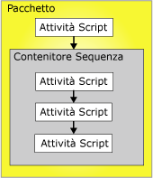

# Vincoli di precedenza
  I vincoli di precedenza collegano eseguibili, contenitori e attività di pacchetti in modo da formare un flusso di controllo e specificano le condizioni che determinano se tali eseguibili devono essere eseguiti. Un eseguibile può essere costituito da un gestore di evento o da un contenitore Ciclo For, Ciclo Foreach o Sequenza. Anche nei gestori di eventi vengono utilizzati vincoli di precedenza per collegare gli eseguibili in modo da formare un flusso di controllo.  
  
 Un vincolo di precedenza collega due eseguibili: l'eseguibile con precedenza e l'eseguibile soggetto al vincolo. L'eseguibile con precedenza viene eseguito prima dell'eseguibile soggetto al vincolo e il risultato della sua esecuzione può determinare se l'eseguibile soggetto al vincolo verrà eseguito o meno. Nella figura seguente vengono illustrati due eseguibili collegati da vincoli di precedenza.  
  
   
  
 In un flusso di controllo lineare, ovvero senza diramazioni, la sequenza di esecuzione delle attività è regolata unicamente dai vincoli di precedenza. In un flusso di controllo con diramazioni l'ordine di esecuzione delle attività e dei contenitori situati immediatamente dopo una diramazione è determinato dal motore di run-time di [!INCLUDE[ssISnoversion](../../includes/ssisnoversion-md.md)] . Il motore di run-time determina anche l'ordine di esecuzione dei flussi di lavoro non connessi in un flusso di controllo.  
  
 L'architettura a contenitori nidificati di [!INCLUDE[ssISnoversion](../../includes/ssisnoversion-md.md)] consente a tutti i contenitori, ad eccezione del contenitore Host attività che incapsula una sola attività, di includere altri contenitori, ognuno con un proprio flusso di controllo. I contenitori Ciclo For, Ciclo Foreach e Sequenza possono includere più attività e altri contenitori, che a loro volta possono includere più attività e contenitori. Un pacchetto con un'attività Script e un contenitore Sequenza può ad esempio includere un vincolo di precedenza che collega l'attività Script e il contenitore Sequenza. Il contenitore Sequenza include tre attività Script e i relativi vincoli di precedenza collegano le tre attività Script in modo da formare un flusso di controllo. Nella figura seguente vengono illustrati i vincoli di precedenza utilizzati in un pacchetto con due livelli di nidificazione.  
  
   
  
 Poiché il pacchetto è al livello principale della gerarchia dei contenitori di [!INCLUDE[ssIS](../../includes/ssis-md.md)] , non è possibile collegare più pacchetti tramite vincoli di precedenza. È tuttavia possibile aggiungere un'attività Esegui pacchetto a un pacchetto e in tal modo collegare indirettamente un altro pacchetto al flusso di controllo.  
  
 Per configurare i vincoli di precedenza, procedere nel modo seguente:  
  
-   Specificare un'operazione di valutazione. Il vincolo di precedenza utilizza un valore di vincolo, un'espressione o entrambi o per determinare se l'eseguibile deve essere eseguito o meno.  
  
-   Se il vincolo di precedenza utilizza il risultato di un'esecuzione, sarà possibile specificare se l'esecuzione deve avere esito positivo, negativo o essere semplicemente completata.  
  
-   Se il vincolo di precedenza utilizza il risultato di una valutazione, sarà possibile specificare un'espressione che restituisce un valore booleano.  
  
-   Specificare se il vincolo di precedenza deve essere valutato singolarmente o insieme ad altri vincoli applicati all'eseguibile soggetto al vincolo.  
  
## Operazioni di valutazione  
 [!INCLUDE[ssISnoversion](../../includes/ssisnoversion-md.md)] offre le operazioni di valutazione seguenti:  
  
-   Un vincolo che utilizza solo il risultato dell'esecuzione dell'eseguibile con precedenza per determinare se l'eseguibile soggetto al vincolo deve essere eseguito o meno. Il risultato dell'esecuzione dell'eseguibile con precedenza indica se l'esecuzione ha avuto esito positivo, negativo o semplicemente se è stata completata. Si tratta dell'operazione predefinita.  
  
-   Un'espressione che viene valutata per determinare se l'eseguibile soggetto al vincolo deve essere eseguito o meno. Se l'espressione restituisce True, l'eseguibile soggetto al vincolo verrà eseguito.  
  
-   Un'espressione e un vincolo che combinano i requisiti del risultato dell'esecuzione dell'eseguibile con precedenza e del risultato restituito dalla valutazione dell'espressione.  
  
-   Un'espressione o un vincolo che utilizza il risultato dell'esecuzione dell'eseguibile con precedenza o il risultato restituito dalla valutazione dell'espressione.  
  
 [!INCLUDE[ssIS](../../includes/ssis-md.md)] In Progettazione SSIS vengono usati i colori per identificare il tipo di vincolo di precedenza. Il vincolo Success è verde, il vincolo Failure è rosso e il vincolo Completion è blu. Per visualizzare in Progettazione [!INCLUDE[ssIS](../../includes/ssis-md.md)] etichette di testo che indicano il tipo di vincolo, è necessario configurare le funzionalità di accessibilità di Progettazione [!INCLUDE[ssIS](../../includes/ssis-md.md)] .  
  
 L'espressione deve essere un'espressione [!INCLUDE[ssIS](../../includes/ssis-md.md)] valida e in essa possono essere incluse funzioni, operatori, nonché variabili personalizzate e di sistema. Per altre informazioni, vedere [Espressioni di Integration Services &#40;SSIS&#41;](../../integration-services/expressions/integration-services-ssis-expressions.md) e [Variabili di Integration Services &#40;SSIS&#41;](../../integration-services/integration-services-ssis-variables.md).  
  
## Risultati di esecuzione  
 I vincoli di precedenza possono utilizzare i risultati di esecuzione seguenti, singolarmente o in combinazione con un'espressione.  
  
-   Il vincolo Completion richiede solo che l'eseguibile con precedenza abbia completato l'esecuzione, indipendentemente dall'esito, affinché l'eseguibile soggetto al vincolo venga eseguito.  
  
-   Il vincolo Success richiede che l'eseguibile con precedenza abbia completato correttamente l'esecuzione, affinché l'eseguibile soggetto al vincolo venga eseguito.  
  
-   Il vincolo Failure richiede che l'eseguibile con precedenza non abbia completato correttamente l'esecuzione, affinché l'eseguibile soggetto al vincolo venga eseguito.  
  
> [!NOTE]  
>  È possibile raggruppare in una condizione con AND logico solo **vincoli di precedenza** appartenenti alla stessa raccolta. Non è ad esempio possibile combinare i vincoli di precedenza utilizzati in due contenitori Ciclo Foreach diversi.  
  
## Impostare le proprietà di un vincolo di precedenza tramite Editor vincoli di precedenza  
  
1.  In [!INCLUDE[ssBIDevStudioFull](../../includes/ssbidevstudiofull-md.md)]aprire il progetto di [!INCLUDE[ssISnoversion](../../includes/ssisnoversion-md.md)] che contiene il pacchetto desiderato.  
  
2.  In Esplora soluzioni fare doppio clic sul pacchetto per aprirlo.  
  
3.  Fare clic sulla scheda **Flusso di controllo** .  
  
4.  Fare doppio clic sul vincolo di precedenza.  
  
     Verrà aperta la finestra di dialogo **Editor vincoli di precedenza** .  
  
5.  Nell'elenco a discesa **Operazione valutazione** selezionare un'operazione di valutazione.  
  
6.  Nell'elenco a discesa **Valore** selezionare il risultato dell'esecuzione dell'eseguibile con precedenza.  
  
7.  Se l'operazione di valutazione usa un'espressione, digitare l'espressione nella casella **Espressione** e fare clic su **Test** per valutarla.  
  
    > [!NOTE]  
    >  Per i nomi delle variabili viene fatta distinzione tra maiuscole e minuscole.  
  
8.  Se all'eseguibile soggetto al vincolo sono connessi più contenitori o attività, selezionare **AND logico** per specificare che il risultato di esecuzione di tutti gli eseguibili con precedenza deve essere **true**. Selezionare **OR logico** per specificare che è sufficiente che un solo risultato di esecuzione restituisca **true**.  
  
9. Scegliere **OK** per chiudere la finestra **Editor vincoli di precedenza**.  
  
10. Per salvare il pacchetto aggiornato, scegliere **Salva elementi selezionati** dal menu **File** .  

## Editor vincoli di precedenza
Utilizzare la finestra di dialogo **Editor vincoli di precedenza** per configurare i vincoli di precedenza.  
  
### Opzioni  
 **Operazione di valutazione**  
 Consente di specificare l'operazione di valutazione utilizzata dal vincolo di precedenza. Le operazioni sono **Vincolo**, **Espressione**, **Espressione e vincolo**e **Espressione o vincolo**.  
  
 **Value**  
 Consente di specificare il valore di vincolo, ovvero **Operazione completata**, **Errore**oppure **Completamento**.  
  
> [!NOTE]  
>  La riga del vincolo di precedenza è di colore verde in caso di **Esito positivo**, evidenziata per **Esito negativo**e blu per **Completamento**.  
  
 **Espressione**  
 Se si usano le operazioni **Espressione**, **Espressione e vincolo**o **Espressione o vincolo**, digitare un'espressione o avviare Generatore di espressioni per creare l'espressione. L'espressione deve restituire un valore booleano.  
  
 **Test**  
 Consente di convalidare l'espressione.  
  
 **AND logico**  
 Selezionare questa opzione per specificare che devono essere valutati contemporaneamente più vincoli di precedenza nello stesso file eseguibile. Tutti i vincoli devono restituire **True**.  
  
> [!NOTE]  
>  Questo tipo di vincolo di precedenza viene visualizzato come riga di colore verde, evidenziata o blu continua.  
  
 **OR logico**  
 Selezionare questa opzione per specificare che devono essere valutati contemporaneamente più vincoli di precedenza nello stesso file eseguibile. Almeno un vincolo deve restituire **True**.  
  
> [!NOTE]  
>  Questo tipo di vincolo di precedenza viene visualizzato come riga di colore verde, evidenziata o blu tratteggiata.  
  
## Impostare le proprietà di un vincolo di precedenza nella finestra Proprietà  
  
1.  In [!INCLUDE[ssBIDevStudioFull](../../includes/ssbidevstudiofull-md.md)]aprire il progetto di [!INCLUDE[ssISnoversion](../../includes/ssisnoversion-md.md)] che contiene il pacchetto da modificare.  
  
2.  In Esplora soluzioni fare doppio clic sul pacchetto per aprirlo.  
  
3.  Fare clic sulla scheda **Flusso di controllo** . Nell'area di progettazione della scheda **Flusso di controllo** fare clic sul vincolo di precedenza con il pulsante destro del mouse e quindi scegliere **Proprietà**. Nella finestra Proprietà modificare i valori delle proprietà.  
  
4.  Nella finestra **Proprietà** impostare le proprietà di lettura/scrittura seguenti dei vincoli di precedenza:  
  
    |Proprietà di lettura/scrittura|Azione di configurazione|  
    |--------------------------|--------------------------|  
    |Descrizione|Specificare una descrizione.|  
    |EvalOp|Selezionare un'operazione di valutazione. In caso di selezione dell'operazione **Expression**, **ExpressionAndConstant**o **ExpressionOrConstant** , è possibile specificare un'espressione.|  
    |Espressione|Se l'operazione di valutazione include un'espressione, specificare l'espressione. L'espressione deve restituire un valore booleano. Per altre informazioni sul linguaggio delle espressioni, vedere [Espressioni di Integration Services &#40;SSIS&#41;](../../integration-services/expressions/integration-services-ssis-expressions.md).|  
    |LogicalAnd|Impostare **LogicalAnd** in modo da specificare se il vincolo di precedenza viene valutato insieme ad altri vincoli di precedenza, quando più eseguibili precedono e sono collegati all'eseguibile soggetto al vincolo|  
    |nome|Aggiornare il nome del vincolo di precedenza.|  
    |ShowAnnotation|Specificare il tipo di annotazione da utilizzare. Selezionare **Never** per disabilitare le annotazioni, **AsNeeded** per attivare le annotazioni su richiesta, **ConstraintName** per aggiungere automaticamente annotazioni usando il valore della proprietà Name, **ConstraintDescription** per aggiungere automaticamente annotazioni usando il valore della proprietà Description e **ConstraintOptions** per aggiungere automaticamente annotazioni usando i valori delle proprietà Value ed Expression.|  
    |valore|Se l'operazione di valutazione specificata nella proprietà EvalOP include un vincolo, selezionare il risultato dell'esecuzione dell'eseguibile vincolante.|  
  
5.  Chiudere la finestra Proprietà.  
  
6.  Per salvare il pacchetto aggiornato, scegliere **Salva elementi selezionati** dal menu **File** .  

## Impostare il valore di un vincolo di precedenza tramite il menu di scelta rapida  
  
1.  In [!INCLUDE[ssBIDevStudioFull](../../includes/ssbidevstudiofull-md.md)]aprire il progetto di [!INCLUDE[ssISnoversion](../../includes/ssisnoversion-md.md)] che contiene il pacchetto desiderato.  
  
2.  In Esplora soluzioni fare doppio clic sul pacchetto per aprirlo.  
  
3.  Fare clic sulla scheda **Flusso di controllo** .  
  
4.  Nell'area di progettazione della scheda **Flusso di controllo** fare clic con il pulsante destro del mouse sul vincolo di precedenza e scegliere **Success**, **Failure**o **Completion**.  
  
5.  Per salvare il pacchetto aggiornato scegliere **Salva elementi selezionati** dal menu **File** .  

## Aggiunta di espressioni ai vincoli di precedenza
 In un vincolo di precedenza è possibile utilizzare un'espressione per definire il vincolo tra due eseguibili: l'eseguibile con precedenza e l'eseguibile soggetto al vincolo. Gli eseguibili possono essere attività o contenitori. L'espressione può essere utilizzata da sola o in combinazione con il risultato dell'esecuzione dell'eseguibile con precedenza. Il risultato dell'esecuzione di un eseguibile può essere Success o Failure. Quando si configura il risultato dell'esecuzione di un vincolo di precedenza è possibile impostare il risultato dell'esecuzione su **Esito positivo**, **Errore**o **Completamento**. **Esito positivo** richiede che l'esecuzione dell'eseguibile con precedenza venga completata correttamente, **Errore** richiede che l'esecuzione dell'eseguibile con precedenza non riesca e **Completamento** indica che l'eseguibile soggetto al vincolo deve essere eseguito indipendentemente dall'esito dell'esecuzione dell'attività con precedenza. Per altre informazioni, vedere [Vincoli di precedenza](../../integration-services/control-flow/precedence-constraints.md).  
  
 L'espressione, che deve restituire **True** o **False**, deve essere un'espressione di [!INCLUDE[ssISnoversion](../../includes/ssisnoversion-md.md)] valida. e può utilizzare valori letterali, variabili di sistema e personalizzate, nonché le funzioni e gli operatori forniti dalla grammatica delle espressioni di [!INCLUDE[ssIS](../../includes/ssis-md.md)]. L'espressione `@Count == SQRT(144) + 10`, ad esempio, usa la variabile **Count**, la funzione SQRT e gli operatori di uguaglianza (==) e di addizione (+). Per altre informazioni, vedere [Espressioni di Integration Services &#40;SSIS&#41;](../../integration-services/expressions/integration-services-ssis-expressions.md).  
  
 Nella figura seguente le attività A e B sono collegate da un vincolo di precedenza che utilizza il risultato di un'esecuzione e un'espressione. Il valore del vincolo è impostato su **Esito positivo** e l'espressione è  `@X >== @Z`. L'attività B, soggetta al vincolo, viene eseguita solo se l'attività A viene completata e il valore della variabile **X** è maggiore o uguale a quello della variabile **Z**.  
  
   
  
 Per collegare gli eseguibili è inoltre possibile utilizzare più vincoli di precedenza contenenti espressioni diverse. Nella figura seguente, ad esempio, le attività B e C sono collegate all'attività A da vincoli di precedenza che utilizzano risultati di esecuzione ed espressioni. I valori di entrambi i vincoli sono impostati su **Esito positivo.** Uno dei vincoli di precedenza include l'espressione `@X >== @Z`, mentre l'altro include l'espressione `@X < @Z`. A seconda dei valori assunti dalle variabili **X** e **Z**, verrà eseguita l'attività C o l'attività B.  
  
   
  
 Per aggiungere o modificare un'espressione, è possibile usare **Editor vincoli di precedenza** in Progettazione [!INCLUDE[ssIS](../../includes/ssis-md.md)] e la finestra Proprietà disponibile in [!INCLUDE[ssBIDevStudioFull](../../includes/ssbidevstudiofull-md.md)]. La finestra Proprietà non è tuttavia in grado di verificare la sintassi delle espressioni.  
  
 Se un vincolo di precedenza include un'espressione, sull'area di progettazione delle scheda **Flusso di controllo** verrà visualizzata un'icona accanto al vincolo di precedenza e l'espressione verrà visualizzata nella descrizione comando di tale icona.  

### Aggiungere un'espressione a un vincolo di precedenza  
  
1.  In [!INCLUDE[ssBIDevStudioFull](../../includes/ssbidevstudiofull-md.md)]aprire il progetto di [!INCLUDE[ssISnoversion](../../includes/ssisnoversion-md.md)] che contiene il pacchetto desiderato.  
  
2.  In Esplora soluzioni fare doppio clic sul pacchetto per aprirlo.  
  
3.  Fare clic sulla scheda **Flusso di controllo** .  
  
4.  Nell'area di progettazione della scheda **Flusso di controllo** fare doppio clic sul vincolo di precedenza. Verrà aperta la finestra di dialogo **Editor vincoli di precedenza** .  
  
5.  Selezionare **Espressione**, **Espressione e vincolo**o **Espressione o vincolo** nell'elenco **Operazione valutazione** .  
  
6.  Digitare un'espressione nella casella di testo **Espressione** o avviare Generatore di espressioni per creare un'espressione.  
  
7.  Per convalidare la sintassi dell'espressione, fare clic su **Test**.  
  
8.  Per salvare il pacchetto aggiornato, scegliere **Salva elementi selezionati** dal menu **File** .  
 
### Combinare valori di esecuzione ed espressioni  
 Nella tabella seguente vengono descritti gli effetti ottenuti combinando un vincolo su un valore di esecuzione e un'espressione in un vincolo precedenza.  
  
|Operazioni di valutazione|Valore restituito dal vincolo|Valore restituito dall'espressione|Esecuzione eseguibile soggetto al vincolo|  
|--------------------------|-----------------------------|-----------------------------|---------------------------------|  
|Vincolo|True|N/D|True|  
|Vincolo|False|N/D|False|  
|Espressione|N/D|True|True|  
|Espressione|N/D|False|False|  
|Vincolo ed espressione|True|True|True|  
|Vincolo ed espressione|True|False|False|  
|Vincolo ed espressione|False|True|False|  
|Vincolo ed espressione|False|False|False|  
|Vincolo o espressione|True|True|True|  
|Vincolo o espressione|True|False|True|  
|Vincolo o espressione|False|True|True|  
|Vincolo o espressione|False|False|False|  

## Scenari complessi con più vincoli di precedenza 
Un vincolo di precedenza consente di connettere due eseguibili, ad esempio due attività, due contenitori o un'attività e un contenitore. Gli elementi connessi sono noti come eseguibile con precedenza ed eseguibile soggetto al vincolo. A un eseguibile soggetto a vincolo possono essere applicati più vincoli di precedenza. Per altre informazioni, vedere [Vincoli di precedenza](../../integration-services/control-flow/precedence-constraints.md).  
  
 Raggruppando più vincoli è possibile definire scenari complessi, che consentono di implementare flussi di controllo complessi nei pacchetti. Nella figura seguente, ad esempio, l'attività D è collegata all'attività A da un vincolo **positivo** , l'attività D è collegata all'attività B da un vincolo **negativo** e l'attività D è collegata all'attività C da un vincolo **positivo** . I vincoli di precedenza tra le attività D e A, tra le attività D e B e tra le attività D e C sono legati da una relazione logica *e* . L'attività D viene quindi eseguita solo se l'attività A viene completata, l'attività B non viene eseguita e l'attività C deve essere eseguita correttamente.  
  
   
  
### Proprietà LogicalAnd  
 Se a un'attività o a un contenitore sono applicati più vincoli, la proprietà **LogicalAnd** specificherà se il corrispondente vincolo di precedenza viene valutato singolarmente o insieme ad altri vincoli.  
  
 Per impostare la proprietà **LogicalAnd** è possibile usare **Editor vincoli di precedenza** in Progettazione [!INCLUDE[ssIS](../../includes/ssis-md.md)] oppure la finestra Proprietà disponibile su [!INCLUDE[ssBIDevStudioFull](../../includes/ssbidevstudiofull-md.md)].  

## Impostare il valore predefinito per i vincoli di precedenza  
La prima volta che si usa Progettazione [!INCLUDE[ssIS](../../includes/ssis-md.md)] , il valore predefinito di un vincolo di precedenza è **Success**. Eseguire la procedura seguente per configurare Progettazione [!INCLUDE[ssIS](../../includes/ssis-md.md)] per l'utilizzo di un valore predefinito diverso per i vincoli di precedenza.
  
1.  Aprire [!INCLUDE[ssBIDevStudioFull](../../includes/ssbidevstudiofull-md.md)].  
  
2.  Scegliere **Opzioni** dal menu **Strumenti**.  
  
3.  Nella finestra di dialogo **Opzioni** espandere **Finestre di progettazione Business Intelligence** e quindi espandere **Finestre di progettazione Integration Services**.  
  
4.  Fare clic su **Connessione automatica flusso di controllo** e selezionare **Per impostazione predefinita connetti la nuova forma alla forma selezionata**.  
  
5.  Nell'elenco a discesa selezionare **Usa vincolo Esito negativo per la nuova forma** oppure **Usa vincolo Completamento per la nuova forma**.  
  
6.  Fare clic su **OK**.  
  
## Creare un vincolo di precedenza predefinito  
  
1.  In [!INCLUDE[ssBIDevStudioFull](../../includes/ssbidevstudiofull-md.md)]aprire il progetto di [!INCLUDE[ssISnoversion](../../includes/ssisnoversion-md.md)] che contiene il pacchetto desiderato.  
  
2.  In Esplora soluzioni fare doppio clic sul pacchetto per aprirlo.  
  
3.  Fare clic sulla scheda **Flusso di controllo** .  
  
4.  Nell'area di progettazione della scheda **Flusso di controllo** fare clic sull'attività o sul contenitore e trascinarne il connettore fino all'eseguibile a cui si desidera applicare il vincolo di precedenza.  
  
5.  Per salvare il pacchetto aggiornato, scegliere **Salva elementi selezionati** dal menu **File** .  
