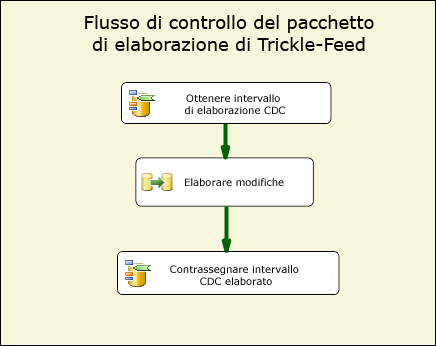
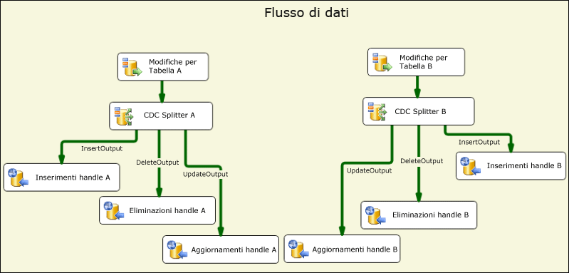
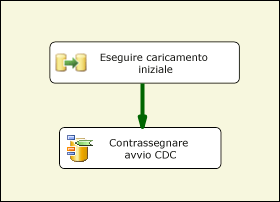
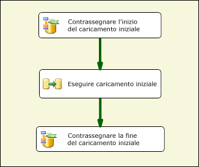
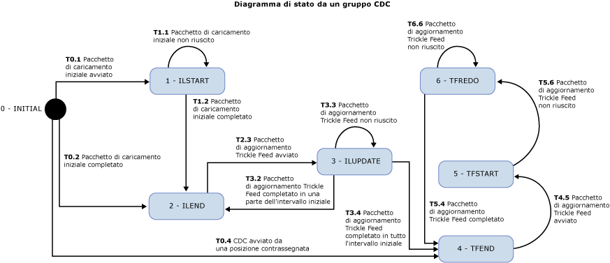

# Componenti di flusso CDC
  I componenti Change Data Capture di Attunity per Microsoft [!INCLUDE[ssISCurrent](../../includes/ssiscurrent-md.md)] consentono agli sviluppatori SSIS di utilizzare CDC e riducono la complessità dei pacchetti CDC.  
  
 I componenti CDC di SSIS sono progettati per usare le funzionalità CDC di [!INCLUDE[ssCurrent](../../includes/sscurrent-md.md)] in cui le tabelle di origine rappresentano lo stesso database di [!INCLUDE[ssCurrent](../../includes/sscurrent-md.md)] o un database Oracle (quando si usa Oracle CDC Service per [!INCLUDE[ssCurrent](../../includes/sscurrent-md.md)]). Le tabelle partizionate non sono supportate.  
  
 Sono inclusi componenti Flusso di controllo e di dati che semplificano l'esperienza di lettura ed elaborazione dei dati di modifica nei pacchetti SSIS. I componenti possono essere aggiunti alla libreria componenti in Microsoft [!INCLUDE[ssCurrent](../../includes/sscurrent-md.md)], ma vengono installati separatamente.  
  
 Di seguito sono elencati i componenti Change Data Capture di Attunity:  
  
 **Componente del flusso di controllo CDC**:  
  
 [Attività di controllo CDC](../../integration-services/control-flow/cdc-control-task.md)  
  
 **Componenti del flusso di dati CDC**:  
  
 [Origine CDC](../../integration-services/data-flow/cdc-source.md)  
  
 [Barra di divisione CDC](../../integration-services/data-flow/cdc-splitter.md)  
  
## Installation  
 Questa sezione descrive le procedure di installazione dei componenti CDC per Microsoft [!INCLUDE[ssISCurrent](../../includes/ssiscurrent-md.md)].  
  
 I componenti CDC per SSIS sono inclusi nel pacchetto con Microsoft® Change Data Capture Designer and Service per Oracle di Attunity per Microsoft SQL Server® 2016. Questo download fa parte del Feature Pack di SQL Server 2016. I componenti del Feature Pack sono disponibili per il download nella [pagina Web del Feature Pack di SQL Server 2016](http://go.microsoft.com/fwlink/?LinkId=746297).  
  
### Supporto versione  
 I prodotti Microsoft [!INCLUDE[ssNoVersion](../../includes/ssnoversion-md.md)] seguenti sono supportati dai componenti CDC per SSIS:  
  
-   Microsoft [!INCLUDE[ssCurrent](../../includes/sscurrent-md.md)]  
  
-   Microsoft [!INCLUDE[ssBIDevStudio](../../includes/ssbidevstudio-md.md)] per Visual Studio 2015  
  
 Queste versioni sono supportate sui sistemi operativi e le piattaforme seguenti:  
  
-   Windows Vista con Service Pack 2  
  
-   Windows 7  
  
-   Windows 10  
  
-   Windows Server 2008 con Service Pack 2  
  
-   Windows Server 2008 R2  
  
-   Windows Server 2012  
  
### Esecuzione del programma di installazione  
 Prima di eseguire l'installazione guidata, assicurarsi che il [!INCLUDE[ssCurrent](../../includes/sscurrent-md.md)] [!INCLUDE[ssBIDevStudio](../../includes/ssbidevstudio-md.md)] è chiuso. Quindi, seguire le indicazioni nell'installazione guidata.  
  
### Riavviare SSIS  
 Dopo avere installato i componenti CDC, è necessario riavviare il servizio SSIS per essere certi che i componenti funzionino correttamente quando si sviluppano pacchetti in [!INCLUDE[ssBIDevStudio](../../includes/ssbidevstudio-md.md)].  
  
 Al termine dell'installazione dei componenti, viene visualizzato un messaggio. Fare clic su **Sì** quando richiesto.  
  
### Disinstallazione dei componenti CDC Microsoft  
 Per disinstallare l'origine CDC, la barra di divisione CDC o l'attività di controllo CDC, utilizzare la disinstallazione guidata. Prima di disinstallare i componenti verificare quanto segue:  
  
 Se si utilizza il [!INCLUDE[ssCurrent](../../includes/sscurrent-md.md)] [!INCLUDE[ssBIDevStudio](../../includes/ssbidevstudio-md.md)] per lo sviluppo di pacchetti, verificare che il [!INCLUDE[ssBIDevStudio](../../includes/ssbidevstudio-md.md)] viene chiuso prima dell'esecuzione della procedura guidata disinstalla.  
  
## Vantaggi  
 I componenti CDC per [!INCLUDE[ssCurrent](../../includes/sscurrent-md.md)] [!INCLUDE[ssISnoversion](../../includes/ssisnoversion-md.md)] componenti consentono agli sviluppatori SSIS di compilare facilmente pacchetti SSIS che elaborano i dati delle modifiche. Questi componenti migliorano la capacità degli sviluppatori di SSIS di gestire CDC e riducono la complessità dei pacchetti CDC.  
  
 I componenti CDC di SSIS sono utilizzati per fornire i dati di modifica in modo da facilitarne un'ulteriore elaborazione per la replica, ovvero il caricamento di un data warehouse, l'aggiornamento di dimensioni a modifica lenta per OLAP, il controllo delle modifiche o ulteriori altri possibili utilizzi. Il tipo di ulteriore elaborazione utilizzato è determinato dallo sviluppatore di SSIS.  
  
 I componenti CDC di SSIS sono progettati per l'interazione con la funzionalità CDC di [!INCLUDE[ssCurrent](../../includes/sscurrent-md.md)] per usare tabelle delle modifiche che si trovano nello stesso database di [!INCLUDE[ssCurrent](../../includes/sscurrent-md.md)] .  
  
## Introduzione ai componenti Change Data Capture  
 Un pacchetto CDC tipico elabora le modifiche apportate a un gruppo di tabelle. La parte del flusso di controllo di base di questo tipo di pacchetto CDC è mostrata nella figura sottostante. Questo pacchetto viene denominato pacchetto di elaborazione Trickle-Feed.  
  
   
  
 Questo [!INCLUDE[ssCurrent](../../includes/sscurrent-md.md)] [!INCLUDE[ssISnoversion](../../includes/ssisnoversion-md.md)] flusso di controllo contiene due attività di controllo CDC e l'attività flusso di dati. La prima attività denominata **Get CDC Processing Range** stabilisce l'intervallo LSN per le modifiche elaborate nell'attività Flusso di dati denominata **Process Changes**. Questo intervallo viene stabilito in base a ciò che è stato elaborato durante l'ultima esecuzione del pacchetto e salvato in un archivio persistente.  
  
 Per altre informazioni sull'uso dell'attività di controllo CDC, vedere [Attività di controllo CDC](../../integration-services/control-flow/cdc-control-task.md) e [CDC Control Task Editor](../../integration-services/control-flow/cdc-control-task-editor.md).  
  
 Nella figura seguente viene visualizzato il flusso di dati **Process Changes** , che mostra concettualmente come vengono elaborate le modifiche.  
  
   
  
 Nella figura sono illustrati i passaggi seguenti:  
  
-   **Changes for Table X** è un'origine CDC che legge le modifiche apportate alla tabella X effettuate nell'intervallo di elaborazione CDC determinato nel flusso di controllo padre.  
  
-   **CDC Splitter X** viene usato per suddividere le modifiche in inserimenti, eliminazioni e aggiornamenti. In questo scenario si presume che l'origine CDC sia configurata per produrre modifiche Net in modo da poter elaborare tipi di modifica diversi in parallelo.  
  
-   Le modifiche specifiche sono quindi ulteriormente elaborate a valle. In questa illustrazione, le modifiche vengono inserite in tabelle utilizzando più destinazioni ODBC, ma nei casi effettivi l'elaborazione potrebbe essere diversa.  
  
 Per ulteriori informazioni sull'origine CDC, vedere:  
  
 [Origine CDC](../../integration-services/data-flow/cdc-source.md)  
  
 [Editor origine CDC &#40; Pagina Gestione connessione &#41;](../../integration-services/data-flow/cdc-source-editor-connection-manager-page.md)  
  
 [Editor origine CDC &#40; Pagina colonne &#41;](../../integration-services/data-flow/cdc-source-editor-columns-page.md)  
  
 [Editor origine CDC &#40; Pagina Output degli errori &#41;](../../integration-services/data-flow/cdc-source-editor-error-output-page.md)  
  
 Per ulteriori informazioni sulla barra di divisione CDC, vedere:  
  
 [Barra di divisione CDC](../../integration-services/data-flow/cdc-splitter.md)  
  
 Uno dei problemi di base che richiede attenzione quando si compilano pacchetti CDC è il modo in cui l'elaborazione delle modifiche interagisce con il caricamento iniziale (o l'elaborazione iniziale) dei dati.  
  
 I componenti CDC supportano tre scenari distinti di caricamento iniziale ed elaborazione delle modifiche:  
  
-   Caricamento iniziale eseguito con uno snapshot del database. In questo caso, l'elaborazione delle modifiche inizia con l'LSN dell'evento snapshot.  
  
-   Caricamento iniziale da un database disattivato. In questo caso, non viene apportata alcuna modifica durante il caricamento iniziale. In un determinato momento del caricamento iniziale viene eseguito il campionamento dell'LSN corrente e l'elaborazione delle modifiche inizia con tale LSN.  
  
-   Caricamento iniziale da un database attivo. In questo caso, poiché è in corso il caricamento iniziale, le modifiche vengono apportate al database e non esiste alcun LSN dal quale è possibile avviare con precisione l'elaborazione delle modifiche. In questo caso, lo sviluppatore del pacchetto di caricamento iniziale può campionare l'LSN corrente del database di origine prima e dopo il caricamento iniziale. Durante l'elaborazione delle modifiche, occorre pertanto prestare attenzione alle modifiche apportate in parallelo al caricamento iniziale poiché alcune delle modifiche elaborate risultano già rilevate durante il caricamento iniziale. È ad esempio possibile che una modifica di inserimento non venga eseguita correttamente e venga restituito un errore di chiave duplicata perché la riga inserita è stata già rilevata dal processo di caricamento iniziale.  
  
 Nella figura seguente viene mostrato un pacchetto SSIS in grado di gestire i primi due scenari:  
  
   
  
 Nella figura seguente viene mostrato un pacchetto SSIS in grado di gestire il terzo scenario:  
  
   
  
 Seguendo il pacchetto di caricamento iniziale, un pacchetto di aggiornamento Trickle-Feed viene eseguito ripetutamente in base a una pianificazione per elaborare modifiche quando queste diventano disponibili per l'utilizzo.  
  
 Il passaggio dello stato dell'elaborazione CDC dal pacchetto di caricamento iniziale al pacchetto Trickle-Feed e tra attività diverse all'interno di ogni pacchetto viene eseguito mediante una speciale variabile stringa del pacchetto SSIS. Il valore di questa variabile viene indicato come stato CDC, che riflette lo stato corrente di elaborazione CDC per i gruppi di tabelle gestiti dai pacchetti di caricamento iniziale e Trickle-Feed.  
  
 Il valore della variabile dello stato CDC deve essere gestito in un archivio permanente, deve essere letto prima di avviare l'elaborazione CDC e deve essere salvato con lo stato corrente al termine dell'elaborazione. L'attività di caricamento e archiviazione dello stato CDC può essere gestita dallo sviluppatore di SSIS ma il componente di controllo CDC può automatizzare questa attività mantenendo il valore dello stato CDC in una tabella di database.  
  
## Considerazioni sulla sicurezza  
 In questa sezione vengono elencate alcune considerazioni di sicurezza correlate all'utilizzo dei componenti CDC in SSIS.  
  
### Autorizzazione di accesso per modificare i dati  
 I pacchetti di aggiornamento Trickle-Feed richiedono l'accesso alle funzioni CDC di [!INCLUDE[ssCurrent](../../includes/sscurrent-md.md)] . Per impostazione predefinita, l'accesso è consentito ai membri del ruolo predefinito del database **db_owner** . Dato che **db_owner** è un ruolo potente, quando si definiscono le istanze di acquisizione all'interno di [!INCLUDE[ssCurrent](../../includes/sscurrent-md.md)] , è consigliabile associare un ruolo di sicurezza di controllo a ogni istanza di acquisizione che consente al pacchetto CDC di SSIS di usare un utente molto più limitato per l'elaborazione delle modifiche.  
  
### Accesso a LSN corrente del database CDC  
 Le operazioni dell'attività di controllo CDC per contrassegnare l'LSN iniziale per elaborazione delle modifiche devono essere in grado di trovare l'LSN corrente del database CDC. Questa operazione viene eseguita usando la stored procedure **sp_replincrementlsn** dal database master. L'autorizzazione Execute per questa procedura deve essere fornita all'account di accesso utilizzato per la connessione al database CDC di [!INCLUDE[ssCurrent](../../includes/sscurrent-md.md)] .  
  
### Accesso alla tabella CDC States  
 La tabella CDC States viene usata per preservare automaticamente stati CDC che devono essere aggiornati dall'account di accesso usato per la connessione al database CDC di [!INCLUDE[ssCurrent](../../includes/sscurrent-md.md)] . Poiché questa tabella viene creata dallo sviluppatore di SSIS, impostare l'amministratore di sistema di [!INCLUDE[ssCurrent](../../includes/sscurrent-md.md)] come un utente autorizzato a creare database di [!INCLUDE[ssCurrent](../../includes/sscurrent-md.md)] ed eseguire attività amministrative e di manutenzione. Inoltre, un amministratore di sistema di [!INCLUDE[ssCurrent](../../includes/sscurrent-md.md)] che utilizza database abilitati CDC deve essere bene informato sulla tecnologia e l'implementazione CDC di [!INCLUDE[ssCurrent](../../includes/sscurrent-md.md)] .  
  
## Raggruppamento di tabelle per elaborazione CDC  
 La dimensione dei progetti di database varia da alcune tabelle a molte migliaia di tabelle. Quando si progettano pacchetti di caricamento iniziale e CDC, è opportuno raggruppare le tabelle in gruppi molto più piccoli per una gestione più semplice e una maggiore efficienza. In questa sezione vengono elencate varie considerazioni che influiscono sull'ordinamento di tabelle in piccoli gruppi, in cui le tabelle vengono inizialmente caricate e quindi aggiornate come un gruppo.  
  
 I modelli CDC supportati dai componenti CDC presuppongono che questo raggruppamento sia già determinato. Ogni gruppo definisce un contesto CDC distinto gestito separatamente dagli altri gruppi. Per ogni gruppo, vengono creati pacchetti di caricamento iniziale e di aggiornamento Trickle-Feed. Gli aggiornamenti Trickle-Feed vengono pianificati per esecuzioni periodiche basate sulla frequenza dei vincoli di elaborazione delle modifiche (ad esempio, utilizzo di CPU e IO, impatto su altri sistemi) e la latenza desiderata.  
  
 Le tabelle vengono raggruppate in base alle considerazioni seguenti:  
  
1.  In base al database di destinazione. Tutte le tabelle che vengono scritte in database di destinazione diversi o subiscono elaborazioni diverse devono essere assegnate a gruppi CDC diversi.  
  
2.  Le tabelle correlate ai vincoli di integrità referenziale devono essere assegnate allo stesso gruppo per evitare problemi di integrità referenziale a livello di destinazione.  
  
3.  Le tabelle per le quali è possibile tollerare una latenza superiore possono essere raggruppate in modo da poter essere elaborate meno frequentemente e ridurre il carico di sistema complessivo.  
  
4.  Le tabelle soggette a modifiche più frequenti devono essere incluse in gruppi più piccoli, mentre quelle soggette a modifiche meno frequenti possono essere incluse in gruppi più grandi.  
  
 Per ogni gruppo CDC vengono creati i due pacchetti seguenti:  
  
-   Un pacchetto di caricamento iniziale che legge l'intero intervallo di dati dalle tabelle di origine e lo applica alle tabelle di destinazione.  
  
-   Un pacchetto di aggiornamento Trickle-Feed che legge le modifiche apportate alle tabelle di origine e applica le modifiche alle tabelle di destinazione. Questo pacchetto deve essere eseguito regolarmente.  
  
## Stato CDC  
 Ad ogni gruppo CDC è associato uno stato, rappresentato da una stringa con un formato specifico. Per altre informazioni, vedere [Attività di controllo CDC](../../integration-services/control-flow/cdc-control-task.md). Nella tabella seguente vengono illustrati i possibili valori dello stato CDC.  
  
|State|Description|  
|-----------|-----------------|  
|0-(INITIAL)|Lo stato esistente prima dell'esecuzione di qualsiasi pacchetto nel gruppo CDC corrente. È anche lo stato quando lo stato CDC è vuoto.   Per altre informazioni sulle operazioni dell'attività di controllo CDC, vedere [Attività di controllo CDC](../../integration-services/control-flow/cdc-control-task.md).|  
|1-ILSTART (Initial-Load-Started)|Si tratta dello stato esistente quando il pacchetto di caricamento iniziale viene avviato. Si verifica dopo la chiamata dell'attività di controllo CDC dall'operazione **MarkInitialLoadStart** .   Per altre informazioni sulle operazioni dell'attività di controllo CDC, vedere [Attività di controllo CDC](../../integration-services/control-flow/cdc-control-task.md).|  
|2- ILEND (Initial-Load-Ended)|Si tratta dello stato esistente quando il pacchetto di caricamento iniziale termina correttamente. Si verifica dopo la chiamata di operazione MarkInitialLoadEnd all'attività di controllo CDC.   Per altre informazioni sulle operazioni dell'attività di controllo CDC, vedere [Attività di controllo CDC](../../integration-services/control-flow/cdc-control-task.md).|  
|3-ILUPDATE (Initial Load Update)|Si tratta dello stato esistente dopo la prima esecuzione del pacchetto di aggiornamento in seguito al caricamento iniziale mentre l'elaborazione dell'intervallo di elaborazione iniziale è ancora in corso. Si verifica dopo la chiamata dell'attività di controllo CDC dall'operazione **GetProcessingRange** .   Se si usa la colonna **_$reprocessing** , viene impostato su 1 per indicare che le righe potrebbero essere già in corso di rielaborazione nella destinazione.   Per altre informazioni sulle operazioni dell'attività di controllo CDC, vedere [Attività di controllo CDC](../../integration-services/control-flow/cdc-control-task.md).|  
|4-TFEND (Trickle-Feed-Update-Ended)|Si tratta dello stato previsto per le esecuzioni CDC normali. Indica che l'esecuzione precedente è stata completata e che è possibile avviare una nuova esecuzione con un nuovo intervallo di elaborazione.|  
|5-TFSTART (Trickle-Feed-Update-Started)|Si tratta dello stato esistente in esecuzioni successive del pacchetto di aggiornamento dopo la chiamata dell'attività di controllo CDC dall'operazione **GetProcessingRange** .   Indica che un'esecuzione CDC normale è stata avviata in maniera pulita, ma non è stata o non è ancora, terminata (**MarkProcessedRange**).   Per altre informazioni sulle operazioni dell'attività di controllo CDC, vedere [Attività di controllo CDC](../../integration-services/control-flow/cdc-control-task.md).|  
|6-TFREDO (Reprocessing-Trickle-Feed-Updates)|Si tratta dello stato di **GetProcessingRange** che si verifica dopo TFSTART. Indica che l'esecuzione precedente non è stata completata correttamente.   Se si utilizza la colonna __$reprocessing, viene impostato su 1 per indicare che a livello di destinazione è possibile che le righe siano già in corso di rielaborazione.|  
|7-ERROR|Il gruppo CDC si trova in uno stato ERROR.|  
  
 Di seguito è riportato il diagramma di stato per i componenti CDC. Lo stato ERROR indica che è stato raggiunto uno stato non previsto. Gli stati previsti vengono illustrati nel diagramma sottostante, tuttavia il diagramma non include lo stato ERROR.  
  
 Ad esempio, alla fine di un pacchetto di caricamento iniziale, quando si cerca di impostare lo stato su ILEND, se lo stato è TFSTART il gruppo CDC è in uno stato di errore e il pacchetto di aggiornamento Trickle-Feed non è viene eseguito (il pacchetto di caricamento iniziale è in esecuzione).  
  
   
  
 Dopo avere eseguito correttamente il pacchetto di caricamento iniziale, il pacchetto di aggiornamento Trickle-Feed viene eseguito ripetutamente in base a una pianificazione predeterminata per elaborare le modifiche alle tabelle di origine. Ogni esecuzione del pacchetto di aggiornamento Trickle-Feed è un'esecuzione CDC.  
  
## Contenuto della sezione  
  
-   [Origine CDC](../../integration-services/data-flow/cdc-source.md)  
  
-   [Barra di divisione CDC](../../integration-services/data-flow/cdc-splitter.md)  
  
## Attività correlate  
  
-   [Indirizzare il flusso CDC in base al tipo di modifica](../../integration-services/data-flow/direct-the-cdc-stream-according-to-the-type-of-change.md)  
  
-   [Definire una variabile di stato](../../integration-services/data-flow/define-a-state-variable.md)  
  
## Contenuto correlato  
  
-   Intervento nel blog [CDC in SSIS per SQL Server 2012](https://www.mattmasson.com/2011/12/cdc-in-ssis-for-sql-server-2012-2/) nel sito Web mattmasson.com.  
  
-   Intervento nel blog sull'impostazione del servizio CDC [CDC for Oracle in SQL Server 2012](http://go.microsoft.com/fwlink/?LinkId=247827)nel sito Web blogs.msdn.com.  
  
-   Articolo tecnico [Installing Microsoft SQL Server 2012 Change Data Capture for Oracle by Attunity](http://go.microsoft.com/fwlink/?LinkId=252958)(Installazione di Microsoft SQL Server 2012 Change Data Capture per Oracle di Attunity) nel sito Web social.technet.microsoft.com.  
  
-   Articolo tecnico [Troubleshoot Configuration Issues in Microsoft Change Data Capture for Oracle by Attunity](http://go.microsoft.com/fwlink/?LinkId=252960)(Risoluzione dei problemi di configurazione in Microsoft Change Data Capture per Oracle di Attunity) nel sito Web social.technet.microsoft.com.  
  
-   Articolo tecnico [Troubleshoot CDC Instance Errors in Microsoft Change Data Capture for Oracle by Attunity](http://go.microsoft.com/fwlink/?LinkId=252961)(Risoluzione degli errori di istanze di CDC in Microsoft Change Data Capture per Oracle di Attunity) nel sito Web social.technet.microsoft.com.  
  
-   Video [CDC for Oracle Databases using SQL Server Integration Services 2012 (SQL Server Video)](http://technet.microsoft.com/sqlserver/jj218898)(CDC per database Oracle tramite SQL Server Integration Services 2012) nel sito Web technet.microsoft.com.  
  
## Vedere anche  
 [Attività di controllo CDC](../../integration-services/control-flow/cdc-control-task.md)  
  
  
