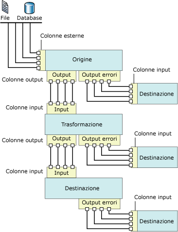

# Flusso di dati
  In [!INCLUDE[ssNoVersion](../../includes/ssnoversion-md.md)] [!INCLUDE[ssISnoversion](../../includes/ssisnoversion-md.md)] sono disponibili tre diversi tipi di componenti flusso di dati: origini, trasformazioni e destinazioni. Le origini estraggono dati da archivi dati quali tabelle e viste di database relazionali, file e database di [!INCLUDE[ssASnoversion](../../includes/ssasnoversion-md.md)] . Tramite le trasformazioni è possibile modificare, riepilogare e pulire i dati. Le destinazioni consentono di caricare dati in archivi dati o di creare set di dati in memoria.  
  
> [!NOTE]  
>  Quando si utilizzano i provider personalizzati, è necessario aggiornare il file ProviderDescriptors.xml con i valori delle colonne di metadati.  
  
 In [!INCLUDE[ssISnoversion](../../includes/ssisnoversion-md.md)] è inoltre possibile creare percorsi che connettono l'output di un componente all'input di un altro componente. I percorsi definiscono la sequenza dei componenti e consentono di aggiungere annotazioni al flusso di dati o visualizzare l'origine della colonna.  
  
 Per connettere i componenti flusso di dati è necessario connettere l'output di origini e destinazioni all'input di trasformazioni e destinazioni. Durante la costruzione di un flusso di dati, il secondo componente e i successivi vengono in genere connessi a mano a mano che vengono aggiunti al flusso di dati. Dopo la connessione di un componente le colonne di input sono disponibili per l'utilizzo durante la configurazione del componente. Se non sono disponibili colonne di input, è necessario completare la configurazione del componente dopo averlo connesso al flusso di dati. Per altre informazioni, vedere [Percorsi in Integration Services](../../integration-services/data-flow/integration-services-paths.md) e [Connessione di componenti con i percorsi](http://msdn.microsoft.com/library/05633e4c-1370-4b05-802b-f36b07dd71c8).  
  
 Nella figura seguente viene illustrato un flusso di dati che include un'origine, una trasformazione con un input e un output e una destinazione. Oltre alle colonne di input, di output ed esterne, la figura include anche gli input, gli output e gli output degli errori.  
  
   
  
## Implementazione del flusso di dati  
 L'aggiunta di un'attività Flusso di dati al flusso di controllo di un pacchetto costituisce il primo passaggio dell'implementazione di un flusso di dati in un pacchetto. Un pacchetto può includere più attività Flusso di dati, ognuna con un proprio flusso di dati. Ad esempio, se i flussi di dati contenuti in un pacchetto devono essere eseguiti in una sequenza specifica o alternati ad altre attività, è necessario utilizzare un'attività Flusso di dati separata per ogni flusso di dati.  
  
 Dopo avere aggiunto un'attività Flusso di dati al flusso di controllo, è possibile iniziare a compilare il flusso di dati utilizzato dal pacchetto. Per altre informazioni, vedere [Attività Flusso di dati](../../integration-services/control-flow/data-flow-task.md).  
  
 Per creare un flusso di dati è necessario effettuare i passaggi seguenti:  
  
-   Aggiungere una o più origini per estrarre i dati da file e database, quindi aggiungere gestioni connessioni per connettersi alle origini.  
  
-   Aggiungere le trasformazioni necessarie per soddisfare i requisiti aziendali del pacchetto. Un flusso di dati non deve necessariamente includere trasformazioni.  
  
     Alcune trasformazioni richiedono una gestione connessione. La trasformazione Ricerca, ad esempio, utilizza una gestione connessione per connettersi al database che contiene i dati di ricerca.  
  
-   Stabilire la connessione dei componenti flusso di dati connettendo l'output di origini e trasformazioni all'input di trasformazioni e destinazioni.  
  
-   Aggiungere una o più destinazioni per caricare i dati in archivi dati quali file e database, quindi aggiungere gestioni connessioni per connettersi alle origini dati.  
  
-   Configurare gli output degli errori sui componenti per gestire i problemi.  
  
     Quando, in fase di esecuzione, i componenti flusso di dati convertono dati, eseguono ricerche o valutano espressioni, possono verificarsi errori a livello di riga. Può verificarsi un errore ad esempio quando si converte in un valore intero una colonna di dati con un valore stringa o se un'espressione tenta di eseguire una divisione per zero. Entrambe le operazioni provocano errori e le righe contenenti gli errori possono essere elaborate separatamente in un flusso degli errori. Per altre informazioni sull'uso di flussi degli errori nei flussi di dati dei pacchetti, vedere [Gestione degli errori nei dati](../../integration-services/data-flow/error-handling-in-data.md).  
  
-   Includere annotazioni per rendere il flusso di dati autodocumentato. Per altre informazioni, vedere [Utilizzo di annotazioni nei pacchetti](../../integration-services/use-annotations-in-packages.md).  
  
> [!NOTE]  
>  Quando si crea un nuovo pacchetto, è anche possibile utilizzare una procedura guidata per configurare correttamente gestioni connessioni, origini e destinazioni. Per altre informazioni, vedere [Creare pacchetti in SQL Server Data Tools](../../integration-services/create-packages-in-sql-server-data-tools.md).  
  
 Quando la scheda **Flusso di dati** è attiva, la casella degli strumenti contiene le origini, le trasformazioni e le destinazioni che è possibile aggiungere al flusso di dati.  
  
## Espressioni  
 Molti componenti flusso di dati, ad esempio origini, trasformazioni e destinazioni, supportano l'utilizzo di espressioni di proprietà in alcune delle relative proprietà. Un'espressione di proprietà è un'espressione che sostituisce il valore della proprietà quando il pacchetto viene caricato. In fase di esecuzione il pacchetto utilizza i valori aggiornati delle proprietà. Le espressioni vengono compilate usando la sintassi delle espressioni di [!INCLUDE[ssISnoversion](../../includes/ssisnoversion-md.md)] e possono includere funzioni, operatori, identificatori e variabili di [!INCLUDE[ssISnoversion](../../includes/ssisnoversion-md.md)]. Per altre informazioni, vedere [Espressioni di Integration Services &#40;SSIS&#41;](../../integration-services/expressions/integration-services-ssis-expressions.md) e [Espressioni di Integration Services &#40;SSIS&#41;](../../integration-services/expressions/integration-services-ssis-expressions.md) e [Utilizzo delle espressioni di proprietà nei pacchetti](../../integration-services/expressions/use-property-expressions-in-packages.md).  
  
 Se si crea un pacchetto in [!INCLUDE[ssBIDevStudioFull](../../includes/ssbidevstudiofull-md.md)], le proprietà dei componenti flusso di dati che supportano espressioni di proprietà vengono esposte nell'attività Flusso di dati a cui appartengono. Per aggiungere, modificare e rimuovere espressioni di proprietà dei componenti flusso di dati, fare clic sull'attività Flusso di dati e quindi utilizzare la finestra Proprietà o l'editor dell'attività per aggiungere, modificare o eliminare espressioni di proprietà. Le espressioni di proprietà per l'attività Flusso di dati possono essere gestite nella finestra Proprietà.  
  
 Se il flusso di dati contiene componenti che utilizzano espressioni, anche le espressioni vengono esposte nella finestra Proprietà. Per visualizzare le espressioni, selezionare l'attività Flusso di dati a cui appartiene il componente. È possibile visualizzare le proprietà in base alle categorie o in ordine alfabetico. Se nella finestra Proprietà si usa la visualizzazione Per categoria, le espressioni non usate in una proprietà specifica vengono visualizzate nella categoria **Varie** . Se si utilizza la visualizzazione in ordine alfabetico, le espressioni sono elencate in base al nome del componente flusso di dati.  
  
## Origini  
 In [!INCLUDE[ssISnoversion](../../includes/ssisnoversion-md.md)]un'origine è il componente flusso di dati che rende disponibili i dati di origini dati esterne diverse ad altri componenti flusso di dati. È possibile estrarre dati da file flat, file XML, cartelle di lavoro di Microsoft Excel e file contenenti dati non elaborati. È inoltre possibile estrarre dati accedendo a tabelle e viste di database ed eseguendo query.  
  
 Un flusso di dati può includere una o più origini.  
  
 L'origine di un flusso di dati include in genere un output regolare, le cui colonne di output sono costituite dalle colonne aggiunte dall'origine al flusso di dati.  
  
 L'output regolare fa riferimento a colonne esterne. Una colonna esterna è una colonna nell'origine. La colonna **MadeFlag** della tabella **Product** del database **AdventureWorks** , ad esempio, è una colonna esterna che può essere aggiunta all'output regolare. I metadati delle colonne esterne includono informazioni quali nome, tipo di dati e lunghezza della colonna di origine.  
  
 L'output degli errori di un'origine contiene le stesse colonne dell'output regolare e due colonne aggiuntive che forniscono informazioni sugli errori. Il modello a oggetti di [!INCLUDE[ssISnoversion](../../includes/ssisnoversion-md.md)] non prevede alcun limite al numero degli output regolari e degli errori di un'origine. La maggior parte delle origini disponibili in [!INCLUDE[ssISnoversion](../../includes/ssisnoversion-md.md)] , ad eccezione del componente script, include un output regolare e molte origini includono anche un output degli errori. È possibile creare origini personalizzate in modo da implementare più output regolari e degli errori.  
  
 Tutte le colonne di output sono disponibili come colonne di input per il successivo componente flusso di dati.  
  
 È inoltre possibile scrivere origini personalizzate. Per altre informazioni, vedere [Sviluppo di un componente del flusso di dati personalizzato](../../integration-services/extending-packages-custom-objects/data-flow/developing-a-custom-data-flow-component.md) e [Sviluppo di tipi specifici di componenti del flusso di dati](../../integration-services/extending-packages-custom-objects-data-flow-types/developing-specific-types-of-data-flow-components.md).  
  
 Le origini seguenti includono proprietà che possono essere aggiornate tramite espressioni di proprietà:  
  
-   [Origine ADO NET](../../integration-services/data-flow/ado-net-source.md)  
  
-   [Origine XML](../../integration-services/data-flow/xml-source.md)  
  
### Origini disponibili per il download  
 Nella tabella seguente sono elencate le origini aggiuntive che è possibile scaricare dal sito Web di [!INCLUDE[msCoName](../../includes/msconame-md.md)] .  
  
|Origine|Descrizione|  
|------------|-----------------|  
|Origine Oracle|L'origine Oracle è il componente di origine del connettore [!INCLUDE[msCoName](../../includes/msconame-md.md)] per Oracle di Attunity. Il connettore [!INCLUDE[msCoName](../../includes/msconame-md.md)] per Oracle di Attunity include anche una gestione connessione e una destinazione. Per ulteriori informazioni, vedere la pagina di download relativa ai [connettori Microsoft per Oracle e Teradata di Attunity](http://go.microsoft.com/fwlink/?LinkId=789384).|  
|Origine SAP BI|L'origine SAP BI è il componente di origine del connettore [!INCLUDE[msCoName](../../includes/msconame-md.md)] per SAP BI. Il connettore [!INCLUDE[msCoName](../../includes/msconame-md.md)] per SAP BI include anche una gestione connessione e una destinazione. Per altre informazioni, vedere la pagina di download relativa al [Feature Pack per Microsoft SQL Server](http://go.microsoft.com/fwlink/?LinkID=746297).|  
|Origine Teradata|L'origine Teradata è il componente di origine del connettore [!INCLUDE[msCoName](../../includes/msconame-md.md)] per Teradata di Attunity. Il connettore [!INCLUDE[msCoName](../../includes/msconame-md.md)] per Teradata di Attunity include anche una gestione connessione e una destinazione. Per ulteriori informazioni, vedere la pagina di download relativa ai [connettori Microsoft per Oracle e Teradata di Attunity](http://go.microsoft.com/fwlink/?LinkId=789384).|  
  
 Per una dimostrazione sull'uso dei miglioramenti delle prestazioni del connettore [!INCLUDE[msCoName](../../includes/msconame-md.md)] per Oracle di Attunity, vedere la pagina [Performance of Microsoft Connector for Oracle by Attunity (SQL Server Video)](http://go.microsoft.com/fwlink/?LinkID=210369)(Prestazioni del connettore Microsoft per Oracle di Attunity (video di SQL Server)).  
  
## Trasformazioni  
 Le trasformazioni possono avere funzionalità molto diverse. Possono eseguire attività quali aggiornamento, riepilogo, pulitura, unione e distribuzione dei dati. Consentono di modificare valori nelle colonne, cercare valori nelle tabelle, eliminare dati e aggregare valori nelle colonne.  
  
 Gli input e gli output di una trasformazione definiscono le colonne dei dati in entrata e in uscita. Alcune trasformazioni includono un singolo input e più output, mentre altre includono più input e un singolo output, a seconda delle operazioni eseguite sui dati. Nelle trasformazioni possono anche essere inclusi gli output degli errori tramite cui vengono fornite informazioni sugli errori generati, oltre ai dati che li hanno provocati, ad esempio dati stringa che non è stato possibile convertire in un tipo di dati Integer. Il modello a oggetti di [!INCLUDE[ssISnoversion](../../includes/ssisnoversion-md.md)] non prevede alcun limite al numero degli input, degli output regolari e degli output degli errori di una trasformazione. È possibile creare trasformazioni personalizzate che implementano qualsiasi combinazione di più input, output regolari e output degli errori.  
  
 L'input di una trasformazione è definito come una o più colonne di input. Alcune trasformazioni di [!INCLUDE[ssISnoversion](../../includes/ssisnoversion-md.md)] possono inoltre fare riferimento a colonne esterne come input. L'input della trasformazione Comando OLE DB, ad esempio, include colonne esterne. Una colonna di output è una colonna che la trasformazione aggiunge al flusso di dati. Sia gli output regolari che gli output degli errori possono contenere colonne di output. Le colonne di output diventano le colonne di input per il successivo componente flusso di dati, che può essere costituito da un'altra trasformazione o da una destinazione.  
  
 Le trasformazioni seguenti includono proprietà che possono essere aggiornate tramite espressioni di proprietà:  
  
-   [Trasformazione Suddivisione condizionale](../../integration-services/data-flow/transformations/conditional-split-transformation.md)  
  
-   [Trasformazione Colonna derivata](../../integration-services/data-flow/transformations/derived-column-transformation.md)  
  
-   [Trasformazione Raggruppamento fuzzy](../../integration-services/data-flow/transformations/fuzzy-grouping-transformation.md)  
  
-   [Trasformazione Ricerca fuzzy](../../integration-services/data-flow/transformations/fuzzy-lookup-transformation.md)  
  
-   [Trasformazione Comando OLE DB](../../integration-services/data-flow/transformations/ole-db-command-transformation.md)  
  
-   [Trasformazione Campionamento percentuale](../../integration-services/data-flow/transformations/percentage-sampling-transformation.md)  
  
-   [Trasformazione Pivot](../../integration-services/data-flow/transformations/pivot-transformation.md)  
  
-   [Trasformazione Campionamento righe](../../integration-services/data-flow/transformations/row-sampling-transformation.md)  
  
-   [Trasformazione Ordinamento](../../integration-services/data-flow/transformations/sort-transformation.md)  
  
-   [Trasformazione UnPivot](../../integration-services/data-flow/transformations/unpivot-transformation.md)  
  
 Per altre informazioni, vedere [Trasformazioni di Integration Services](../../integration-services/data-flow/transformations/integration-services-transformations.md).  
  
## Destinazioni  
 Una destinazione è il componente flusso di dati che scrive dati da un flusso di dati a un archivio dati specifico oppure crea un set di dati in memoria. È possibile caricare dati in file flat, elaborare oggetti di analisi e fornire dati ad altri processi. È inoltre possibile caricare dati accedendo a tabelle e viste di database ed eseguendo query.  
  
 Un flusso di dati può includere più destinazioni che caricano dati in archivi dati diversi.  
  
 Le destinazioni di [!INCLUDE[ssISnoversion](../../includes/ssisnoversion-md.md)] devono includere almeno un input. L'input contiene colonne di input, che provengono da un altro componente flusso di dati e sulle quali viene eseguito il mapping alle colonne della destinazione.  
  
 Molte destinazioni includono anche un output degli errori. L'output degli errori di una destinazione include colonne di output, che in genere contengono informazioni sugli errori generati durante la scrittura dei dati nell'archivio dati di destinazione. Gli errori possono verificarsi per motivi diversi. Ad esempio, una colonna contiene un valore Null mentre la colonna di destinazione corrispondente non può essere impostata su Null.  
  
 Il modello a oggetti di [!INCLUDE[ssISnoversion](../../includes/ssisnoversion-md.md)] non prevede alcun limite al numero degli input regolari e degli output degli errori di una destinazione e consente di creare destinazioni personalizzate in cui vengono implementati più input e output degli errori.  
  
 È inoltre possibile scrivere destinazioni personalizzate. Per altre informazioni, vedere [Sviluppo di un componente del flusso di dati personalizzato](../../integration-services/extending-packages-custom-objects/data-flow/developing-a-custom-data-flow-component.md) e [Sviluppo di tipi specifici di componenti del flusso di dati](../../integration-services/extending-packages-custom-objects-data-flow-types/developing-specific-types-of-data-flow-components.md).  
  
 Le destinazioni seguenti includono proprietà che possono essere aggiornate tramite espressioni di proprietà:  
  
-   [Destinazione file flat](../../integration-services/data-flow/flat-file-destination.md)  
  
-   [Destinazione SQL Server Compact Edition](../../integration-services/data-flow/sql-server-compact-edition-destination.md)  
  
### Destinazioni disponibili per il download  
 Nella tabella seguente sono elencate le destinazioni aggiuntive che è possibile scaricare dal sito Web di [!INCLUDE[msCoName](../../includes/msconame-md.md)] .  
  
|Origine|Descrizione|  
|------------|-----------------|  
|Destinazione Oracle|La destinazione Oracle è il componente di destinazione del connettore [!INCLUDE[msCoName](../../includes/msconame-md.md)] per Oracle di Attunity. Il connettore [!INCLUDE[msCoName](../../includes/msconame-md.md)] per Oracle di Attunity include anche una gestione connessione e un'origine. Per ulteriori informazioni, vedere la pagina di download relativa ai [connettori Microsoft per Oracle e Teradata di Attunity](http://go.microsoft.com/fwlink/?LinkId=789384).|  
|Destinazione SAP BI|La destinazione SAP BI è il componente di destinazione del connettore [!INCLUDE[msCoName](../../includes/msconame-md.md)] per SAP BI. Il connettore [!INCLUDE[msCoName](../../includes/msconame-md.md)] per SAP BI include anche una gestione connessione e un'origine. Per altre informazioni, vedere la pagina di download relativa al [Feature Pack per Microsoft SQL Server](http://go.microsoft.com/fwlink/?LinkID=746297).|  
|Destinazione Teradata|La destinazione Teradata è il componente di destinazione del connettore [!INCLUDE[msCoName](../../includes/msconame-md.md)] per Teradata di Attunity. Il connettore [!INCLUDE[msCoName](../../includes/msconame-md.md)] per Teradata di Attunity include anche una gestione connessione e un'origine. Per ulteriori informazioni, vedere la pagina di download relativa ai [connettori Microsoft per Oracle e Teradata di Attunity](http://go.microsoft.com/fwlink/?LinkId=789384).|  
  
 Per una dimostrazione sull'uso dei miglioramenti delle prestazioni del connettore [!INCLUDE[msCoName](../../includes/msconame-md.md)] per Oracle di Attunity, vedere la pagina [Performance of Microsoft Connector for Oracle by Attunity (SQL Server Video)](http://go.microsoft.com/fwlink/?LinkID=210369)(Prestazioni del connettore Microsoft per Oracle di Attunity (video di SQL Server)).  
  
## Gestioni connessioni  
 Molti componenti flusso di dati si connettono a origini dati e, affinché sia possibile configurare correttamente i componenti, è necessario aggiungere al pacchetto le gestioni connessioni richieste dai componenti stessi. È possibile aggiungere le gestioni connessioni prima o durante la costruzione del flusso di dati. Per altre informazioni, vedere [Connessioni in Integration Services &#40;SSIS&#41;](../../integration-services/connection-manager/integration-services-ssis-connections.md) e [Creazione di gestioni connessioni](http://msdn.microsoft.com/library/6ca317b8-0061-4d9d-b830-ee8c21268345).  
  
## Metadati esterni  
 Quando si crea un flusso di dati in un pacchetto utilizzando Progettazione [!INCLUDE[ssIS](../../includes/ssis-md.md)] , i metadati delle origini e delle destinazioni vengono copiati nelle colonne esterne delle origini e delle destinazioni, fornendo uno snapshot dello schema. Quando [!INCLUDE[ssISnoversion](../../includes/ssisnoversion-md.md)] convalida il pacchetto, Progettazione [!INCLUDE[ssIS](../../includes/ssis-md.md)] confronta tale snapshot con lo schema dell'origine o destinazione e invia gli errori e gli avvisi appropriati, a seconda delle differenze rilevate.  
  
 Il progetto di [!INCLUDE[ssISnoversion](../../includes/ssisnoversion-md.md)] offre una modalità offline. Quando si utilizza tale modalità non viene stabilita alcuna connessione alle origini o destinazioni utilizzate dal pacchetto e i metadati delle colonne esterne non vengono aggiornati.  
  
## Input e output  
 Le origini includono output, le destinazioni includono input e le trasformazioni includono sia input che output. Molti componenti flusso di dati possono essere inoltre configurati per l'utilizzo di un output degli errori.  
  
### Input  
 Le destinazioni e le trasformazioni includono input. Un input contiene una o più colonne di input, che possono fare riferimento a colonne esterne se il componente flusso di dati è stato configurato per utilizzarne. Gli input possono essere configurati in modo da monitorare e controllare il flusso di dati: è ad esempio possibile specificare se il componente non deve essere completato correttamente in risposta a un errore, se gli errori devono essere ignorati o se le righe con errori devono essere reindirizzate all'output degli errori. È inoltre possibile assegnare una descrizione all'input o aggiornarne il nome. Per configurare gli input in Progettazione [!INCLUDE[ssIS](../../includes/ssis-md.md)] , è possibile usare la finestra di dialogo **Editor avanzato** . Per altre informazioni su **Editor avanzato** , vedere [Interfaccia utente di Integration Services](../../integration-services/integration-services-user-interface.md).  
  
### Output  
 Origini e trasformazioni includono sempre output. Un output contiene una o più colonne di output, che possono fare riferimento a colonne esterne se il componente flusso di dati è stato configurato per utilizzarne. Gli output possono essere configurati in modo da fornire informazioni utili per le operazioni di elaborazione dei dati a valle. È ad esempio possibile indicare se l'output è ordinato. È inoltre possibile specificare una descrizione per l'output o aggiornarne il nome. Per configurare gli output in Progettazione [!INCLUDE[ssIS](../../includes/ssis-md.md)] , è possibile usare la finestra di dialogo **Editor avanzato** .  
  
### Output degli errori  
 Origini, destinazioni e trasformazioni possono includere output degli errori. Usando la finestra di dialogo **Configura output errori** è possibile specificare come il componente flusso di dati risponde agli errori in ogni input o colonna. Se in fase di esecuzione si verifica un errore o un troncamento di dati e il componente flusso di dati è configurato per il reindirizzamento delle righe, le righe di dati con l'errore verranno inviate all'output degli errori. L'output degli errori può essere connesso a trasformazioni che applicano ulteriori trasformazioni o indirizzano i dati verso un'altra destinazione. Per impostazione predefinita un output degli errori contiene le colonne di output e due colonne di informazioni sugli errori: **ErrorCode** e **ErrorColumn**. Le colonne di output contengono i dati della riga che ha generato l'errore, **ErrorCode** contiene il codice di errore ed **ErrorColumn** identifica la colonna che provoca l'errore.  
  
 Per altre informazioni, vedere [Gestione degli errori nei dati](../../integration-services/data-flow/error-handling-in-data.md).  
  
### Colonne  
 Input, output e output degli errori sono raccolte di colonne. Ogni colonna è configurabile e, a seconda del tipo di colonna, input, output o esterna,[!INCLUDE[ssISnoversion](../../includes/ssisnoversion-md.md)] offre proprietà diverse per la colonna. [!INCLUDE[ssISnoversion](../../includes/ssisnoversion-md.md)] offre tre modi diversi per impostare le proprietà della colonna: a livello di codice, tramite finestre di dialogo specifiche del componente o tramite la finestra di dialogo **Editor avanzato**.  
  
## Percorsi  
 I percorsi connettono i componenti flusso di dati. In Progettazione [!INCLUDE[ssIS](../../includes/ssis-md.md)] è possibile visualizzare e modificare le proprietà di un percorso, visualizzare i metadati di output per il punto iniziale di un percorso e collegare i visualizzatori dati a un percorso.  
  
 Per altre informazioni, vedere [Percorsi in Integration Services](../../integration-services/data-flow/integration-services-paths.md) e [Debug di un flusso di dati](../../integration-services/troubleshooting/debugging-data-flow.md).  
  
## Configurazione dei componenti flusso di dati  
 I componenti flusso di dati possono essere configurati a livello di componente, a livello di input, output e output degli errori, nonché a livello di colonna.  
  
-   A livello di componente è possibile impostare le proprietà comuni a tutti i componenti e le proprietà personalizzate del componente.  
  
-   A livello di input, output e output degli errori è possibile impostare le proprietà comuni degli input, degli output e degli output degli errori. Se il componente supporta più output, sarà possibile aggiungere output.  
  
-   A livello di colonna è possibile impostare le proprietà comuni a tutte le colonne, oltre a tutte le proprietà personalizzate fornite dal componente per le colonne. Se il componente supporta l'aggiunta di colonne di output, sarà possibile aggiungere colonne agli output.  
  
 È possibile impostare le proprietà tramite Progettazione [!INCLUDE[ssIS](../../includes/ssis-md.md)] o a livello di codice. In Progettazione [!INCLUDE[ssIS](../../includes/ssis-md.md)] è possibile impostare le proprietà degli elementi usando le finestre di dialogo personalizzate disponibili per ogni tipo di elemento, oppure usando la finestra Proprietà della finestra di dialogo **Editor avanzato** .  
  
 Per altre informazioni su come impostare le proprietà usando Progettazione [!INCLUDE[ssIS](../../includes/ssis-md.md)] , vedere [Impostazione delle proprietà di un componente del flusso di dati](../../integration-services/data-flow/set-the-properties-of-a-data-flow-component.md).  
  
## Related Tasks  
 [Aggiungere o eliminare un componente in un flusso di dati](../../integration-services/data-flow/add-or-delete-a-component-in-a-data-flow.md)  
  
 [Connettere componenti in un flusso di dati](../../integration-services/data-flow/connect-components-in-a-data-flow.md)  
  
## Contenuto correlato  
 Video sulle [prestazioni del connettore Microsoft per Oracle di Attunity (video di SQL Server)](http://go.microsoft.com/fwlink/?LinkID=210369)sul sito Web technet.microsoft.com.  
