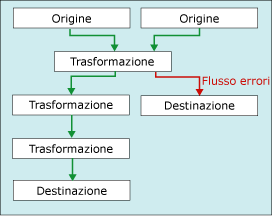

# <a name="error-handling-in-data"></a>Gestione degli errori nei dati
  Quando tramite un componente flusso di dati viene applicata una trasformazione ai dati delle colonne, vengono estratti dati dalle origini o vengono caricati dati nelle destinazioni, possono verificarsi errori. Gli errori sono spesso dovuti alla presenza di valori non previsti. Una conversione di dati può ad esempio avere esito negativo perché una colonna contiene una stringa anziché un numero, un inserimento in una colonna di database può avere esito negativo perché i dati rappresentano una data mentre la colonna ha un tipo di dati numeric oppure la valutazione di un'espressione può avere esito negativo perché il valore di una colonna è zero e dà luogo a un'operazione matematica non valida.  
  
 Gli errori rientrano in genere nelle categorie seguenti:  
  
-   Errori di conversione dei dati, che si verificano se una conversione comporta la perdita di cifre significative o non significative oppure il troncamento di una stringa. Gli errori di conversione dei dati si verificano anche quando la conversione richiesta non è supportata.  
  
-   Errori di valutazione delle espressioni, che si verificano se le espressioni che vengono valutate in fase di esecuzione eseguono operazioni non valide o non risultano sintatticamente corrette a causa di valori mancanti o errati.  
  
-   Errori di ricerca, che si verificano se un'operazione di ricerca non trova una corrispondenza nella tabella di ricerca.  
  
 Per un elenco di errori, avvisi e altri messaggi di Integration Services, vedere [Guida di riferimento ai messaggi e agli errori di Integration Services](../../integration-services/integration-services-error-and-message-reference.md).  
  
## <a name="use-error-outputs-to-capture-row-level-errors"></a>Usare gli output degli errori per acquisire gli errori a livello di riga  
 Molti componenti dei flussi di dati supportano output degli errori che consentono di controllare la modalità di gestione degli errori a livello di riga nei dati in ingresso e in uscita. È possibile specificare il comportamento che dovrà avere il componente in caso di troncamento o errore impostando opzioni sulle singole colonne di input o di output. È ad esempio possibile specificare che il componente dovrà generare un errore se il nome di un cliente viene troncato, mentre gli errori relativi ad altre colonne contenenti dati meno importanti potranno essere ignorati.  
  
 L'output degli errori può essere connesso all'input di un'altra trasformazione o caricato in una destinazione diversa da quella dell'output non degli errori. L'output degli errori può ad esempio essere connesso a una trasformazione Colonna derivata che fornisce una stringa per una colonna vuota.  
  
 Nella figura seguente viene illustrato un semplice flusso di dati che include un output degli errori.  
  
   
  
 Per altre informazioni, vedere [Flusso di dati](../../integration-services/data-flow/data-flow.md) e [Percorsi in Integration Services](../../integration-services/data-flow/integration-services-paths.md).  

## <a name="configure-error-output-dialog-box"></a>Configurare la finestra di dialogo di Output degli errori
Usare la finestra di dialogo **Configura output errori** per configurare le opzioni di gestione degli errori per le trasformazioni del flusso di dati che supportano l'output degli errori.  
  
 Per altre informazioni sull'utilizzo degli output errori, vedere [Gestione degli errori nei dati](../../integration-services/data-flow/error-handling-in-data.md).  
  
### <a name="options"></a>Opzioni  
 **Input o output**  
 Consente di visualizzare il nome dell'output.  
  
 **Colonna**  
 Consente di visualizzare le colonne di output selezionate nella finestra di dialogo dell'editor trasformazione.  
  
 **Errore**  
 Se applicabile, consente di specificare l'azione da eseguire in caso di errori, ovvero ignorare l'errore, reindirizzare la riga o interrompere il componente.  
  
 **Argomenti correlati:** [Gestione degli errori nei dati](../../integration-services/data-flow/error-handling-in-data.md)  
  
 **Troncamento**  
 Se applicabile, consente di specificare l'azione da eseguire in caso di troncamenti, ovvero ignorare l'errore, reindirizzare la riga o interrompere il componente.  
  
 **Argomenti correlati:** [Gestione degli errori nei dati](../../integration-services/data-flow/error-handling-in-data.md)  
  
 **Description**  
 Consente di visualizzare la descrizione dell'operazione.  
  
 **Imposta questo valore nelle celle selezionate**  
 Consente di specificare l'azione che dovrà interessare tutte le celle selezionate in caso di errore o troncamento: ignorare l'errore, reindirizzare la riga o interrompere il componente.  
  
 **Applica**  
 Consente di applicare l'opzione di gestione degli errori alle celle selezionate.  
  
## <a name="errors-are-either-failures-or-truncations"></a>Gli errori sono errori o troncamenti  
 Gli errori possono essere suddivisi in due categorie: errori o troncamenti.  
  
 **Errori**. Un errore indica un problema certo e genera un risultato NULL. Rientrano in questa categoria ad esempio gli errori di conversione dei dati e gli errori di valutazione delle espressioni. Un errore può essere ad esempio causato dal tentativo di convertire in un numero una stringa che contiene caratteri alfabetici. Le conversioni di dati, le valutazioni delle espressioni e le assegnazioni dei risultati delle espressioni a variabili, proprietà e colonne di dati può avere esito negativo a causa di cast non validi o tipi di dati non compatibili. Per altre informazioni, vedere [Cast &#40;espressione SSIS&#41;](../../integration-services/expressions/cast-ssis-expression.md), [Tipi di dati nelle espressioni di Integration Services](../../integration-services/expressions/integration-services-data-types-in-expressions.md) e [Tipi di dati di Integration Services](../../integration-services/data-flow/integration-services-data-types.md).  
  
 **Troncamenti**. Un troncamento è meno grave di un errore. Il troncamento genera risultati che possono essere utilizzabili se non addirittura utili. Si può scegliere se considerare i troncamenti come errori o come condizioni accettabili. Se ad esempio si inserisce una stringa di 15 caratteri in una colonna con larghezza di un carattere, si può scegliere di troncare la stringa.  
  
## <a name="select-an-error-handling-option"></a>Selezionare un'opzione di gestione degli errori  
 È possibile configurare la modalità di gestione di errori e troncamenti utilizzata da origini, trasformazioni e destinazioni. Nella tabella seguente vengono descritte le opzioni disponibili.  
  
|Opzione|Description|  
|------------|-----------------|  
|Interrompi componente|Quando si verifica un errore o un troncamento l'attività Flusso di dati viene interrotta. Questa è l'opzione predefinita per errori e troncamenti.|  
|Ignora errore|L'errore o il troncamento viene ignorato e la riga di dati viene indirizzata all'output della trasformazione o dell'origine.|  
|Reindirizza riga|La riga di dati contenente l'errore o il troncamento viene inviata all'output degli errori dell'origine, della trasformazione o della destinazione.|  
  
## <a name="get-more-info-about-the-error"></a>Ottenere altre informazioni sull'errore  
 Oltre alle colonne di dati, l'output degli errori include anche le colonne **ErrorCode** ed **ErrorColumn** . La colonna **ErrorCode** identifica l'errore, mentre la colonna **ErrorColumn** contiene l'identificatore di derivazione della colonna degli errori.  
  
 In alcune circostanze il valore della colonna **ErrorColumn** è impostato su zero. Questa situazione si verifica quando la condizione di errore interessa l'intera riga anziché una singola colonna, ad esempio quando nella trasformazione Ricerca una ricerca non riesce.  
  
 Questi due valori numerici possono avere un'utilità limitata senza la descrizione dell'errore corrispondente e il nome della colonna. Ecco alcuni modi per ottenere la descrizione dell'errore e il nome della colonna.  
  
-   Collegando un visualizzatore dati all'output degli errori è possibile visualizzare sia le descrizioni degli errori che i nomi delle colonne. In Progettazione SSIS fare clic con il pulsante destro del mouse sulla freccia rossa che indica un output degli errori e scegliere **Abilita visualizzatore dati**.  
  
-   È possibile trovare i nomi di colonna abilitando la registrazione e selezionando l'evento **DiagnosticEx** . Questo evento scrive una mappa delle colonne del flusso di dati nel log. È quindi possibile cercare il nome della colonna dal relativo identificatore in questa mappa delle colonne. Notare che l'evento **DiagnosticEx** non mantiene gli spazi vuoti nel relativo output XML per ridurre le dimensioni del log. Per migliorare la leggibilità, copiare il log in un editor XML come Visual Studio, che supporta la formattazione XML e l'evidenziazione della sintassi. Per altre informazioni sulla registrazione, vedere [Registrazione di Integration Services &#40;SSIS&#41;](../../integration-services/performance/integration-services-ssis-logging.md).  
  
     Ecco un esempio di mappa delle colonne del flusso di dati.  
  
    ```xml  
  
    \<DTS:PipelineColumnMap xmlns:DTS="www.microsoft.com/SqlServer/Dts">  
        \<DTS:Pipeline DTS:Path="\Package\Data Flow Task">  
            \<DTS:Column DTS:ID="11" DTS:IdentificationString="ADO NET Source.Outputs[ADO NET Source Output].Columns[Customer]"/>  
            \<DTS:Column DTS:ID="12" DTS:IdentificationString="ADO NET Source.Outputs[ADO NET Source Output].Columns[Product]"/>  
            \<DTS:Column DTS:ID="13" DTS:IdentificationString="ADO NET Source.Outputs[ADO NET Source Output].Columns[Price]"/>  
            \<DTS:Column DTS:ID="14" DTS:IdentificationString="ADO NET Source.Outputs[ADO NET Source Output].Columns[Timestamp]"/>  
            \<DTS:Column DTS:ID="20" DTS:IdentificationString="ADO NET Source.Outputs[ADO NET Source Error Output].Columns[Customer]"/>  
            \<DTS:Column DTS:ID="21" DTS:IdentificationString="ADO NET Source.Outputs[ADO NET Source Error Output].Columns[Product]"/>  
            \<DTS:Column DTS:ID="22" DTS:IdentificationString="ADO NET Source.Outputs[ADO NET Source Error Output].Columns[Price]"/>  
            \<DTS:Column DTS:ID="23" DTS:IdentificationString="ADO NET Source.Outputs[ADO NET Source Error Output].Columns[Timestamp]"/>  
            \<DTS:Column DTS:ID="24" DTS:IdentificationString="ADO NET Source.Outputs[ADO NET Source Error Output].Columns[ErrorCode]"/>  
            \<DTS:Column DTS:ID="25" DTS:IdentificationString="ADO NET Source.Outputs[ADO NET Source Error Output].Columns[ErrorColumn]"/>  
            \<DTS:Column DTS:ID="31" DTS:IdentificationString="Flat File Destination.Inputs[Flat File Destination Input].Columns[Customer]"/>  
            \<DTS:Column DTS:ID="32" DTS:IdentificationString="Flat File Destination.Inputs[Flat File Destination Input].Columns[Product]"/>  
            \<DTS:Column DTS:ID="33" DTS:IdentificationString="Flat File Destination.Inputs[Flat File Destination Input].Columns[Price]"/>  
            \<DTS:Column DTS:ID="34" DTS:IdentificationString="Flat File Destination.Inputs[Flat File Destination Input].Columns[Timestamp]"/>  
        \</DTS:Pipeline>  
    \</DTS:PipelineColumnMap>  
  
    ```  
  
-   Si può anche usare il componente Script per includere la descrizione dell'errore e il nome della colonna in altre colonne dell'output degli errori. Per un esempio, vedere [Ottimizzazione di un output degli errori con il componente script](../../integration-services/extending-packages-scripting-data-flow-script-component-examples/enhancing-an-error-output-with-the-script-component.md).  
  
    -   Includere la descrizione dell'errore in una colonna aggiuntiva, usando una singola riga di script per chiamare il metodo <xref:Microsoft.SqlServer.Dts.Pipeline.Wrapper.IDTSComponentMetaData100.GetErrorDescription%2A> dell'interfaccia <xref:Microsoft.SqlServer.Dts.Pipeline.Wrapper.IDTSComponentMetaData100> .  
  
    -   Includere il nome della colonna in una colonna aggiuntiva usando una singola riga di script per chiamare il metodo <xref:Microsoft.SqlServer.Dts.Pipeline.Wrapper.IDTSComponentMetaData100.GetIdentificationStringByID%2A> dell'interfaccia <xref:Microsoft.SqlServer.Dts.Pipeline.Wrapper.IDTSComponentMetaData100> .  
  
     È possibile aggiungere il componente Script al segmento del flusso di dati relativo agli errori in qualsiasi punto a valle dai componenti del flusso di dati di cui si vuole acquisire gli errori. In genere il componente Script viene posizionato immediatamente prima che le righe con errori vengano scritte in una destinazione. In questo modo lo script cerca solo le descrizioni relative alle righe con errori che vengono scritte. Il segmento del flusso di dati relativo agli errori può correggere alcuni errori e non scrivere tali righe in una destinazione errori.  

## <a name="see-also"></a>Vedere anche  
 [Flusso di dati](../../integration-services/data-flow/data-flow.md)   
 [La trasformazione dei dati con le trasformazioni](../../integration-services/data-flow/transformations/transform-data-with-transformations.md)   
 [Connessione di componenti con i percorsi](http://msdn.microsoft.com/library/05633e4c-1370-4b05-802b-f36b07dd71c8)   
 [Attività flusso di dati](../../integration-services/control-flow/data-flow-task.md)   
 [Flusso di dati](../../integration-services/data-flow/data-flow.md)  
  
  
