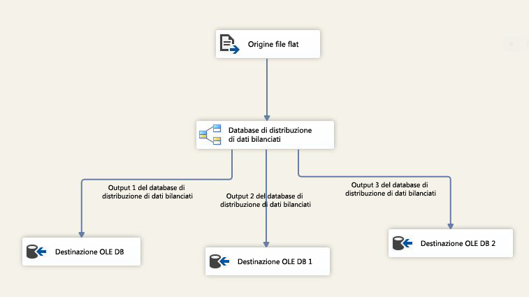

# Trasformazione del server di distribuzione di dati bilanciati
  La trasformazione del server di distribuzione di dati bilanciati (BDD) sfrutta le funzionalità di elaborazione simultanea delle CPU più recenti. Vengono distribuiti in modo uniforme i buffer di righe in entrata in output di thread distinti. Tramite i thread distinti di ogni percorso di output, con il componente BDD vengono migliorate le prestazioni di un pacchetto SSIS in computer con più processori e più core.  
  
 Nel diagramma seguente viene illustrato un esempio semplice di utilizzo della trasformazione BDD. In questo esempio, tramite la trasformazione BDD viene selezionato un buffer della pipeline per volta dai dati di input di un'origine del file flat e viene inviato a uno dei tre percorsi di output in base a un meccanismo round robin. In SQL Server Data Tools è possibile controllare i valori di una proprietà <xref:Microsoft.SqlServer.Dts.Pipeline.Wrapper.MainPipeClass.DefaultBufferSize%2A>(dimensioni predefinite del buffer della pipeline) e di una proprietà <xref:Microsoft.SqlServer.Dts.Pipeline.Wrapper.MainPipeClass.DefaultBufferMaxRows%2A>(numero massimo di righe predefinito in un buffer della pipeline) nella finestra **Proprietà** in cui sono visualizzate le proprietà di un'attività Flusso di dati.  
  
   
  
 La trasformazione del server di distribuzione di dati bilanciati consente di migliorare le prestazioni di un pacchetto in uno scenario che soddisfa i requisiti seguenti:  
  
1.  Sono presenti grandi quantità di dati in entrata nella trasformazione BDD. Se le dimensioni dei dati sono limitate e solo un buffer è in grado di contenere i dati, non è presente alcun punto quando si utilizza la trasformazione BDD. Se le dimensioni dei dati sono grandi e sono necessari diversi buffer per contenerli, tramite BDD è possibile elaborare i buffer di dati in parallelo tramite thread distinti.  
  
2.  I dati possono essere letti più velocemente rispetto al resto del flusso di dati elaborabile. In questo scenario, le trasformazioni effettuate nei dati vengono eseguite lentamente rispetto alla velocità di ingresso dei dati. Se il collo di bottiglia si trova in corrispondenza della destinazione, anche quest'ultima deve essere parallelizzabile.  
  
3.  I dati non devono essere ordinati. Ad esempio, se i dati devono rimanere ordinati, non è necessario suddividerli utilizzando la trasformazione BDD.  
  
 Si noti che se il collo di bottiglia in un pacchetto SSIS è dovuto alla velocità con cui i dati possono essere letti dall'origine, tramite il componente BDD non è possibile migliorare le prestazioni. Se il collo di bottiglia in un pacchetto SSIS si verifica perché la destinazione non supporta il parallelismo, non è possibile avvalersi del supporto di BDD. Tuttavia, è possibile eseguire tutte le trasformazioni in parallelo e utilizzare la trasformazione Unione input multipli per combinare i dati di output che provengano da percorsi di output differenti della trasformazione BDD prima di inviare i dati alla destinazione.  
  
> [!IMPORTANT]  
>  Per una presentazione con una demo sull'utilizzo della trasformazione, vedere il [video relativo al server di distribuzione di dati bilanciati](http://go.microsoft.com/fwlink/?LinkID=226278) nella libreria TechNet.  
  
  

