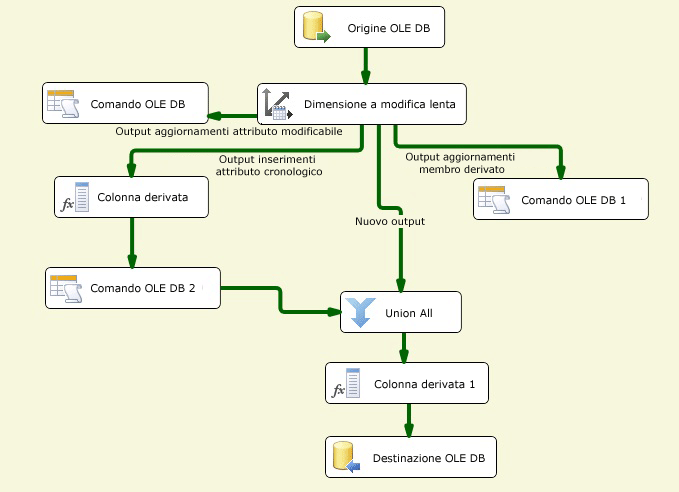

# Configurazione degli output tramite Configurazione guidata dimensioni a modifica lenta
  Configurazione guidata dimensioni a modifica lenta è l'editor per la trasformazione Dimensione a modifica lenta. La compilazione e la configurazione del flusso di dati di una dimensione a modifica lenta può risultare particolarmente complessa. Configurazione guidata dimensioni a modifica lenta rappresenta il modo più semplice per compilare il flusso di dati per gli output della trasformazione Dimensione a modifica lenta assistendo l'utente nel mapping delle colonne, nella selezione delle colonne chiave business, nell'impostazione degli attributi relativi alla modifica delle colonne e nella configurazione del supporto per i membri derivati della dimensione.  
  
 È necessario scegliere almeno una colonna chiave business nella tabella delle dimensioni ed eseguirne il mapping a una colonna di input. Il valore della chiave business collega un record nell'origine a un record nella tabella delle dimensioni. La trasformazione utilizza questo mapping per individuare il record nella tabella delle dimensioni e determinare se si tratta di un record nuovo o modificato. La chiave business in genere è la chiave primaria nell'origine ma può essere una chiave alternativa purché identifichi in modo esclusivo un record e il suo valore non cambi. La chiave business può essere anche una chiave composta, formata da più colonne. La chiave primaria nella tabella delle dimensioni è in genere una chiave surrogata, ovvero è un valore numerico generato automaticamente da una colonna Identity o da una soluzione personalizzata come ad esempio uno script.  
  
 Per poter eseguire Configurazione guidata dimensioni a modifica lenta, è necessario aggiungere un'origine e una trasformazione Dimensione a modifica lenta al flusso di dati e quindi connettere l'output dall'origine all'input della trasformazione Dimensione a modifica lenta. Facoltativamente, il flusso di dati può includere anche altre trasformazioni, tra l'origine dei dati e la trasformazione Dimensione a modifica lenta.  
  
 Per aprire la Configurazione guidata dimensioni a modifica lenta in Progettazione [!INCLUDE[ssIS](../../../includes/ssis-md.md)] , fare doppio clic sulla trasformazione Dimensione a modifica lenta.  
  
## Creazione degli output della trasformazione dimensione a modifica lenta  
  
#### Per creare gli output della trasformazione Dimensione a modifica lenta  
  
1.  Scegliere la gestione connessione per l'accesso all'origine dei dati che contiene la tabella delle dimensioni che si desidera aggiornare.  
  
     È possibile selezionarla da un elenco delle gestioni connessioni incluse nel pacchetto.  
  
2.  Scegliere la vista o la tabella delle dimensioni che si desidera aggiornare.  
  
     Dopo avere selezionato la gestione connessione, sarà possibile selezionare la tabella o la vista dall'origine dei dati.  
  
3.  Impostare gli attributi chiave sulle colonne ed eseguire il mapping delle colonne di input alle colonne della tabella delle dimensioni.  
  
     È necessario scegliere almeno una colonna chiave business nella tabella delle dimensioni ed eseguirne il mapping a una colonna di input. È possibile eseguire il mapping anche altre colonne di input alle colonne della tabella delle dimensioni come mapping non chiave.  
  
4.  Scegliere il tipo di modifica per ogni colonna.  
  
    -   **Attributo modificabile** sovrascrive i valori esistenti nei record.  
  
    -   **Attributo cronologico** crea nuovi record invece di aggiornare quelli esistenti.  
  
    -   **Attributo fisso** indica che il valore della colonna non deve essere modificato.  
  
5.  Impostare le opzioni relative agli attributi fissi e modificabili.  
  
     Se si configurano le colonne in modo da usare il tipo di modifica **Attributo fisso** , è possibile specificare se la trasformazione Dimensione a modifica lenta deve generare un errore quando vengono rilevate modifiche in queste colonne. Se si configurano le colonne in modo da usare il tipo di modifica **Attributo modificabile** , è possibile specificare se devono essere aggiornati tutti i record corrispondenti, inclusi quelli obsoleti.  
  
6.  Impostare le opzioni relative agli attributi cronologici.  
  
     Se si configurano le colonne in modo da usare il tipo di modifica **Attributo cronologico** , è necessario specificare come distinguere tra record correnti e scaduti. Per identificare le righe correnti e scadute è possibile utilizzare una colonna indicatore di riga corrente o due colonne di data. Se si usa la colonna indicatore di riga corrente, è possibile impostarla su **Corrente**o **True** quando la riga è aggiornata e su **Scaduta** o **False** quando la riga è scaduta. È inoltre possibile immettere valori personalizzati. Se si utilizzano due colonne di data, una data di inizio e una di fine, sarà possibile specificare la data da utilizzare per l'impostazione dei valori delle colonne di data digitando una data o selezionando una variabile di sistema e quindi utilizzandone il valore.  
  
7.  Specificare il supporto per i membri derivati e scegliere le colonne contenute nei record dei membri derivati.  
  
     Quando si caricano le misure in una tabella dei fatti, è possibile creare record minimi per i membri derivati che non esistono ancora. Quando in seguito saranno disponibili dati più significativi, i record delle dimensioni potranno essere aggiornati. È possibile creare i tipi di record minimi seguenti:  
  
    -   Un record in cui tutte le colonne hanno tipo di modifica Null.  
  
    -   Un record in cui è presente una colonna booleana che indica se il record è un membro derivato o meno.  
  
8.  Verificare le configurazioni compilate da Configurazione guidata dimensioni a modifica lenta. A seconda dei tipi di modifica supportati, al pacchetto vengono aggiunti set di componenti dei flussi di dati diversi.  
  
     Nella figura seguente viene illustrato un esempio di flusso di dati che supporta i tipi di modifica Attributo fisso, Attributo modificabile e Attributo cronologico, membri derivati e modifiche ai record corrispondenti.  
  
       
  
## Aggiornamento degli output della trasformazione Dimensione a modifica lenta  
 Il modo più semplice per aggiornare la configurazione degli output della trasformazione Dimensione a modifica lenta consiste nell'eseguire nuovamente Configurazione guidata dimensioni a modifica lenta e modificare le proprietà nelle pagine della procedura guidata. È possibile aggiornare la trasformazione Dimensione a modifica lenta anche usando la finestra di dialogo **Editor avanzato** oppure a livello di codice.  
  
## Vedere anche  
 [Slowly Changing Dimension Transformation](../../../integration-services/data-flow/transformations/slowly-changing-dimension-transformation.md)  
  
  
