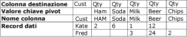
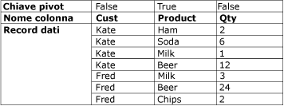

# UnPivot - trasformazione
  La trasformazione tramite UnPivot consente di trasformare un set di dati non normalizzato in una versione più normalizzata, espandendo valori di più colonne contenuti in un singolo record in più record con gli stessi valori in un'unica colonna. Si consideri ad esempio un set di dati che elenca i nomi dei clienti e include una riga per ogni cliente, ognuna contenente colonne in cui sono indicati i prodotti e le quantità acquistati. Dopo la normalizzazione del set di dati tramite la trasformazione UnPivot, il set di dati conterrà una riga per ogni prodotto acquistato dal cliente.  
  
 Nella figura seguente viene illustrato un set di dati prima della trasformazione tramite UnPivot in base alla colonna Product.  
  
   
  
 Nella figura seguente viene illustrato un set di dati dopo la trasformazione tramite UnPivot in base alla colonna Product.  
  
   
  
 In alcuni casi, i risultati della trasformazione tramite UnPivot possono contenere righe con valori imprevisti. Se i dati di esempio da trasformare tramite UnPivot illustrati nel diagramma contenessero valori Null in tutte le colonne Qty per Fred, l'output conterrebbe solo una riga per Fred e non cinque. La colonna Qty conterrebbe valori Null oppure zero, in base al tipo di dati della colonna.  
  
## Configurazione della trasformazione UnPivot  
 La trasformazione UnPivot include la proprietà personalizzata **PivotKeyValue** , che può essere aggiornata da un'espressione di proprietà al caricamento del pacchetto. Per altre informazioni, vedere [Espressioni di Integration Services &#40;SSIS&#41;](../../../integration-services/expressions/integration-services-ssis-expressions.md), [Utilizzo delle espressioni di proprietà nei pacchetti](../../../integration-services/expressions/use-property-expressions-in-packages.md) e [Proprietà personalizzate delle trasformazioni](../../../integration-services/data-flow/transformations/transformation-custom-properties.md).  
  
 Questa trasformazione include un input e un output. Non include alcun output degli errori.  
  
 È possibile impostare le proprietà tramite Progettazione [!INCLUDE[ssIS](../../../includes/ssis-md.md)] o a livello di codice.  
  
 Per ulteriori informazioni sulle proprietà che è possibile impostare nella finestra di dialogo **Editor avanzato** o a livello di codice, fare clic su uno degli argomenti seguenti:  
  
-   [Proprietà comuni](http://msdn.microsoft.com/library/51973502-5cc6-4125-9fce-e60fa1b7b796)  
  
-   [Proprietà personalizzate delle trasformazioni](../../../integration-services/data-flow/transformations/transformation-custom-properties.md)  
  
 Per altre informazioni su come impostare le proprietà, vedere [Impostazione delle proprietà di un componente del flusso di dati](../../../integration-services/data-flow/set-the-properties-of-a-data-flow-component.md).  
  
## Editor trasformazione UnPivot
  Utilizzare la finestra di dialogo **Editor trasformazione UnPivot** per selezionare le colonne da trasformare in righe tramite Pivot e specificare la colonna di dati e la nuova colonna di output per il valore pivot.  
  
> [!NOTE]  
>  Per illustrare l'uso delle opzioni, questo argomento si basa sullo scenario UnPivot descritto in [Unpivot Transformation](../../../integration-services/data-flow/transformations/unpivot-transformation.md) .  
  
### Opzioni  
 **Colonne di input disponibili**  
 Consente di specificare le colonne da trasformare in righe tramite Pivot utilizzando le caselle di controllo.  
  
 **Nome**  
 Consente di visualizzare il nome della colonna di input disponibile.  
  
 **Pass-through**  
 Indica se includere la colonna nell'output trasformato tramite UnPivot.  
  
 **Colonna di input**  
 Consente di selezionare una colonna di input nell'elenco delle colonne di input disponibili per ogni riga. Le selezioni effettuate vengono riflesse nelle selezioni delle caselle di controllo nella tabella **Colonne di input disponibili** .  
  
 Nello scenario UnPivot descritto in [Unpivot Transformation](../../../integration-services/data-flow/transformations/unpivot-transformation.md), le colonne di input sono le colonne **Ham**, **Soda**, **Milk**, **Beer**e **Chips** .  
  
 **Colonna di destinazione**  
 Consente di specificare un nome per la colonna di dati.  
  
 Nello scenario UnPivot descritto in [Unpivot Transformation](../../../integration-services/data-flow/transformations/unpivot-transformation.md), la colonna di destinazione è la colonna delle quantità, ovvero**Qty**.  
  
 **Valore chiave pivot**  
 Consente di specificare un nome per il valore pivot. Per impostazione predefinita viene suggerito il nome della colonna di input. È comunque possibile scegliere qualsiasi nome descrittivo univoco.  
  
 È possibile specificare il valore di questa proprietà tramite un'espressione di proprietà.  
  
 Nello scenario UnPivot descritto in [Unpivot Transformation](../../../integration-services/data-flow/transformations/unpivot-transformation.md), i valori pivot verranno visualizzati nella nuova colonna Product designata dall'opzione **Nome colonna valore chiave pivot** allo stesso modo dei valori di testo **Ham**, **Soda**, **Milk**, **Beer**e **Chips**.  
  
 **Nome colonna valore chiave pivot**  
 Consente di specificare il nome per la colonna del valore pivot. L'impostazione predefinita è "Valore chiave pivot". È comunque possibile scegliere un nome descrittivo univoco.  
  
 Nello scenario UnPivot descritto in [Unpivot Transformation](../../../integration-services/data-flow/transformations/unpivot-transformation.md), il Nome colonna valore chiave pivot è **Product** e designa la nuova colonna **Product** come la colonna in cui viene applicata la trasformazione tramite UnPivot alle colonne **Ham**, **Soda**, **Milk**, **Beer**e **Chips** .  
  
## Vedere anche  
 [Guida di riferimento ai messaggi e agli errori di Integration Services](../../../integration-services/integration-services-error-and-message-reference.md)   
 [Trasformazione pivot](../../../integration-services/data-flow/transformations/pivot-transformation.md)  
  
  
