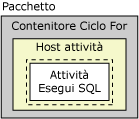
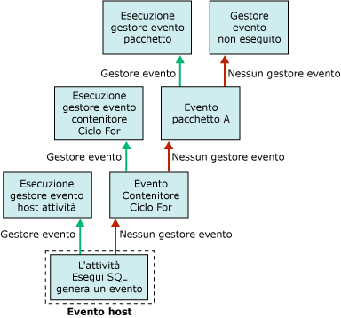

# Gestori eventi di Integration Services (SSIS)
  Durante la fase di esecuzione gli eseguibili, costituiti da pacchetti e contenitori Ciclo Foreach, Ciclo For, Sequenza e Host attività, generano eventi. Quando si verifica un errore, ad esempio, viene generato l'evento OnError. È possibile creare gestori di eventi personalizzati per tali eventi, per estendere le funzionalità dei pacchetti e semplificarne la gestione in fase di esecuzione. I gestori di eventi possono eseguire varie attività, ad esempio:  
  
-   Cancellare l'archivio dati temporaneo al termine dell'esecuzione di un pacchetto o attività.  
  
-   Recuperare informazioni di sistema per verificare la disponibilità delle risorse prima dell'esecuzione di un pacchetto.  
  
-   Aggiornare dati in una tabella quando una ricerca in una tabella di riferimento non riesce.  
  
-   Inviare un messaggio di posta elettronica quando viene generato un errore o un avviso oppure quando un'attività non riesce.  
  
 Se per un evento non esiste alcun gestore, tale evento verrà passato al contenitore di livello immediatamente superiore nella gerarchia dei contenitori del pacchetto. Se il contenitore dispone di un gestore di evento, quest'ultimo verrà eseguito in risposta all'evento, in caso contrario l'evento verrà passato al contenitore di livello immediatamente superiore nella gerarchia dei contenitori.  
  
 Nella figura seguente viene illustrato un semplice pacchetto che include un contenitore Ciclo For contenente un'attività Esegui SQL.  
  
   
  
 Solo il pacchetto dispone di un gestore di evento per il proprio evento **OnError** . Se si verifica un errore mentre viene eseguita l'attività Esegui SQL, verrà eseguito il gestore dell'evento **OnError** del pacchetto. Nella figura seguente viene illustrata la sequenza di chiamate che provoca l'esecuzione del gestore dell'evento **OnError** per il pacchetto.  
  
   
  
 I gestori di eventi sono membri di un insieme di gestori di eventi, disponibile in tutti i contenitori. Se si crea un pacchetto utilizzando Progettazione [!INCLUDE[ssIS](../includes/ssis-md.md)] , sarà possibile visualizzare i membri dell'insieme dei gestori di eventi nelle cartelle **Gestori eventi** della scheda **Esplora pacchetti** di Progettazione [!INCLUDE[ssIS](../includes/ssis-md.md)] .  
  
 Per configurare il contenitore di un gestore di evento, procedere nel modo seguente:  
  
-   Specificare un nome e una descrizione per il gestore di evento.  
  
-   Indicare se il gestore di evento viene eseguito, se il pacchetto deve generare un errore in caso di errore del gestore di evento e il numero di errori che possono verificarsi prima che il gestore di evento generi a sua volta un errore.  
  
-   Specificare il risultato di esecuzione da restituire al posto di quello effettivamente restituito dal gestore di evento in fase di esecuzione.  
  
-   Specificare l'opzione relativa alle transazioni per il gestore di evento.  
  
-   Specificare la modalità di registrazione utilizzata dal gestore di evento.  
  
## Contenuto di un gestore di evento  
 La creazione di un gestore di evento è simile alla compilazione di un pacchetto. Un gestore di evento include attività e contenitori, ordinati in sequenza in modo da formare un flusso di controllo, e può includere anche flussi di dati. In Progettazione [!INCLUDE[ssIS](../includes/ssis-md.md)] è disponibile la scheda **Gestori eventi** , che consente di creare gestori di eventi personalizzati.  
  
 È possibile creare gestori di eventi anche a livello di codice. Per altre informazioni, vedere [Gestione degli eventi a livello di programmazione](../integration-services/building-packages-programmatically/handling-events-programmatically.md).  
  
## Eventi di run-time  
 Nella tabella seguente vengono elencati i gestori di eventi disponibili in [!INCLUDE[ssISnoversion](../includes/ssisnoversion-md.md)] e vengono descritti gli eventi di run-time che ne provocano l'esecuzione.  
  
|Gestore di evento|Evento|  
|-------------------|-----------|  
|**OnError**|Gestore di evento per l'evento **OnError** . Questo evento viene generato da un eseguibile quando si verifica un errore.|  
|**OnExecStatusChanged**|Gestore di evento per l'evento **OnExecStatusChanged** . Questo evento viene generato da un eseguibile quando cambia il suo stato di esecuzione.|  
|**OnInformation**|Gestore di evento per l'evento **OnInformation** . Questo evento viene generato durante la convalida e l'esecuzione di un eseguibile, allo scopo di fornire informazioni. Questo evento fornisce solo informazioni, non errori o avvisi.|  
|**OnPostExecute**|Gestore di evento per l'evento **OnPostExecute** . Questo evento viene generato da un eseguibile immediatamente dopo la fine dell'esecuzione.|  
|**OnPostValidate**|Gestore di evento per l'evento **OnPostValidate** . Questo evento viene generato da un eseguibile al termine della convalida.|  
|**OnPreExecute**|Gestore di evento per l'evento **OnPreExecute** . Questo evento viene generato da un eseguibile immediatamente prima della sua esecuzione.|  
|**OnPreValidate**|Gestore di evento per l'evento **OnPreValidate** . Questo evento viene generato da un eseguibile all'inizio della sua convalida.|  
|**OnProgress**|Gestore di evento per l'evento **OnProgress** . Questo evento viene generato da un eseguibile quando compie un avanzamento misurabile.|  
|**OnQueryCancel**|Gestore di evento per l'evento **OnQueryCancel** . Questo evento viene generato da un eseguibile per determinare se l'esecuzione deve essere arrestata.|  
|**OnTaskFailed**|Gestore di evento per l'evento **OnTaskFailed** . Questo evento viene generato da un'attività quando non riesce.|  
|**OnVariableValueChanged**|Gestore di evento per l'evento **OnVariableValueChanged** . Questo evento viene generato da un eseguibile quando il valore di una variabile viene modificato. L'evento viene generato dall'eseguibile in cui è definita la variabile. Se la proprietà **RaiseChangeEvent** della variabile è impostata su **False**, questo evento non verrà generato. Per altre informazioni, vedere [Integration Services &#40;SSIS&#41; Variables](../integration-services/integration-services-ssis-variables.md).|  
|**OnWarning**|Gestore di evento per l'evento **OnWarning** . Questo evento viene generato da un eseguibile quando viene generato un avviso.|  

## Aggiunta di un gestore eventi a un pacchetto
In fase di esecuzione contenitori e attività generano eventi. È possibile creare gestori di eventi personalizzati che rispondono a tali eventi eseguendo un flusso di lavoro alla generazione dell'evento. Ad esempio, è possibile creare un gestore di evento che invia un messaggio di posta elettronica quando un'attività non viene completata correttamente.  
  
 Un gestore di evento è simile a un pacchetto. Come un pacchetto, può fornire un ambito per le variabili e includere un flusso di controllo, oltre a flussi di dati facoltativi. È possibile compilare gestori di eventi per i pacchetti, per il contenitore Ciclo Foreach, per il contenitore Ciclo For, per il contenitore Sequenza e per tutte le attività.  
  
 Per creare i gestori di eventi è possibile usare l'area di progettazione della scheda **Gestori eventi** in Progettazione [!INCLUDE[ssIS](../includes/ssis-md.md)] .  
  
 Quando la scheda **Gestori eventi** è attiva, nei nodi **Elementi flusso di controllo** e **Attività di manutenzione** della casella degli strumenti di Progettazione [!INCLUDE[ssIS](../includes/ssis-md.md)] sono disponibili le attività e i contenitori necessari per la compilazione del flusso di controllo del gestore di evento. Nei nodi **Origini flusso di dati**, **Trasformazioni**e **Destinazioni flusso di dati** sono disponibili le origini dei dati, le trasformazioni e le destinazioni per la compilazione dei flussi di dati nel gestore di evento. Per altre informazioni, vedere [Flusso di controllo](../integration-services/control-flow/control-flow.md) e [Flusso di dati](../integration-services/data-flow/data-flow.md).  
  
 La scheda **Gestori eventi** include anche l'area **Gestioni connessioni** , in cui è possibile creare e modificare le gestioni connessioni usate dai gestori di eventi per connettersi a server e origini dei dati. Per altre informazioni, vedere [Creazione di gestioni connessioni](http://msdn.microsoft.com/library/6ca317b8-0061-4d9d-b830-ee8c21268345).  
  
### Aggiungere un gestore eventi nella scheda Gestori eventi  
  
1.  In [!INCLUDE[ssBIDevStudioFull](../includes/ssbidevstudiofull-md.md)]aprire il progetto di [!INCLUDE[ssISnoversion](../includes/ssisnoversion-md.md)] che contiene il pacchetto desiderato.  
  
2.  In Esplora soluzioni fare doppio clic sul pacchetto per aprirlo.  
  
3.  Fare clic sulla scheda **Gestori eventi** .  
  
       
  
     La creazione del flusso di controllo e dei flussi di dati di un gestore dell'evento è analoga alla creazione del flusso di controllo e dei flussi di dati di un pacchetto. Per altre informazioni, vedere [Flusso di controllo](../integration-services/control-flow/control-flow.md) e [Flusso di dati](../integration-services/data-flow/data-flow.md).  
  
4.  Nell'elenco **File eseguibili** selezionare il file per il quale si desidera creare un gestore dell'evento.  
  
5.  Nell'elenco **Gestore evento** selezionare il gestore dell'evento che si desidera compilare.  
  
6.  Fare clic sul collegamento nell'area di progettazione della scheda **Gestore evento** .  
  
7.  Aggiungere le voci del flusso di controllo nel gestore dell'evento, quindi connetterle tra di loro tramite un vincolo di precedenza trascinando il vincolo da una voce del flusso di controllo a un'altra. Per altre informazioni, vedere [Flusso di controllo](../integration-services/control-flow/control-flow.md).  
  
8.  Facoltativamente, aggiungere un'attività Flusso di dati e nell'area di progettazione della scheda **Flusso di dati** creare un flusso di dati per il gestore dell'evento. Per altre informazioni, vedere [Flusso di dati](../integration-services/data-flow/data-flow.md).  
  
9. Scegliere **Salva elementi selezionati** dal menu **File** per salvare il pacchetto.  

## Impostare le proprietà di un gestore eventi  
 È possibile impostare le proprietà a livello di codice o nella finestra **Proprietà** di [!INCLUDE[ssBIDevStudioFull](../includes/ssbidevstudiofull-md.md)] .  
  
 Per informazioni su come impostare queste proprietà nella finestra di Progettazione [!INCLUDE[ssBIDevStudioFull](../includes/ssbidevstudiofull-md.md)], vedere [Impostazione delle proprietà di un'attività o di un contenitore](http://msdn.microsoft.com/library/52d47ca4-fb8c-493d-8b2b-48bb269f859b).  
  
 Per informazioni sull'impostazione di queste proprietà a livello di codice, vedere <xref:Microsoft.SqlServer.Dts.Runtime.DtsEventHandler>.  
  
## Related Tasks  
 Per informazioni su come aggiungere un gestore eventi a un pacchetto, vedere [Aggiunta di un gestore eventi a un pacchetto](http://msdn.microsoft.com/library/5e56885d-8658-480a-bed9-3f2f8003fd78).  
  
  
