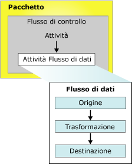

# Pacchetti di Integration Services (SSIS)
  Un pacchetto è una raccolta organizzata di connessioni, elementi di flusso di controllo, elementi di flusso di dati, gestori eventi, variabili, parametri e configurazioni che possono essere assemblati usando gli strumenti di progettazione grafica disponibili in [!INCLUDE[ssNoVersion](../includes/ssnoversion-md.md)] [!INCLUDE[ssISnoversion](../includes/ssisnoversion-md.md)], oppure compilati a livello di codice.  Salvare il pacchetto completo in [!INCLUDE[ssNoVersion](../includes/ssnoversion-md.md)], nell'archivio pacchetti di [!INCLUDE[ssIS](../includes/ssis-md.md)] o nel file system oppure distribuire il progetto ssISnoversion nel server [!INCLUDE[ssIS](../includes/ssis-md.md)] . Il pacchetto è l'unità di lavoro che viene recuperata, eseguita e salvata.  
  
 Al momento della creazione un pacchetto è un oggetto vuoto, privo di funzionalità. Per aggiungere funzionalità a un pacchetto è necessario aggiungervi un flusso di controllo e, facoltativamente, uno o più flussi di dati.  
  
 Nella figura seguente viene illustrato un semplice pacchetto che contiene un flusso di controllo con un'attività Flusso di dati, che a sua volta contiene un flusso di dati.  
  
   
  
 Dopo aver creato il pacchetto base è possibile estenderne le funzionalità aggiungendovi ad esempio variabili e funzionalità di registrazione. Per ulteriori informazioni, vedere la sezione dedicata agli oggetti che estendono le funzionalità dei pacchetti.  
  
 Il pacchetto completo può essere quindi configurato impostando proprietà a livello di pacchetto che implementano la sicurezza, consentono il riavvio del pacchetto da un checkpoint o l'incorporamento di transazioni nel flusso di lavoro. Per ulteriori informazioni, vedere la sezione dedicata alle proprietà che supportano le funzionalità avanzate.  
  
## Contenuto di un pacchetto  
 **Attività e contenitori (flusso di controllo).** Un flusso di controllo è costituito da una o più attività e contenitori che vengono eseguiti durante l'esecuzione del pacchetto. Per controllare l'ordine o definire le condizioni per l'esecuzione dell'attività o del contenitore successivo nel flusso di controllo del pacchetto, è necessario connettere le attività e i contenitori del pacchetto tramite vincoli di precedenza. È anche possibile raggruppare un subset di attività e contenitori per eseguirli ripetutamente come unità nell'ambito del flusso di controllo del pacchetto. Per altre informazioni, vedere [Flusso di controllo](../integration-services/control-flow/control-flow.md).  
  
 **Origini e destinazioni dei dati (flusso di dati).** Un flusso di dati è costituito da origini e destinazioni che estraggono e caricano dati, da trasformazioni che modificano ed estendono dati e da percorsi che collegano origini, trasformazioni e destinazioni. È possibile aggiungere un flusso di dati a un pacchetto solo se il flusso di controllo del pacchetto include un'attività Flusso di dati. L'attività Flusso di dati è un eseguibile, nell'ambito del pacchetto [!INCLUDE[ssIS](../includes/ssis-md.md)] , che crea, ordina ed esegue il flusso di dati. Per ogni attività Flusso di dati contenuta in un pacchetto, viene aperta un'istanza distinta del motore flusso di dati. Per altre informazioni, vedere [Attività Flusso di dati](../integration-services/control-flow/data-flow-task.md) e [Flusso di dati](../integration-services/data-flow/data-flow.md).  
  
 **Gestioni connessioni (connessioni).** Un pacchetto include in genere almeno una gestione connessione. Una gestione connessione è un collegamento tra un pacchetto e un'origine dati che definisce la stringa di connessione per l'accesso ai dati utilizzata da attività, trasformazioni e gestori dell'evento nel pacchetto. [!INCLUDE[ssISnoversion](../includes/ssisnoversion-md.md)] sono disponibili tipi di connessione per origini dati quali file di testo e XML, database relazionali e progetti e database di [!INCLUDE[ssASnoversion](../includes/ssasnoversion-md.md)] . Per altre informazioni, vedere [Connessioni in Integration Services &#40;SSIS&#41;](../integration-services/connection-manager/integration-services-ssis-connections.md).  
  
## Oggetti che estendono le funzionalità dei pacchetti  
 I pacchetti possono includere oggetti quali gestori eventi, configurazioni, funzionalità di registrazione e variabili, che aggiungono funzionalità avanzate o estendono quelle esistenti.  
  
### Gestori di eventi  
 Un gestore di evento è un flusso di lavoro che viene eseguito in risposta agli eventi generati da un pacchetto, un'attività o un contenitore. È ad esempio possibile utilizzare un gestore di evento per controllare lo spazio su disco quando si verifica un evento di pre-esecuzione o un errore e inviare a un amministratore un messaggio di posta elettronica contenente informazioni sullo spazio disponibile o sull'errore. Un gestore di evento è strutturato come un pacchetto, con un flusso di controllo e uno o più flussi di dati facoltativi. I gestori di eventi possono essere aggiunti alle singole attività o contenitori di un pacchetto. Per altre informazioni, vedere [Gestori eventi di Integration Services &#40;SSIS&#41;](../integration-services/integration-services-ssis-event-handlers.md).  
  
### Configurazioni  
 Una configurazione è un set di coppie proprietà-valore che definisce le proprietà del pacchetto e dei relativi contenitori, attività, variabili, connessioni e gestori di eventi, al momento dell'esecuzione del pacchetto. Grazie alle configurazioni è possibile aggiornare le proprietà senza modificare il pacchetto. Quando il pacchetto viene eseguito, le informazioni di configurazione vengono caricate e i valori delle proprietà vengono aggiornati. Una configurazione può ad esempio aggiornare la stringa di connessione.  
  
 La configurazione viene salvata e quindi distribuita insieme al pacchetto quando questo viene installato in un altro computer. Quando il pacchetto viene installato in un ambiente diverso, i valori della configurazione possono essere aggiornati in base alle nuove esigenze. Per altre informazioni, vedere [Creazione di configurazioni dei pacchetti](../integration-services/packages/create-package-configurations.md).  
  
### Registrazione e provider di log  
 Un log è una raccolta di informazioni sul pacchetto che vengono raccolte quando il pacchetto viene eseguito. Un log può ad esempio indicare l'ora di inizio e di fine dell'esecuzione di un pacchetto. Un provider di log definisce il tipo di destinazione e il formato che il pacchetto e i relativi contenitori e attività possono utilizzare per la registrazione delle informazioni in fase di esecuzione. I log sono associati a un pacchetto, ma le attività e i contenitori nel pacchetto possono registrare informazioni in qualsiasi log di pacchetto. [!INCLUDE[ssISnoversion](../includes/ssisnoversion-md.md)] è disponibile una varietà di provider di log predefiniti per la registrazione. [!INCLUDE[ssISnoversion](../includes/ssisnoversion-md.md)] include ad esempio provider di log per [!INCLUDE[ssNoVersion](../includes/ssnoversion-md.md)] e file di testo. È inoltre possibile creare provider di log personalizzati e utilizzarli per la registrazione. Per altre informazioni, vedere [registrazione di Integration Services &#40;SSIS&#41;](../integration-services/performance/integration-services-ssis-logging.md).  
  
### Variabili  
 [!INCLUDE[ssISnoversion](../includes/ssisnoversion-md.md)] supporta variabili di sistema e variabili definite dall'utente. Le variabili di sistema contengono informazioni utili sugli oggetti del pacchetto in fase di esecuzione, mentre le variabili definite dall'utente consentono la gestione di scenari personalizzati. Entrambi i tipi di variabili possono essere utilizzati in espressioni, script e configurazioni.  
  
 Le variabili a livello di pacchetto includono le variabili di sistema predefinite e le variabili definite dall'utente con ambito pacchetto. Per altre informazioni, vedere [Variabili di Integration Services (SSIS)](../integration-services/integration-services-ssis-variables.md).  
 
### Parametri  
 [!INCLUDE[ssISnoversion](../includes/ssisnoversion-md.md)] I parametri consentono di assegnare valori alle proprietà incluse nei pacchetti durante la fase di esecuzione. È possibile creare *parametri di progetto* al livello del progetto e *parametri di pacchetto* al livello del pacchetto. I parametri del progetto vengono utilizzati per fornire input esterno ricevuto dal progetto a uno o più pacchetti nel progetto. I parametri del pacchetto consentono di modificare l'esecuzione del pacchetto senza doverlo modificare e ridistribuire. Per altre informazioni, vedere [Parametri di Integration Services (SSIS)](../integration-services/integration-services-ssis-package-and-project-parameters.md).  
 
## Proprietà dei pacchetti che supportano funzionalità avanzate  
 L'oggetto pacchetto può essere configurato in modo da supportare funzionalità quali il riavvio del pacchetto da un determinato checkpoint, la firma del pacchetto con un certificato digitale, l'impostazione del livello di protezione del pacchetto e la protezione dell'integrità dei dati tramite transazioni.  
  
### Riavvio dei pacchetti  
 Il pacchetto include proprietà checkpoint che possono essere utilizzate per riavviarlo quando una o più attività hanno esito negativo. Se ad esempio un pacchetto contiene due attività Flusso di dati che aggiornano due diverse tabelle e la seconda attività non riesce, sarà possibile riavviare il pacchetto senza ripetere la prima attività Flusso di dati. Per i pacchetti a esecuzione prolungata questo consente un notevole risparmio di tempo, perché tramite il riavvio è possibile riprendere l'esecuzione del pacchetto a partire dall'attività non riuscita, anziché rieseguirlo per intero. Per ulteriori informazioni, vedere [Restart Packages by Using Checkpoints](../integration-services/packages/restart-packages-by-using-checkpoints.md).  
  
### Sicurezza dei pacchetti  
 I pacchetti possono essere firmati digitalmente e crittografati utilizzando una password o una chiave utente. La firma digitale consente di autenticare l'origine del pacchetto. Tuttavia, è necessario configurare anche [!INCLUDE[ssISnoversion](../includes/ssisnoversion-md.md)] per verificare la firma digitale quando viene caricato il pacchetto. Per altre informazioni, vedere [Identificazione dell'origine dei pacchetti con firme digitali](../integration-services/security/identify-the-source-of-packages-with-digital-signatures.md) e [Controllo dell'accesso per dati sensibili nei pacchetti](../integration-services/security/access-control-for-sensitive-data-in-packages.md).  
  
### Supporto delle transazioni  
 Se si imposta un attributo di transazione a livello di pacchetto, sarà possibile includere nella transazione tutti i contenitori, le attività e le connessioni del pacchetto. Gli attributi di transazione assicurano che il pacchetto e i relativi elementi abbiano esito positivo o negativo come una singola unità. Poiché un pacchetto può eseguire altri pacchetti e includerli in una transazione, una singola unità di lavoro può comprendere più pacchetti. Per altre informazioni, vedere [Transazioni di Integration Services](../integration-services/integration-services-transactions.md).  
  
## Voci di log personalizzate disponibili nei pacchetti  
 Nella tabella seguente sono elencate le voci di log personalizzate disponibili per i pacchetti. Per altre informazioni, vedere [registrazione di Integration Services &#40;SSIS&#41;](../integration-services/performance/integration-services-ssis-logging.md).  
  
|Voce di log|Description|  
|---------------|-----------------|  
|**PackageStart**|Indica che l'esecuzione del pacchetto è iniziata.   Nota: questa voce di log viene scritta automaticamente nel log. e non può essere esclusa.|  
|**Fine pacchetto**|Indica che l'esecuzione del pacchetto è stata completata.   Nota: questa voce di log viene scritta automaticamente nel log. e non può essere esclusa.|  
|**Diagnostic**|Offre informazioni sulla configurazione del sistema che influisce sull'esecuzione dei pacchetti, ad esempio il numero di file eseguibili che è possibile eseguire simultaneamente.|  
  
## Impostare le proprietà di un pacchetto  
 È possibile impostare le proprietà a livello di codice o nella finestra **Proprietà** di [!INCLUDE[ssBIDevStudioFull](../includes/ssbidevstudiofull-md.md)] .  
  
 Per informazioni su come impostare queste proprietà usando [!INCLUDE[ssBIDevStudioFull](../includes/ssbidevstudiofull-md.md)], vedere [Impostazione delle proprietà di un pacchetto](../integration-services/set-package-properties.md).  
  
 Per informazioni sull'impostazione di queste proprietà a livello di codice, vedere <xref:Microsoft.SqlServer.Dts.Runtime.Package>.  

## Riusare un pacchetto esistente come modello  
 Molti pacchetti vengono utilizzati come modello per la compilazione di pacchetti con le stesse funzionalità di base. È possibile compilare il pacchetto di base e quindi copiarlo oppure impostare tale pacchetto come modello. Un pacchetto che scarica e copia file e quindi ne estrae i dati, ad esempio, può includere le attività FTP e File system in un ciclo Foreach che enumera i file presenti in una cartella. Può inoltre includere gestioni connessioni file flat per l'accesso ai dati e origini file flat per l'estrazione dei dati. Poiché la destinazione dei dati può variare, viene aggiunta a ogni nuovo pacchetto dopo la copia dal pacchetto di base. È anche possibile creare pacchetti e quindi usarli come modelli per i nuovi pacchetti da aggiungere a un progetto di [!INCLUDE[ssISnoversion](../includes/ssisnoversion-md.md)] . Per altre informazioni, vedere [Creare pacchetti in SQL Server Data Tools](../integration-services/create-packages-in-sql-server-data-tools.md).  
  
 Alla creazione di un nuovo pacchetto, a livello di codice o tramite Progettazione SSIS, viene aggiunto un GUID alla proprietà **ID** e un nome alla proprietà **Name** del pacchetto. Se si crea un nuovo pacchetto copiando un pacchetto esistente oppure utilizzando un pacchetto modello, verranno copiati anche il nome e il GUID di tale pacchetto. Quando si utilizza la registrazione questo può costituire un problema, perché il GUID e il nome del pacchetto vengono scritti nei log per identificare il pacchetto a cui appartengono le informazioni registrate. È pertanto necessario modificare il nome e il GUID dei nuovi pacchetti per distinguerli tra loro e da quello da cui sono stati copiati, nei dati dei file di log.  
  
 Per modificare il GUID di un pacchetto è necessario rigenerare il GUID nella proprietà **ID** , disponibile nella finestra Proprietà in [!INCLUDE[ssBIDevStudioFull](../includes/ssbidevstudiofull-md.md)]. Per cambiare il nome di un pacchetto è necessario modificare il valore della proprietà **Name** nella finestra Proprietà. In alternativa è possibile usare il prompt dei comandi **dtutil** oppure modificare il nome e il GUID a livello di codice. Per altre informazioni, vedere [Impostazione delle proprietà di un pacchetto](../integration-services/set-package-properties.md) e [Utilità dtutil](../integration-services/dtutil-utility.md).  
  
## Related Tasks  
 [!INCLUDE[ssISnoversion](../includes/ssisnoversion-md.md)] sono disponibili due strumenti grafici per la creazione di pacchetti, Progettazione [!INCLUDE[ssIS](../includes/ssis-md.md)] e Importazione/Esportazione guidata [!INCLUDE[ssNoVersion](../includes/ssnoversion-md.md)] , oltre al modello a oggetti [!INCLUDE[ssIS](../includes/ssis-md.md)] . Per informazioni dettagliate, vedere gli argomenti seguenti.  
  
-   [Importare ed esportare dati con l'Importazione/Esportazione guidata SQL Server](../integration-services/import-export-data/import-and-export-data-with-the-sql-server-import-and-export-wizard.md)  
  
-   [Creare pacchetti in SQL Server Data Tools](../integration-services/create-packages-in-sql-server-data-tools.md)  
  
-   Vedere [Compilazione di pacchetti a livello di programmazione](../integration-services/building-packages-programmatically/building-packages-programmatically.md) nella Guida per gli sviluppatori. 
  
  
