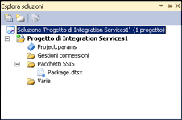

# Progetti e soluzioni di Integration Services (SSIS)
  [!INCLUDE[ssNoVersion](../includes/ssnoversion-md.md)] fornisce [!INCLUDE[ssBIDevStudioFull](../includes/ssbidevstudiofull-md.md)] per lo sviluppo di pacchetti [!INCLUDE[ssISnoversion](../includes/ssisnoversion-md.md)] .  
  
I pacchetti di [!INCLUDE[ssISnoversion](../includes/ssisnoversion-md.md)] risiedono in progetti. Per creare e usare progetti di [!INCLUDE[ssISnoversion](../includes/ssisnoversion-md.md)] , è necessario installare l'ambiente [!INCLUDE[ssBIDevStudioFull](../includes/ssbidevstudiofull-md.md)] . Per altre informazioni, vedere [Installazione di Integration Services](../integration-services/install-windows/install-integration-services.md).  
  
 Quando si crea un nuovo progetto di [!INCLUDE[ssISnoversion](../includes/ssisnoversion-md.md)] in [!INCLUDE[ssBIDevStudioFull](../includes/ssbidevstudiofull-md.md)], nella finestra di dialogo **Nuovo progetto** è incluso un modello **Progetto di Integration Services** . Questo modello consente di creare un nuovo progetto che contiene un singolo pacchetto.  
  
## Progetti e soluzioni  
 I progetti vengono archiviati in soluzioni. È possibile creare una soluzione e quindi aggiungervi un progetto di [!INCLUDE[ssISnoversion](../includes/ssisnoversion-md.md)] . Se non esiste alcuna soluzione, [!INCLUDE[ssBIDevStudioFull](../includes/ssbidevstudiofull-md.md)] ne creerà automaticamente una al momento della creazione del progetto. Una soluzione può contenere più progetti di tipi diversi.  
  
> [!TIP]  
>  Per impostazione predefinita, quando si crea un nuovo progetto in [!INCLUDE[ssBIDevStudio](../includes/ssbidevstudio-md.md)], la soluzione non viene visualizzata nel riquadro **Esplora soluzioni**. Per modificare questo comportamento predefinito, scegliere **Opzioni** dal menu **Strumenti**. Nella finestra di dialogo **Opzioni** espandere **Progetti e soluzioni**e quindi fare clic su **Generale**. Nella pagina **Generale** selezionare **Mostra sempre soluzione**.  

## Soluzioni che contengono progetti  
 Una soluzione è un contenitore tramite cui vengono raggruppati e gestiti i progetti utilizzati durante lo sviluppo di soluzioni aziendali end-to-end. Una soluzione consente di gestire più progetti come una singola unità e raggruppa uno o più progetti correlati che concorrono a formare una soluzione aziendale.  
  
 Nelle soluzioni possono essere inclusi diversi tipi di progetto. Per creare un pacchetto di [!INCLUDE[ssIS](../includes/ssis-md.md)] mediante Progettazione [!INCLUDE[ssISnoversion](../includes/ssisnoversion-md.md)] , sarà necessario utilizzare un progetto di [!INCLUDE[ssISnoversion](../includes/ssisnoversion-md.md)] in una soluzione fornita da [!INCLUDE[ssBIDevStudioFull](../includes/ssbidevstudiofull-md.md)].  
  
 Quando si crea una nuova soluzione, [!INCLUDE[ssBIDevStudioFull](../includes/ssbidevstudiofull-md.md)] aggiunge una cartella specifica della soluzione a Esplora soluzioni e crea file con estensioni sln e suo:  
  
-   Il file con estensione sln contiene informazioni sulla configurazione della soluzione e un elenco dei progetti della soluzione.  
  
-   Il file con estensione suo contiene informazioni sulle preferenze dell'utente relative alla soluzione.  
  
 Quando si crea un nuovo progetto in [!INCLUDE[ssBIDevStudioFull](../includes/ssbidevstudiofull-md.md)] , viene automaticamente creata una soluzione, ma è anche possibile creare una soluzione vuota a cui aggiungere progetti in un secondo tempo.  
   
## Progetti di Integration Services che contengono pacchetti  
 Un progetto è un contenitore in cui si sviluppano pacchetti di [!INCLUDE[ssISnoversion](../includes/ssisnoversion-md.md)] .  
  
 In un progetto di [!INCLUDE[ssBIDevStudioFull](../includes/ssbidevstudiofull-md.md)]in [!INCLUDE[ssISnoversion](../includes/ssisnoversion-md.md)] vengono archiviati e raggruppati i file correlati al pacchetto. Ad esempio, in un progetto sono inclusi i file necessari per creare una specifica soluzione di estrazione, trasferimento e caricamento specifica (ETL).  
  
 Prima di creare un progetto di [!INCLUDE[ssISnoversion](../includes/ssisnoversion-md.md)] , è necessario acquisire dimestichezza con il contenuto di base di questo tipo di progetto. Una volta compreso il contenuto, è possibile cominciare a creare e utilizzare un progetto di [!INCLUDE[ssISnoversion](../includes/ssisnoversion-md.md)] .  
  
## Cartelle dei progetti di Integration Services  
 Nel diagramma seguente vengono illustrate le cartelle di un progetto di [!INCLUDE[ssISnoversion](../includes/ssisnoversion-md.md)] in [!INCLUDE[ssBIDevStudioFull](../includes/ssbidevstudiofull-md.md)].  
  
   
  
 Nella tabella seguente si descrivono le cartelle incluse in un progetto di [!INCLUDE[ssISnoversion](../includes/ssisnoversion-md.md)] .  
  
|Cartella|Description|  
|------------|-----------------|  
|[!INCLUDE[ssIS](../includes/ssis-md.md)] Pacchetti|Contiene i pacchetti. Per altre informazioni, vedere [Pacchetti di Integration Services &#40;SSIS&#41;](../integration-services/integration-services-ssis-packages.md).|  
|Varie|Sono contenuti file diversi dai file di pacchetto.|  
  
## File dei progetti di Integration Services  
 Quando si aggiunge un progetto di [!INCLUDE[ssISnoversion](../includes/ssisnoversion-md.md)] nuovo o esistente a una soluzione, tramite [!INCLUDE[ssBIDevStudioFull](../includes/ssbidevstudiofull-md.md)] vengono creati file di progetto con estensione dtproj, dtproj.user e database.  
  
-   Nel file con estensione dtproj sono contenute informazioni sulle configurazioni del progetto e su elementi quali i pacchetti.  
  
-   Il file con estensione dtproj.user contiene informazioni relative alle preferenze dell'utente per l'utilizzo del progetto.  
  
-   Nel file con estensione database sono contenute le informazioni necessarie a [!INCLUDE[ssBIDevStudioFull](../includes/ssbidevstudiofull-md.md)] per aprire il progetto di [!INCLUDE[ssISnoversion](../includes/ssisnoversion-md.md)] .  
  
## Specifica delle versioni di destinazione nei progetti di Integration Services  
 In [!INCLUDE[ssBIDevStudioFull](../includes/ssbidevstudiofull-md.md)]è possibile creare, gestire ed eseguire pacchetti destinati a SQL Server 2016, SQL Server 2014 o SQL Server 2012.  
  
 In Esplora soluzioni fare clic con il pulsante destro del mouse su un progetto di Integration Services e scegliere **Proprietà** per aprire le pagine delle proprietà per il progetto. Nella scheda **Generale** di **Proprietà di configurazione**selezionare la proprietà **TargetServerVersion** , quindi scegliere SQL Server 2016, SQL Server 2014 o SQL Server 2012.  
  
   
 
## Creazione di un nuovo progetto di Integration Services  
  
1.  Aprire [!INCLUDE[ssBIDevStudioFull](../includes/ssbidevstudiofull-md.md)].  
  
2.  Scegliere **Nuovo** dal menu **File**e quindi fare clic su **Progetto**.  
  
3.  Nel riquadro **Modelli** della finestra di dialogo **Nuovo progetto** selezionare il modello **Progetto di Integration Services**.  
  
     Con il modello **Progetto di Integration Services** è possibile creare un progetto di [!INCLUDE[ssISnoversion](../includes/ssisnoversion-md.md)] contenente un unico pacchetto vuoto.  
  
4.  Facoltativamente, modificare il nome e il percorso del modello.  
  
     Il nome della soluzione viene aggiornato automaticamente in moda da corrispondere al nome del progetto.  
  
5.  Per creare una cartella distinta per il file della soluzione, selezionare **Crea directory per soluzione**. Si tratta dell'opzione predefinita.  
  
6.  Se nel computer è installato software per il controllo del codice sorgente, selezionare **Aggiungi al controllo del codice sorgente** per associare il progetto al controllo del codice sorgente.  
  
7.  Se il software per il controllo del codice sorgente è [!INCLUDE[msCoName](../includes/msconame-md.md)] Visual SourceSafe, verrà visualizzata la finestra di dialogo **Accesso a Visual SourceSafe**. In **Accesso a Visual SourceSafe** specificare un nome utente, una password e il nome del database di [!INCLUDE[msCoName](../includes/msconame-md.md)] Visual SourceSafe. Fare clic su **Sfoglia** per individuare il database.  
  
    > **NOTA:** per visualizzare e modificare il plug-in del controllo del codice sorgente selezionato e configurare l'ambiente di controllo del codice sorgente, scegliere **Opzioni** dal menu **Strumenti** e quindi espandere il nodo **Controllo del codice sorgente**.  
  
8.  Fare clic su **OK** per aggiungere la soluzione a **Esplora soluzioni** e aggiungere il progetto alla soluzione.  
  
## Scegliere la versione di destinazione di un progetto e i pacchetti correlati  
  
1.  In Esplora soluzioni fare clic con il pulsante destro del mouse su un progetto di Integration Services e scegliere **Proprietà** per aprire le pagine delle proprietà per il progetto.  
  
2.  Nella scheda **Generale** di **Proprietà di configurazione**selezionare la proprietà **TargetServerVersion** , quindi scegliere SQL Server 2016, SQL Server 2014 o SQL Server 2012.  
  
       
  
 È possibile creare, gestire ed eseguire pacchetti destinati a SQL Server 2016, SQL Server 2014 o SQL Server 2012.  

## Importare un progetto esistente con l'Importazione guidata progetto
  
1.  In [!INCLUDE[vsprvs](../includes/vsprvs-md.md)]scegliere **Nuovo** > **progetto** dal menu **File** .  
  
2.  Nell'area **Modelli installati** della finestra **Nuovo progetto** espandere **Business Intelligence**, quindi scegliere **Integration Services**.  
  
3.  Selezionare **Importazione guidata progetto di Integration Services** dall'elenco dei tipi di progetto.  
  
4.  Digitare un nome per il nuovo progetto da creare nella casella di testo **Nome** .  
  
5.  Digitare il percorso del progetto nella casella di testo **Percorso** oppure fare clic su **Sfoglia** per selezionarne uno.  
  
6.  Digitare un nome per la soluzione nella casella di testo **Nome soluzione** .  
  
7.  Fare clic su **OK** per avviare la finestra di dialogo **Importazione guidata progetto di Integration Services** .  
  
8.  Fare clic su **Avanti** per passare alla pagina **Seleziona origine** .  
  
9. Se si importa da un file **ispac** , digitare il percorso comprendente il nome file nella casella di testo **Percorso** . Fare clic su **Sfoglia** per passare alla cartella in cui si desidera archiviare la soluzione e digitare il nome file nella casella di testo **Nome file** e fare clic su **Apri**.  
  
     Se si importa da un **Catalogo di Integration Services**, digitare il nome dell'istanza di database nella casella di testo **Nome server** oppure fare clic su **Sfoglia** e selezionare l'istanza di database che contiene il catalogo.  
  
     Fare clic su **Sfoglia** accanto alla casella di testo **Percorso** , espandere cartella nel catalogo, selezionare il progetto che si desidera importare e fare clic su **OK**.  
  
     Fare clic su **Avanti** per passare alla pagina **Verifica** .  
  
10. Rivedere le informazioni e fare clic su **Importa** per creare un progetto basato sul progetto esistente selezionato.  
  
11. Facoltativo: fare clic su **Salva report** per salvare i risultati in un file  
  
12. Fare clic su **Chiudi** per chiudere la finestra di dialogo **Importazione guidata progetto di Integration Services** .  

## Aggiungere un progetto a una soluzione 
 È possibile aggiungere un nuovo progetto vuoto tramite [!INCLUDE[ssISnoversion](../includes/ssisnoversion-md.md)] oppure aggiungere un progetto già creato per una soluzione diversa. È possibile aggiungere un progetto in una soluzione esistente solo se la soluzione è visibile in [!INCLUDE[ssBIDevStudioFull](../includes/ssbidevstudiofull-md.md)].  
  
### Aggiungere un nuovo progetto a una soluzione  
  
1.  In [!INCLUDE[ssBIDevStudioFull](../includes/ssbidevstudiofull-md.md)] aprire la soluzione a cui si vuole aggiungere un nuovo progetto di [!INCLUDE[ssISnoversion](../includes/ssisnoversion-md.md)] ed eseguire una delle operazioni seguenti:  
  
    -   Fare clic con il pulsante destro del mouse sulla soluzione, scegliere **Aggiungi** e quindi fare clic su **Nuovo progetto**.  
  
    -   Scegliere **Aggiungi** dal menu **File** e quindi fare clic su **Nuovo progetto**.  
  
2.  Nella finestra di dialogo **Aggiungi nuovo progetto** fare clic su **Progetto di Integration Services** nel riquadro **Modelli**.  
  
3.  È inoltre possibile modificare il nome e il percorso del progetto.  
  
4.  Fare clic su **OK**.  
  
### Aggiungere un progetto esistente a una soluzione  
  
1.  In [!INCLUDE[ssBIDevStudioFull](../includes/ssbidevstudiofull-md.md)] aprire la soluzione a cui si desidera aggiungere un progetto di [!INCLUDE[ssISnoversion](../includes/ssisnoversion-md.md)] esistente ed eseguire una delle operazioni seguenti:  
  
    -   Fare clic con il pulsante destro del mouse sulla soluzione, scegliere **Aggiungi** e quindi fare clic su **Progetto esistente**.  
  
    -   Scegliere **Aggiungi** dal menu **File** e quindi fare clic su **Progetto esistente**.  
  
2.  Nella finestra di dialogo **Aggiungi progetto esistente** usare il pulsante Sfoglia per individuare il progetto da aggiungere e quindi fare clic su **Apri**.  
  
3.  Il progetto verrà aggiunto alla cartella della soluzione in **Esplora soluzioni**.  
  
## Rimuovere un progetto da una soluzione
 È possibile rimuovere un progetto da una soluzione solo se la soluzione è visibile in [!INCLUDE[ssBIDevStudioFull](../includes/ssbidevstudiofull-md.md)]. Quando la soluzione è visibile, è possibile rimuovere tutti i progetti tranne uno. Se rimane un solo progetto, la cartella della soluzione non verrà più visualizzata in [!INCLUDE[ssBIDevStudioFull](../includes/ssbidevstudiofull-md.md)] e non sarà possibile rimuovere l'ultimo progetto.  
   
1.  In [!INCLUDE[ssBIDevStudioFull](../includes/ssbidevstudiofull-md.md)] aprire la soluzione da cui si vuole rimuovere un progetto di [!INCLUDE[ssISnoversion](../includes/ssisnoversion-md.md)].  
  
2.  In Esplora soluzioni fare clic con il pulsante destro del mouse sul progetto e quindi scegliere **Scarica progetto**.  
  
3.  Fare clic su **OK** per confermare la rimozione.  

## Aggiungere un elemento a un progetto  
  
1.  In [!INCLUDE[ssBIDevStudioFull](../includes/ssbidevstudiofull-md.md)]aprire la soluzione che contiene il progetto di [!INCLUDE[ssISnoversion](../includes/ssisnoversion-md.md)] a cui si desidera aggiungere un elemento.  
  
2.  In Esplora soluzioni fare clic sul progetto con il pulsante destro del mouse, scegliere **Aggiungi**ed eseguire una delle operazioni seguenti:  
  
    -   Fare clic su **Nuovo elemento**, quindi selezionare un modello dal riquadro **Modelli** della finestra di dialogo **Aggiungi nuovo elemento** .  
  
    -   Fare clic su **Elemento esistente**, individuare nella finestra di dialogo **Aggiungi elemento esistente** l'elemento che si desidera aggiungere al progetto, quindi fare clic su **Aggiungi**.  
  
3.  Il nuovo elemento verrà visualizzato nella cartella appropriata in Esplora soluzioni.  

## Copia di elementi di progetto  
È possibile copiare gli oggetti all'interno di un progetto di [!INCLUDE[ssISnoversion](../includes/ssisnoversion-md.md)] o tra progetti di [!INCLUDE[ssISnoversion](../includes/ssisnoversion-md.md)]. È anche possibile copiare oggetti tra gli altri tipi di progetti di [!INCLUDE[ssBIDevStudioFull](../includes/ssbidevstudiofull-md.md)], [!INCLUDE[ssRSnoversion](../includes/ssrsnoversion-md.md)] e [!INCLUDE[ssASnoversion](../includes/ssasnoversion-md.md)]. Per copiare tra progetti, il progetto deve far parte della stessa soluzione di [!INCLUDE[ssBIDevStudioFull](../includes/ssbidevstudiofull-md.md)].

1.  In [!INCLUDE[ssBIDevStudioFull](../includes/ssbidevstudiofull-md.md)] aprire la soluzione o il progetto di [!INCLUDE[ssISnoversion](../includes/ssisnoversion-md.md)] che si vuole usare.  
  
2.  Espandere il progetto e la cartella contenente l'elemento da copiare.  
  
3.  Fare clic con il pulsante destro del mouse sull'elemento e scegliere **Copia**.  
  
4.  Fare clic con il pulsante destro del mouse sul progetto di [!INCLUDE[ssISnoversion](../includes/ssisnoversion-md.md)] in cui copiare l'elemento e scegliere **Incolla**.  
  
     Gli elementi vengono copiati automaticamente nella cartella corretta. Se gli elementi copiati nel progetto di [!INCLUDE[ssISnoversion](../includes/ssisnoversion-md.md)] non sono pacchetti, verranno copiati nella cartella **Varie**.  
     
