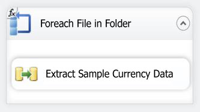
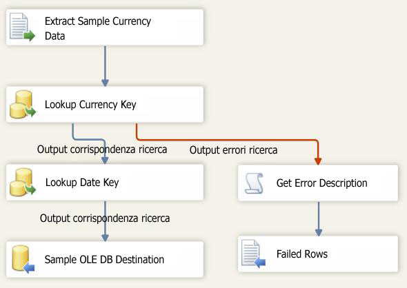

# Lezione 6-3-test del pacchetto della lezione 6
In fase di esecuzione, il pacchetto ottiene il valore della proprietà Directory dal parametro VarFolderName.  
  
Per verificare che il pacchetto esegua l'aggiornamento della proprietà Directory con il nuovo valore in fase di esecuzione, eseguire semplicemente il pacchetto. Poiché solo tre file di dati di esempio sono stati copiati nella nuova directory, il flusso di dati verrà eseguito solo tre volte anziché essere reiterato nei 14 file della cartella originale.  
  
## Verifica del layout del pacchetto  
Prima di testare il pacchetto è consigliabile verificare che il flusso di controllo e il flusso di dati nel pacchetto della lezione 6 contengano gli oggetti visualizzati nelle figure seguenti. Il flusso di controllo deve essere identico a quello nella lezione 5. Il flusso di dati deve essere identico a quello nella lezione 5.  
  
**Flusso di controllo**  
  
  
  
**Flusso di dati**  
  
  
  
### Per testare il pacchetto creato nella lezione 6 dell'esercitazione  
  
1.  Scegliere Avvia debug dal menu Debug.  
  
2.  Al termine dell'esecuzione del pacchetto, scegliere Arresta debug dal menu Debug.  
  
## Attività successiva della lezione  
[Passaggio 4: Distribuzione del pacchetto della lezione 6](../integration-services/lesson-6-4-deploying-the-lesson-6-package.md)  
  
  
  

