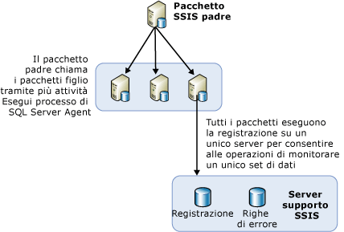

# Bilanciamento del carico dei pacchetti su server remoti tramite SQL Server Agent
  Quando è necessario eseguire numerosi pacchetti, è preferibile utilizzare altri server eventualmente disponibili. L'utilizzo di altri server per l'esecuzione di più pacchetti controllati da un unico pacchetto padre è detto bilanciamento del carico. In [!INCLUDE[ssNoVersion](../../includes/ssnoversion-md.md)] [!INCLUDE[ssISnoversion](../../includes/ssisnoversion-md.md)]il bilanciamento del carico è una procedura manuale che deve essere definita dai proprietari dei pacchetti. Il bilanciamento del carico non viene infatti eseguito automaticamente dai server. Inoltre, sui server remoti è possibile eseguire esclusivamente pacchetti interi, non singole attività in altri pacchetti.  
  
 Il bilanciamento del carico risulta utile negli scenari seguenti:  
  
-   I pacchetti possono essere eseguiti contemporaneamente.  
  
-   I pacchetti sono di grandi dimensioni e, se eseguiti sequenzialmente, richiedere un tempo di esecuzione superiore al tempo massimo consentito per l'elaborazione.  
  
 Amministratori e architetti possono stabilire se l'utilizzo di server aggiuntivi per l'elaborazione può costituire un vantaggio per i processi.  
  
## Illustrazione del bilanciamento del carico  
 Nella figura seguente viene illustrato un pacchetto padre in un server. Il pacchetto padre contiene più attività Esegui processo di SQL Server Agent e ogni attività nel pacchetto padre chiama un processo di SQL Server Agent su un server remoto. Ogni server remoto contiene un processo di SQL Server Agent che include un passaggio in cui viene chiamato un pacchetto su tale server.  
  
   
  
 I passaggi necessari per il bilanciamento del carico in questa architettura non sono concetti nuovi. Il bilanciamento del carico viene infatti ottenuto utilizzando in modo nuovo concetti esistenti e oggetti SSIS comuni.  
  
## Esecuzione di pacchetti in un'istanza remota tramite SQL Server Agent  
 Nell'architettura di base per l'esecuzione di pacchetti remoti è presente un pacchetto centrale che risiede nell'istanza di SQL Server che controlla gli altri pacchetti remoti. Tale pacchetto è illustrato nella figura, con il nome Pacchetto SSIS padre. L'istanza in cui risiede tale pacchetto controlla l'esecuzione dei processi di SQL Server Agent che eseguono i pacchetti figlio. I pacchetti figlio non vengono eseguiti in base a una pianificazione fissa controllata da SQL Server Agent sul server remoto, ma vengono avviati da SQL Server Agent quando quest'ultimo viene chiamato dal pacchetto padre e vengono eseguiti nella stessa istanza di SQL Server in cui risiede SQL Server Agent.  
  
 Per poter eseguire un pacchetto remoto tramite SQL Server Agent, è necessario configurare i pacchetti padre e figlio, quindi configurare i processi di SQL Server Agent che controllano i pacchetti figlio. Nelle sezioni seguenti vengono fornite ulteriori informazioni sulle procedure per la creazione, la configurazione, l'esecuzione e la manutenzione di pacchetti eseguiti su server remoti. Il processo include numerosi passaggi:  
  
-   Creazione dei pacchetti figlio e installazione di questi ultimi nei server remoti.  
  
-   Creazione dei processi di SQL Server Agent sulle istanze remote in cui verranno eseguiti i pacchetti.  
  
-   Creazione del pacchetto padre.  
  
-   Determinazione dello scenario di registrazione per i pacchetti figlio.  
  
## Implementazione di pacchetti figlio
  Quando si implementa il bilanciamento del carico tramite [!INCLUDE[ssISnoversion](../../includes/ssisnoversion-md.md)], i pacchetti figlio vengono installati su altri server per sfruttare il tempo di CPU o di server disponibile. Per creare ed eseguire i pacchetti figlio è necessario attenersi alla procedura seguente:  
  
-   Progettare i pacchetti figlio.  
  
-   Spostare i pacchetti sul server remoto.  
  
-   Creare sul server remoto un processo di SQL Server Agent contenente un passaggio che esegue il pacchetto figlio.  
  
-   Eseguire il debug e il test del processo di SQL Server Agent e dei pacchetti figlio.  
  
 Poiché non sono previste limitazioni, durante la progettazione dei pacchetti figlio è possibile inserire qualsiasi funzionalità nei pacchetti. Se tuttavia il pacchetto deve accedere a dati, è necessario verificare che il server in cui viene eseguito il pacchetto abbia accesso a tali dati.  
  
 Per identificare il pacchetto padre che esegue i pacchetti figlio, in [!INCLUDE[ssBIDevStudioFull](../../includes/ssbidevstudiofull-md.md)] fare clic con il pulsante destro del mouse sul pacchetto in Esplora soluzioni e quindi scegliere **Pacchetto punto di ingresso**.  
  
 Terminata la progettazione dei pacchetti figlio è necessario distribuirli nei server remoti.  
  
### Spostamento dei pacchetti figlio nell'istanza remota  
 Esistono più modi per spostare pacchetti su altri server. È tuttavia consigliabile utilizzare i due metodi seguenti:  
  
-   Esportazione di pacchetti tramite [!INCLUDE[ssManStudioFull](../../includes/ssmanstudiofull-md.md)].  
  
-   Distribuzione di pacchetti compilando un'utilità di distribuzione per il progetto contenente i pacchetti da distribuire, quindi esecuzione dell'Installazione guidata pacchetti per installare i pacchetti nel file system o in un'istanza di [!INCLUDE[ssNoVersion](../../includes/ssnoversion-md.md)]. Per altre informazioni, vedere [Distribuzione del pacchetto legacy &#40;SSIS&#41;](../../integration-services/packages/legacy-package-deployment-ssis.md).  
  
 È necessario ripetere la distribuzione su tutti i server remoti che si desidera utilizzare.  
  
### Creazione dei processi di SQL Server Agent  
 Dopo la distribuzione dei pacchetti figlio sui vari server, creare un processo di SQL Server Agent su ogni server che contiene un pacchetto figlio. Il processo di SQL Server Agent deve contenere un passaggio che esegue il pacchetto figlio quando viene chiamato l'agente del processo. I processi di SQL Server Agent non sono processi pianificati, ma eseguono i pacchetti figlio solo quando vengono chiamati dal pacchetto padre. Nella notifica dell'esito positivo o negativo restituita al pacchetto padre viene comunicato l'esito positivo o negativo del processo di SQL Server Agent, specificando se la chiamata a SQL Server Agent è avvenuta correttamente, ma non viene indicato l'esito positivo o negativo del pacchetto figlio oppure se quest'ultimo è stato eseguito.  
  
### Debug dei processi di SQL Server Agent e dei pacchetti figlio  
 Per il test dei processi di SQL Server Agent e dei relativi pacchetti figlio è possibile utilizzare uno dei metodi seguenti:  
  
-   Eseguire ogni pacchetto figlio in Progettazione SSIS, scegliendo **Debug** / **Avvia senza eseguire debug**.  
  
-   Eseguire ogni singolo processo di SQL Server Agent sul relativo computer remoto, tramite [!INCLUDE[ssManStudioFull](../../includes/ssmanstudiofull-md.md)], per verificare che il pacchetto venga eseguito.  
  
 Per informazioni su come risolvere i problemi legati all'esecuzione di pacchetti dai processi di [!INCLUDE[ssNoVersion](../../includes/ssnoversion-md.md)] Agent, vedere l'articolo relativo a [un pacchetto SSIS che non viene eseguito quando si chiama il pacchetto SSIS da un passaggio di processo di SQL Server Agent](http://support.microsoft.com/kb/918760) nella [!INCLUDE[msCoName](../../includes/msconame-md.md)] Knowledge Base.  
  
 SQL Server Agent verifica l'accesso al sottosistema per un proxy e garantisce l'accesso al proxy a ogni esecuzione del relativo passaggio del processo.  
  
 In [!INCLUDE[ssManStudioFull](../../includes/ssmanstudiofull-md.md)]è possibile creare un proxy.  

## Implementazione del pacchetto padre
  Quando si esegue il bilanciamento del carico dei pacchetti di SSIS tra più server, dopo la creazione e la distribuzione dei pacchetti figlio e dopo la creazione dei processi remoti di SQL Server Agent per eseguirli, è necessario creare il pacchetto padre. Il pacchetto padre deve contenere più attività Esegui processo di SQL Server Agent, ognuna della quali è responsabile di chiamare un diverso processo di SQL Server Agent che esegue uno dei pacchetti figlio. Le attività Esegui processo di SQL Server Agent nel pacchetto padre eseguono a loro volta i vari processi di SQL Server Agent. Ogni attività nel pacchetto padre contiene informazioni riguardanti ad esempio la modalità di connessione al server remoto e il processo da eseguire su tale server. Per altre informazioni, vedere [Execute SQL Server Agent Job Task](../../integration-services/control-flow/execute-sql-server-agent-job-task.md).  
  
 Per identificare il pacchetto padre che esegue i pacchetti figlio, in [!INCLUDE[ssBIDevStudioFull](../../includes/ssbidevstudiofull-md.md)] fare clic con il pulsante destro del mouse sul pacchetto in Esplora soluzioni, quindi scegliere **Pacchetto punto di ingresso**.  
  
### Elenco di pacchetti figlio  
 Se si distribuisce un progetto contenente un pacchetto padre e pacchetti figlio nel server [!INCLUDE[ssISnoversion](../../includes/ssisnoversion-md.md)] , sarà possibile visualizzare un elenco dei pacchetti figlio eseguiti dal pacchetto padre. Quando si esegue il pacchetto padre, un report **Panoramica** per il pacchetto padre è generato automaticamente in [!INCLUDE[ssManStudioFull](../../includes/ssmanstudiofull-md.md)]. Il report include un elenco dei pacchetti figlio eseguiti dall'attività Esegui pacchetto contenuta nel pacchetto padre, come illustrato nell'immagine seguente.  
  
   
  
 Per informazioni sull'accesso al report **Panoramica** , vedere [Reports for the Integration Services Server](../../integration-services/performance/monitor-running-packages-and-other-operations.md#reports).  
  
### Vincoli di precedenza nel pacchetto padre  
 Quando si creano vincoli di precedenza tra le attività Esegui processo di SQL Server Agent nel pacchetto padre, tali vincoli di precedenza controllano solo il momento in cui vengono avviati i processi di SQL Server Agent sui server remoti. I vincoli di precedenza non possono ricevere informazioni sull'esito positivo o negativo dei pacchetti figlio eseguiti dai passaggi dei processi di SQL Server Agent.  
  
 L'esito positivo o negativo di un pacchetto figlio non viene pertanto propagato al pacchetto padre, perché l'attività Esegui processo di SQL Server Agent nel pacchetto padre ha unicamente la funzione di richiedere al processo di SQL Server Agent di eseguire il pacchetto figlio. Se la chiamata al processo di SQL Server Agent viene completata correttamente, il pacchetto padre riceve il risultato <xref:Microsoft.SqlServer.Dts.Runtime.DTSExecResult.Success>.  
  
 In questo scenario l'eventuale esito negativo indica solamente che si è verificato un errore durante la chiamata remota al processo di SQL Server Agent. Questa situazione si presenta ad esempio quando il server remoto non è disponibile e l'agente non risponde. Finché l'agente è attivo, tuttavia, il pacchetto padre completa correttamente l'attività.  
  
> [!NOTE]  
>  È possibile usare un'attività Esegui SQL contenente un'istruzione Transact-SQL **sp_start_job N'package_name'**. Per altre informazioni, vedere [sp_start_job &#40;Transact-SQL&#41;](../../relational-databases/system-stored-procedures/sp-start-job-transact-sql.md).  
  
### Ambiente di debug  
 Durante il test del pacchetto padre è possibile accedere all'ambiente di debug della finestra di progettazione scegliendo Avvia debug (F5) dal menu Debug. In alternativa, è possibile usare l'utilità della riga di comando **dtexec**. Per altre informazioni, vedere [dtexec Utility](../../integration-services/packages/dtexec-utility.md).  

## Registrazione per pacchetti con bilanciamento del carico in server remoti
  La gestione dei log di tutti i pacchetti figlio in esecuzione su più server risulta più semplice se tutti i pacchetti figlio utilizzano lo stesso provider di log e scrivono nella stessa destinazione. Per creare un file di log comune per tutti i pacchetti figlio, è possibile configurare i pacchetti figlio in modo da registrare i propri eventi in un provider di log di tipo SQL Server. È possibile configurare tutti i pacchetti in modo che utilizzino lo stesso database, lo stesso server e la stessa istanza del server.  
  
 Per visualizzare tutti i file di log, l'amministratore deve semplicemente accedere a un server e visualizzare il file di log per tutti i pacchetti figlio.  
  
 Per informazioni su come abilitare la registrazione in un pacchetto, vedere [Registrazione di Integration Services (SSIS)](../../integration-services/performance/integration-services-ssis-logging.md).  

## Attività correlate  
 [Processi di SQL Server Agent per i pacchetti](../../integration-services/packages/sql-server-agent-jobs-for-packages.md)  
  
  
