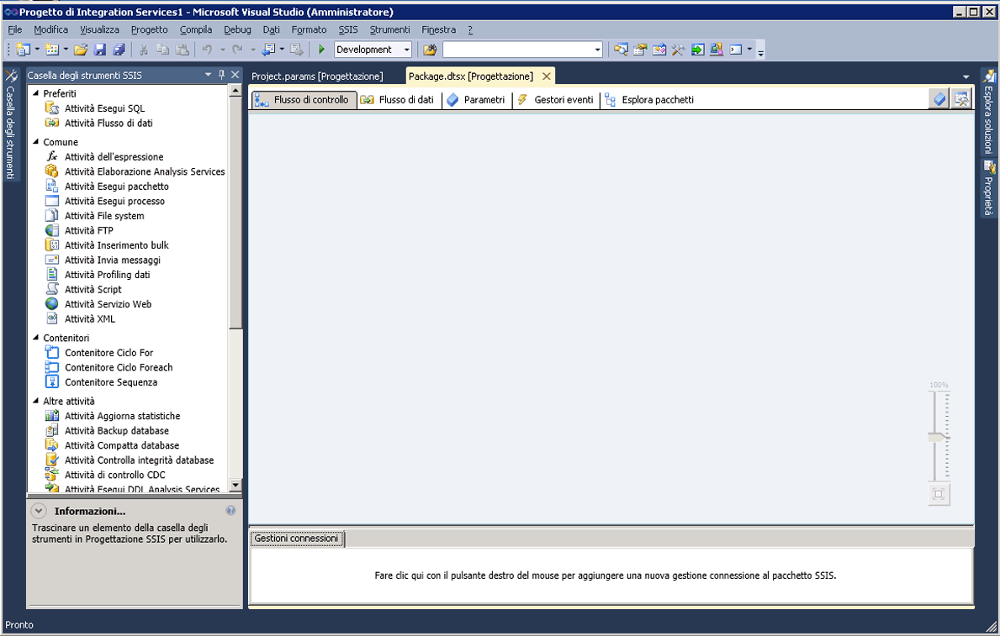

# Progettazione SSIS
  [!INCLUDE[ssIS](../includes/ssis-md.md)] - Progettazione SSIS è uno strumento grafico che è possibile usare per creare e gestire pacchetti di [!INCLUDE[ssISnoversion](../includes/ssisnoversion-md.md)]. [!INCLUDE[ssIS](../includes/ssis-md.md)] - Progettazione SSIS è disponibile in [!INCLUDE[ssBIDevStudioFull](../includes/ssbidevstudiofull-md.md)] nell'ambito di un progetto di [!INCLUDE[ssISnoversion](../includes/ssisnoversion-md.md)].  
  
 È possibile utilizzare Progettazione [!INCLUDE[ssIS](../includes/ssis-md.md)] per eseguire le attività seguenti:  
  
-   Costruzione del flusso di controllo in un pacchetto.  
  
-   Costruzione dei flussi di dati in un pacchetto.  
  
-   Aggiunta di gestori di eventi al pacchetto e agli oggetti del pacchetto.  
  
-   Visualizzazione del contenuto del pacchetto.  
  
-   In fase di esecuzione, visualizzazione dello stato di esecuzione del pacchetto.  
  
 Nella figura seguente vengono illustrate le finestre Progettazione [!INCLUDE[ssIS](../includes/ssis-md.md)] e **Casella degli strumenti**.  
  
   
  
 [!INCLUDE[ssISnoversion](../includes/ssisnoversion-md.md)] include ulteriori finestre e finestre di dialogo per l'aggiunta di funzionalità ai pacchetti e in [!INCLUDE[ssBIDevStudioFull](../includes/ssbidevstudiofull-md.md)] sono disponibili finestre e finestre di dialogo che consentono di configurare l'ambiente di sviluppo e usare i pacchetti. Per altre informazioni, vedere [Interfaccia utente di Integration Services](../integration-services/integration-services-user-interface.md).  
  
 [!INCLUDE[ssIS](../includes/ssis-md.md)] - Progettazione SSIS non ha dipendenze da [!INCLUDE[ssISnoversion](../includes/ssisnoversion-md.md)], il servizio responsabile della gestione e del monitoraggio dei pacchetti, ed è pertanto possibile creare e modificare pacchetti in Progettazione [!INCLUDE[ssIS](../includes/ssis-md.md)] anche quando tale servizio non è in esecuzione. Se tuttavia si arresta il servizio mentre è aperta la finestra di Progettazione [!INCLUDE[ssIS](../includes/ssis-md.md)], non sarà più possibile aprire le finestre di dialogo di Progettazione [!INCLUDE[ssIS](../includes/ssis-md.md)] ed è possibile che venga visualizzato il messaggio di errore "Server RPC non disponibile". Per reimpostare Progettazione [!INCLUDE[ssIS](../includes/ssis-md.md)] e continuare a usare il pacchetto, è necessario chiudere la finestra di progettazione, uscire da [!INCLUDE[ssBIDevStudioFull](../includes/ssbidevstudiofull-md.md)] e riaprire [!INCLUDE[ssBIDevStudioFull](../includes/ssbidevstudiofull-md.md)], il progetto [!INCLUDE[ssISnoversion](../includes/ssisnoversion-md.md)] e il pacchetto.  
  
## Annullare e ripristinare  
 È possibile annullare e ripristinare fino a 20 azioni in Progettazione [!INCLUDE[ssIS](../includes/ssis-md.md)]. Per un pacchetto, la funzionalità di annullamento o ripristino è disponibile nelle schede **Flusso di controllo**, **Flusso di dati**, **Gestori eventi** e **Parametri** e nella finestra **Variabili**. Per un progetto, tale funzionalità è disponibile nella finestra **Parametri progetto**.  
  
 Non è possibile annullare/ripristinare le modifiche alla nuova **Casella degli strumenti SSIS**.  
  
 Quando si apportano modifiche a un componente utilizzando l'editor del componente, è possibile annullare o ripristinare le modifiche come set anziché annullare e ripristinare modifiche singole. Il set di modifiche viene visualizzato come un'azione singola nell'elenco a discesa di annullamento e ripristino.  
  
 Per annullare un'azione, fare clic sul pulsante sulla barra degli strumenti, scegliere la voce di menu **Modifica/Annulla** o premere CTRL+Z. Per ripetere un'azione, fare clic sul pulsante sulla barra degli strumenti, scegliere la voce di menu **Annulla/Ripeti** o premere CTRL+Y. Per annullare e ripetere più azioni, fare clic sulla freccia accanto al pulsante sulla barra degli strumenti, evidenziare più azioni nell'elenco a discesa e fare clic nell'elenco.  
  
## Parti di Progettazione SSIS  
 [!INCLUDE[ssIS](../includes/ssis-md.md)] - Progettazione SSIS contiene cinque schede permanenti: tre consentono di compilare, rispettivamente, il flusso di controllo, i flussi di dati e i gestori eventi del pacchetto e una consente di visualizzare il contenuto del pacchetto. In fase di esecuzione viene visualizzata una sesta scheda che mostra lo stato di esecuzione del pacchetto, mentre è in esecuzione, e i risultati ottenuti, al termine dell'esecuzione.  
  
 Progettazione [!INCLUDE[ssIS](../includes/ssis-md.md)] include inoltre l'area Gestioni connessioni, in cui è possibile aggiungere e configurare le gestioni connessioni utilizzate dal pacchetto per connettersi ai dati.  
  
### Scheda Flusso di controllo  
 L'area di progettazione della scheda **Flusso di controllo** consente di costruire il flusso di controllo di un pacchetto. Trascinare gli elementi desiderati da **Casella degli strumenti** all'area di progettazione e connetterli in modo da formare un flusso di controllo, facendo clic sull'icona di un elemento e trascinando la freccia verso un altro elemento.  
  
 Per altre informazioni, vedere [Flusso di controllo](../integration-services/control-flow/control-flow.md).  
  
### Scheda Flusso di dati  
 Se un pacchetto contiene un'attività Flusso di dati, sarà possibile aggiungere flussi di dati al pacchetto. Per costruire flussi di dati in un pacchetto è possibile usare l'area di progettazione della scheda **Flusso di dati**. Trascinare gli elementi desiderati da **Casella degli strumenti** all'area di progettazione e connetterli in modo da formare un flusso di dati, facendo clic sull'icona di un elemento e trascinando la freccia verso un altro elemento.  
  
 Per altre informazioni, vedere [Flusso di dati](../integration-services/data-flow/data-flow.md).  
  
### Scheda Parametri  
 I parametri di Integration Services (SSIS) consentono di assegnare valori alle proprietà incluse nei pacchetti durante la fase di esecuzione. È possibile creare parametri di progetto al livello del progetto e parametri di pacchetto al livello del pacchetto. I parametri del progetto vengono utilizzati per fornire input esterno ricevuto dal progetto a uno o più pacchetti nel progetto. I parametri del pacchetto consentono di modificare l'esecuzione del pacchetto senza doverlo modificare e ridistribuire. Questa scheda consente di gestire i parametri del pacchetto.  
  
 Per altre informazioni sui parametri, vedere [Parametri di Integration Services (SSIS)](https://msdn.microsoft.com/library/hh213214.aspx).  
  
> **IMPORTANTE**  I parametri sono disponibili solo per i progetti sviluppati per il modello di distribuzione del progetto. Pertanto, la scheda Parametri sarà disponibile solo per i pacchetti che fanno parte di un progetto configurato per l'utilizzo del modello di distribuzione del progetto.  
  
### Scheda Gestori eventi  
 Per costruire gli eventi di un pacchetto, usare l'area di progettazione della scheda **Gestori eventi**. Nella scheda **Gestori eventi** selezionare il pacchetto o l'oggetto del pacchetto per cui si vuole creare un gestore di evento e quindi selezionare l'evento da associare al gestore di evento. Un gestore di evento include un flusso di controllo e flussi di dati facoltativi.  
  
 Per altre informazioni, vedere [Aggiunta di un gestore eventi a un pacchetto](../Topic/Add%20an%20Event%20Handler%20to%20a%20Package.md).  
  
### Scheda Esplora pacchetti  
 I pacchetti possono essere complessi, ovvero includere numerose attività, gestioni connessioni, variabili e altri elementi. La visualizzazione di esplorazione del pacchetto consente di ottenere un elenco completo degli elementi del pacchetto.  
  
 Per altre informazioni, vedere [Visualizzazione di oggetti di pacchetto](../integration-services/view-package-objects.md).  
  
#### Scheda Stato o Risultati esecuzione  
 Durante l'esecuzione di un pacchetto nella scheda **Stato** viene mostrato lo stato di esecuzione del pacchetto. Al termine dell'esecuzione i risultati rimangono disponibili nella scheda **Risultati esecuzione**.  
  
> **NOTA:** per abilitare o disabilitare la visualizzazione di messaggi nella scheda **Stato **, attivare o disattivare l'opzione **Debug report di stato** nel menu **SSIS**.  
  
##### Area Gestioni connessioni  
 Le gestioni connessioni usate da un pacchetto vengono aggiunte e modificate nell'area **Gestioni connessioni**. [!INCLUDE[ssISnoversion](../includes/ssisnoversion-md.md)] include le gestioni connessioni per stabilire la connessione a una varietà di origini dati quali file di testo, database OLE DB e provider .NET.  
  
 Per altre informazioni, vedere [Connessioni in Integration Services &#40;SSIS&#41;](../integration-services/connection-manager/integration-services-ssis-connections.md) e [Creazione di gestioni connessioni](../Topic/Create%20Connection%20Managers.md).  
  
## Attività correlate  
  
-   [Creare pacchetti in SQL Server Data Tools](../integration-services/create-packages-in-sql-server-data-tools.md)  
  
## Vedere anche  
 [Interfaccia utente di Integration Services](../integration-services/integration-services-user-interface.md)  
  
  