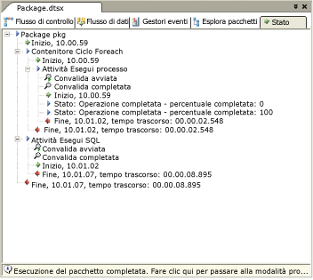

# Debug del flusso di controllo
  [!INCLUDE[ssBIDevStudioFull](../../includes/ssbidevstudiofull-md.md)] e [!INCLUDE[msCoName](../../includes/msconame-md.md)] [!INCLUDE[ssISnoversion](../../includes/ssisnoversion-md.md)] includono funzionalità e strumenti che è possibile usare per la risoluzione dei problemi del flusso di controllo in un pacchetto di [!INCLUDE[ssISnoversion](../../includes/ssisnoversion-md.md)] .  
  
-   [!INCLUDE[ssISnoversion](../../includes/ssisnoversion-md.md)] supporta l'uso di punti di interruzione in contenitori e attività.  
  
-   [!INCLUDE[ssIS](../../includes/ssis-md.md)] Progettazione genera report di stato in fase di runtime.  
  
-   [!INCLUDE[ssBIDevStudioFull](../../includes/ssbidevstudiofull-md.md)] offre finestre di debug.  
  
## Punti di interruzione  
 [!INCLUDE[ssIS](../../includes/ssis-md.md)] Progettazione include la finestra di dialogo **Imposta punti di interruzione** , che consente di impostare punti di interruzione attivando condizioni di interruzione e specificando per quante volte può essere rilevato un punto di interruzione prima che l'esecuzione del pacchetto venga sospesa. I punti di interruzione possono essere abilitati a livello di pacchetto oppure a livello di singolo componente. Se le condizioni di interruzione vengono abilitate a livello di attività o di contenitore, nell'area di progettazione della scheda **Flusso di controllo** accanto all'attività o al contenitore verrà visualizzata l'icona del punto di interruzione. Se le condizioni di interruzione vengono abilitate a livello di pacchetto, l'icona del punto di interruzione verrà visualizzata sull'etichetta della scheda **Flusso di controllo** .  
  
 Quando viene rilevato un punto di interruzione, la relativa icona viene modificata in modo da aiutare l'utente a identificarne l'origine. È possibile aggiungere, eliminare e modificare i punti di interruzione durante l'esecuzione del pacchetto.  
  
 [!INCLUDE[ssISnoversion](../../includes/ssisnoversion-md.md)] offre dieci condizioni di interruzione che è possibile abilitare su tutte le attività e i contenitori. Nella finestra di dialogo **Imposta punti di interruzione** è possibile abilitare punti di interruzione per le condizioni seguenti:  
  
|Condizione di interruzione|Descrizione|  
|---------------------|-----------------|  
|Quando l'evento **OnPreExecute** viene ricevuto dall'attività o dal contenitore.|Viene chiamata quando l'attività sta per essere eseguita. Questo evento viene generato da un'attività o da un contenitore immediatamente prima della sua esecuzione.|  
|Quando l'evento **OnPostExecute** viene ricevuto dall'attività o dal contenitore.|Viene chiamata immediatamente dopo il termine della logica di esecuzione dell'attività. Questo evento viene generato da un'attività o da un contenitore immediatamente dopo la sua esecuzione.|  
|Quando l'evento **OnError** viene ricevuto dall'attività o dal contenitore.|Viene chiamata da un'attività o un contenitore quando si verifica un errore.|  
|Quando l'evento **OnWarning** viene ricevuto dall'attività o dal contenitore.|Viene chiamata quando l'attività è in uno stato che non giustifica un errore, ma richiede la visualizzazione di un avviso.|  
|Quando l'evento **OnInformation** viene ricevuto dall'attività o dal contenitore.|Viene chiamata quando l'attività deve fornire informazioni.|  
|Quando l'evento **OnTaskFailed** viene ricevuto dall'attività o dal contenitore.|Viene chiamata dall'host delle attività in caso di errore.|  
|Quando l'evento **OnProgress** viene ricevuto dall'attività o dal contenitore.|Viene chiamata per aggiornare le informazioni sullo stato di esecuzione dell'attività.|  
|Quando l'evento **OnQueryCancel** viene ricevuto dall'attività o dal contenitore.|Viene chiamata in qualsiasi momento dell'elaborazione dell'attività in cui è possibile annullare l'esecuzione.|  
|Quando l'evento **OnVariableValueChanged** viene ricevuto dall'attività o dal contenitore.|Viene chiamata dal runtime di [!INCLUDE[ssISnoversion](../../includes/ssisnoversion-md.md)] quando il valore di una variabile viene modificato. Affinché venga generato questo evento, il valore della proprietà RaiseChangeEvent della variabile deve essere impostato su **true** .   **\*\* Avviso \*\*** La variabile associata a questo punto di interruzione deve essere definita nell'ambito del **contenitore** . Se la variabile viene definita nell'ambito del pacchetto, il punto di interruzione non viene raggiunto.|  
|Quando l'evento **OnCustomEvent** viene ricevuto dall'attività o dal contenitore.|Chiamato dalle attività per generare eventi personalizzati definiti per le singole attività.|  
  
 Oltre a quelle disponibili per tutte le attività e i contenitori, alcuni contenitori e attività includono speciali condizioni di interruzione per l'impostazione dei punti di interruzione. Per il contenitore Ciclo For è ad esempio possibile abilitare un punto di interruzione che sospende l'esecuzione all'inizio di ogni iterazione del ciclo.  
  
 Per aumentare la flessibilità e l'efficacia di un punto di interruzione, è possibile modificarne il comportamento specificando le opzioni seguenti:  
  
-   Il numero di passaggi, ovvero il massimo numero di volte per cui può verificarsi una condizione di interruzione prima che l'esecuzione venga sospesa.  
  
-   Il tipo di passaggi, ovvero la regola che specifica in quali casi la condizione di interruzione deve attivare il punto di interruzione.  
  
 Ad eccezione del tipo Sempre, il tipo di passaggi è ulteriormente qualificato dall'opzione Passaggi. Se ad esempio il tipo è "Numero di passaggi uguale a" e l'opzione Passaggi è 5, l'esecuzione verrà sospesa alla sesta occorrenza della condizione di interruzione.  
  
 Nella tabella seguente vengono descritti i tipi di passaggi disponibili.  
  
|Tipo di passaggi|Descrizione|  
|--------------------|-----------------|  
|Always|L'esecuzione viene sempre sospesa al rilevamento di un punto di interruzione.|  
|Numero di passaggi uguale a|L'esecuzione viene sospesa quando il punto di interruzione viene rilevato per un numero di volte uguale al numero di passaggi specificato.|  
|Numero di passaggi maggiore o uguale a|L'esecuzione viene sospesa quando il punto di interruzione viene rilevato per un numero di volte maggiore o uguale al numero di passaggi specificato.|  
|Numero di passaggi multiplo di|L'esecuzione viene sospesa quando il punto di interruzione viene rilevato per un numero di volte multiplo del numero di passaggi specificato. Se ad esempio questa opzione è impostata su 5, l'esecuzione verrà sospesa ogni cinque volte.|  
  
#### Per impostare punti di interruzione  
  
-   [Debug di un pacchetto impostando punti di interruzione in un'attività o in un contenitore](#debug)  
  
## Report di stato  
 [!INCLUDE[ssIS](../../includes/ssis-md.md)] Progettazione include due tipi di report di stato: stato con codifica a colori sull'area di progettazione della scheda **Flusso di controllo** e messaggi di stato visualizzati sulla scheda **Stato** .  
  
 Durante l'esecuzione di un pacchetto, Progettazione [!INCLUDE[ssIS](../../includes/ssis-md.md)] indica l'avanzamento dell'esecuzione visualizzando ogni attività o contenitore con un colore che ne indica lo stato di esecuzione. Dal colore è possibile capire se l'elemento è in attesa di esecuzione, in fase di esecuzione, ha terminato l'esecuzione o è stato interrotto senza completare l'esecuzione. Quando l'esecuzione del pacchetto viene arrestata, la codifica a colori non viene più utilizzata.  
  
 Nella tabella seguente vengono descritti i colori utilizzati per indicare lo stato dell'esecuzione.  
  
|Colore|Stato esecuzione|  
|-----------|----------------------|  
|Grigio|In attesa di esecuzione.|  
|Giallo|In esecuzione|  
|Green|L'esecuzione è stata completata.|  
|evidenziazione|Il componente è stato eseguito con errori.|  
  
 La scheda **Stato** elenca i contenitori e le attività in ordine di esecuzione, oltre all'ora di inizio e di fine, agli avvisi e ai messaggi di errore. Dopo l'arresto dell'esecuzione di un pacchetto, le informazioni sullo stato rimangono disponibili nella scheda **Risultati esecuzione** .  
  
> [!NOTE]  
>  Per abilitare o disabilitare la visualizzazione di messaggi nella scheda **Stato** , attivare o disattivare l'opzione **Debug report di stato** del menu **SSIS** .  
  
 Il diagramma illustra la scheda **Stato** .  
  
   
  
## Finestre di debug  
 [!INCLUDE[ssBIDevStudioFull](../../includes/ssbidevstudiofull-md.md)] include numerose finestre che è possibile usare per la gestione dei punti di interruzione e per il debug dei pacchetti contenenti punti di interruzione. Per ulteriori informazioni su una finestra specifica, aprirla e premere F1 per visualizzare l'argomento della Guida corrispondente.  
  
 Per aprire queste finestre in [!INCLUDE[ssBIDevStudioFull](../../includes/ssbidevstudiofull-md.md)], scegliere **Finestre** dal menu **Debug**e quindi **Punti di interruzione**, **Output**o **Controllo immediato**.  
  
 Nella tabella seguente vengono descritte le finestre disponibili.  
  
|Finestra|Descrizione|  
|------------|-----------------|  
|Punti di interruzione|Elenca i punti di interruzione presenti in un pacchetto e include opzioni che consentono di abilitarli ed eliminarli.|  
|Output|Visualizza messaggi di stato per le funzionalità di [!INCLUDE[ssBIDevStudioFull](../../includes/ssbidevstudiofull-md.md)].|  
|Controllo immediato|Consente di valutare espressioni ed eseguirne il debug, nonché di visualizzare i valori delle variabili.|  

##  Debug di un pacchetto impostando punti di interruzione in un'attività o in un contenitore
  In questa procedura viene descritto come impostare punti di interruzione in un pacchetto, in un'attività o in un contenitore Ciclo For, Ciclo Foreach o Sequenza.  
  
### Per impostare punti di interruzione in un pacchetto, in un'attività o in un contenitore  
  
1.  In [!INCLUDE[ssBIDevStudioFull](../../includes/ssbidevstudiofull-md.md)]aprire il progetto di [!INCLUDE[ssISnoversion](../../includes/ssisnoversion-md.md)] che contiene il pacchetto desiderato.  
  
2.  Fare doppio clic sul pacchetto in cui si desidera impostare punti di interruzione.  
  
3.  In Progettazione SSIS eseguire una delle operazioni seguenti:  
  
    -   Per impostare punti di interruzione nell'oggetto di pacchetto, nella scheda **Flusso di controllo** posizionare il cursore in un punto qualsiasi dello sfondo dell'area di progettazione, fare clic con il pulsante destro del mouse e quindi scegliere **Modifica punti di interruzione**.  
  
    -   Per impostare punti di interruzione nel flusso di controllo di un pacchetto, nella scheda **Flusso di controllo** fare clic con il pulsante destro del mouse su un'attività o su un contenitore Ciclo For, Ciclo Foreach o Sequenza e quindi scegliere **Modifica punti di interruzione**.  
  
    -   Per impostare punti di interruzione in un gestore evento, nella scheda **Gestore evento** fare clic con il pulsante destro del mouse su un'attività o su un contenitore Ciclo For, Ciclo Foreach o Sequenza e quindi scegliere **Modifica punti di interruzione**.  
  
4.  Nella finestra di dialogo **Imposta punti di interruzione \<nome contenitore>** selezionare i punti di interruzione da attivare.  
  
5.  Facoltativamente, modificare il tipo di passaggi e il numero di passaggi per ogni punto di interruzione.  
  
6.  Per salvare il pacchetto, scegliere **Salva elementi selezionati** dal menu **File** .  

## Imposta punti di interruzione
  Utilizzare la finestra di dialogo **Imposta punti di interruzione** per specificare gli eventi su cui abilitare i punti di interruzione e per controllarne il funzionamento.  
  
### Opzioni  
 **Abilitata**  
 Consente di abilitare un punto di interruzione su un evento.  
  
 **Condizione interruzione**  
 Consente di visualizzare un elenco di eventi disponibili sui quali è possibile impostare i punti di interruzione.  
  
 **Tipo passaggi**  
 Consente di specificare quando il punto di interruzione diventa effettivo.  
  
|valore|Descrizione|  
|-----------|-----------------|  
|**Always**|L'esecuzione viene sempre sospesa al rilevamento di un punto di interruzione.|  
|**Numero di passaggi uguale a**|L'esecuzione viene sospesa quando il punto di interruzione viene rilevato per un numero di volte uguale al numero di passaggi specificato.|  
|**Numero di passaggi maggiore o uguale a**|L'esecuzione viene sospesa quando il punto di interruzione viene rilevato per un numero di volte maggiore o uguale al numero di passaggi specificato.|  
|**Numero di passaggi multiplo di**|L'esecuzione viene sospesa quando il punto di interruzione viene rilevato per un numero di volte multiplo del numero di passaggi specificato. Se ad esempio questa opzione è impostata su 5, l'esecuzione verrà sospesa ogni cinque volte.|  
  
 **Passaggi**  
 Consente di specificare il numero di passaggi al raggiungimento del quale attivare un'interruzione. Questa opzione non è disponibile se il punto di interruzione è sempre attivo.  
  
## Vedere anche  
 [Strumenti per la risoluzione dei problemi relativi allo sviluppo dei pacchetti](../../integration-services/troubleshooting/troubleshooting-tools-for-package-development.md)  
 [Eseguire il debug di uno script impostando punti di interruzione in un'attività e in un componente Script](../../integration-services/extending-packages-scripting/debug-a-script-by-setting-breakpoints-in-a-script-task-and-script-component.md)   
