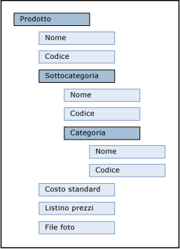

# Attributi (Master Data Services)
  Gli attributi sono oggetti contenuti in entità [!INCLUDE[ssMDSshort](../includes/ssmdsshort-md.md)] . I valori dell'attributo descrivono i membri dell'entità. Un attributo può essere utilizzato per descrivere un membro foglia, un membro consolidato o una raccolta.  
  
## Correlazione tra attributi e altri oggetti modello  
 Un attributo può essere considerato come una colonna in una tabella entità. Un valore di attributo è il valore utilizzato per descrivere un membro specifico.  
  
   
  
 Quando si crea un'entità che contiene molti attributi, è possibile organizzare gli attributi in gruppi di attributi. Per altre informazioni, vedere [Gruppi di attributi &#40;Master Data Services&#41;](../master-data-services/attribute-groups-master-data-services.md).  
  
## Attributi obbligatori  
 Quando si crea un'entità, gli attributi Name e Code vengono creati automaticamente. L'attributo Code richiede un valore che deve essere univoco all'interno dell'entità. Gli attributi Name e Code non possono essere rimossi.  
  
## Tipi di attributi  
 Sono disponibili tre tipi di attributi:  
  
-   Attributi in formato libero che consentono l'immissione in formato libero di testo, numeri, date o collegamenti.  
  
-   Attributi basati su dominio, che vengono popolati dalle entità. Per altre informazioni, vedere [Attributi basati su dominio &#40;Master Data Services&#41;](../master-data-services/domain-based-attributes-master-data-services.md).  
  
-   Attributi di file che vengono utilizzati per archiviare file, documenti o immagini. Gli attributi di file hanno lo scopo di favorire la coerenza dei dati richiedendo che i file abbiano un'estensione specifica. Non è possibile garantire che gli attributi di file impediscano ad un utente malintenzionato di caricare un file di tipo diverso.  
  
### Attributi numerici in formato libero  
 Per i valori di attributi numerici in formato libero è necessaria una gestione particolare poiché tali valori sono limitati al tipo di valore **SqlDouble** .  
  
 Per impostazione predefinita, un valore **SqlDouble** contiene 15 cifre decimali di precisione, anche se internamente viene gestito un massimo di 17 cifre. La precisione di un numero a virgola mobile ha diverse conseguenze:  
  
-   Due numeri a virgola mobile apparentemente uguali per una particolare precisione potrebbero non risultare uguali, in quanto le relative cifre meno significative sono diverse.  
  
-   Un'operazione matematica o di confronto che utilizza un numero a virgola mobile potrebbe non produrre lo stesso risultato se viene utilizzato un numero decimale, perché il numero a virgola mobile potrebbe non avere un'esatta approssimazione al numero decimale.  
  
-   È possibile che un valore non esegua un *round trip* se è interessato un numero a virgola mobile. Si dice che un valore esegue un roundtrip se un'operazione converte un numero a virgola mobile originale in un altro formato, un'operazione inversa trasforma di nuovo il formato convertito in un numero a virgola mobile e il numero a virgola mobile finale è uguale al numero a virgola mobile originale. Il round trip potrebbe non riuscire perché una o più cifre meno significative vengono perse o modificate in una conversione.  
  
## Esempi di attributo  
 Nell'esempio seguente l'entità dispone degli attributi Name, Code, Subcategory, StandardCost, ListPrice e FilePhoto. Tali attributi descrivono i membri. Ogni membro viene rappresentato da una singola riga di valori di attributo.  
  
   
  
 Nell'esempio seguente l'entità Product include:  
  
-   Gli attributi in formato libero Name, Code, StandardCost e ListPrice.  
  
-   L'attributo basato su dominio Subcategory.  
  
-   L'attributo di file FilePhoto.  
  
 Subcategory è un'entità utilizzata come attributo basato su dominio di Product. Category è un'entità utilizzata come attributo basato su dominio di Subcategory. Come l'entità Product, le entità Category e Subcategory includono ciascuna gli attributi predefiniti Name e Code.  
  
   
  
## Attività correlate  
  
|Descrizione dell'attività|Argomento|  
|----------------------|-----------|  
|Creare un nuovo attributo di testo in formato libero.|[Creare un attributo di testo &#40;Master Data Services&#41;](../master-data-services/create-a-text-attribute-master-data-services.md)|  
|Creare un nuovo attributo numerico in formato libero.|[Creare un attributo numerico &#40;Master Data Services&#41;](../master-data-services/create-a-numeric-attribute-master-data-services.md)|  
|Creare un nuovo attributo di collegamento in formato libero.|[Creare un attributo di collegamento &#40;Master Data Services&#41;](../master-data-services/create-a-link-attribute-master-data-services.md)|  
|Creare un nuovo attributo di file.|[Creare un attributo di file &#40;Master Data Services&#41;](../master-data-services/create-a-file-attribute-master-data-services.md)|  
|Creare un nuovo attributo basato su dominio.|[Creare un attributo basato su dominio &#40;Master Data Services&#41;](../master-data-services/create-a-domain-based-attribute-master-data-services.md)|  
|Modificare il nome di un attributo esistente.|[Modificare il nome e il tipo di dati di un attributo &#40;Master Data Services&#41;](../master-data-services/change-an-attribute-name-and-data-type-master-data-services.md)|  
|Aggiungere attributi ad un gruppo rilevamento modifiche|[Aggiungere attributi ad un gruppo rilevamento modifiche &#40;Master Data Services&#41;](../master-data-services/add-attributes-to-a-change-tracking-group-master-data-services.md)|  
|Eliminare un attributo esistente.|[Eliminare un attributo &#40;Master Data Services&#41;](../master-data-services/delete-an-attribute-master-data-services.md)|  
|Modificare l'ordine degli attributi.|[Modificare l'ordine degli attributi](../master-data-services/change-the-order-of-attributes.md)|  
|Creare un attributo di data|[Creare un attributo di data &#40;Master Data Services&#41;](../master-data-services/create-a-date-attribute-master-data-services.md)|  
  
## Contenuto correlato  
  
-   [Attributi basati su dominio &#40;Master Data Services&#41;](../master-data-services/domain-based-attributes-master-data-services.md)  
  
-   [Gruppi di attributi &#40;Master Data Services&#41;](../master-data-services/attribute-groups-master-data-services.md)  
  
-   [Membri &#40;Master Data Services&#41;](../master-data-services/members-master-data-services.md)  
  
-   [Autorizzazioni per elementi foglia &#40;Master Data Services&#41;](../master-data-services/leaf-permissions-master-data-services.md)
  
