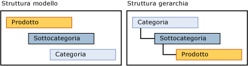

# Gerarchie derivate (Master Data Services)
  Una gerarchia derivata [!INCLUDE[ssMDSshort](../includes/ssmdsshort-md.md)] si basa sulle relazioni tra attributi basati su dominio che esistono già tra le entità di un modello.  
  
 È possibile creare una gerarchia derivata per evidenziare qualsiasi relazione esistente tra gli attributi basati su dominio presente nel modello.  
  
## Membri foglia che raggruppano altri membri foglia  
 In una gerarchia derivata i membri foglia di un'entità vengono utilizzati per raggruppare i membri foglia di un'altra entità. Una gerarchia derivata si basa sulla relazione tra tali entità. Al contrario, una gerarchia esplicita è basata solo su membri di una singola entità ed è strutturata in qualsiasi modo venga specificato.  
  
 È possibile modificare la struttura di una gerarchia derivata senza modificare i dati sottostanti. Finché le relazioni sono presenti nel modello, l'eliminazione di una gerarchia derivata non determina alcun effetto sui dati master.  
  
## Gerarchie esplicite e gerarchie derivate  
 Nella tabella seguente vengono illustrate alcune differenze tra le gerarchie esplicite e derivate.  
  
> [!NOTE]  
>  Le gerarchie esplicite sono deprecate in questa versione di [!INCLUDE[ssMDSshort](../includes/ssmdsshort-md.md)].  
  
|Gerarchie esplicite|Gerarchie derivate|  
|--------------------------|-------------------------|  
|La struttura viene definita dall'utente|La struttura è derivata dalle relazioni tra attributi basati su dominio|  
|Contengono membri di una sola entità|Contengono membri di più entità|  
|Utilizzano i membri consolidati per raggruppare altri membri|Utilizzano i membri foglia di un'entità per raggruppare i membri foglia di un'altra entità|  
  
## Creazione di una gerarchia con livelli di nidificazione di variabili  
 Si consigliano due modi per creare una gerarchia con livelli di nidificazione di variabili:  
  
-   Se tutti i livelli devono avere gli stessi attributi, creare una singola entità, quindi creare una gerarchia ricorsiva su tale entità utilizzando un attributo basato su dominio che sia basato sull'entità.  
  
-   Se è necessario un set di attributi per membri foglia e un altro set di attributi nei livelli superiori, creare due entità per una gerarchia derivata. Per l'entità foglia, utilizzare un attributo basato su dominio che sia basato sull'entità padre. Per l'entità padre, utilizzare un attributo basato su dominio che sia basato su se stesso.  
  
## Esempio di gerarchia derivata  
 Nell'esempio seguente i membri foglia dell'entità Product vengono raggruppati in base ai membri foglia dell'entità Subcategory, a loro volta raggruppati in base ai membri foglia dell'entità Category. Questa gerarchia è possibile perché l'entità Product dispone di un attributo basato su dominio denominato Subcategory e l'entità Subcategory dispone di un attributo basato su dominio denominato Category.  
  
 La struttura della gerarchia illustra il raggruppamento dei membri. L'entità con il maggiore numero di membri è in fondo.  
  
   
  
 In una gerarchia derivata è possibile evidenziare la relazione tra Product e Subcategory, quindi tra Subcategory e Category. Quando si visualizzano i membri in questa gerarchia, ogni livello nell'albero contiene i membri della stessa entità.  
  
   
  
 Questo tipo di gerarchia non consente lo spostamento di un membro in un livello non valido. È ad esempio possibile spostare la bicicletta Road-650 da una sottocategoria, Road Bikes, in un'altra, Mountain Bikes. Non è possibile spostare Road-650 direttamente in una categoria, ad esempio 1 {Bikes}. Ogni volta che si sposta un membro nell'albero gerarchico, il valore dell'attributo basato su dominio del membro viene modificato in modo da riflettere lo spostamento.  
  
## Note  
 Tutti i membri di un albero gerarchico derivato vengono ordinati in base al codice. Non è possibile modificare l'ordinamento.  
  
 Se un attributo basato su dominio di un membro è vuoto e l'attributo viene utilizzato per una gerarchia derivata, il membro non verrà visualizzato nella gerarchia. Creare regole business per richiedere il popolamento degli attributi. Per altre informazioni, vedere [Richiedere valori di attributo &#40;Master Data Services&#41;](../master-data-services/require-attribute-values-master-data-services.md).  
  
## Related Tasks  
  
|Descrizione dell'attività|Argomento|  
|----------------------|-----------|  
|Creare una nuova gerarchia derivata.|[Creare una gerarchia derivata &#40;Master Data Services&#41;](../master-data-services/create-a-derived-hierarchy-master-data-services.md)|  
|Nascondere o eliminare i livelli in una gerarchia derivata esistente.|[Nascondere o eliminare livelli di una gerarchia derivata &#40;Master Data Services&#41;](../master-data-services/hide-or-delete-levels-in-a-derived-hierarchy-master-data-services.md)|  
|Modificare il nome di una gerarchia derivata esistente.|[Modificare il nome di una gerarchia derivata &#40;Master Data Services&#41;](../master-data-services/change-a-derived-hierarchy-name-master-data-services.md)|  
|Eliminare una gerarchia derivata esistente.|[Eliminare una gerarchia derivata &#40;Master Data Services&#41;](../master-data-services/delete-a-derived-hierarchy-master-data-services.md)|  
  
## Contenuto correlato  
  
-   [Attributi basati su dominio &#40;Master Data Services&#41;](../master-data-services/domain-based-attributes-master-data-services.md)  
  
-   [Gerarchie esplicite &#40;Master Data Services&#41;](../master-data-services/explicit-hierarchies-master-data-services.md)  
  
-   [Gerarchie ricorsive &#40;Master Data Services&#41;](../master-data-services/recursive-hierarchies-master-data-services.md)  
  
-   [Gerarchie derivate con estremità esplicite &#40;Master Data Services&#41;](../master-data-services/derived-hierarchies-with-explicit-caps-master-data-services.md)  
  
-   [Mostrare le relazioni molti-a-molti nelle gerarchie derivate &#40;Master Data Services&#41;](../master-data-services/show-many-to-many-relationships-in-derived-hierarchies-master-data-services.md)  
  
-   [Raccolte &#40;Master Data Services&#41;](../master-data-services/collections-master-data-services.md)  
  
  
