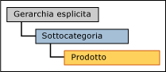
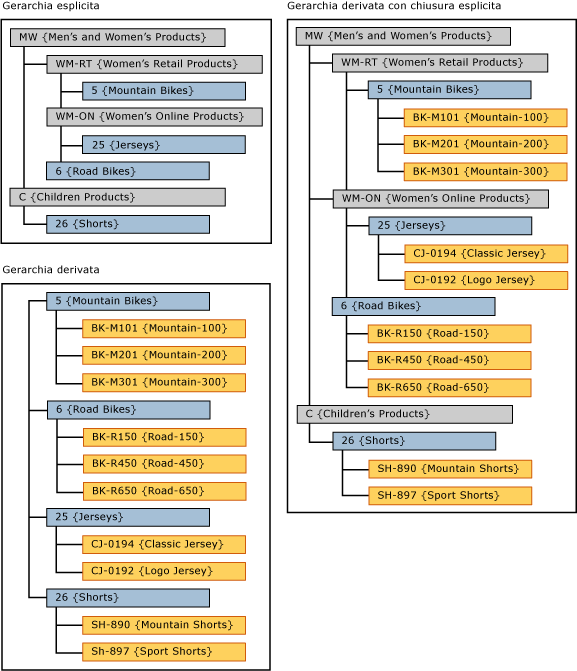

# Gerarchie derivate con estremità esplicite (Master Data Services)

[!INCLUDE[appliesto-ss-xxxx-xxxx-xxx-md-winonly](../includes/appliesto-ss-xxxx-xxxx-xxx-md-winonly.md)]

  In [!INCLUDE[ssMDSshort](../includes/ssmdsshort-md.md)], quando i livelli di una gerarchia esplicita vengono usati come livelli principali di una gerarchia derivata, questa viene chiamata gerarchia derivata con estremità esplicita.  
  
 La gerarchia esplicita deve essere basata sulla stessa entità dell'entità al livello principale della gerarchia derivata.  
  
 Nell'interfaccia utente di [!INCLUDE[ssMDSmdm](../includes/ssmdsmdm-md.md)] , si crea questo tipo di gerarchia trascinando una gerarchia esplicita al di sopra di una gerarchia derivata.  
  
   
  
## Esempio di gerarchia derivata con estremità esplicita  
 In questo esempio, i membri nella gerarchia esplicita provengono dall'entità Subcategory. Nella gerarchia derivata, anche i membri del livello principale provengono dall'entità Subcategory.  
  
   
  
 Posizionando la gerarchia esplicita al di sopra di una gerarchia derivata, la gerarchia derivata diventa incompleta.  
  
## Regole  
  
-   Non è possibile avere più di una gerarchia esplicita in una gerarchia derivata con estremità esplicita.  
  
-   È possibile utilizzare come estremità la stessa gerarchia esplicita per più gerarchie derivate.  
  
-   Non è possibile assegnare autorizzazioni membri gerarchia alle gerarchie derivate con estremità esplicite. Se si assegnano autorizzazioni individualmente alla gerarchia esplicita o alla gerarchia derivata, le autorizzazioni hanno effetto su entrambe le gerarchie.  
  
## Attività correlate  
  
|Descrizione dell'attività|Argomento|  
|----------------------|-----------|  
|Creare una gerarchia derivata.|[Creare una gerarchia derivata &#40;Master Data Services&#41;](../master-data-services/create-a-derived-hierarchy-master-data-services.md)|  
|Creare una gerarchia esplicita.|[Creare una gerarchia esplicita &#40;Master Data Services&#41;](../master-data-services/create-an-explicit-hierarchy-master-data-services.md)|  
|Eliminare una gerarchia derivata esistente.|[Eliminare una gerarchia derivata &#40;Master Data Services&#41;](../master-data-services/delete-a-derived-hierarchy-master-data-services.md)|  
|||  
  
## Contenuto correlato  
  
-   [Gerarchie derivate &#40;Master Data Services&#41;](../master-data-services/derived-hierarchies-master-data-services.md)  
  
-   [Gerarchie esplicite &#40;Master Data Services&#41;](../master-data-services/explicit-hierarchies-master-data-services.md)  
  
  
