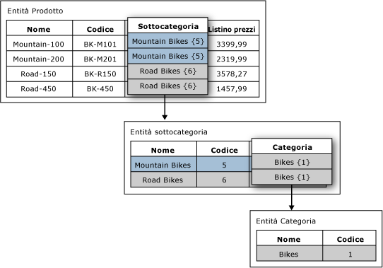

# Attributi basati su dominio [Master Data Services]
  In [!INCLUDE[ssMDSshort](../includes/ssmdsshort-md.md)]un attributo basato su dominio è un attributo i cui valori sono popolati da membri di un'entità. È possibile pensare a un attributo basato su dominio come a un elenco vincolato, gli attributi basati su dominio non consentono l'immissione dei valori di attributo non validi da parte degli utenti. Per selezionare un valore di attributo, l'utente deve scegliere da un elenco.  
  
## Esempio di attributo basato su dominio  
 Nella immagine seguente, l'entità Product dispone di un attributo basato su dominio chiamato Subcategory. L'attributo Subcategory viene popolato dai valori dell'entità Subcategory.  
  
 L'entità Subcategory dispone di un attributo basato su dominio chiamato Category. L'attributo Category viene popolato dai valori dell'entità Category.  
  
   
  
## Utilizzare la stessa entità per più attributi basati su dominio  
 È possibile utilizzare la stessa entità come un attributo basato su dominio di più entità. Ad esempio, è possibile creare un'entità denominata YesNoIndicator con i membri Yes, No e Maybe. È possibile creare un attributo basato su dominio denominato InStock e utilizzare l'entità YesNoIndicator come origine. Inoltre è possibile creare un altro attributo basato su dominio denominato Approved e utilizzare l'entità YesNoIndicator come origine. Ogni volta che si desidera che gli utenti scelgano da un elenco di membri dell'entità YesNoIndicator, è possibile utilizzare l'entità come attributo basato su dominio.  
  
## Gerarchie derivate del form degli attributi basati su dominio dedotto gerarchie  
 Le relazioni tra attributi basati su dominio costituiscono la base delle gerarchie derivate. Per altre informazioni, vedere [Gerarchie derivate &#40;Master Data Services&#41;](../master-data-services/derived-hierarchies-master-data-services.md).  
  
## Attività correlate  
  
|Descrizione dell'attività|Argomento|  
|----------------------|-----------|  
|Creare un nuovo attributo basato su dominio originato da un'entità esistente.|[Creare un attributo basato su dominio &#40;Master Data Services&#41;](../master-data-services/create-a-domain-based-attribute-master-data-services.md)|  
|Creare una nuova entità.|[Creare un'entità &#40;Master Data Services&#41;](../master-data-services/create-an-entity-master-data-services.md)|  
  
## Contenuto correlato  
  
-   [Gerarchie derivate &#40;Master Data Services&#41;](../master-data-services/derived-hierarchies-master-data-services.md)  
  
-   [Attributi &#40;Master Data Services&#41;](../master-data-services/attributes-master-data-services.md)  
  
-   [Entità &#40;Master Data Services&#41;](../master-data-services/entities-master-data-services.md)  
  
  
