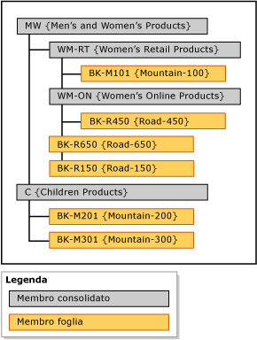

# Gerarchie esplicite (Master Data Services)
  In [!INCLUDE[ssMDSshort](../includes/ssmdsshort-md.md)] una gerarchia esplicita consente di organizzare i membri di una sola entità secondo qualsiasi modalità specificata. La struttura può essere incompleta e, a differenza delle gerarchie derivate, le gerarchie esplicite non sono basate su relazioni tra attributi basati su dominio.  
  
> [!NOTE]  
>  La funzionalità Gerarchia esplicita è deprecata.  
  
## Membri consolidati che raggruppano altri membri  
 In una gerarchia esplicita vengono utilizzati membri consolidati creati allo scopo di raggruppare altri membri. Questi membri consolidati possono appartenere a un'unica gerarchia esplicita per volta. Inoltre, in una gerarchia esplicita sono inclusi tutti i membri foglia dell'entità associata.  
  
 Una gerarchia esplicita può essere incompleta, il che vuol dire che la gerarchia può terminare su livelli diversi simultaneamente. Ogni membro consolidato può disporre di un numero illimitato di membri consolidati e foglia sottostanti oppure di nessuno membro. I membri foglia possono trovarsi al di sotto di un singolo membro consolidato o al di sotto di più livelli di membri consolidati.  
  
> [!NOTE]  
>  Prima di creare una gerarchia esplicita, è necessario abilitare l'entità per le gerarchie esplicite.  
  
## Tipi di gerarchie esplicite  
 Esistono due tipi di gerarchie esplicite, ovvero obbligatoria e non obbligatoria.  
  
### Gerarchia esplicita obbligatoria  
 Una gerarchia esplicita obbligatoria è una gerarchia nella quale tutti i membri foglia devono essere inclusi nell'albero gerarchico. Per impostazione predefinita, tutti i membri vengono inclusi al livello radice dell'albero. È possibile ridisporre i membri in base alle necessità.  
  
### Gerarchia esplicita non obbligatoria  
 Una gerarchia esplicita non obbligatoria è una gerarchia nella quale tutti i membri foglia si trovano in un nodo **Inutilizzato** creato dal sistema. I membri necessari possono essere spostati fuori da questo nodo. Il resto dei membri può rimanere nel nodo **Inutilizzato** .  
  
 Quando si utilizzano gerarchie esplicite non obbligatorie, le attività di report o le analisi eseguite sulla gerarchia potrebbero non corrispondere alle attività di report o analisi eseguite su gerarchie obbligatorie.  
  
## Regole  
 Le regole seguenti si applicano alle gerarchie esplicite (obbligatorie e non obbligatorie).  
  
-   Ogni membro foglia può essere incluso nella gerarchia una sola volta.  
  
-   Tutti i membri consolidati devono essere inclusi in una gerarchia.  
  
-   I membri consolidati non possono trovarsi in più di una gerarchia esplicita.  
  
-   I membri consolidati nell'albero gerarchico non devono contenere membri foglia sottostanti.  
  
-   Se si elimina una gerarchia esplicita, vengono eliminati tutti i membri consolidati utilizzati nella gerarchia.  
  
-   Se si elimina un membro consolidato incluso in una gerarchia esplicita, tutti i membri foglia raggruppati in base a tale membro consolidato vengono spostati al livello radice.  
  
## Gerarchie esplicite e gerarchie derivate  
 Nella tabella seguente vengono illustrate alcune differenze tra le gerarchie esplicite e derivate.  
  
|Gerarchie esplicite|Gerarchie derivate|  
|--------------------------|-------------------------|  
|La struttura viene definita dall'utente|La struttura è derivata dalle relazioni tra attributi basati su dominio|  
|Contengono membri di una sola entità|Contengono membri di più entità|  
|Utilizzano i membri consolidati per raggruppare altri membri|Utilizzano i membri foglia di un'entità per raggruppare i membri foglia di un'altra entità|  
|Possono essere incomplete|Contengono sempre un numero coerente di livelli|  
  
## Esempio di gerarchia esplicita  
 Nell'esempio seguente, l'entità Product contiene i seguenti membri foglia: BK-M101 {Mountain-100}, BK-M201 {Mountain-200}, BK-M301 {Mountain-300}, BK-R150 {Road-150}, BK-R450 {Road-450} e BK-R650 {Road-650}.  
  
 Per riepilogare i membri foglia in corrispondenza di punti di consolidamento specifici, è possibile creare membri consolidati nell'entità Product. Inserire i membri consolidati nei livelli dell'albero gerarchico nel punto in cui si desidera riepilogare i membri foglia. Non sussistono limitazioni rispetto al punto di inserimento dei membri consolidati. Ogni membro (foglia o consolidato) può tuttavia essere utilizzato una sola volta.  
  
   
  
 I membri consolidati possono essere utilizzati per raggruppare membri a qualsiasi livello e i membri consolidati vengono ordinati nell'ordine determinato dall'utente.  
  
## Attività correlate  
  
|Descrizione dell'attività|Argomento|  
|----------------------|-----------|  
|Creare una nuova gerarchia esplicita.|[Creare una gerarchia esplicita &#40; Master Data Services &#41;](../master-data-services/create-an-explicit-hierarchy-master-data-services.md)|  
|Modificare il nome di una gerarchia esplicita esistente.|[Modificare il nome di una gerarchia esplicita &#40; Master Data Services &#41;](../master-data-services/change-an-explicit-hierarchy-name-master-data-services.md)|  
|Eliminare una gerarchia esplicita esistente.|[Eliminare una gerarchia esplicita &#40; Master Data Services &#41;](../master-data-services/delete-an-explicit-hierarchy-master-data-services.md)|  
|||  
  
## Contenuto correlato  
  
-   [Gerarchie derivate &#40; Master Data Services &#41;](../master-data-services/derived-hierarchies-master-data-services.md)  
  
-   [Raccolte &#40; Master Data Services &#41;](../master-data-services/collections-master-data-services.md)  
  
  

