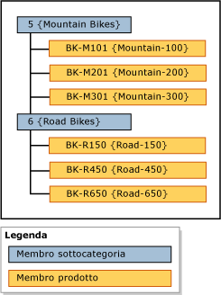

# Gerarchie (Master Data Services)
  In [!INCLUDE[ssMDSshort](../includes/ssmdsshort-md.md)]una gerarchia è una struttura ad albero che consente di effettuare le operazioni seguenti:  
  
-   Raggruppare membri simili per scopi organizzativi.  
  
-   Consolidare e riepilogare membri per la creazione di report e l'analisi.  
  
## Contenuto delle gerarchie  
 In ogni gerarchia sono contenuti i membri di una o più entità. Quando un membro viene aggiunto, modificato o eliminato, vengono aggiornate tutte le gerarchie. In questo modo viene garantita l'accuratezza dei dati in esse contenute. Le gerarchie consentono inoltre di assicurare che ogni membro venga contato una sola volta.  
  
 Se si desidera creare un raggruppamento di un subset di membri, si consideri l'utilizzo di una raccolta. Per altre informazioni, vedere [Raccolte &#40;Master Data Services&#41;](../master-data-services/collections-master-data-services.md).  
  
## Tipi di gerarchie  
 È possibile creare più gerarchie per visualizzare e organizzare i membri in modi diversi. È possibile creare:  
  
-   Gerarchie incomplete da una sola entità, chiamate gerarchie esplicite. Per altre informazioni, vedere [Gerarchie esplicite &#40;Master Data Services&#41;](../master-data-services/explicit-hierarchies-master-data-services.md).  
  
-   Gerarchie basate su livelli provenienti da più entità, in base alle relazioni esistenti tra le entità e i relativi attributi, chiamate gerarchie derivate. Per altre informazioni, vedere [Gerarchie derivate &#40;Master Data Services&#41;](../master-data-services/derived-hierarchies-master-data-services.md).  
  
> [!NOTE]  
>  Tutti i membri di una gerarchia devono trovarsi all'interno dello stesso modello.  
  
## Le gerarchie non sono tassonomie  
 Una gerarchia è diversa da una tassonomia. In una tassonomia i membri vengono organizzati contemporaneamente in base a più attributi, mentre in una gerarchia i membri vengono organizzati in base a un attributo alla volta. In una tassonomia lo stesso membro può essere incluso più volte, mentre in una gerarchia può essere incluso una sola volta.  
  
 Ad esempio, la stessa bicicletta può essere inclusa due volte in una tassonomia, una perché è rossa e un'altra perché ha una dimensione 38. In una gerarchia la bicicletta viene inclusa una sola volta ed è pertanto necessario decidere se visualizzarla in relazione al colore o alla dimensione.  
  
## Esempio di gerarchia  
 Nell'esempio seguente, i membri del prodotto vengono raggruppati in base ai membri della sottocategoria.  
  
   
  
## Attività correlate  
  
|Descrizione dell'attività|Argomento|  
|----------------------|-----------|  
|Creare una gerarchia esplicita.|[Creare una gerarchia esplicita &#40;Master Data Services&#41;](../master-data-services/create-an-explicit-hierarchy-master-data-services.md)|  
|Creare una gerarchia derivata.|[Creare una gerarchia derivata &#40;Master Data Services&#41;](../master-data-services/create-a-derived-hierarchy-master-data-services.md)|  
|Nascondere o eliminare i livelli in una gerarchia derivata esistente.|[Nascondere o eliminare livelli di una gerarchia derivata &#40;Master Data Services&#41;](../master-data-services/hide-or-delete-levels-in-a-derived-hierarchy-master-data-services.md)|  
  
## Contenuto correlato  
  
-   [Gerarchie esplicite &#40;Master Data Services&#41;](../master-data-services/explicit-hierarchies-master-data-services.md)  
  
-   [Gerarchie derivate &#40;Master Data Services&#41;](../master-data-services/derived-hierarchies-master-data-services.md)  
  
-   [Gerarchie ricorsive &#40;Master Data Services&#41;](../master-data-services/recursive-hierarchies-master-data-services.md)  
  
-   [Gerarchie derivate con estremità esplicite &#40;Master Data Services&#41;](../master-data-services/derived-hierarchies-with-explicit-caps-master-data-services.md)  
  
-   [Raccolte &#40;Master Data Services&#41;](../master-data-services/collections-master-data-services.md)  
  
  

