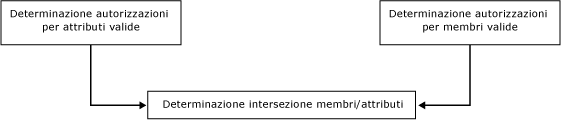
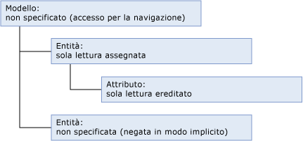
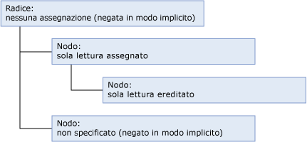
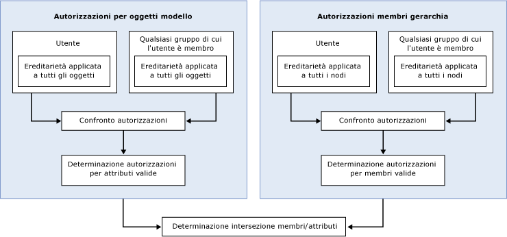

# Modalità di determinazione delle autorizzazioni (Master Data Services)
  In [!INCLUDE[ssMDSshort](../includes/ssmdsshort-md.md)]il modo più semplice per configurare la sicurezza consiste nell'assegnare autorizzazioni per oggetti modello a un gruppo di cui l'utente è membro.  
  
 La sicurezza diventa più complessa quando:  
  
-   Vengono assegnate entrambe le autorizzazioni per oggetti modello e membri gerarchia.  
  
-   L'utente appartiene a gruppi e le autorizzazioni vengono assegnate sia all'utente sia ai gruppi.  
  
-   L'utente appartiene a gruppi e le autorizzazioni vengono assegnate a più gruppi.  
  
## Autorizzazioni assegnate a un singolo gruppo o utente  
 Se vengono assegnate a un singolo gruppo o utente, le autorizzazioni vengono determinate in base al flusso di lavoro seguente.  
  
   
  
### Passaggio 1: vengono determinate le autorizzazioni per attributi valide.  
 Nell'elenco seguente viene descritto il modo in cui vengono determinate le autorizzazioni per attributi valide:  
  
-   Le autorizzazioni assegnate agli oggetti modello determinano gli attributi a cui un utente può accedere.  
  
-   Tutti gli oggetti modello ereditano automaticamente le autorizzazioni dall'oggetto più vicino a un livello superiore della struttura del modello.  
  
-   Tutti gli oggetti che si trovano allo stesso livello dell'entità vengono negati in modo implicito.  
  
-   A tutti gli oggetti che si trovano a un livello superiore viene fornita l'autorizzazione di lettura derivata. Per altre informazioni su Inferred Read, vedere [Accesso per la navigazione &#40;Master Data Services&#41;](../master-data-services/navigational-access-master-data-services.md).  
  
 In questo esempio l'autorizzazione **Read** viene assegnata a un'entità e viene ereditata dal relativo attributo che si trova a un livello inferiore della struttura del modello. Il modello fornisce l'autorizzazione di lettura derivata a questa entità e al relativo attributo. All'altra entità del modello non viene assegnata alcuna autorizzazione esplicita e non eredita alcuna autorizzazione, pertanto viene negata in modo implicito.  
  
   
  
### Passaggio 2: Se vengono assegnate le autorizzazioni per i membri gerarchia, vengono determinate le autorizzazioni per i membri valide.  
 Nell'elenco seguente viene descritto il modo in cui vengono determinate le autorizzazioni per i membri gerarchia valide:  
  
-   Le autorizzazioni assegnate ai nodi gerarchia determinano i membri a cui un utente può accedere.  
  
-   Tutti i nodi di una gerarchia ereditano automaticamente le autorizzazioni dall'oggetto più vicino a un livello superiore della struttura della gerarchia.  
  
-   Tutti i nodi che si trovano allo stesso livello vengono negati in modo implicito.  
  
-   Tutti i nodi che si trovano a livelli superiori a cui non sono assegnate autorizzazioni vengono negati in modo implicito.  
  
 In questo esempio l'autorizzazione **Read** viene assegnata a un nodo della gerarchia e viene ereditata da un nodo che si trova a un livello inferiore della struttura della gerarchia. Alla radice non viene assegnata alcuna autorizzazione, pertanto viene negata in modo implicito. All'altro nodo della struttura della gerarchia non viene assegnata alcuna autorizzazione esplicita e non eredita alcuna autorizzazione, pertanto viene negato in modo implicito.  
  
   
  
### Passaggio 3: viene determinata l'intersezione delle autorizzazioni per membri e attributi.  
 Se le autorizzazioni per attributi valide sono diverse dalle autorizzazioni per membri valide, le autorizzazioni devono essere determinate per ogni singolo valore di attributo. Per altre informazioni, vedere [Autorizzazioni per modelli e membri sovrapposte &#40;Master Data Services&#41;](../master-data-services/overlapping-model-and-member-permissions-master-data-services.md).  
  
## Autorizzazioni assegnate a più gruppi  
 Se un utente appartiene uno o più gruppi e le autorizzazioni vengono assegnate sia all'utente sia ai gruppi, il flusso di lavoro diventa più complesso.  
  
   
  
 In questo caso, la sovrapposizione delle autorizzazioni utente e gruppo deve essere risolta prima del confronto tra autorizzazioni per membri gerarchia e oggetti modello. Per altre informazioni, vedere [Autorizzazioni utenti e gruppi sovrapposte &#40;Master Data Services&#41;](../master-data-services/overlapping-user-and-group-permissions-master-data-services.md).  
  
## Vedere anche  
 [Autorizzazioni utenti e gruppi sovrapposte &#40;Master Data Services&#41;](../master-data-services/overlapping-user-and-group-permissions-master-data-services.md)   
 [Autorizzazioni per modelli e membri sovrapposte &#40;Master Data Services&#41;](../master-data-services/overlapping-model-and-member-permissions-master-data-services.md)  
  
  
