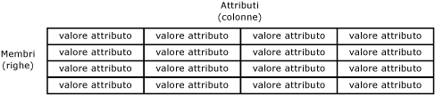
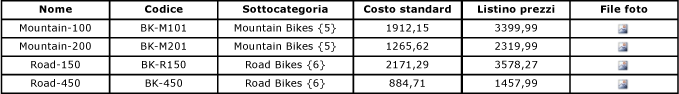

# Membri (Master Data Services)
  In [!INCLUDE[ssMDSshort](../includes/ssmdsshort-md.md)]i membri sono i dati master fisici. Ad esempio, un membro può essere una bicicletta Road-150 in un'entità Product o un cliente specifico in un'entità Customer.  
  
## Correlazione tra membri e altri oggetti modello  
 I membri possono essere considerati come righe in una tabella. I membri correlati sono contenuti in un'entità e ogni membro è definito da valori di attributo.  
  
 In questo esempio, la tabella rappresenta un'entità, le righe della tabella rappresentano i membri e le colonne della tabella rappresentano gli attributi. Ogni cella rappresenta un valore di attributo per un membro specifico.  
  
   
  
## Tipi di membri  
 Sono disponibili tre tipi di membri: membri foglia, membri consolidati e membri raccolta.  
  
 I membri foglia rappresentano i membri predefiniti in un'entità.  
  
-   Nelle gerarchie derivate i membri foglia sono l'unico tipo di membro. I membri foglia di un'entità vengono utilizzati come elementi padre di membri foglia di un'altra entità.  
  
-   Nelle gerarchie esplicite i membri foglia sono il livello più basso e non possono disporre di elementi figlio.  
  
 I membri consolidati esistono solo quando le gerarchie esplicite e le raccolte sono abilitate per l'entità.  
  
-   Le gerarchie derivate non contengono membri consolidati.  
  
-   Nelle gerarchie esplicite i membri consolidati possono essere elementi padre di altri membri all'interno della gerarchia o possono essere elementi figlio.  
  
## Utilizzare gerarchie e raccolte per organizzare i membri  
 Le gerarchie e le raccolte possono essere utilizzate per raggruppare i membri per l'esecuzione di report o analisi. Per altre informazioni, vedere [Gerarchie &#40;Master Data Services&#41;](../master-data-services/hierarchies-master-data-services.md) e [Raccolte &#40;Master Data Services&#41;](../master-data-services/collections-master-data-services.md).  
  
## Esempio di membro  
 Nell'esempio seguente ogni membro è costituito da un valore di attributo Name, Code, Subcategory StandardCost, ListPrice e FilePhoto.  
  
   
  
## Attività correlate  
  
|Descrizione dell'attività|Argomento|  
|----------------------|-----------|  
|Creare un nuovo membro foglia.|[Creare un membro foglia &#40;Master Data Services&#41;](../master-data-services/create-a-leaf-member-master-data-services.md)|  
|Creare un nuovo membro consolidato.|[Creare membri consolidati &#40;Master Data Services&#41;](../master-data-services/create-a-consolidated-member-master-data-services.md)|  
|Eliminare un membro o una raccolta esistente.|[Eliminare un membro o una raccolta &#40;Master Data Services&#41;](../master-data-services/delete-a-member-or-collection-master-data-services.md)|  
|Riattivare una raccolta o un membro eliminato.|[Riattivare un membro o una raccolta &#40;Master Data Services&#41;](../master-data-services/reactivate-a-member-or-collection-master-data-services.md)|  
|Aggiornare i valori dell'attributo di un membro.|[Modificare il tipo di attributo &#40;componente aggiuntivo MDS per Excel&#41;](../master-data-services/microsoft-excel-add-in/change-the-attribute-type-mds-add-in-for-excel.md)|  

  
## Contenuto correlato  
  
-   [Panoramica di Master Data Services (MDS)](../master-data-services/master-data-services-overview-mds.md)  
  
-   [Entità &#40;Master Data Services&#41;](../master-data-services/entities-master-data-services.md)  
  
-   [Attributi &#40;Master Data Services&#41;](../master-data-services/attributes-master-data-services.md)  
  
-   [Gerarchie &#40;Master Data Services&#41;](../master-data-services/hierarchies-master-data-services.md)  
  
-   [Raccolte &#40;Master Data Services&#41;](../master-data-services/collections-master-data-services.md)  
  
-   [Autorizzazioni per elementi foglia &#40;Master Data Services&#41;](../master-data-services/leaf-permissions-master-data-services.md)  
  
 
-   [Operatori di filtro &#40;Master Data Services&#41;](../master-data-services/filter-operators-master-data-services.md)  
  
  
