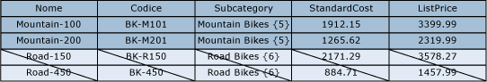
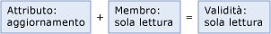
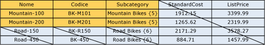
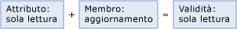

# Autorizzazioni per modelli e membri sovrapposte (Master Data Services)

[!INCLUDE[appliesto-ss-xxxx-xxxx-xxx-md-winonly](../includes/appliesto-ss-xxxx-xxxx-xxx-md-winonly.md)]

  Le autorizzazioni assegnate a un membro possono sovrapporsi alle autorizzazioni assegnate a un oggetto modello. Quando si verificano sovrapposizioni, viene applicata l'autorizzazione più restrittiva.  
  
 Se un membro dispone di autorizzazione diversa da quella del relativo oggetto modello corrispondente, si applicano le regole seguenti:  
  
-   **Nega** esegue l'override di tutte le altre autorizzazioni.  
  
-   L'autorizzazione di**amministratore** al livello del modello esegue l'override di tutte le altre autorizzazioni e viene modificata nell'autorizzazione di accesso All (CRUD) ai livelli secondari.  
  
-   Un'autorizzazione di accesso valida interseca le autorizzazioni per membri e attributi.  
  
     Ad esempio, se le autorizzazioni per i membri includono **Create** e **Update**, l'autorizzazione per gli attributi è **Update**. L'autorizzazione valida è **Update**.  
  
 Nell'immagine seguente viene indicato quali autorizzazioni vengono applicate a ogni singolo valore di attributo quando le autorizzazioni per gli attributi sono diverse dalle autorizzazioni per i membri.  
  
   
  
## Esempio 1  
   
  
 Nella scheda **Modelli** all'entità Product è stata assegnata l'autorizzazione **Aggiorna** . Tutti gli attributi nell'entità ereditano questa autorizzazione.  
  
 Nella scheda **Membri gerarchia** il nodo della sottocategoria Mountain Bikes in una gerarchia derivata dispone dell'autorizzazione **Aggiorna** .  
  
 Risultato: in **Esplora**l'utente dispone dell'autorizzazione **Aggiorna** per tutti i valori di attributo per tutti i membri nel nodo Mountain Bike. Tutti gli altri membri e attributi sono nascosti.  
  
   
  
## Esempio 2  
   
  
 Nella scheda **Modelli** all'attributo Subcategory è assegnata l'autorizzazione **Aggiorna** .  
  
 Nella scheda **Membri gerarchia** al nodo della sottocategoria Mountain Bikes in una gerarchia derivata è stata assegnata in modo esplicito l'autorizzazione **Lettura** .  
  
 Risultato: in **Esplora**l'utente ha l'autorizzazione **Lettura** per i valori dell'attributo Subcategory per i membri del nodo Mountain Bikes. Tutti gli altri membri e attributi sono nascosti.  
  
   
  
## Esempio 3  
   
  
 Nella scheda **Modelli** all'attributo Subcategory è stata assegnata l'autorizzazione **Lettura** .  
  
 Nella scheda **Membri gerarchia** alla sottocategoria Mountain Bikes in una gerarchia derivata è stata assegnata in modo esplicito l'autorizzazione **Aggiorna** .  
  
 Risultato: in **Esplora**l'utente ha l'autorizzazione **Lettura** per i valori di attributo. Tutti gli altri membri e attributi sono nascosti.  
  
   
  
## Vedere anche  
 [Modalità di determinazione delle autorizzazioni &#40;Master Data Services&#41;](../master-data-services/how-permissions-are-determined-master-data-services.md)   
 [Autorizzazioni utenti e gruppi sovrapposte &#40;Master Data Services&#41;](../master-data-services/overlapping-user-and-group-permissions-master-data-services.md)  
  
  
