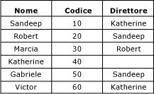
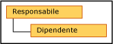

# Gerarchie ricorsive (Master Data Services)

[!INCLUDE[appliesto-ss-xxxx-xxxx-xxx-md-winonly](../includes/appliesto-ss-xxxx-xxxx-xxx-md-winonly.md)]

  In [!INCLUDE[ssMDSshort](../includes/ssmdsshort-md.md)]una gerarchia ricorsiva è una gerarchia derivata in cui è inclusa una relazione ricorsiva. Una relazione ricorsiva si verifica quando un'entità dispone di un attributo basato su dominio che si fonda sull'entità stessa.  
  
## Esempio di gerarchia ricorsiva  
 Un esempio tipico di gerarchia ricorsiva è una struttura organizzativa. In [!INCLUDE[ssMDSshort](../includes/ssmdsshort-md.md)]questa operazione viene effettuata creando un'entità Employee con un attributo basato su dominio chiamato Manager. L'attributo Manager viene popolato dall'elenco dei dipendenti. Nell'organizzazione di esempio, tutti i dipendenti possono essere responsabili (Manager).  
  
   
  
 È possibile creare una gerarchia derivata che evidenzia la relazione tra l'entità Employee e l'attributo basato su dominio Manager.  
  
   
  
 Per includere ciascun membro solo una volta nella gerarchia, è possibile ancorare relazioni Null. Quando si fa ciò, i membri con valori di attributo basati su dominio vuoti vengono visualizzati al livello gerarchico principale.  
  
   
  
 Se non si ancorano relazioni Null, i membri vengono inclusi più volte. Tutti i membri vengono visualizzati al livello principale. Vengono anche visualizzati al di sotto dei membri dei quali sono attributi.  
  
   
  
 In questo esempio, Marcia è al livello principale. Non è il responsabile (Manager) di alcun dipendente poiché non viene utilizzata come un valore di attributo basato su dominio per nessun altro membro definito come Employee. Robert, invece, presenta un livello al di sotto di lui poiché Marcia ha Robert come suo valore dell'attributo Manager.  
  
## Regole  
  
-   Una gerarchia derivata non può contenere più di una relazione ricorsiva. Tuttavia, può disporre di altre relazioni derivate, ad esempio una gerarchia derivata che contiene una relazione ricorsiva da amministratore a dipendente può disporre anche delle relazioni da paese ad amministratore e da dipendente a archivia).  
  
-   Non è possibile assegnare autorizzazioni (nella scheda **Membri gerarchia** ) ai membri appartenenti a una gerarchia ricorsiva.  
  
-   Le gerarchie ricorsive non possono includere relazioni circolari. Ad esempio, Katherine non può essere il responsabile (Manager) di Sandeep se Sandeep è il suo responsabile. Inoltre, Katherine non può essere il responsabile (Manager) di se stessa.  
  
## Related Tasks  
  
|Descrizione dell'attività|Argomento|  
|----------------------|-----------|  
|Creare una gerarchia derivata.|[Creare una gerarchia derivata &#40;Master Data Services&#41;](../master-data-services/create-a-derived-hierarchy-master-data-services.md)|  
|Modificare il nome di una gerarchia derivata esistente.|[Modificare il nome di una gerarchia derivata &#40;Master Data Services&#41;](../master-data-services/change-a-derived-hierarchy-name-master-data-services.md)|  
|Eliminare una gerarchia derivata esistente.|[Eliminare una gerarchia derivata &#40;Master Data Services&#41;](../master-data-services/delete-a-derived-hierarchy-master-data-services.md)|  
  
## Contenuto correlato  
  
-   [Attributi basati su dominio &#40;Master Data Services&#41;](../master-data-services/domain-based-attributes-master-data-services.md)  
  
-   [Gerarchie derivate &#40;Master Data Services&#41;](../master-data-services/derived-hierarchies-master-data-services.md)  
  
  
