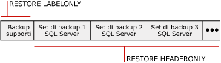

# Informazioni sulla cronologia e sull&#39;intestazione del backup (SQL Server)
  Nel database [!INCLUDE[ssNoVersion](../../includes/ssnoversion-md.md)] msdb **viene archiviata una cronologia completa di tutte le operazioni di backup e ripristino di** eseguite in un'istanza del server. In questo argomento vengono fornite informazioni generali sulle tabelle di cronologia di backup e ripristino e sulle istruzioni [!INCLUDE[tsql](../../includes/tsql-md.md)] utilizzate per accedere alla cronologia di backup. L'argomento tratta anche dell'utilità dell'elenco di file del database e del log delle transazioni e di quando utilizzare informazioni sull'intestazione supporto rispetto alle informazioni dell'intestazione del backup.  
  
> [!IMPORTANT]  
>  Per gestire il rischio di perdita delle modifiche recenti alla cronologia di backup e ripristino, eseguire backup frequenti di **msdb** . Per informazioni sui database di sistema di cui è necessario eseguire il backup,vedere [Backup e ripristino di database di sistema &#40;SQL Server&#41;](../../relational-databases/backup-restore/back-up-and-restore-of-system-databases-sql-server.md).  
  
 **Contenuto dell'argomento**  
  
-   [Tabelle di cronologia di backup e ripristino](#BnRHistoryTables)  
  
-   [Istruzioni Transact-SQL per l'accesso alla cronologia di backup](#TsqlStatementsForBackupHistory)  
  
-   [File di database e del log delle transazioni](#ListDbTlogFiles)  
  
-   [Informazioni sull'intestazione supporto](#MediaHeader)  
  
-   [Informazioni sull'intestazione del backup](#BackupHeader)  
  
-   [Confronto tra le informazioni sull'intestazione supporto e le informazioni sull'intestazione del backup](#CompareMediaHeaderBackupHeader)  
  
-   [Verifica di backup](#Verification)  
  
-   [Attività correlate](#RelatedTasks)  
  
##   Tabelle di cronologia di backup e ripristino  
 In questa sezione vengono fornite informazioni generali sulle tabelle di cronologia in cui vengono archiviati i metadati di backup e ripristino nel database di sistema **msdb** .  
  
|Tabella di cronologia|Descrizione|  
|-------------------|-----------------|  
|[backupfile](../../relational-databases/system-tables/backupfile-transact-sql.md)|Include una riga per ogni file di dati o di log di cui viene eseguito il backup.|  
|[backupfilegroup](../../relational-databases/system-tables/backupfilegroup-transact-sql.md)|Include una riga per ciascun filegroup di un set di backup.|  
|[backupmediafamily](../../relational-databases/system-tables/backupmediafamily-transact-sql.md)|Include una riga per ogni gruppo di supporti. Se un gruppo di supporti risiede in un set di supporti con mirroring, il gruppo includerà una riga distinta per ciascun mirror del set di supporti.|  
|[backupmediaset](../../relational-databases/system-tables/backupmediaset-transact-sql.md)|Contiene una riga per ogni set di supporti di backup.|  
|[backupset](../../relational-databases/system-tables/backupset-transact-sql.md)|Contiene una riga per ogni set di backup.|  
|[restorefile](../../relational-databases/system-tables/restorefile-transact-sql.md)|Contiene una riga per ogni file ripristinato, inclusi i file ripristinati in modo indiretto in base al nome del filegroup.|  
|[restorefilegroup](../../relational-databases/system-tables/restorefilegroup-transact-sql.md)|Contiene una riga per ogni filegroup ripristinato.|  
|[restorehistory](../../relational-databases/system-tables/restorehistory-transact-sql.md)|Contiene una riga per ogni operazione di ripristino.|  
  
> [!NOTE]  
>  Quando viene eseguito un ripristino, le tabelle di cronologia di backup e le tabelle di cronologia di ripristino vengono modificate.  
  
##   Istruzioni Transact-SQL per l'accesso alla cronologia di backup  
 Le istruzioni di ripristino di tipo informativo corrispondono alle informazioni archiviate in determinate tabelle di cronologia di backup.  
  
> [!IMPORTANT]  
>  Per le istruzioni Transact-SQL RESTORE FILELISTONLY, RESTORE HEADERONLY, RESTORE LABELONLY e RESTORE VERIFYONLY è richiesta l'autorizzazione CREATE DATABASE. Questo requisito consente di proteggere i file di backup in modo da rendere le informazioni di backup più sicure rispetto alle versioni precedenti. Per informazioni su questa autorizzazione, vedere [GRANT - autorizzazioni per database &#40;Transact-SQL&#41;](../../t-sql/statements/grant-database-permissions-transact-sql.md).  
  
|Istruzione di tipo informativo|Tabella di cronologia di backup|Descrizione|  
|---------------------------|--------------------------|-----------------|  
|[RESTORE FILELISTONLY](../Topic/RESTORE%20FILELISTONLY%20\(Transact-SQL\).md)|[backupfile](../../relational-databases/system-tables/backupfile-transact-sql.md)|Restituisce un set di risultati con l'elenco dei file di database e del log contenuti nel set di backup specificato.   Per ulteriori informazioni, vedere "Elenco dei file di database e dei file del log delle transazioni" di seguito in questo argomento.|  
|[RESTORE HEADERONLY](../Topic/RESTORE%20HEADERONLY%20\(Transact-SQL\).md)|[backupset](../../relational-databases/system-tables/backupset-transact-sql.md)|Recupera tutte le informazioni sull'intestazione del backup per tutti i set di backup di un dispositivo specifico. Il risultato dell'esecuzione di RESTORE HEADERONLY è un set di risultati.   Per ulteriori informazioni, vedere "Visualizzazione delle informazioni sull'intestazione del backup" di seguito in questo argomento.|  
|[RESTORE LABELONLY](../Topic/RESTORE%20LABELONLY%20\(Transact-SQL\).md)|[backupmediaset](../../relational-databases/system-tables/backupmediaset-transact-sql.md)|Restituisce un set di risultati che include informazioni sul supporto di backup su un dispositivo di backup specificato.   Per ulteriori informazioni, vedere "Visualizzazione delle informazioni sull'intestazione supporto" di seguito in questo argomento.|  
  
##   File di database e del log delle transazioni  
 Le informazioni visualizzate quando vengono elencati i file di database e i file del log delle transazioni disponibili in un backup includono il nome logico, il nome fisico, il tipo di file (database o log), l'appartenenza a un filegroup, le dimensioni del file in byte, le dimensioni massime consentite del file e l'aumento predefinito delle dimensioni del file in byte. Queste informazioni risultano utili nelle situazioni seguenti per determinare i nomi dei file inclusi in un backup del database prima di eseguire il ripristino:  
  
-   Non è più possibile utilizzare un'unità disco che include uno o più file relativi a un database.  
  
     È possibile visualizzare l'elenco dei file inclusi nel backup del database per individuare quelli interessati e quindi ripristinare tali file in un'altra unità durante il ripristino dell'intero database. In alternativa, è possibile ripristinare soltanto tali file e quindi applicare i backup del log delle transazioni creati successivamente al backup del database.  
  
-   Si intende ripristinare un database da un server a un altro server, ma la struttura di directory e il mapping delle unità non esistono sul server.  
  
     La visualizzazione dell'elenco dei file inclusi nel backup consente di individuare i file interessati. Si supponga, ad esempio, che il backup includa un file che deve essere ripristinato nell'unità E e che nel server di destinazione non sia presente questa unità. Durante il ripristino del file, è quindi necessario spostarlo in un altro percorso, ad esempio l'unità Z.  
  
##   Informazioni sull'intestazione supporto  
 La visualizzazione dell'intestazione supporto consente di ottenere informazioni sul supporto stesso anziché sui backup presenti nel supporto. Le informazioni sull'intestazione supporto visualizzate includono il nome del supporto, la descrizione, il nome del software utilizzato per la creazione dell'intestazione e la data di creazione dell'intestazione supporto.  
  
> [!NOTE]  
>  La visualizzazione dell'intestazione supporto è un'operazione rapida.  
  
 Per altre informazioni, vedere [Confronto tra le informazioni sull'intestazione supporto e le informazioni sull'intestazione del backup](#CompareMediaHeaderBackupHeader) più avanti in questo argomento.  
  
##   Informazioni sull'intestazione del backup  
 La visualizzazione dell'intestazione del backup consente di ottenere informazioni su tutti i set di backup di [!INCLUDE[ssNoVersion](../../includes/ssnoversion-md.md)] e non -[!INCLUDE[ssNoVersion](../../includes/ssnoversion-md.md)] presenti nel supporto. Le informazioni visualizzate includono i tipi di dispositivi di backup utilizzati, i tipi di backup (ad esempio del database, del log delle transazioni, del file o differenziali), nonché la data e l'ora di avvio e di arresto delle operazioni di backup. Queste informazioni risultano utili quando è necessario individuare il set di backup su nastro da ripristinare o i backup presenti sul supporto.  
  
> [!NOTE]  
>  Nel caso di nastri ad alta capacità, la visualizzazione delle informazioni sull'intestazione del backup può richiedere parecchio tempo, in quanto per visualizzare le informazioni su ogni backup presente sul supporto è necessario eseguire l'analisi dell'intero supporto.  
  
 Per altre informazioni, vedere [Confronto tra le informazioni sull'intestazione supporto e le informazioni sull'intestazione del backup](#CompareMediaHeaderBackupHeader) più avanti in questo argomento.  
  
### Quale set di backup ripristinare  
 È possibile utilizzare le informazioni nell'intestazione del backup per individuare il set di backup da ripristinare. Il motore di database numera ogni set di backup sui supporti di backup. In questo modo è possibile individuare il set di backup da ripristinare utilizzando la relativa posizione sul supporto. Ad esempio, nei supporti seguenti sono contenuti tre set di backup.  
  
   
  
 Per ripristinare un determinato set di backup, è sufficiente specificare il numero di posizione del set desiderato. Per ripristinare, ad esempio, il secondo set di backup, specificare 2 come set di backup da ripristinare.  
  
##   Confronto tra le informazioni sull'intestazione supporto e le informazioni sull'intestazione del backup  
 Nella figura seguente vengono illustrate alcune delle differenze esistenti tra la visualizzazione delle informazioni sull'intestazione del backup e la visualizzazione delle informazioni sull'intestazione supporto. Per visualizzare l'intestazione supporto, è sufficiente recuperare le informazioni dall'inizio del nastro. Per visualizzare l'intestazione del backup, è necessario eseguire l'analisi di tutto il nastro per esaminare l'intestazione di ogni set di backup.  
  
   
  
> [!NOTE]  
>  Quando si utilizzano set di supporti con più gruppi di supporti, l'intestazione supporto e il set di backup vengono scritti in tutti i gruppi di supporti. È pertanto sufficiente specificare un singolo gruppo di supporti per queste operazioni a scopo di report.  
  
 Per informazioni sulla visualizzazione dell'intestazione supporto, vedere "Visualizzazione delle informazioni sull'intestazione supporto" più indietro in questo argomento.  
  
 Per informazioni sulla visualizzazione delle informazioni sull'intestazione del backup per tutti i set di backup in un dispositivo di backup, vedere "Visualizzazione delle informazioni sull'intestazione del backup" più indietro in questo argomento.  
  
##   Verifica di backup  
 La verifica di un backup è un'operazione utile, sebbene non necessaria. L'operazione di verifica di un backup controlla che il backup sia fisicamente intatto, al fine di garantire che tutti i file in esso presenti siano leggibili e ripristinabili, e che sia possibile ripristinare il backup nel caso in cui sia necessario utilizzarlo. È importante tenere presente che la verifica di un backup non prevede la verifica della struttura dei dati in esso contenuti. Se tuttavia il backup è stato creato utilizzando WITH CHECKSUMS, la verifica del backup utilizzando WITH CHECKSUMS può offrire una valida indicazione sull'affidabilità dei dati in esso contenuti.  
  
##   Attività correlate  
 **Per eliminare le righe meno recenti dalle tabelle di cronologia di backup e ripristino**  
  
-   [sp_delete_backuphistory &#40;Transact-SQL&#41;](../../relational-databases/system-stored-procedures/sp-delete-backuphistory-transact-sql.md)  
  
 **Per eliminare tutte le righe di un database specifico dalle tabelle di cronologia di backup e ripristino**  
  
-   [sp_delete_database_backuphistory &#40;Transact-SQL&#41;](../../relational-databases/system-stored-procedures/sp-delete-database-backuphistory-transact-sql.md)  
  
 **Per visualizzare i file di dati e i file di log in un set di backup**  
  
-   [RESTORE FILELISTONLY &#40;Transact-SQL&#41;](../Topic/RESTORE%20FILELISTONLY%20\(Transact-SQL\).md)  
  
-   <xref:Microsoft.SqlServer.Management.Smo.Restore.ReadFileList%2A> (SMO)  
  
 **Per visualizzare le informazioni sull'intestazione supporto**  
  
-   [RESTORE LABELONLY &#40;Transact-SQL&#41;](../Topic/RESTORE%20LABELONLY%20\(Transact-SQL\).md)  
  
-   [Visualizzare le proprietà e il contenuto di un dispositivo di backup logico &#40;SQL Server&#41;](../../relational-databases/backup-restore/view-the-properties-and-contents-of-a-logical-backup-device-sql-server.md)  
  
-   [Visualizzare il contenuto di un nastro o di un file di backup &#40;SQL Server&#41;](../../relational-databases/backup-restore/view-the-contents-of-a-backup-tape-or-file-sql-server.md)  
  
-   <xref:Microsoft.SqlServer.Management.Smo.Restore.ReadMediaHeader%2A> (SMO)  
  
 **Per visualizzare le informazioni sull'intestazione del backup**  
  
-   [RESTORE HEADERONLY &#40;Transact-SQL&#41;](../Topic/RESTORE%20HEADERONLY%20\(Transact-SQL\).md)  
  
-   [Visualizzare il contenuto di un nastro o di un file di backup &#40;SQL Server&#41;](../../relational-databases/backup-restore/view-the-contents-of-a-backup-tape-or-file-sql-server.md)  
  
-   [Visualizzare le proprietà e il contenuto di un dispositivo di backup logico &#40;SQL Server&#41;](../../relational-databases/backup-restore/view-the-properties-and-contents-of-a-logical-backup-device-sql-server.md)  
  
-   <xref:Microsoft.SqlServer.Management.Smo.Restore.ReadBackupHeader%2A> (SMO)  
  
 **Per eliminare le righe meno recenti dalle tabelle di cronologia di backup e ripristino**  
  
-   [sp_delete_backuphistory &#40;Transact-SQL&#41;](../../relational-databases/system-stored-procedures/sp-delete-backuphistory-transact-sql.md)  
  
 **Per eliminare tutte le righe di un database specifico dalle tabelle di cronologia di backup e ripristino**  
  
-   [sp_delete_database_backuphistory &#40;Transact-SQL&#41;](../../relational-databases/system-stored-procedures/sp-delete-database-backuphistory-transact-sql.md)  
  
 **Per visualizzare le informazioni sull'intestazione supporto**  
  
-   [RESTORE LABELONLY &#40;Transact-SQL&#41;](../Topic/RESTORE%20LABELONLY%20\(Transact-SQL\).md)  
  
-   [Visualizzare le proprietà e il contenuto di un dispositivo di backup logico &#40;SQL Server&#41;](../../relational-databases/backup-restore/view-the-properties-and-contents-of-a-logical-backup-device-sql-server.md)  
  
-   [Visualizzare il contenuto di un nastro o di un file di backup &#40;SQL Server&#41;](../../relational-databases/backup-restore/view-the-contents-of-a-backup-tape-or-file-sql-server.md)  
  
-   <xref:Microsoft.SqlServer.Management.Smo.Restore.ReadMediaHeader%2A> (SMO)  
  
 **Per visualizzare le informazioni sull'intestazione del backup**  
  
-   [RESTORE HEADERONLY &#40;Transact-SQL&#41;](../Topic/RESTORE%20HEADERONLY%20\(Transact-SQL\).md)  
  
-   [Visualizzare il contenuto di un nastro o di un file di backup &#40;SQL Server&#41;](../../relational-databases/backup-restore/view-the-contents-of-a-backup-tape-or-file-sql-server.md)  
  
-   [Visualizzare le proprietà e il contenuto di un dispositivo di backup logico &#40;SQL Server&#41;](../../relational-databases/backup-restore/view-the-properties-and-contents-of-a-logical-backup-device-sql-server.md)  
  
-   <xref:Microsoft.SqlServer.Management.Smo.Restore.ReadBackupHeader%2A> (SMO)  
  
 **Per visualizzare i file in un set di backup**  
  
-   [Visualizzare i file di dati e i file di log in un set di backup &#40;SQL Server&#41;](../../relational-databases/backup-restore/view-the-data-and-log-files-in-a-backup-set-sql-server.md)  
  
-   [RESTORE HEADERONLY &#40;Transact-SQL&#41;](../Topic/RESTORE%20HEADERONLY%20\(Transact-SQL\).md)  
  
 **Per verificare un backup**  
  
-   [RESTORE VERIFYONLY &#40;Transact-SQL&#41;](../Topic/RESTORE%20VERIFYONLY%20\(Transact-SQL\).md)  
  
-   <xref:Microsoft.SqlServer.Management.Smo.Restore.SqlVerify%2A> (SMO)  
  
## Vedere anche  
 [BACKUP &#40;Transact-SQL&#41;](../../t-sql/statements/backup-transact-sql.md)   
 [Set di supporti, gruppi di supporti e set di backup &#40;SQL Server&#41;](../../relational-databases/backup-restore/media-sets-media-families-and-backup-sets-sql-server.md)   
 [Dispositivi di backup &#40;SQL Server&#41;](../../relational-databases/backup-restore/backup-devices-sql-server.md)   
 [Set di supporti di backup con mirroring &#40;SQL Server&#41;](../../relational-databases/backup-restore/mirrored-backup-media-sets-sql-server.md)   
 [Possibili errori relativi ai supporti durante il backup e il ripristino &#40;SQL Server&#41;](../../relational-databases/backup-restore/possible-media-errors-during-backup-and-restore-sql-server.md)  
  
  