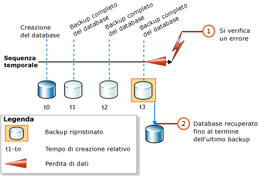
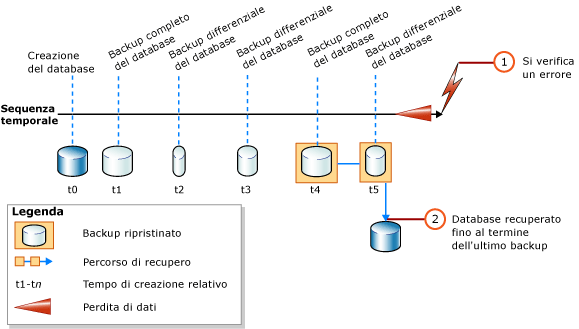

# <a name="complete-database-restores-simple-recovery-model"></a>Ripristini di database completi (modello di recupero con registrazione minima)
[!INCLUDE[appliesto-ss-xxxx-xxxx-xxx-md](../../includes/appliesto-ss-xxxx-xxxx-xxx-md.md)]

  L'obiettivo di un ripristino completo del database è il ripristino dell'intero database. L'intero database è offline per la tutta la durata del ripristino. Prima che sia possibile portare online una o più parti del database, tutti i dati vengono recuperati fino a un punto coerente in cui tutte le parti del database sono aggiornate allo stesso punto nel tempo e non sono presenti transazioni di cui non è stato eseguito il commit.  
  
 Il modello di recupero con registrazione minima non consente di ripristinare il database fino a uno specifico punto nel tempo all'interno di un determinato backup.  
  
> [!IMPORTANT]  
>  È consigliabile evitare di collegare o ripristinare database provenienti da origini sconosciute o non attendibili. Questi database potrebbero contenere malware che può eseguire codice [!INCLUDE[tsql](../../includes/tsql-md.md)] indesiderato o causare errori modificando lo schema o la struttura fisica di database. Prima di usare un database da un'origine sconosciuta o non attendibile, eseguire [DBCC CHECKDB](../../t-sql/database-console-commands/dbcc-checkdb-transact-sql.md) sul database in un server non di produzione ed esaminare anche il codice contenuto nel database, ad esempio le stored procedure o altro codice definito dall'utente.  
  
 **Contenuto dell'argomento**  
  
-   [Panoramica del ripristino del database nel modello di recupero con registrazione minima](#Overview)  
  
-   [Attività correlate](#RelatedTasks)  
  
> [!NOTE]  
>  Per informazioni sul supporto dei backup di versioni precedenti di [!INCLUDE[ssNoVersion](../../includes/ssnoversion-md.md)], vedere la sezione "Supporto della compatibilità" di [RESTORE &#40;Transact-SQL&#41;](../../t-sql/statements/restore-statements-transact-sql.md).  
  
##  <a name="Overview"></a> Panoramica del ripristino del database nel modello di recupero con registrazione minima  
 Se si utilizza il modello di recupero con registrazione minima, il ripristino completo del database richiede solo una o due istruzioni [RESTORE](../../t-sql/statements/restore-statements-transact-sql.md) , a seconda che si desideri o meno ripristinare un backup differenziale del database. Se si utilizza solo un backup di database completo, ripristinare unicamente il backup più recente come illustrato nella figura seguente.  
  
   
  
 Se si utilizza anche un backup differenziale del database, ripristinare il backup completo del database più recente senza recuperare il database e quindi ripristinare il backup differenziale del database più recente e recuperare il database. Questo processo viene illustrato nella figura seguente.  
  
   
  
> [!NOTE]  
>  Se si prevede di ripristinare un backup del database in un'istanza del server diversa, vedere [Copiare database tramite backup e ripristino](../../relational-databases/databases/copy-databases-with-backup-and-restore.md).  
  
###  <a name="TsqlSyntax"></a> Sintassi Transact-SQL di base per RESTORE  
 La sintassi di base di [!INCLUDE[tsql](../../includes/tsql-md.md)][RESTORE](../../t-sql/statements/restore-statements-transact-sql.md) per il ripristino di un backup di database completo è la seguente:  
  
 RESTORE DATABASE *nome_database* FROM *dispositivo_backup* [ WITH NORECOVERY ]  
  
> [!NOTE]  
>  Utilizzare WITH NORECOVERY se si desidera ripristinare anche un backup differenziale del database.  
  
 La sintassi di base di [RESTORE](../../t-sql/statements/restore-statements-transact-sql.md) per il ripristino di un backup del database è la seguente:  
  
 RESTORE DATABASE *nome_database* FROM *dispositivo_backup* WITH RECOVERY  
  
###  <a name="Example"></a> Esempio (Transact-SQL)  
 Nell'esempio seguente viene innanzitutto illustrato come utilizzare l'istruzione [BACKUP](../../t-sql/statements/backup-transact-sql.md) per creare un backup completo del database e un backup differenziale del database [!INCLUDE[ssSampleDBobject](../../includes/sssampledbobject-md.md)] . Questi backup vengono quindi ripristinati in sequenza. Il database è ripristinato con lo stesso stato del momento in cui è stato completato il backup differenziale del database.  
  
 Nell'esempio seguente vengono illustrate le opzioni fondamentali di una sequenza di ripristino per lo scenario di ripristino completo del database. Una *sequenza di ripristino* è costituita da una o più operazioni di ripristino che gestiscono lo spostamento dei dati attraverso una o più fasi del ripristino. La sintassi e i dettagli non rilevanti sono stati omessi. Quando si recupera un database, è consigliabile specificare in modo esplicito l'opzione RECOVERY per maggiore chiarezza, anche se si tratta dell'opzione predefinita.  
  
> [!NOTE]  
>  L'esempio inizia con un'istruzione [ALTER DATABASE](../../t-sql/statements/alter-database-transact-sql.md) che imposta il modello di recupero su `SIMPLE`.  
  
```  
USE master;  
--Make sure the database is using the simple recovery model.  
ALTER DATABASE AdventureWorks2012 SET RECOVERY SIMPLE;  
GO  
-- Back up the full AdventureWorks2012 database.  
BACKUP DATABASE AdventureWorks2012   
TO DISK = 'Z:\SQLServerBackups\AdventureWorks2012.bak'   
  WITH FORMAT;  
GO  
--Create a differential database backup.  
BACKUP DATABASE AdventureWorks2012   
TO DISK = 'Z:\SQLServerBackups\AdventureWorks2012.bak'  
   WITH DIFFERENTIAL;  
GO  
--Restore the full database backup (from backup set 1).  
RESTORE DATABASE AdventureWorks2012   
FROM DISK = 'Z:\SQLServerBackups\AdventureWorks2012.bak'   
   WITH FILE=1, NORECOVERY;  
--Restore the differential backup (from backup set 2).  
RESTORE DATABASE AdventureWorks2012   
FROM DISK = 'Z:\SQLServerBackups\AdventureWorks2012.bak'   
   WITH FILE=2, RECOVERY;  
GO  
```  
  
##  <a name="RelatedTasks"></a> Attività correlate  
 **Per ripristinare un backup completo del database**  
  
-   [Ripristinare un backup del database nel modello di recupero con registrazione minima &#40;Transact-SQL&#41;](../../relational-databases/backup-restore/restore-a-database-backup-under-the-simple-recovery-model-transact-sql.md)  
  
-   [Ripristino di un backup del database con SQL Server Management Studio](../../relational-databases/backup-restore/restore-a-database-backup-using-ssms.md)  
  
-   [Ripristinare un database in una nuova posizione &#40;SQL Server&#41;](../../relational-databases/backup-restore/restore-a-database-to-a-new-location-sql-server.md)  
  
 **Per ripristinare un backup differenziale del database**  
  
-   [Ripristino di un backup differenziale del database &#40;SQL Server&#41;](../../relational-databases/backup-restore/restore-a-differential-database-backup-sql-server.md)  
  
 **Per ripristinare un backup utilizzando SMO (SQL Server Management Objects)**  
  
-   <xref:Microsoft.SqlServer.Management.Smo.Restore.SqlRestore%2A>  
  
## <a name="see-also"></a>Vedere anche  
 [RESTORE &#40;Transact-SQL&#41;](../../t-sql/statements/restore-statements-transact-sql.md)   
 [BACKUP &#40;Transact-SQL&#41;](../../t-sql/statements/backup-transact-sql.md)   
 [sp_addumpdevice &#40;Transact-SQL&#41;](../../relational-databases/system-stored-procedures/sp-addumpdevice-transact-sql.md)   
 [Backup completo del database &#40;SQL Server&#41;](../../relational-databases/backup-restore/full-database-backups-sql-server.md)   
 [Backup differenziali &#40;SQL Server&#41;](../../relational-databases/backup-restore/differential-backups-sql-server.md)   
 [Panoramica del backup &#40;SQL Server&#41;](../../relational-databases/backup-restore/backup-overview-sql-server.md)   
 [Panoramica del ripristino e del recupero &#40;SQL Server&#41;](../../relational-databases/backup-restore/restore-and-recovery-overview-sql-server.md)  
  
  
