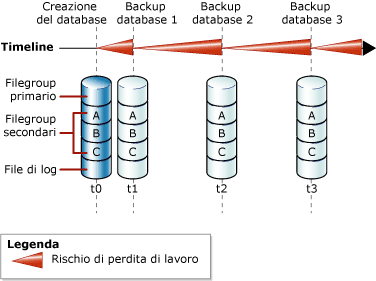
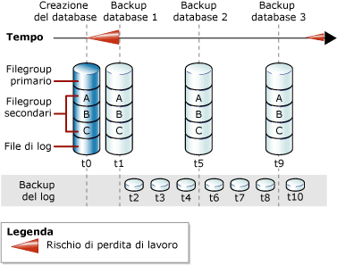

# <a name="full-database-backups-sql-server"></a>Backup completo del database (SQL Server)
  Un backup completo del database consente di eseguire il backup dell'intero database. Tale backup include la parte del log delle transazioni sufficiente per consentire il recupero del database completo dopo il ripristino del backup completo del database. I backup completi del database rappresentano il database al momento del completamento del backup.  
  
> [!TIP]  
>  Poiché le dimensioni del database aumentano, i backup completi del database richiedono più tempo e più spazio di archiviazione. Per un database di grandi dimensioni può pertanto essere utile integrare un backup completo del database con una serie di *backup database differenziali*. Per altre informazioni, vedere [Backup differenziali &#40;SQL Server&#41;](../../relational-databases/backup-restore/differential-backups-sql-server.md).  
  
> [!IMPORTANT]  
>  TRUSTWORTHY è impostato su OFF in un backup del database. Per informazioni su come impostare TRUSTWORTHY su ON, vedere [Opzioni ALTER DATABASE SET &#40; Transact-SQL &#41;](../../t-sql/statements/alter-database-transact-sql-set-options.md).  
  
 **Contenuto dell'argomento**  
  
-   [Backup del database nel modello di recupero con registrazione minima](#DbBuRMs)  
  
-   [Backup del database nel modello di recupero con registrazione completa](#DbBuRMf)  
  
-   [Utilizzare un backup completo del database per ripristinare il database](#RestoreDbBu)  
  
-   [Attività correlate](#RelatedTasks)  
  
##  <a name="DbBuRMs"></a> Backup del database nel modello di recupero con registrazione minima  
 Se si utilizza il modello di recupero con registrazione minima, dopo ogni backup, il database è esposto al rischio di perdita di dati nel caso si verifichi un'emergenza. Questo rischio aumenta a ogni aggiornamento fino al backup successivo, quando il rischio torna a essere zero e inizia un nuovo ciclo. Il rischio di perdita dei dati cresce nel tempo che intercorre tra un backup e l'altro. Nella figura seguente viene illustrato il rischio di perdita di dati per una strategia di backup che utilizza solo backup completi di database.  
  
   
  
### <a name="example-includetsqlincludestsql-mdmd"></a>Esempio ([!INCLUDE[tsql](../../includes/tsql-md.md)])  
 Nell'esempio seguente viene illustrato come creare un backup completo del database utilizzando WITH FORMAT per sovrascrivere eventuali backup esistenti e creare un nuovo set di supporti.  
  
```  
-- Back up the AdventureWorks2012 database to new media set.  
BACKUP DATABASE AdventureWorks2012  
    TO DISK = 'Z:\SQLServerBackups\AdventureWorksSimpleRM.bak'   
    WITH FORMAT;  
GO  
```  
  
##  <a name="DbBuRMf"></a> Backup del database nel modello di recupero con registrazione completa  
 Per i database che utilizzano il modello di recupero con registrazione completa e il modello di recupero con registrazione minima delle operazioni bulk, i backup del database sono necessari, ma non sufficienti. Sono inoltre necessari i backup del log delle transazioni. Nella figura seguente viene illustrata la strategia di backup più semplice possibile quando si utilizza il modello di recupero con registrazione completa.  
  
   
  
 Per informazioni sulle modalità di creazione dei backup di log, vedere [Backup di log delle transazioni &#40; SQL Server&#41;](../../relational-databases/backup-restore/transaction-log-backups-sql-server.md).  
  
### <a name="example-includetsqlincludestsql-mdmd"></a>Esempio ([!INCLUDE[tsql](../../includes/tsql-md.md)])  
 Nell'esempio seguente viene illustrato come creare un backup completo del database utilizzando WITH FORMAT per sovrascrivere eventuali backup esistenti e creare un nuovo set di supporti. Viene quindi eseguito il backup del log delle transazioni. In una situazione reale sarebbe necessario eseguire una serie di backup del log regolari. In questo caso il database di esempio [!INCLUDE[ssSampleDBobject](../../includes/sssampledbobject-md.md)] viene impostato per l'utilizzo del modello di recupero con registrazione completa.  
  
```  
USE master;  
ALTER DATABASE AdventureWorks2012 SET RECOVERY FULL;  
GO  
-- Back up the AdventureWorks2012 database to new media set (backup set 1).  
BACKUP DATABASE AdventureWorks2012  
  TO DISK = 'Z:\SQLServerBackups\AdventureWorks2012FullRM.bak'   
  WITH FORMAT;  
GO  
--Create a routine log backup (backup set 2).  
BACKUP LOG AdventureWorks2012 TO DISK = 'Z:\SQLServerBackups\AdventureWorks2012FullRM.bak';  
GO  
```  
  
##  <a name="RestoreDbBu"></a> Utilizzare un backup completo del database per ripristinare il database  
 È possibile ricreare un intero database in un solo passaggio ripristinando il database da un backup completo del database in qualsiasi posizione. Nel backup è inclusa una parte del log delle transazioni sufficiente per consentire il recupero del database fino al momento in cui è terminato il backup. Lo stato del database ripristinato corrisponde allo stato del database originale al termine del backup del database, escluse eventuali transazioni di cui non è stato eseguito il commit. Nel modello di recupero completo, ripristinare tutti i successivi backup del log delle transazioni. Quando il database viene recuperato, viene effettuato il rollback delle transazioni di cui non è stato eseguito il commit.  
  
 Per altre informazioni, vedere [Ripristini di database completi &#40;modello di recupero con registrazione minima&#41;](../../relational-databases/backup-restore/complete-database-restores-simple-recovery-model.md) o [Ripristini di database completi &#40;modello di recupero con registrazione completa &#41;](../../relational-databases/backup-restore/complete-database-restores-full-recovery-model.md).  
  
##  <a name="RelatedTasks"></a> Attività correlate  
 **Per creare un backup completo del database**  
  
-   [Creazione di un backup completo del database &#40;SQL Server&#41;](../../relational-databases/backup-restore/create-a-full-database-backup-sql-server.md)  
  
-   <xref:Microsoft.SqlServer.Management.Smo.Backup.SqlBackup%2A> (SMO)  
  
 **Per pianificare i processi di backup**  
  
 [Utilizzare la Creazione guidata piano di manutenzione](../../relational-databases/maintenance-plans/use-the-maintenance-plan-wizard.md)  
  
## <a name="see-also"></a>Vedere anche  
 [Backup e ripristino di database SQL Server](../../relational-databases/backup-restore/back-up-and-restore-of-sql-server-databases.md)   
 [Panoramica del backup &#40;SQL Server&#41;](../../relational-databases/backup-restore/backup-overview-sql-server.md)   
 [Backup e ripristino di database di Analysis Services](../../analysis-services/multidimensional-models/backup-and-restore-of-analysis-services-databases.md)  
  
  
