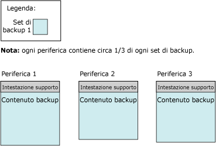
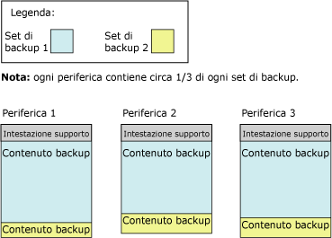

# <a name="media-sets-media-families-and-backup-sets-sql-server"></a>Set di supporti, gruppi di supporti e set di backup (SQL Server)
[!INCLUDE[appliesto-ss-xxxx-xxxx-xxx-md](../../includes/appliesto-ss-xxxx-xxxx-xxx-md.md)]  **Questo argomento presenta la terminologia di base relativa ai supporti per le procedure di backup e ripristino di [!INCLUDE[ssNoVersion](../../includes/ssnoversion-md.md)] ed è rivolto ai nuovi utenti di [!INCLUDE[ssNoVersion](../../includes/ssnoversion-md.md)].** 
  
  Vengono descritti il formato usato da [!INCLUDE[ssNoVersion](../../includes/ssnoversion-md.md)] per i supporti di backup, la corrispondenza tra supporti e dispositivi di backup, l'organizzazione dei backup nei relativi supporti e vengono elencate alcune considerazioni relative ai set e ai gruppi di supporti. In questo argomento vengono inoltre illustrati i passaggi per inizializzare e formattare i supporti di backup in occasione del primo utilizzo o della sostituzione di un set di supporti precedente con uno nuovo e vengono elencate le operazioni necessarie per sovrascrivere set di backup precedenti in un set di supporti e per aggiungere nuovi set di backup a set di supporti esistenti.  
  
>**NOTA** Per altre informazioni sul backup di SQL Server nel servizio di archiviazione BLOB di Microsoft Azure, vedere [Backup e ripristino di SQL Server con il servizio di archiviazione BLOB di Microsoft Azure](../../relational-databases/backup-restore/sql-server-backup-and-restore-with-microsoft-azure-blob-storage-service.md).  
   
##  <a name="TermsAndDefinitions"></a> Termini  
 **set di supporti**  
 Raccolta ordinata di supporti di backup, nastri o file su disco, su cui una o più operazioni di backup hanno eseguito la scrittura usando un tipo e un numero fisso di dispositivi di backup.  
  
 **gruppo di supporti**  
 Backup creati su un singolo dispositivo senza mirroring o su un set di dispositivi con mirroring in un set di supporti  
  
**set di backup**  
 Contenuto di backup aggiunto a un set di supporti da un'operazione di backup completata.  
  

##  <a name="OvMediaSetsFamiliesBackupSets"></a> Panoramica dei set di supporti, dei gruppi di supporti e dei set di backup  
 I backup disponibili in un set di uno o più supporti di backup costituiscono un singolo set di supporti. Un *set di supporti* è una raccolta ordinata di *supporti di backup*, nastri o file su disco, o oggetti BLOB di Azure, su cui una o più operazioni di backup hanno eseguito la scrittura usando un tipo e un numero fissi di dispositivi di backup. Un set di supporti specificati usano unità nastro, unità disco o oggetti BLOB di Azure, ma non una combinazione di due o più. 
 
**Esempio:** i dispositivi di backup associati a un set di supporti possono essere tre unità nastro denominate `\\.\TAPE0`, `\\.\TAPE1`e `\\.\TAPE2`. Il set di supporti include solo nastri, a partire da almeno tre nastri, ovvero uno per unità. Il tipo e il numero di dispositivi di backup vengono definiti in fase di creazione di un set di supporti e non è possibile modificarli. Se necessario, tra le operazioni di backup e ripristino è tuttavia possibile sostituire un determinato dispositivo con un dispositivo dello stesso tipo.  
  
 Per creare un set di supporti nei supporti di backup durante un'operazione di backup, formattare i supporti di backup. Per altre informazioni, vedere [Creazione di un nuovo set di supporti](#CreatingMediaSet)più avanti in questo argomento. Dopo la formattazione, ogni file o nastro include un'intestazione supporto per il set di supporti ed è pronto per la ricezione di contenuto di backup. Dopo la creazione dell'intestazione, l'operazione di backup continua e in tutti i dispositivi di backup specificati per l'operazione viene eseguito il backup dei dati specificati nel supporto di backup.  
  
> **NOTA** È possibile eseguire il mirroring dei set di supporti, per proteggersi dal rischio di un volume di supporti, ovvero un nastro o file su disco, danneggiato. Per altre informazioni, vedere [Set di supporti di backup con mirroring &#40;SQL Server&#41;](../../relational-databases/backup-restore/mirrored-backup-media-sets-sql-server.md).  
  
 Non è possibile effettuare contemporaneamente backup compressi e non compressi in un set di supporti. Qualsiasi edizione di [!INCLUDE[ssKatmai](../../includes/sskatmai-md.md)] o successiva è in grado di leggere i backup compressi. Per altre informazioni, vedere [Compressione backup &#40;SQL Server&#41;](../../relational-databases/backup-restore/backup-compression-sql-server.md).  

  
## <a name="media-families"></a>Gruppi di supporti  
 I backup creati su un singolo dispositivo senza mirroring o su un set di dispositivi con mirroring in un set di supporti costituiscono un *gruppo di supporti*. Il numero di gruppi di supporti disponibili in un set di supporti dipende dal numero di dispositivi di backup usati per il set di supporti. Ad esempio, se in un set di supporti vengono usati due dispositivi di backup di cui non è stato eseguito il mirroring, il set di supporti contiene due gruppi di supporti.  
  
In un set di supporti viene eseguito il mirroring di ogni gruppo di supporti. Ad esempio, se si usano sei dispositivi di backup per formattare un set di supporti in cui vengono usati due mirror, sono disponibili tre gruppi di supporti, ognuno dei quali include due copie equivalenti dei dati di backup. Per altre informazioni sui set di supporti con mirroring, vedere [Set di supporti di backup con mirroring &#40;SQL Server&#41;](../../relational-databases/backup-restore/mirrored-backup-media-sets-sql-server.md).  
  
 A ogni nastro o disco in un gruppo di supporti viene assegnato un *numero di sequenza dei supporti*. Il numero di sequenza dei supporti per un disco è sempre 1. In un gruppo di supporti a nastro il numero di sequenza del nastro iniziale è 1, quello del secondo nastro è 2 e così via. Per altre informazioni, vedere [Set di supporti, gruppi di supporti e set di backup (SQL Server)](../../relational-databases/backup-restore/media-sets-media-families-and-backup-sets-sql-server.md).
  
## <a name="the-media-header"></a>Intestazione supporto  
 Ogni volume di supporti di backup, ovvero file su disco o nastro, contiene un'intestazione supporto, creata dalla prima operazione di backup che usano il nastro o il disco. L'intestazione non subisce alcuna modifica, fino a quando il supporto non viene riformattato.  
  
 L'intestazione supporto include tutte le informazioni necessarie per identificare il supporto, ovvero file su disco o nastro, e la relativa posizione nel gruppo di supporti a cui appartiene. In queste informazioni sono inclusi gli elementi seguenti:  
  
-   Nome del supporto.  
  
     Il nome del supporto è facoltativo, ma è consigliabile usare sempre nomi di supporti che consentano di identificare chiaramente il supporto. Il nome del supporto viene assegnato dall'utente che formatta il supporto.  
  
-   Numero di identificazione univoco del set di supporti.  
  
-   Numero di gruppi di supporti nel set di supporti.  
  
-   Numero di sequenza del gruppo di supporti contenente il supporto specificato.  
  
-   Numero di identificazione univoco del gruppo di supporti.  
  
-   Numero di sequenza del supporto nel gruppo di supporti. Nel caso di un file su disco, tale valore è sempre 1.  
  
-   Indicazione della presenza o meno di un'etichetta del supporto MTF o di una descrizione dei supporti nella descrizione del supporto.  
  
    >**NOTA** Tutti i supporti usati per un'operazione di backup o di ripristino usano un formato di backup standard detto MTF ( [!INCLUDE[msCoName](../../includes/msconame-md.md)] Tape Format). MTF consente agli utenti di specificare un'etichetta del nastro che contiene una descrizione specifica di MTF. [!INCLUDE[ssNoVersion](../../includes/ssnoversion-md.md)] mantiene qualsiasi etichetta dei supporti di MTF scritta da un'altra applicazione ma non consente di eseguire la scrittura di tali etichette.  
  
-   Etichetta del supporto MTF ( [!INCLUDE[msCoName](../../includes/msconame-md.md)] Tape Format) o descrizione del supporto (testo in formato libero).  
  
-   Nome del software di backup con cui è stata scritta l'etichetta.  
  
-   Numero di identificazione univoco del fornitore del software che ha formattato il supporto.  
  
-   Data e ora in cui è stata scritta l'etichetta.  
  
-   Numero di mirror nel set (1-4). Il valore 1 indica che non è stato eseguito il mirroring di un dispositivo.  
  
 [!INCLUDE[ssCurrent](../../includes/sscurrent-md.md)] è in grado di elaborare supporti formattati da versioni precedenti di [!INCLUDE[ssNoVersion](../../includes/ssnoversion-md.md)].  
  
## <a name="backup-sets"></a>Set di backup  
 Un'operazione di backup aggiunge un singolo *set di backup* al set di supporti. Il set di backup viene descritto in termini di set di supporti a cui appartiene il backup. Se i supporti di backup sono costituiti da un solo gruppo di supporti, tale gruppo include l'intero set di backup. Se i supporti di backup sono costituiti da più gruppi di supporti, il set di backup viene distribuito tra i diversi gruppi. In ogni supporto il set di backup include un'intestazione che lo descrive.  
  
 In questo esempio viene riportata un'istruzione [!INCLUDE[tsql](../../includes/tsql-md.md)] che consente di creare un set di supporti denominato `MyAdvWorks_MediaSet_1` per il database [!INCLUDE[ssSampleDBobject](../../includes/sssampledbobject-md.md)] usando tre unità nastro come dispositivi di backup:  
  
```  
BACKUP DATABASE AdventureWorks2012  
TO TAPE = '\\.\tape0', TAPE = '\\.\tape1', TAPE = '\\.\tape2'  
WITH   
   FORMAT,  
   MEDIANAME = 'MyAdvWorks_MediaSet_1'  
```  
  
 Se completata correttamente, questa operazione di backup consente di ottenere un nuovo set di supporti contenente una nuova intestazione supporto e un set di backup distribuito nei tre nastri. Tali risultati vengono illustrati nella figura seguente:  
  
   
  
 In genere, dopo la creazione di un set di supporti, i set di backup vengono aggiunti al set di supporti da operazioni di backup successive. Tutti i supporti usati da un set di backup compongono il set di supporti, indipendentemente dal numero di supporti o di dispositivi di backup coinvolti. Ai set di backup vengono assegnati numeri sequenziali in base alla rispettiva posizione nel set di supporti. Tali numeri consentono di specificare il set di backup da ripristinare.  
  
 È necessario che ogni operazione di backup in un set di supporti scriva nello stesso numero e tipo di dispositivi di backup. Nel caso di più dispositivi, ad esempio nel primo set di backup, il contenuto di ogni set di backup successivo viene distribuito tra i supporti di backup in tutti i dispositivi. Per continuare l'esempio precedente, una seconda operazione di backup, ovvero un backup differenziale, aggiunge informazioni allo stesso set di supporti:  
  
```  
BACKUP DATABASE AdventureWorks2012  
TO TAPE = '\\.\tape0', TAPE = '\\.\tape1', TAPE = '\\.\tape2'  
WITH   
   NOINIT,  
   MEDIANAME = 'AdventureWorksMediaSet1',  
   DIFFERENTIAL  
```  
  
> **NOTA** L'opzione NOINIT è l'impostazione predefinita, ma è stata inclusa per maggiore chiarezza.  
  
 Se la seconda operazione di backup viene completata correttamente, un secondo set di backup viene scritto nel set di supporti, con la seguente distribuzione del contenuto del backup:  
  
   
  
 Quando si ripristinano i backup, è possibile usare l'opzione FILE per specificare quali backup si desidera usare. L'esempio seguente illustra l'uso delle clausole FILE **=***numero_file_set_backup* quando si ripristina un backup completo del database [!INCLUDE[ssSampleDBobject](../../includes/sssampledbobject-md.md)] seguito da un backup differenziale del database sullo stesso set di supporti. Il set di supporti usano tre nastri di backup, che si trovano sulle unità nastro `\\.\tape0`, `tape1`e `tape2`.  
  
```  
RESTORE DATABASE AdventureWorks2012 FROM TAPE = '\\.\tape0', TAPE = '\\.\tape1', TAPE = '\\.\tape2'  
   WITH   
   MEDIANAME = 'AdventureWorksMediaSet1',  
   FILE=1,   
   NORECOVERY;  
RESTORE DATABASE AdventureWorks2012 FROM TAPE = '\\.\tape0', TAPE = '\\.\tape1', TAPE = '\\.\tape2'   
   WITH   
   MEDIANAME = 'AdventureWorksMediaSet1',  
   FILE=2,   
   RECOVERY;  
GO  
```  
  
 Per informazioni sulle tabelle della cronologia nelle quali sono archiviate le informazioni sui set di supporti e i relativi gruppi di supporti e set di backup, vedere [Informazioni sulla cronologia e sull'intestazione del backup &#40;SQL Server&#41;](../../relational-databases/backup-restore/backup-history-and-header-information-sql-server.md).  
  
 Il numero di supporti di backup in un set di supporti dipende da numerosi fattori:  
  
-   Numero di dispositivi di backup  
  
-   Tipo di dispositivi di backup  
  
-   Numero di set di backup  

  
##  <a name="CreatingMediaSet"></a> Creating a new media set  
 Per creare un nuovo set di supporti, è necessario formattare i supporti di backup, ovvero uno o più nastri o file su disco. Durante il processo di formattazione i supporti di backup vengono modificati come descritto di seguito:  
  
1.  L'eventuale vecchia intestazione viene eliminata, così come il contenuto precedente dei supporti di backup.  
  
     La formattazione di un dispositivo nastro implica l'eliminazione del contenuto precedente del nastro attualmente montato. La formattazione di un disco interessa solo il file specificato per l'operazione di backup.  
  
2.  Sul supporto di backup (nastro o file su disco) di ciascun dispositivo di backup viene scritta una nuova intestazione supporto.  

  
##  <a name="UseExistingMediaSet"></a> Backup su un set di supporti esistente  
 Quando si esegue il backup su un set di supporti esistente, è possibile scegliere tra le due opzioni seguenti:  
  
-   Accodare i dati al set di backup esistente.  
  
     Per sfruttare al meglio lo spazio disponibile, i nuovi set di backup vengono in genere accodati al set di supporti esistenti. In tal modo vengono mantenuti anche tutti i backup precedenti. Per altre informazioni, vedere [Accodamento a set di backup esistenti](#Appending), più avanti in questa sezione.  

L'accodamento, che corrisponde al comportamento predefinito dell'istruzione BACKUP, può essere specificato in modo esplicito tramite l'opzione NOINIT.  
  
-   Sovrascrivere tutti i set di backup esistenti con il backup corrente senza eliminare l'intestazione supporto corrente.  
  
     [!INCLUDE[ssNoVersion](../../includes/ssnoversion-md.md)] prevede funzionalità che impediscono la sovrascrittura accidentale dei supporti. È tuttavia possibile sovrascrivere automaticamente set di backup che hanno raggiunto la data di scadenza prevista.  
  
     Per quanto riguarda le intestazioni del nastro, può risultare opportuno mantenerle. Per altre informazioni, vedere [Sovrascrittura di set di backup](#Overwriting), più avanti in questa sezione.  

    >  La sovrascrittura dei set di backup esistenti viene specificata tramite l'opzione INIT dell'istruzione BACKUP.  
  
##  <a name="Appending"></a> Appending to existing backup sets  
 È possibile archiviare nello stesso supporto i backup dello stesso database o di database differenti eseguiti in momenti diversi. Se si accoda un altro set di backup a un supporto esistente, il contenuto precedente del supporto rimane invariato e il nuovo backup viene registrato dopo la fine dell'ultimo backup presente nel supporto.  
  
 Per impostazione predefinita, [!INCLUDE[ssNoVersion](../../includes/ssnoversion-md.md)] accoda sempre i nuovi backup al supporto. È possibile accodare i backup solo alla fine del supporto. Se ad esempio un volume del supporto include cinque set di backup, non è possibile ignorare i primi tre set e sovrascrivere il quarto con un nuovo set di backup.  
  
 Se si usano l'istruzione BACKUP WITH NOREWIND per un backup su nastro, il nastro rimarrà aperto alla fine dell'operazione. In questo modo sarà possibile accodare altri backup al nastro senza riavvolgerlo e scorrerlo in avanti per individuare l'ultimo set di backup. L'elenco delle unità nastro aperte è disponibile nella vista a gestione dinamica **sys.dm_io_backup_tapes**. Per altre informazioni, vedere [sys.dm_io_backup_tapes &#40;Transact-SQL&#41;](../../relational-databases/system-dynamic-management-views/sys-dm-io-backup-tapes-transact-sql.md).  
  
 I backup di Microsoft Windows e di [!INCLUDE[ssNoVersion](../../includes/ssnoversion-md.md)] possono condividere lo stesso supporto ma non sono interoperativi. [!INCLUDE[ssNoVersion](../../includes/ssnoversion-md.md)] .  
  
> **IMPORTANTE** Non è possibile effettuare contemporaneamente backup compressi e non compressi in un set di supporti. Qualsiasi edizione di [!INCLUDE[ssKatmai](../../includes/sskatmai-md.md)] o versioni successive è in grado di leggere i backup compressi. Per altre informazioni, vedere [Compressione backup &#40;SQL Server&#41;](../../relational-databases/backup-restore/backup-compression-sql-server.md).  
  
 
##  <a name="Overwriting"></a> Overwriting backup sets  
 La sovrascrittura dei set di backup esistenti viene specificata tramite l'opzione INIT dell'istruzione BACKUP. Se le verifiche hanno esito positivo, questa opzione sovrascrive gli eventuali set di backup presenti nei supporti, mantenendo solo l'intestazione supporto. Se non esiste alcuna intestazione supporto ne viene creata una.  
  
 Per quanto riguarda le intestazioni del nastro, può risultare opportuno mantenerle. Nel caso di backup su disco vengono sovrascritti soltanto i file usati dai dispositivi di backup specificati per l'operazione. Gli altri file presenti nel disco rimangono inalterati. Durante la sovrascrittura di backup è possibile mantenere l'intestazione supporto esistente. Il nuovo backup verrà creato come primo backup del dispositivo di backup. Se l'intestazione supporto non è presente, viene creata automaticamente una nuova intestazione con un nome e una descrizione del supporto. Se l'intestazione supporto esistente non è valida, l'operazione di backup viene interrotta. Se il supporto è vuoto, viene generata una nuova intestazione supporto con gli eventuali valori MEDIANAME, MEDIAPASSWORD e MEDIADESCRIPTION specificati.  
  
 
 I supporti di backup non vengono sovrascritti in presenza di una qualunque delle due condizioni seguenti:  
  
-   I backup esistenti nei supporti non sono scaduti. Se è stato specificato SKIP, la data di scadenza non viene verificata.  
  
     La data di scadenza indica la data in cui il backup risulta scaduto e può essere sovrascritto con un altro backup. Questa data può essere specificata al momento della creazione del backup. Per impostazione predefinita, la data di scadenza è determinata dall'opzione **media retention** impostata con **sp_configure**. Per altre informazioni, vedere [sp_configure &#40;Transact-SQL&#41;](../../relational-databases/system-stored-procedures/sp-configure-transact-sql.md).  
  
-   Il nome dei supporti, se specificato, non corrisponde al nome esistente nei supporti di backup.  
  
     Il nome dei supporti è un nome descrittivo che consente l'identificazione immediata dei supporti.  
  
 È possibile ignorare esplicitamente queste verifiche se si desidera effettivamente sovrascrivere i supporti esistenti, ad esempio se si è certi che i backup presenti nel nastro non sono più necessari.  
  
 I supporti di backup non vengono sovrascritti se sono protetti con una password di Microsoft Windows. Per poterli sovrascrivere, è necessario reinizializzarli.  
  

  
##  <a name="SequenceNumbers"></a> Numeri di sequenza  
 L'ordine corretto è importante per più gruppi di supporti in un set di supporti o per più supporti di backup in un gruppo di supporti. Il backup assegna pertanto i numeri di sequenza nei modi seguenti:  
  
-   Gruppi di supporti sequenziali in un set di supporti  
  
     All'interno di un set di supporti viene assegnata una numerazione sequenziale ai gruppi di supporti, in base alla rispettiva posizione nel set di supporti. Il numero del gruppo di supporti viene registrato nella colonna **family_sequence_number** della tabella **backupmediafamily** .  
  
-   Supporti fisici in un gruppo di supporti  
  
     Un numero di sequenza di supporti indica l'ordine applicato ai supporti fisici in un gruppo di supporti. Il numero di sequenza è 1 per il supporto di backup iniziale. A esso è associato il tag 1, al secondo (il primo nastro di continuità) il tag 2 e così via. Quando il set di backup viene ripristinato, i numeri di sequenza dei supporti assicurano che l'operatore che ripristina i backup monti i supporti corretti nell'ordine corretto.  
  
###  <a name="MultipleDevices"></a> Utilizzo di più dispositivi  
 Quando si usano più unità nastro o file su disco, si applicano le considerazioni seguenti:  
  
-   Per il backup:  
  
     Il set di supporti completo creato da un'operazione di backup deve essere usato da tutte le operazioni di backup successive. Se ad esempio un set di supporti è stato creato usando due dispositivi di backup su nastro, tutte le operazioni di backup successive relative a tale set di supporti devono usare due dispositivi di backup.  
  
-   Per il ripristino:  
  
     Per qualsiasi ripristino da backup su disco e per qualsiasi ripristino online, tutti i gruppi di supporti devono essere montati simultaneamente. Per un ripristino offline da backup su nastro, è possibile elaborare i gruppi di supporti da un minor numero di dispositivi di backup. Ogni gruppo di supporti deve essere elaborato completamente prima di avviare l'elaborazione di un altro gruppo di supporti. I gruppi di supporti vengono sempre elaborati in parallelo, a meno che siano ripristinati con un dispositivo singolo.  
  
##  <a name="RelatedTasks"></a> Attività correlate  
 **Creare un nuovo set di supporti**  
  
-   [Creazione di un backup completo del database &#40;SQL Server&#41;](../../relational-databases/backup-restore/create-a-full-database-backup-sql-server.md) (opzione **Esegui backup in un nuovo set di supporti e cancella tutti i set di backup esistenti**)  
  
-   [BACKUP &#40;Transact-SQL&#41;](../../t-sql/statements/backup-transact-sql.md) (opzione FORMAT)  
  
-   <xref:Microsoft.SqlServer.Management.Smo.Backup.FormatMedia%2A>  
  
 **Accodare un nuovo backup a un supporto esistente**  
  
-   [Creazione di un backup completo del database &#40;SQL Server&#41;](../../relational-databases/backup-restore/create-a-full-database-backup-sql-server.md) (opzione **Accoda al set di backup esistente**)  
  
-   [BACKUP &#40;Transact-SQL&#41;](../../t-sql/statements/backup-transact-sql.md) (opzione NOINIT)  
  
 **Sovrascrivere tutti i set di backup esistenti**  
  
-   [Creazione di un backup completo del database &#40;SQL Server&#41;](../../relational-databases/backup-restore/create-a-full-database-backup-sql-server.md) (opzione **Sovrascrivi tutti i set di backup esistenti**)  
  
-   [BACKUP &#40;Transact-SQL&#41;](../../t-sql/statements/backup-transact-sql.md) (opzione INIT)  
  
 **Impostare la data di scadenza**  
  
-   [Impostazione della data di scadenza di un backup &#40;SQL Server&#41;](../../relational-databases/backup-restore/set-the-expiration-date-on-a-backup-sql-server.md)  
  
 **Visualizzare i numeri di sequenza dei supporti e dei gruppi**  
  
-   [Visualizzare le proprietà e il contenuto di un dispositivo di backup logico &#40;SQL Server&#41;](../../relational-databases/backup-restore/view-the-properties-and-contents-of-a-logical-backup-device-sql-server.md)  
  
-   [backupmediafamily &#40;Transact-SQL&#41;](../../relational-databases/system-tables/backupmediafamily-transact-sql.md) (colonna **family_sequence_number**)  
  
 **Visualizzare i set di backup in un determinato dispositivo di backup**  
  
-   [Visualizzare i file di dati e i file di log in un set di backup &#40;SQL Server&#41;](../../relational-databases/backup-restore/view-the-data-and-log-files-in-a-backup-set-sql-server.md)  
  
-   [Visualizzare le proprietà e il contenuto di un dispositivo di backup logico &#40;SQL Server&#41;](../../relational-databases/backup-restore/view-the-properties-and-contents-of-a-logical-backup-device-sql-server.md)  
  
-   [RESTORE HEADERONLY &#40;Transact-SQL&#41;](../../t-sql/statements/restore-statements-headeronly-transact-sql.md)  
  
 **Leggere l'intestazione supporto specificata in un dispositivo di backup**  
  
-   [RESTORE LABELONLY &#40;Transact-SQL&#41;](../../t-sql/statements/restore-statements-labelonly-transact-sql.md)  
 
  
## <a name="see-also"></a>Vedere anche  
 [Backup e ripristino di database SQL Server](../../relational-databases/backup-restore/back-up-and-restore-of-sql-server-databases.md)   
 [Possibili errori relativi ai supporti durante il backup e il ripristino &#40;SQL Server&#41;](../../relational-databases/backup-restore/possible-media-errors-during-backup-and-restore-sql-server.md)   
 [Informazioni sulla cronologia e sull'intestazione del backup &#40;SQL Server&#41;](../../relational-databases/backup-restore/backup-history-and-header-information-sql-server.md)   
 [Set di supporti di backup con mirroring &#40;SQL Server&#41;](../../relational-databases/backup-restore/mirrored-backup-media-sets-sql-server.md)   
 [BACKUP &#40;Transact-SQL&#41;](../../t-sql/statements/backup-transact-sql.md)   
 [RESTORE &#40;Transact-SQL&#41;](../../t-sql/statements/restore-statements-transact-sql.md)   
 [RESTORE REWINDONLY &#40;Transact-SQL&#41;](../../t-sql/statements/restore-statements-rewindonly-transact-sql.md)   
 [sp_configure &#40;Transact-SQL&#41;](../../relational-databases/system-stored-procedures/sp-configure-transact-sql.md)  
  
  
