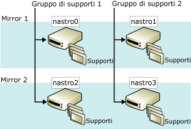

# Set di supporti di backup con mirroring (SQL Server)
    
> [!NOTE]  
>  I set di supporti di backup con mirroring sono supportati solo in [!INCLUDE[ssNoVersion](../../includes/ssnoversion-md.md)]Enterprise Edition.  
  
 L'esecuzione del mirroring di un set di supporti consente di incrementare l'affidabilità del backup, riducendo l'impatto di problemi relativi al dispositivo di backup. Tali problemi possono risultare estremamente gravi, poiché i backup rappresentano l'ultima difesa contro la perdita dei dati. Con l'aumento delle dimensioni dei database, cresce il rischio che un errore di un dispositivo o di un supporto di backup impedisca il ripristino di un backup. Il mirroring dei supporti di backup consente di incrementare l'affidabilità dei backup tramite la ridondanza.  
  
> [!NOTE]  
>  Per informazioni sui set di supporti in genere, vedere [Set di supporti, gruppi di supporti e set di backup &#40;SQL Server&#41;](../../relational-databases/backup-restore/media-sets-media-families-and-backup-sets-sql-server.md)Enterprise Edition.  
  
 **Contenuto dell'argomento**  
  
-   [Panoramica dei set di supporti con mirroring](#OverviewofMirroredMediaSets)  
  
-   [Requisiti hardware per i mirror di backup](#HardwareReqs)  
  
-   [Attività correlate](#RelatedTasks)  
  
##   Panoramica dei set di supporti con mirroring  
 Il mirroring dei supporti è una proprietà del set di supporti. Un *set di supporti con mirroring* è costituito da più copie (*mirror*) del set di supporti. Un set di supporti contiene uno o più set di supporti, ognuno dei quali corrisponde a un dispositivo di backup. Ad esempio, se la clausola TO di un'istruzione BACKUP DATABASE include tre dispositivi, BACKUP distribuisce i dati tra tre gruppi di supporti, uno per dispositivo. Il numero di gruppi di supporti e di mirror è definito quando viene creato il set di supporti (tramite un'istruzione BACKUP DATABASE che specifica WITH FORMAT).  
  
 Un set di supporti con mirroring include da due a quattro mirror. Ogni mirror include tutti i gruppi di supporti del set di supporti. Per i mirror è necessario lo stesso numero di dispositivi, uno per gruppo di supporti. Per ogni mirror è necessario un dispositivo di backup separato per ogni gruppo di supporti. Ad esempio, per un set di supporti con mirroring costituito da quattro gruppi di supporti con tre mirror sono necessari dodici dispositivi di backup. È necessario che tutti questi dispositivi siano equivalenti, ad esempio unità nastro dello stesso produttore e con lo stesso numero di modello.  
  
 Nella figura seguente viene illustrato un esempio di un set di supporti con mirroring costituito da due gruppi di supporti con due mirror. Ogni gruppo di supporti include tre volumi di supporti, il cui backup viene eseguito una volta per ogni mirror.  
  
   
  
 I volumi corrispondenti sui mirror hanno contenuti identici. Questo li rende intercambiabili al momento del ripristino. Ad esempio, nella figura precedente il terzo volume di nastro2 è intercambiabile con il terzo volume di nastro0.  
  
 [!INCLUDE[ssDEnoversion](../../includes/ssdenoversion-md.md)] assicura che il contenuto dei supporti con mirroring sia identico tramite la sincronizzazione delle scritture nei dispositivi. Quando uno dei mirror si riempie, viene eseguito lo spanning di tutti i mirror contemporaneamente.  
  
> [!IMPORTANT]  
>  Non è possibile spezzare implicitamente, ovvero dividere, un set di supporti con mirroring tramite la rimozione di un mirror. Se un nastro o un disco in un mirror viene danneggiato o riformattato, non sarà più possibile utilizzare tale mirror per ulteriori backup. Se rimane intatto almeno un mirror completo, sarà possibile leggere il set di supporti. Se ogni mirror perde un determinato gruppo di supporti, il set di supporti risulterà inutile.  
  
 I requisiti relativi alla presenza di tutti i mirror sono diversi in caso di operazioni di backup e di ripristino. Per la scrittura, ovvero la creazione o estensione, di un set di supporti con mirroring da parte di un'operazione di backup, è necessario che siano presenti tutti i mirror. Quando al contrario si esegue il ripristino di un backup da un set di supporti con mirroring, è possibile specificare un solo mirror per ogni gruppo di supporti. È possibile eseguire il ripristino da un numero di dispositivi inferiore a quello dei gruppi, ma ogni gruppo di supporti viene elaborato solo una volta. In presenza di errori, tuttavia, la disponibilità degli altri mirror può consentire una risoluzione rapida di alcuni problemi di ripristino. È possibile sostituire un volume di un supporto danneggiato con il volume corrispondente da un altro mirror. RESTORE e RESTORE VERIFYONLY supportano infatti la sostituzione di supporti danneggiati con il volume di supporti di backup corrispondente disponibile in un altro mirror.  
  
##   Requisiti hardware per i mirror di backup  
 È possibile eseguire il mirroring sia su disco che su nastro. I dischi tuttavia non supportano i nastri di continuità. Tutti i dispositivi di backup per una singola operazione di backup o di ripristino devono essere dello stesso tipo, vale a dire disco o nastro.  
  
 È inoltre necessario utilizzare dispositivi simili, con le stesse proprietà. Se i dispositivi non sono sufficientemente simili, verrà generato un messaggio di errore (3212). Per evitare il rischio di mancata corrispondenza di un dispositivo, utilizzare dispositivi equivalenti, ad esempio unità dello stesso produttore e con lo stesso numero di modello.  
  
##   Attività correlate  
 **Per eseguire il backup su dispositivi di backup con mirroring**  
  
-   [Backup in un set di supporti con mirroring &#40;Transact-SQL&#41;](../../relational-databases/backup-restore/back-up-to-a-mirrored-media-set-transact-sql.md)  
  
## Vedere anche  
 [Possibili errori relativi ai supporti durante il backup e il ripristino &#40;SQL Server&#41;](../../relational-databases/backup-restore/possible-media-errors-during-backup-and-restore-sql-server.md)   
 [RESTORE VERIFYONLY &#40;Transact-SQL&#41;](../../t-sql/statements/restore-statements-verifyonly-transact-sql.md)   
 [Dispositivi di backup &#40;SQL Server&#41;](../../relational-databases/backup-restore/backup-devices-sql-server.md)   
 [Set di supporti, gruppi di supporti e set di backup &#40;SQL Server&#41;](../../relational-databases/backup-restore/media-sets-media-families-and-backup-sets-sql-server.md)  
  
  
